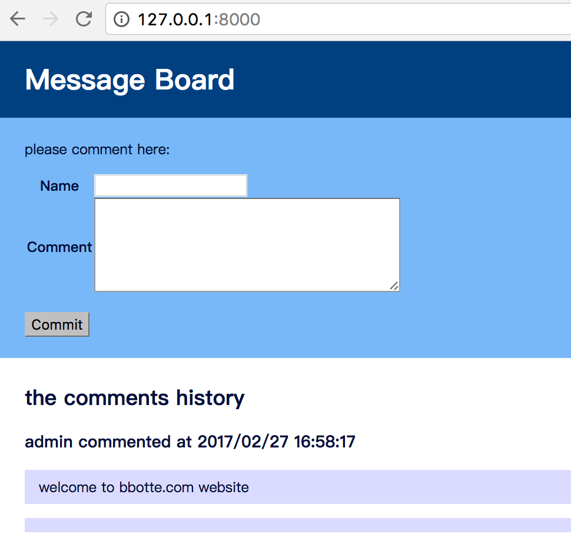

###Message_Board 留言板

####需要安装的模块
pip install flask

####提交评论
在web页面即可提交
也可以用下面方式导入评论数据:
`#` ipython
In [1]: import datetime
In [2]: from message_board import save_data
In [3]: save_data('test','test_comment',datetime.datetime(2017,02,27,11,0,0))
In [4]: from message_board import load_data
In [5]: load_data()
Out[5]:
[{'comment': 'test_comment',
  'create_at': datetime.datetime(2017, 2, 27, 11, 0),
    'name': 'test'}]

####服务启动:
python message_board.py

