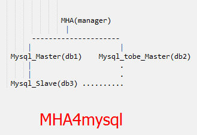
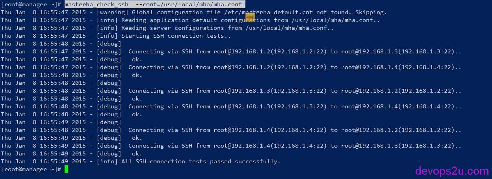
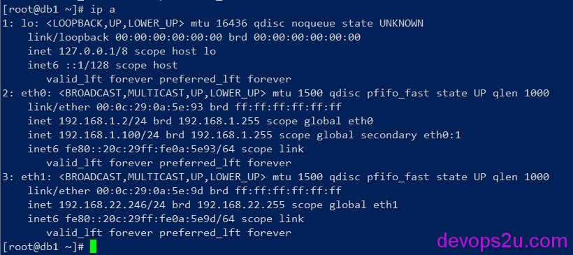
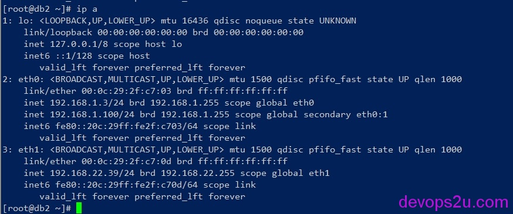

# MHA-MySQL线上配置附官方文档

说明
配置mysql主从

1. db1主    (现有的主库)
2. db2备  (即将做双主的这台机)
3. db3从  (现有的从库)

配置双机互信
安装mysql-MHA

1. db1主 db2备 db3从
2. manager

配置mysql-MHA
验证ssh通讯
验证mysql复制
启动MHA

1. 查看MHA
2. 停止MHA

验证MHA

1. 查看mysql_MHA日志

恢复操作

### 说明

MHA for MySQL:Master High Availability Manager and tools for MySQL


centos 6.5 mysql 5.5.37 mha4mysql-manager-0.55 mha4mysql-node-0.54
manager  192.168.1.1     mha-manager管理端
db1         192.168.1.2     现有主库
db2         192.168.1.3     即将做双主的数据库
db3         192.168.1.4     现有从库



### **配置mysql主从**

db1主库:
server-id = 1
log-bin=mysql-bin
binlog_format=row

db2主库:
server-id = 2
log-bin=mysql-bin
binlog_format=row
relay_log_purge=0

db3从库:
server_id = 3
log_bin = mysql-bin
relay_log = mysql-relay-bin
max_relay_log_size = 2G
log_slave_updates = 1
read_only = 1
relay_log_purge=0

2个主库的my.cnf中设置 bind_address=0.0.0.0  ，因为mysql连接是通过VIP操作的

#### **db1主 **   **(现有的主库)**

```
grant replication slave on *.* to mharep@'192.168.1.%' identified by 'passwd';
flush privileges;
stop slave;
#设置复制权限帐号
GRANT ALL PRIVILEGES ON *.* TO 'mha_manager'@'192.168.1.%' IDENTIFIED BY '123456';
reset master;
show master status\G
```

#### **db2备** ** (即将做双主的这台机)**

```
grant replication slave on *.* to mharep@'192.168.1.%' identified by 'passwd';
GRANT ALL PRIVILEGES ON *.* TO 'mha_manager'@'192.168.1.%' IDENTIFIED BY '123456';
flush privileges;
reset master;
slave stop;
change master to MASTER_HOST='192.168.1.2', MASTER_PORT=3306,MASTER_USER='mharep', MASTER_PASSWORD='passwd',master_log_file='mysql-bin.000001', master_log_pos=107;
slave start;
show slave status\G;
```

#### **db3从**  **(现有的从库)**

```
reset master;
slave stop;
GRANT ALL PRIVILEGES ON *.* TO 'mha_manager'@'192.168.1.%' IDENTIFIED BY '123456';
flush privileges;
change master to MASTER_HOST='192.168.1.2', MASTER_PORT=3306,MASTER_USER='mharep', MASTER_PASSWORD='passwd',master_log_file='mysql-bin.000001', master_log_pos=107;
slave start;
show slave status\G;
```

### **配置双机互信**

manager

```
ssh-keygen -t rsa
for i in db1 db2 db3;do ssh-copy-id -i ~/.ssh/id_rsa.pub root@$i;done
```

db1主

```
ssh-keygen -t rsa 
for i in manager db2 db3;do ssh-copy-id -i ~/.ssh/id_rsa.pub root@$i;done
```

db2备 和 db3从 配置略

db1和db2 同样需要双机互信，是为了db1 down的时候，把二进制日志发送到db2

/usr/sbin/ntpdate ntp1.aliyun.com   请把时间同步

### **安装mysql-MHA**

<https://downloads.mariadb.com/files/MHA>

```
wget https://downloads.mariadb.com/files/MHA/mha4mysql-manager-0.55-0.el6.noarch.rpm
wget https://downloads.mariadb.com/files/MHA/mha4mysql-node-0.54-0.el6.noarch.rpm
```

#### **db1主 db2备 db3从**

```
yum install perl-DBD-MySQL 
yum localinstall mha4mysql-node-0.54-0.el6.noarch.rpm
```

#### **manager**

```
yum install perl cpan
yum install perl-DBD-MySQL perl-Config-Tiny perl-Log-Dispatch perl-Parallel-ForkManager
```

这两个yum没有安装上 perl-Log-Dispatch perl-Parallel-ForkManager

```
wget http://rpmfind.net/linux/dag/redhat/el6/en/x86_64/dag/RPMS/perl-Log-Dispatch-2.26-1.el6.rf.noarch.rpm
wget ftp://rpmfind.net/linux/dag/redhat/el6/en/x86_64/dag/RPMS/perl-Parallel-ForkManager-0.7.5-2.2.el6.rf.noarch.rpm
wget ftp://rpmfind.net/linux/dag/redhat/el6/en/x86_64/dag/RPMS/perl-Mail-Sender-0.8.16-1.el6.rf.noarch.rpm
wget ftp://rpmfind.net/linux/dag/redhat/el6/en/x86_64/dag/RPMS/perl-Mail-Sendmail-0.79-1.2.el6.rf.noarch.rpm
 
rpm -ivh perl-Mail-Sender-0.8.16-1.el6.rf.noarch.rpm 
rpm -ivh perl-Mail-Sendmail-0.79-1.2.el6.rf.noarch.rpm
yum localinstall perl-Log-Dispatch-2.26-1.el6.rf.noarch.rpm
yum localinstall perl-Parallel-ForkManager-0.7.5-2.2.el6.rf.noarch.rpm
yum localinstall mha4mysql-node-0.54-0.el6.noarch.rpm
yum localinstall mha4mysql-manager-0.55-0.el6.noarch.rpm
```

或者更简单的yum安装,不用考虑依赖

```
yum install -y mha4mysql-node-0.54-0.el6.noarch.rpm mha4mysql-manager-0.55-0.el6.noarch.rpm
```

### **配置mysql-MHA**

```
[root@manager ~]# masterha_<Tab>
masterha_check_repl       masterha_conf_host        masterha_master_switch
masterha_check_ssh        masterha_manager          masterha_secondary_check
masterha_check_status     masterha_master_monitor   masterha_stop
tar -xzf mha4mysql-manager-0.55.tar.gz  #
ls mha4mysql-manager-0.55/samples/conf  #大家了解mha自带的配置文件,可忽略
masterha_default.cnf    app1.cnf
mkdir -p /usr/local/mha/scripts
cp mha4mysql-manager-0.55/samples/scripts/* /usr/local/mha/scripts
 
[root@manager ~]# vim /usr/local/mha/mha.conf #根据自己的mysql配置改动
[server default]
user=mha_manager                              #mha管理的用户名
password=123456
manager_workdir=/usr/local/mha
manager_log=/usr/local/mha/manager.log
remote_workdir=/usr/local/mha
ssh_user=root                                #上面双机互信的用户
repl_user=mharep                             #mysql复制(同步)的用户名
repl_password=passwd
ping_interval=1
  
#下面是mysql检测设置
secondary_check_script= masterha_secondary_check -s 192.168.1.2 -s 192.168.1.3 -s 192.168.1.4
#master_ip_failover_script=/usr/local/mha/scripts/master_ip_failover
#shutdown_script= /usr/local/mha/scripts/power_manager
report_script= /usr/local/mha/scripts/send_report
master_ip_online_change_script= /usr/local/mha/scripts/master_ip_online_change
  
[server1]
hostname=192.168.1.2     #写ip或者主机名都可以
ssh_port=22
master_binlog_dir=/var/mysql/log
candidate_master=1
[server2]
hostname=192.168.1.3
ssh_port=22
master_binlog_dir=/var/mysql/log
candidate_master=1
[server3]
hostname=192.168.1.4
ssh_port=22
master_binlog_dir=/var/mysql/log
no_master=1
```

### **验证ssh通讯**

```
masterha_check_ssh  --conf=/usr/local/mha/mha.conf
```



### **验证mysql复制**

```
wget ftp://rpmfind.net/linux/dag/redhat/el6/en/x86_64/extras/RPMS/perl-Net-Telnet-3.03-2.el6.rfx.noarch.rpm
yum localinstall perl-Net-Telnet-3.03-2.el6.rfx.noarch.rpm
```

mysql必须都启动

```
[root@manager ~]# masterha_check_repl --conf=/usr/local/mha/mha.conf 
Thu Jan  8 18:05:40 2015 - [warning] Global configuration file /etc/masterha_default.cnf not found. Skipping.
Thu Jan  8 18:05:40 2015 - [info] Reading application default configurations from /usr/local/mha/mha.conf..
Thu Jan  8 18:05:40 2015 - [info] Reading server configurations from /usr/local/mha/mha.conf..
Thu Jan  8 18:05:40 2015 - [info] MHA::MasterMonitor version 0.55.
Thu Jan  8 18:05:40 2015 - [info] Dead Servers:
Thu Jan  8 18:05:40 2015 - [info] Alive Servers:
Thu Jan  8 18:05:40 2015 - [info]   192.168.1.2(192.168.1.2:3306)
Thu Jan  8 18:05:40 2015 - [info]   192.168.1.3(192.168.1.3:3306)
Thu Jan  8 18:05:40 2015 - [info]   192.168.1.4(192.168.1.4:3306)
Thu Jan  8 18:05:40 2015 - [info] Alive Slaves:
Thu Jan  8 18:05:40 2015 - [info]   192.168.1.3(192.168.1.3:3306)  Version=5.5.37-log (oldest major version between slaves) log-bin:enabled
Thu Jan  8 18:05:40 2015 - [info]     Replicating from 192.168.1.2(192.168.1.2:3306)
Thu Jan  8 18:05:40 2015 - [info]     Primary candidate for the new Master (candidate_master is set)
Thu
 Jan  8 18:05:40 2015 - [info]   192.168.1.4(192.168.1.4:3306)  
Version=5.5.37-log (oldest major version between slaves) log-bin:enabled
Thu Jan  8 18:05:40 2015 - [info]     Replicating from 192.168.1.2(192.168.1.2:3306)
Thu Jan  8 18:05:40 2015 - [info]     Not candidate for the new Master (no_master is set)
Thu Jan  8 18:05:40 2015 - [info] Current Alive Master: 192.168.1.2(192.168.1.2:3306)
Thu Jan  8 18:05:40 2015 - [info] Checking slave configurations..
Thu Jan  8 18:05:40 2015 - [info] Checking replication filtering settings..
Thu Jan  8 18:05:40 2015 - [info]  binlog_do_db= , binlog_ignore_db= 
Thu Jan  8 18:05:40 2015 - [info]  Replication filtering check ok.
Thu Jan  8 18:05:40 2015 - [info] Starting SSH connection tests..
Thu Jan  8 18:05:41 2015 - [info] All SSH connection tests passed successfully.
Thu Jan  8 18:05:41 2015 - [info] Checking MHA Node version..
Thu Jan  8 18:05:42 2015 - [info]  Version check ok.
Thu Jan  8 18:05:42 2015 - [info] Checking SSH publickey authentication settings on the current master..
Thu Jan  8 18:05:42 2015 - [info] HealthCheck: SSH to 192.168.1.2 is reachable.
Thu Jan  8 18:05:42 2015 - [info] Master MHA Node version is 0.54.
Thu Jan  8 18:05:42 2015 - [info] Checking recovery script configurations on the current master..
Thu
 Jan  8 18:05:42 2015 - [info]   Executing command: save_binary_logs 
--command=test --start_pos=4 --binlog_dir=/var/mysql/log 
--output_file=/usr/local/mha/save_binary_logs_test 
--manager_version=0.55 --start_file=mysql-bin.000002 
Thu Jan  8 18:05:42 2015 - [info]   Connecting to root@192.168.1.2(192.168.1.2).. 
  Creating /usr/local/mha if not exists..    ok.
  Checking output directory is accessible or not..
   ok.
  Binlog found at /var/mysql/log, up to mysql-bin.000002
Thu Jan  8 18:05:42 2015 - [info] Master setting check done.
Thu
 Jan  8 18:05:42 2015 - [info] Checking SSH publickey authentication and
 checking recovery script configurations on all alive slave servers..
Thu
 Jan  8 18:05:42 2015 - [info]   Executing command : 
apply_diff_relay_logs --command=test --slave_user='mha_manager' 
--slave_host=192.168.1.3 --slave_ip=192.168.1.3 --slave_port=3306 
--workdir=/usr/local/mha --target_version=5.5.37-log 
--manager_version=0.55 --relay_log_info=/var/mysql/data/relay-log.info  
--relay_dir=/var/mysql/data/  --slave_pass=xxx
Thu Jan  8 18:05:42 2015 - [info]   Connecting to root@192.168.1.3(192.168.1.3:22).. 
  Checking slave recovery environment settings..
    Opening /var/mysql/data/relay-log.info ... ok.
    Relay log found at /var/mysql/data, up to mysql-relay-bin.000007
    Temporary relay log file is /var/mysql/data/mysql-relay-bin.000007
    Testing mysql connection and privileges.. done.
    Testing mysqlbinlog output.. done.
    Cleaning up test file(s).. done.
Thu
 Jan  8 18:05:42 2015 - [info]   Executing command : 
apply_diff_relay_logs --command=test --slave_user='mha_manager' 
--slave_host=192.168.1.4 --slave_ip=192.168.1.4 --slave_port=3306 
--workdir=/usr/local/mha --target_version=5.5.37-log 
--manager_version=0.55 --relay_log_info=/var/mysql/data/relay-log.info  
--relay_dir=/var/mysql/data/  --slave_pass=xxx
Thu Jan  8 18:05:42 2015 - [info]   Connecting to root@192.168.1.4(192.168.1.4:22).. 
  Checking slave recovery environment settings..
    Opening /var/mysql/data/relay-log.info ... ok.
    Relay log found at /var/mysql/data, up to mysql-relay-bin.000006
    Temporary relay log file is /var/mysql/data/mysql-relay-bin.000006
    Testing mysql connection and privileges.. done.
    Testing mysqlbinlog output.. done.
    Cleaning up test file(s).. done.
Thu Jan  8 18:05:43 2015 - [info] Slaves settings check done.
Thu Jan  8 18:05:43 2015 - [info] 
192.168.1.2 (current master)
 +--192.168.1.3
 +--192.168.1.4
Thu Jan  8 18:05:43 2015 - [info] Checking replication health on 192.168.1.3..
Thu Jan  8 18:05:43 2015 - [info]  ok.
Thu Jan  8 18:05:43 2015 - [info] Checking replication health on 192.168.1.4..
Thu Jan  8 18:05:43 2015 - [info]  ok.
Thu Jan  8 18:05:43 2015 - [info] Checking master_ip_failover_script status:
Thu
 Jan  8 18:05:43 2015 - [info]   
/usr/local/mha/scripts/master_ip_failover --command=status 
--ssh_user=root --orig_master_host=192.168.1.2 
--orig_master_ip=192.168.1.2 --orig_master_port=3306
 
IN
 SCRIPT TEST====/sbin/ifconfig eth0:1 down==/sbin/ifconfig eth0:1 
192.168.1.100;/sbin/arping -I eth0 -c 3 -s 192.168.1.100 192.168.1.1 
>/dev/null 2>&1===
Checking the Status of the script.. OK 
Thu Jan  8 18:05:46 2015 - [info]  OK.
Thu Jan  8 18:05:46 2015 - [warning] shutdown_script is not defined.
Thu Jan  8 18:05:46 2015 - [info] Got exit code 0 (Not master dead).
MySQL Replication Health is OK.
```

### **启动MHA**

```
mv /usr/local/mha/scripts/master_ip_failover /usr/local/mha/scripts/master_ip_failover.def
 
vim /usr/local/mha/scripts/master_ip_failover 
#!/usr/bin/env perl
use strict;
use warnings FATAL => 'all';
use Getopt::Long;
my (
$command, $ssh_user, $orig_master_host, $orig_master_ip,
$orig_master_port, $new_master_host, $new_master_ip, $new_master_port
);
  
my $vip = '192.168.1.100'; # Virtual IP
my $gateway = '192.168.1.1'; #Gateway IP
my $interface = 'eth0';
my $key = "1";
my $ssh_start_vip = "/sbin/ifconfig $interface:$key $vip;/sbin/arping -I $interface -c 3 -s $vip $gateway >/dev/null 2>&1";
my $ssh_stop_vip = "/sbin/ifconfig $interface:$key down";
  
GetOptions(
'command=s' => \$command,
'ssh_user=s' => \$ssh_user,
'orig_master_host=s' => \$orig_master_host,
'orig_master_ip=s' => \$orig_master_ip,
'orig_master_port=i' => \$orig_master_port,
'new_master_host=s' => \$new_master_host,
'new_master_ip=s' => \$new_master_ip,
'new_master_port=i' => \$new_master_port,
);
exit &main();
sub main {
print "\n\nIN SCRIPT TEST====$ssh_stop_vip==$ssh_start_vip===\n\n";
if ( $command eq "stop" || $command eq "stopssh" ) {
# $orig_master_host, $orig_master_ip, $orig_master_port are passed.
# If you manage master ip address at global catalog database,
# invalidate orig_master_ip here.
my $exit_code = 1;
eval {
print "Disabling the VIP on old master: $orig_master_host \n";
&stop_vip();
$exit_code = 0;
};
if ($@) {
warn "Got Error: $@\n";
exit $exit_code;
}
exit $exit_code;
}
elsif ( $command eq "start" ) {
# all arguments are passed.
# If you manage master ip address at global catalog database,
# activate new_master_ip here.
# You can also grant write access (create user, set read_only=0, etc) here.
my $exit_code = 10;
eval {
print "Enabling the VIP - $vip on the new master - $new_master_host \n";
&start_vip();
$exit_code = 0;
};
if ($@) {
warn $@;
exit $exit_code;
}
exit $exit_code;
}
elsif ( $command eq "status" ) {
print "Checking the Status of the script.. OK \n";
`ssh $ssh_user\@$orig_master_host \" $ssh_start_vip \"`;
exit 0;
}
else {
&usage();
exit 1;
}
}
# A simple system call that enable the VIP on the new master
sub start_vip() {
`ssh $ssh_user\@$new_master_host \" $ssh_start_vip \"`;
}
# A simple system call that disable the VIP on the old_master
sub stop_vip() {
`ssh $ssh_user\@$orig_master_host \" $ssh_stop_vip \"`;
}
sub usage {
print
"Usage:
 master_ip_failover --command=start|stop|stopssh|status 
--orig_master_host=host --orig_master_ip=ip --orig_master_port=port 
--new_master_host=host --new_master_ip=ip --new_master_port=port\n";
}
 
# sed -i 's/#master_ip_failover_script/master_ip_failover_script/' /usr/local/mha/mha.conf
 配置文件的master_ip_failover_script前面注释#取消
```

```
# chmod 755 /usr/local/mha/scripts/master_ip_failover
# masterha_check_repl --conf=/usr/local/mha/mha.conf
 
启动mha
[root@manager ~]# masterha_manager --conf=/usr/local/mha/mha.conf &
或者 
nohup masterha_manager --conf=/usr/local/mha/mha.conf > /tmp/mha_manager.log  < /dev/null 2>&1 &
```

#### **查看MHA**

```
[root@manager ~]# masterha_check_status --conf=/usr/local/mha/mha.conf 
mha (pid:2686) is running(0:PING_OK), master:192.168.1.2
```

到mysql主库上看看ip信息，自己的ip，VIP



#### **停止MHA**

```
[root@manager ~]# masterha_stop --conf=/usr/local/mha/mha.conf
```

### **验证MHA**

```
[root@db1 ~]# ip a #现在有VIP
[root@db1 ~]# service mysqld stop #mysql停止，在这时候VIP会做转移
Shutting down MySQL... SUCCESS! 
[root@db1 ~]# ip a #已经没有VIP
IP已经转移到db2，并且在db3上 mysql> show slave status\G 查看 Master_Server_Id: 2
```



#### **查看mysql_MHA日志**

/usr/local/mha/manager.log

```
#检查到db1数据库出错
Fri Jan  9 10:09:39 2015 - [info] Executing seconary network check script: masterha_secondary_check -s 192.168.1.2 -s 192.168.1.3 -s 192.168.1.4  --user=root  --master_host=192.168.1.2  --master_ip=192.168.1.2  --master_port=3306
Fri Jan  9 10:09:39 2015 - [info] Executing SSH check script: save_binary_logs --command=test --start_pos=4 --binlog_dir=/var/mysql/log --output_file=/usr/local/mha/save_binary_logs_test --manager_version=0.55 --binlog_prefix=mysql-bin
Fri Jan  9 10:09:39 2015 - [info] HealthCheck: SSH to 192.168.1.2 is reachable.
Monitoring server 192.168.1.2 is reachable, Master is not reachable from 192.168.1.2. OK.
Monitoring server 192.168.1.3 is reachable, Master is not reachable from 192.168.1.3. OK.
Monitoring server 192.168.1.4 is reachable, Master is not reachable from 192.168.1.4. OK.
Fri Jan  9 10:09:39 2015 - [info] Master is not reachable from all other monitoring servers. Failover should start.
Fri Jan  9 10:09:40 2015 - [warning] Got error on MySQL connect: 2013 (Lost connection to MySQL server at 'reading initial communication packet', system error: 111)
Fri Jan  9 10:09:40 2015 - [warning] Connection failed 1 time(s)..
#转移
Fri Jan  9 10:09:42 2015 - [info] Dead Servers:
Fri Jan  9 10:09:42 2015 - [info]   192.168.1.2(192.168.1.2:3306)
Fri Jan  9 10:09:42 2015 - [info] Alive Servers:
Fri Jan  9 10:09:42 2015 - [info]   192.168.1.3(192.168.1.3:3306)
Fri Jan  9 10:09:42 2015 - [info]   192.168.1.4(192.168.1.4:3306)
Fri Jan  9 10:09:42 2015 - [info] Alive Slaves:
Fri Jan  9 10:09:42 2015 - [info]   192.168.1.3(192.168.1.3:3306)  Version=5.5.37-log (oldest major version between slaves) log-bin:enabled
Fri Jan  9 10:09:42 2015 - [info]     Replicating from 192.168.1.2(192.168.1.2:3306)
Fri Jan  9 10:09:42 2015 - [info]     Primary candidate for the new Master (candidate_master is set)
Fri Jan  9 10:09:42 2015 - [info]   192.168.1.4(192.168.1.4:3306)  Version=5.5.37-log (oldest major version between slaves) log-bin:enabled
Fri Jan  9 10:09:42 2015 - [warning]  relay_log_purge=0 is not set on slave 192.168.1.3(192.168.1.3:3306).
Fri Jan  9 10:09:42 2015 - [warning]  relay_log_purge=0 is not set on slave 192.168.1.4(192.168.1.4:3306).
Disabling the VIP on old master: 192.168.1.2 
Fri Jan  9 10:09:42 2015 - [info]  done.
Fri Jan  9 10:09:42 2015 - [warning] shutdown_script is not set. Skipping explicit shutting down of the dead master.
Fri Jan  9 10:09:42 2015 - [info] The latest binary log file/position on all slaves is mysql-bin.000003:107
Fri Jan  9 10:09:42 2015 - [info] Latest slaves (Slaves that received relay log files to the latest):
Fri Jan  9 10:09:42 2015 - [info]   192.168.1.3(192.168.1.3:3306)  Version=5.5.37-log (oldest major version between slaves) log-bin:enabled
Fri Jan  9 10:09:42 2015 - [info]     Replicating from 192.168.1.2(192.168.1.2:3306)
Fri Jan  9 10:09:42 2015 - [info]     Primary candidate for the new Master (candidate_master is set)
Fri Jan  9 10:09:42 2015 - [info]   192.168.1.4(192.168.1.4:3306)  Version=5.5.37-log (oldest major version between slaves) log-bin:enabled
#转移后
Fri Jan  9 10:09:43 2015 - [info] Starting master failover..
Fri Jan  9 10:09:43 2015 - [info] 
From:
192.168.1.2 (current master)
 +--192.168.1.3
 +--192.168.1.4
 
To:
192.168.1.3 (new master)
 +--192.168.1.4
----- Failover Report -----
 
mha: MySQL Master failover 192.168.1.2 to 192.168.1.3 succeeded
 
Master 192.168.1.2 is down!
```

在 db1 此目录 /usr/local/mha/ 会有binlog文件

```
saved_master_binlog_from_192.168.1.2_3306_20150109100942.binlog
```

当db1 mysql down后，manager会停止运行，

```
[root@manager ~]# masterha_check_status --conf=/usr/local/mha/mha.conf 
mha is stopped(2:NOT_RUNNING).
[1]+  Done                    nohup masterha_manager --conf=/usr/local/mha/mha.conf > /tmp/mha_manager.log < /dev/null 2>&1
```

### **恢复操作**

1，db1启动mysql

```
[root@db1 ~]# service mysqld start
Starting MySQL.. SUCCESS!
```

2，mysqlbinlog 查看binlog文件，然后把db1主做为备

```
# mysqlbinlog saved_master_binlog_from_192.168.1.2_3306_20150109100942.binlog > mysqlbinlog.sql           #转换binlog为sql语句
```

3，less  mysqlbinlog.sql   #找出同步的pos做从，或者重新做mysql从

```
change master to MASTER_HOST='192.168.1.3', MASTER_PORT=3306,MASTER_USER='mharep', MASTER_PASSWORD='passwd',master_log_file='mysql-bin.000001', master_log_pos=107;
slave start;
show slave status\G;
```

4，启动manager的管理

```
# nohup masterha_manager --conf=/usr/local/mha/mha.conf > /tmp/mha_manager.log < /dev/null 2>&1 &
# masterha_check_status --conf=/usr/local/mha/mha.conf
```

如果有下面这个提示，那么删除此文件/usr/local/mha/mha.failover.complete

```
[error][/usr/share/perl5/vendor_perl/MHA/MasterFailover.pm, ln298] Last failover was \
done at 2015/01/09 10:00:47. Current time is too early to do failover again. If you want \
to do failover, manually remove /usr/local/mha/mha.failover.complete and run this script again.
```

5，MmysqlMHA的VIP手动切换

```
masterha_check_repl --conf=/usr/local/mha/mha.conf
nohup masterha_manager --conf=/usr/local/mha/mha.conf > /tmp/mha_manager.log  < /dev/null 2>&1 &
masterha_check_status --conf=/usr/local/mha/mha.conf
 
masterha_stop --conf=/usr/local/mha/mha.conf
 
masterha_master_switch --conf=/usr/local/mha/mha.conf --master_state=alive --new_master_host=192.168.(new master IP address) --new_master_port=3306 --orig_master_is_new_slave --running_updates_limit=10000
```

附：

```
vim /usr/local/mha/scripts/master_ip_online_change
#!/usr/bin/env perl
 
#  Copyright (C) 2011 DeNA Co.,Ltd.
#
#  This program is free software; you can redistribute it and/or modify
#  it under the terms of the GNU General Public License as published by
#  the Free Software Foundation; either version 2 of the License, or
#  (at your option) any later version.
#
#  This program is distributed in the hope that it will be useful,
#  but WITHOUT ANY WARRANTY; without even the implied warranty of
#  MERCHANTABILITY or FITNESS FOR A PARTICULAR PURPOSE.  See the
#  GNU General Public License for more details.
#
#  You should have received a copy of the GNU General Public License
#   along with this program; if not, write to the Free Software
#  Foundation, Inc.,
#  51 Franklin Street, Fifth Floor, Boston, MA  02110-1301  USA
 
## Note: This is a sample script and is not complete. Modify the script based on your environment.
 
use strict;
use warnings FATAL => 'all';
 
use Getopt::Long;
use MHA::DBHelper;
use MHA::NodeUtil;
use Time::HiRes qw( sleep gettimeofday tv_interval );
use Data::Dumper;
 
my $_tstart;
my $_running_interval = 0.1;
my (
  $command,          $orig_master_host, $orig_master_ip,
  $orig_master_port, $orig_master_user, 
  $new_master_host,  $new_master_ip,    $new_master_port,
  $new_master_user,  
);
 
 
my $vip = '192.168.1.100/24';  # Virtual IP 
my $key = "1"; 
my $ssh_start_vip = "/sbin/ifconfig eth1:$key $vip";
my $ssh_stop_vip = "/sbin/ifconfig eth1:$key down";
my $ssh_user = "root";
my $new_master_password='123456';
my $orig_master_password='123456';
GetOptions(
  'command=s'              => \$command,
  #'ssh_user=s'             => \$ssh_user,  
  'orig_master_host=s'     => \$orig_master_host,
  'orig_master_ip=s'       => \$orig_master_ip,
  'orig_master_port=i'     => \$orig_master_port,
  'orig_master_user=s'     => \$orig_master_user,
  #'orig_master_password=s' => \$orig_master_password,
  'new_master_host=s'      => \$new_master_host,
  'new_master_ip=s'        => \$new_master_ip,
  'new_master_port=i'      => \$new_master_port,
  'new_master_user=s'      => \$new_master_user,
  #'new_master_password=s'  => \$new_master_password,
);
 
exit &main();
 
sub current_time_us {
  my ( $sec, $microsec ) = gettimeofday();
  my $curdate = localtime($sec);
  return $curdate . " " . sprintf( "%06d", $microsec );
}
 
sub sleep_until {
  my $elapsed = tv_interval($_tstart);
  if ( $_running_interval > $elapsed ) {
    sleep( $_running_interval - $elapsed );
  }
}
 
sub get_threads_util {
  my $dbh                    = shift;
  my $my_connection_id       = shift;
  my $running_time_threshold = shift;
  my $type                   = shift;
  $running_time_threshold = 0 unless ($running_time_threshold);
  $type                   = 0 unless ($type);
  my @threads;
 
  my $sth = $dbh->prepare("SHOW PROCESSLIST");
  $sth->execute();
 
  while ( my $ref = $sth->fetchrow_hashref() ) {
    my $id         = $ref->{Id};
    my $user       = $ref->{User};
    my $host       = $ref->{Host};
    my $command    = $ref->{Command};
    my $state      = $ref->{State};
    my $query_time = $ref->{Time};
    my $info       = $ref->{Info};
    $info =~ s/^\s*(.*?)\s*$/$1/ if defined($info);
    next if ( $my_connection_id == $id );
    next if ( defined($query_time) && $query_time < $running_time_threshold );
    next if ( defined($command)    && $command eq "Binlog Dump" );
    next if ( defined($user)       && $user eq "system user" );
    next
      if ( defined($command)
      && $command eq "Sleep"
      && defined($query_time)
      && $query_time >= 1 );
 
    if ( $type >= 1 ) {
      next if ( defined($command) && $command eq "Sleep" );
      next if ( defined($command) && $command eq "Connect" );
    }
 
    if ( $type >= 2 ) {
      next if ( defined($info) && $info =~ m/^select/i );
      next if ( defined($info) && $info =~ m/^show/i );
    }
 
    push @threads, $ref;
  }
  return @threads;
}
 
sub main {
  if ( $command eq "stop" ) {
    ## Gracefully killing connections on the current master
    # 1. Set read_only= 1 on the new master
    # 2. DROP USER so that no app user can establish new connections
    # 3. Set read_only= 1 on the current master
    # 4. Kill current queries
    # * Any database access failure will result in script die.
    my $exit_code = 1;
    eval {
      ## Setting read_only=1 on the new master (to avoid accident)
      my $new_master_handler = new MHA::DBHelper();
 
      # args: hostname, port, user, password, raise_error(die_on_error)_or_not
      $new_master_handler->connect( $new_master_ip, $new_master_port,
        $new_master_user, $new_master_password, 1 );
      print current_time_us() . " Set read_only on the new master.. ";
      $new_master_handler->enable_read_only();
      if ( $new_master_handler->is_read_only() ) {
        print "ok.\n";
      }
      else {
        die "Failed!\n";
      }
      $new_master_handler->disconnect();
 
      # Connecting to the orig master, die if any database error happens
      my $orig_master_handler = new MHA::DBHelper();
      $orig_master_handler->connect( $orig_master_ip, $orig_master_port,
        $orig_master_user, $orig_master_password, 1 );
 
      ## Drop application user so that nobody can connect. Disabling per-session binlog beforehand
      #$orig_master_handler->disable_log_bin_local();
      #print current_time_us() . " Drpping app user on the orig master..\n";
      #FIXME_xxx_drop_app_user($orig_master_handler);
 
      ## Waiting for N * 100 milliseconds so that current connections can exit
      my $time_until_read_only = 15;
      $_tstart = [gettimeofday];
      my @threads = get_threads_util( $orig_master_handler->{dbh},
        $orig_master_handler->{connection_id} );
      while ( $time_until_read_only > 0 && $#threads >= 0 ) {
        if ( $time_until_read_only % 5 == 0 ) {
          printf
"%s Waiting all running %d threads are disconnected.. (max %d milliseconds)\n",
            current_time_us(), $#threads + 1, $time_until_read_only * 100;
          if ( $#threads < 5 ) {
            print Data::Dumper->new( [$_] )->Indent(0)->Terse(1)->Dump . "\n"
              foreach (@threads);
          }
        }
        sleep_until();
        $_tstart = [gettimeofday];
        $time_until_read_only--;
        @threads = get_threads_util( $orig_master_handler->{dbh},
          $orig_master_handler->{connection_id} );
      }
 
      ## Setting read_only=1 on the current master so that nobody(except SUPER) can write
      print current_time_us() . " Set read_only=1 on the orig master.. ";
      $orig_master_handler->enable_read_only();
      if ( $orig_master_handler->is_read_only() ) {
        print "ok.\n";
      }
      else {
        die "Failed!\n";
      }
 
      ## Waiting for M * 100 milliseconds so that current update queries can complete
      my $time_until_kill_threads = 5;
      @threads = get_threads_util( $orig_master_handler->{dbh},
        $orig_master_handler->{connection_id} );
      while ( $time_until_kill_threads > 0 && $#threads >= 0 ) {
        if ( $time_until_kill_threads % 5 == 0 ) {
          printf
"%s Waiting all running %d queries are disconnected.. (max %d milliseconds)\n",
            current_time_us(), $#threads + 1, $time_until_kill_threads * 100;
          if ( $#threads < 5 ) {
            print Data::Dumper->new( [$_] )->Indent(0)->Terse(1)->Dump . "\n"
              foreach (@threads);
          }
        }
        sleep_until();
        $_tstart = [gettimeofday];
        $time_until_kill_threads--;
        @threads = get_threads_util( $orig_master_handler->{dbh},
          $orig_master_handler->{connection_id} );
      }
 
 
 
                print "Disabling the VIP on old master: $orig_master_host \n";
                &stop_vip();     
 
 
      ## Terminating all threads
      print current_time_us() . " Killing all application threads..\n";
      $orig_master_handler->kill_threads(@threads) if ( $#threads >= 0 );
      print current_time_us() . " done.\n";
      #$orig_master_handler->enable_log_bin_local();
      $orig_master_handler->disconnect();
 
      ## After finishing the script, MHA executes FLUSH TABLES WITH READ LOCK
      $exit_code = 0;
    };
    if ($@) {
      warn "Got Error: $@\n";
      exit $exit_code;
    }
    exit $exit_code;
  }
  elsif ( $command eq "start" ) {
    ## Activating master ip on the new master
    # 1. Create app user with write privileges
    # 2. Moving backup script if needed
    # 3. Register new master's ip to the catalog database
 
# We don't return error even though activating updatable accounts/ip failed so that we don't interrupt slaves' recovery.
# If exit code is 0 or 10, MHA does not abort
    my $exit_code = 10;
    eval {
      my $new_master_handler = new MHA::DBHelper();
 
      # args: hostname, port, user, password, raise_error_or_not
      $new_master_handler->connect( $new_master_ip, $new_master_port,
        $new_master_user, $new_master_password, 1 );
 
      ## Set read_only=0 on the new master
      #$new_master_handler->disable_log_bin_local();
      print current_time_us() . " Set read_only=0 on the new master.\n";
      $new_master_handler->disable_read_only();
 
      ## Creating an app user on the new master
      #print current_time_us() . " Creating app user on the new master..\n";
      #FIXME_xxx_create_app_user($new_master_handler);
      #$new_master_handler->enable_log_bin_local();
      $new_master_handler->disconnect();
 
      ## Update master ip on the catalog database, etc
                print "Enabling the VIP - $vip on the new master - $new_master_host \n";
                &start_vip();
                $exit_code = 0;
    };
    if ($@) {
      warn "Got Error: $@\n";
      exit $exit_code;
    }
    exit $exit_code;
  }
  elsif ( $command eq "status" ) {
 
    # do nothing
    exit 0;
  }
  else {
    &usage();
    exit 1;
  }
}
 
# A simple system call that enable the VIP on the new master 
sub start_vip() {
    `ssh $ssh_user\@$new_master_host \" $ssh_start_vip \"`;
}
# A simple system call that disable the VIP on the old_master
sub stop_vip() {
    `ssh $ssh_user\@$orig_master_host \" $ssh_stop_vip \"`;
}
 
sub usage {
  print
"Usage: master_ip_online_change --command=start|stop|status --orig_master_host=host --orig_master_ip=ip --orig_master_port=port --new_master_host=host --new_master_ip=ip --new_master_port=port\n";
  die;
}
```

mysql-mha官方文档，<https://code.google.com/p/mysql-master-ha/> 自己手动粘贴下来的，链接: http://pan.baidu.com/s/1nu0kW2H 密码: 4cg7

[mysql-mmm的配置介绍请点我](http://bbotte.com/databases/multi-master-replication-manager-for-mysql/)


2016年03月17日 于 [linux工匠](http://www.bbotte.com/) 发表


