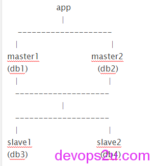
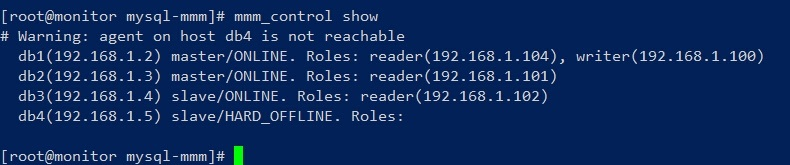

# Multi-Master Replication Manager for MySQL(mysql-mmm)

1. 配置说明
2. 安装mysql-mmm
3. 配置mysql主主
4. 配置mysql主从
5. 配置mysql-mmm
6. 启动服务mysql-mmm
7. 检查及测试mysql-mmm

### 配置说明

mysql-mmm和mha是公司常用的数据库高可用方案，这一篇写[mysql-mmm](mhttps://bbotte.github.io/databases/ulti-master-replication-manager-for-mysql/)，下一篇写[mysql-mha](https://bbotte.github.io/databases/mha-mysql-online-configuration-with-official-documents/)，每一种高可用方案思路各有不同，下面来看mysql-mmm

MMM (**M**ulti-**M**aster Replication **M**anager for MySQL) is a set of flexible scripts to perform monitoring/failover and management of MySQL master-master replication configurations (with only one node writable at any time).

The toolset also has the ability to read balance standard master/slave configurations with any number of slaves, so you can use it to move virtual IP addresses around a group of servers depending on whether they are behind in replication.

mysql-mmm官网 <http://mysql-mmm.org/start>
mysql-mmm 系统CentOS 6.5 64位 Mysql版本 5.5.37，实验为5台测试机
monitor监控2主2从
master1和master2互为备份
slave1是master1的从
slave2是master2的从
ip地址
monitor   192.168.1.1
master1   192.168.1.2
master2   192.168.1.3
slave1      192.168.1.4
slave2      192.168.1.5



事前准备：

修改各主机的名字 /etc/sysconfig/network 比如monitor： HOSTNAME=monitor
修改各主机

```
 /etc/hosts
192.168.1.1 monitor
192.168.1.2 db1
192.168.1.3 db2
192.168.1.4 db3
192.168.1.5 db4
```

配置monitor和各agent双机互信修改文件可以很方便

```
# ssh-keygen -t rsa
# for i in db1 db2 db3 db4; do ssh-copy-id -i ~/.ssh/id_rsa.pub root@$i;done
# for i in db1 db2 db3 db4; do ssh $i ‘date’;done #检测
```

如果时间不同步则

```
ntpdate ntp1.aliyun.com ;hwclock -w
yum install ntp ntpdate -y
service ntpd restart
```

在其他节点和此节点时间同步 ntpdate monitor
如果提示ntpdate[35485]: no server suitable for synchronization found 是因为NTP server没有和其自身或者其他的server同步，则在 /etc/ntp.conf 添加以下，然后重启ntp服务
server 127.127.1.0 fudge
127.127.1.0 stratum 8

### **安装mysql-mmm**

下面是两种安装方式：

安装方式1:

```
所有服务器执行
wget http://dl.fedoraproject.org/pub/epel/6/x86_64/epel-release-6-8.noarch.rpm
rpm -Uvh epel-release-6-8.noarch.rpm
monitor执行:
yum install mysql-mmm*
mysql agent 执行:
yum install mysql-mmm-agent
```

安装方式2:

```
yum install perl-CPAN #CPAN是perl的包管理器
perl -MCPAN -e shell#选择地区、国家和源
install Algorithm::Diff
install DBI
force install DBD::mysql
```

monitor要装的包：

```
# perl -MCPAN -e shell
cpan> install Algorithm::Diff
cpan> install Class::Singleton
cpan> install Log::Dispatch
cpan> install Log::Log4perl
cpan> install Mail::Send
cpan> install Proc::Daemon
cpan> install Thread::Queue
cpan> install Time::HiRes 
cpan> install DBI
cpan>install DBD::mysql
```

agent要装的包：

```
# perl -MCPAN -e shell
cpan> install Algorithm::Diff
cpan> install DBI
cpan>install Log::Dispatch
cpan> install Log::Log4perl
cpan> install Mail::Send
cpan> install Net::ARP
cpan> install Proc::Daemon
cpan> install Time::HiRes
cpan>install DBD::mysql
cpan>install File::stat
cpan>install File:basename
```

```
tar zxf mysql-mmm-2.2.1.tar.gz
cd mysql-mmm-2.2.1
make instal
mysql-mmm文件位置及作用如下：
/usr/lib/perl5/vendor_perl/5.8.8/MMM                 MMM 使用的 perl 模块
/usr/lib/mysql-mmm                                   MMM 的脚本揑件
/usr/sbin                                            MMM 的命令保存路径
/var/log/mysql-mmm                                   MMM 的日志保存路径
/etc                                                 MMM 配置文件保存的路径
/etc/mysql-mmm                                       MMM 配置文件保存的路径，优先级最高
/etc/init.d/                                         agentd 和 monitor 的启劢关闭脚本
```

mysql安装略过

依次配置各个my.cnf 的server-id为1,2,3,4   比如db1：

server-id  = 1
read_only = 1

### **配置mysql主主**

master1:

```
mysql> grant replication slave on *.* to "zhuzhu"@"192.168.1.%" identified by "zhuzhu";
mysql> grant process, super, replication client on *.* to 'mmm_agent'@'192.168.1.%' identified by 'mmm_agent';
mysql> grant replication client on *.* to "mmm_monitor"@"192.168.1.%" identified by "mmm_monitor"; 
mysql> flush privileges;
mysql> show master status\G
```

查看master1 mysql-bin的日志文件名称和MASTER_LOG_POS的值，在master2上执行CHANGE MASTER TO MASTER_HOST 时使用，这里master1的MASTER_LOG_FILE=’mysql-bin.000010’，MASTER_LOG_POS=107

```
mysql> CHANGE MASTER TO MASTER_HOST='192.168.1.3',MASTER_USER='zhuzhu',MASTER_PASSWORD='zhuzhu',MASTER_PORT=3306,MASTER_LOG_FILE='mysql-bin.000006', MASTER_LOG_POS=1180,MASTER_CONNECT_RETRY=10;
mysql> start slave;
mysql> show slave status\G
```

master2:

```
mysql> grant replication slave on *.* to "zhuzhu"@"192.168.1.%" identified by "zhuzhu";
mysql> grant process, super, replication client on *.* to 'mmm_agent'@'192.168.1.%' identified by 'mmm_agent';
mysql> grant replication client on *.* to "mmm_monitor"@"192.168.1.%" identified by "mmm_monitor"; 
mysql> flush privileges;
mysql> show master status\G
```

查看master2 mysql-bin的日志文件名称和MASTER_LOG_POS的值，在master1上执行CHANGE MASTER TO MASTER_HOST 时使用，这里master2的MASTER_LOG_FILE=’mysql-bin.000006’，MASTER_LOG_POS=1180

```
mysql> CHANGE MASTER TO MASTER_HOST='192.168.1.2',MASTER_USER='zhuzhu',MASTER_PASSWORD='zhuzhu',MASTER_PORT=3306,MASTER_LOG_FILE='mysql-bin.000010', MASTER_LOG_POS=107,MASTER_CONNECT_RETRY=10;
mysql> start slave;
mysql> show slave status\G
```

### **配置mysql主从**

slave1：

```
mysql> stop slave;
mysql> CHANGE MASTER TO MASTER_HOST='192.168.1.2',MASTER_USER='zhuzhu',MASTER_PASSWORD='zhuzhu',MASTER_PORT=3306,MASTER_LOG_FILE='mysql-bin.000010', MASTER_LOG_POS=107,MASTER_CONNECT_RETRY=10;
mysql> start slave;
mysql> show slave status\G
```

slave2：

```
mysql> stop slave;
mysql> CHANGE MASTER TO MASTER_HOST='192.168.1.3',MASTER_USER='zhuzhu',MASTER_PASSWORD='zhuzhu',MASTER_PORT=3306,MASTER_LOG_FILE='mysql-bin.000006', MASTER_LOG_POS=1180,MASTER_CONNECT_RETRY=10;
mysql> start slave;
mysql> show slave status\G
```

在两个slave上面创建monitor的账号：

```
grant replication client on *.* to "mmm_monitor"@"192.168.1.%" identified by "mmm_monitor"; 
grant process, super, replication client on *.* to 'mmm_agent'@'192.168.1.%' identified by 'mmm_agent';
flush privileges;
show slave status\G
```

在db1 新建用户，稍后用于测试：

```
mysql> grant all on *.* to user@"192.168.1.%" identified by "123456";
mysql> flush privileges;
```

在db1创建一个表，在db4测试是否同步成功：

```
mysql> create database testdb;
Query OK, 1 row affected (0.02 sec)
mysql> use testdb;
Database changed
mysql> create table user (id int(4),name varchar(10));
Query OK, 0 rows affected (0.07 sec)
mysql> insert into user values(1,"tom");
Query OK, 1 row affected (0.01 sec)
```

### **配置mysql-mmm**

配置mmm_agent.conf

monitor:  /etc/mysql-mmm目录下 mmm_agent.conf 注释#this db1

agent:  db1(192.168.1.2)–db4(192.168.1.5) 上mmm_agent.conf 依次为this db1，，this db4

配置mmm_common.conf

monitor:

```
[root@monitor mysql-mmm]# vim mmm_common.conf
active_master_role      writer
<host default>
    cluster_interface       eth0
    pid_path                /var/run/mysql-mmm/mmm_agentd.pid
    bin_path                /usr/libexec/mysql-mmm/
    replication_user         zhuzhu
    replication_password    zhuzhu
    agent_user                  mmm_agent
    agent_password          mmm_agent
</host>
<host db1>
    ip      192.168.1.2
    mode    master
    peer    db2
</host>
<host db2>
    ip      192.168.1.3
    mode    master
    peer    db1
</host>
<host db3>
    ip      192.168.1.4
    mode    slave
</host>
<host db4>
    ip      192.168.1.5
    mode    slave
</host>
 
<role writer>
    hosts   db1, db2
    ips     192.168.1.100
    mode    exclusive
</role>
<role reader>
    hosts   db1,db2,db3,db4
    ips     192.168.1.101, 192.168.1.102,192.168.1.103,192.168.1.104
    mode    balanced
</role>
```

配置agent:  把此配置文件mmm_common.conf复制到各agent /etc/mysql-mmm

配置mmm_mon.conf

monitor:

```
[root@monitor mysql-mmm]# vim mmm_mon.conf
include mmm_common.conf
<monitor>
    ip                  192.168.1.1
    pid_path            /var/run/mysql-mmm/mmm_mond.pid
    bin_path            /usr/libexec/mysql-mmm
    status_path         /var/lib/mysql-mmm/mmm_mond.status
    ping_ips            192.168.1.2,192.168.1.3,192.168.1.4,192.168.1.5
    auto_set_online     60
    # The kill_host_bin does not exist by default, though the monitor will
    # throw a warning about it missing.  See the section 5.10 "Kill Host
    # Functionality" in the PDF documentation.
    #
    # kill_host_bin     /usr/libexec/mysql-mmm/monitor/kill_host
    #
</monitor>
<host default>
    monitor_user        mmm_monitor
    monitor_password    mmm_monitor
</host>
debug 0
```

### **启动服务mysql-mmm**

先启agent，再启monitor，顺序不要错了
在各个agent节点启动服务# service mysql-mmm-agent restart
在monitor节点启动监控服务 # service mysql-mmm-monitor start
monitor节点查看

```
[root@monitor mysql-mmm]# mmm_control show
db1(192.168.1.2) master/ONLINE. Roles: reader(192.168.1.102), writer(192.168.1.100)
db2(192.168.1.3) master/ONLINE. Roles: reader(192.168.1.101)
db3(192.168.1.4) slave/ONLINE. Roles: reader(192.168.1.104)
db4(192.168.1.5) slave/ONLINE. Roles: reader(192.168.1.103)
 
[root@monitor mysql-mmm]# mmm_control help
[root@monitor mysql-mmm]# mmm_control show
[root@monitor mysql-mmm]# mmm_control ping
```

```
[root@monitor mysql-mmm]# mmm_control checks all
db4  ping         [last change: 2014/12/31 15:15:22]  OK
db4  mysql        [last change: 2014/12/31 15:15:22]  OK
db4  rep_threads  [last change: 2014/12/31 15:15:22]  OK
db4  rep_backlog  [last change: 2014/12/31 15:15:22]  OK: Backlog is null
db2  ping         [last change: 2014/12/31 15:15:22]  OK
db2  mysql        [last change: 2014/12/31 15:15:22]  OK
db2  rep_threads  [last change: 2014/12/31 15:15:22]  OK
db2  rep_backlog  [last change: 2014/12/31 15:15:22]  OK: Backlog is null
db3  ping         [last change: 2014/12/31 15:15:22]  OK
db3  mysql        [last change: 2014/12/31 15:15:22]  OK
db3  rep_threads  [last change: 2014/12/31 15:15:22]  OK
db3  rep_backlog  [last change: 2014/12/31 15:15:22]  OK: Backlog is null
db1  ping         [last change: 2014/12/31 15:15:22]  OK
db1  mysql        [last change: 2014/12/31 15:15:22]  OK
db1  rep_threads  [last change: 2014/12/31 15:15:22]  OK
db1  rep_backlog  [last change: 2014/12/31 15:15:22]  OK: Backlog is null
```

查看db1的ip地址：

```
[root@db1 mysql-mmm]# ip a
1: lo: <LOOPBACK,UP,LOWER_UP> mtu 16436 qdisc noqueue state UNKNOWN 
    link/loopback 00:00:00:00:00:00 brd 00:00:00:00:00:00
    inet 127.0.0.1/8 scope host lo
    inet6 ::1/128 scope host 
       valid_lft forever preferred_lft forever
2: eth0: <BROADCAST,MULTICAST,UP,LOWER_UP> mtu 1500 qdisc pfifo_fast state UP qlen 1000
    link/ether 00:0c:29:0a:5e:93 brd ff:ff:ff:ff:ff:ff
    inet 192.168.1.2/24 brd 192.168.1.255 scope global eth0
    inet 192.168.1.104/32 scope global eth0
    inet 192.168.1.100/32 scope global eth0
    inet6 fe80::20c:29ff:fe0a:5e93/64 scope link 
       valid_lft forever preferred_lft forever 
```

### **检查及测试mysql-mmm**

在monitor节点登录可以写入的VIP

```
# mysql -uuser -p123456 -h 192.168.1.100
mysql> insert into user values(2,"jerry");
```

在db4查看是否有此数据

```
mysql> select * from testdb.user;
+------+-------+
| id   | name  |
+------+-------+
|    1 | tom   |
|    2 | jerry |
+------+-------+
2 rows in set (0.00 sec)
```

模拟主mysql服务关闭，测试VIP是否会移动到master2
在db1 service mysqld stop
monitor查看结果

```
[root@monitor mysql-mmm]# mmm_control show
  db1(192.168.1.2) master/HARD_OFFLINE. Roles: 
  db2(192.168.1.3) master/ONLINE. Roles: reader(192.168.1.101), writer(192.168.1.100)
  db3(192.168.1.4) slave/ONLINE. Roles: reader(192.168.1.102), reader(192.168.1.104)
  db4(192.168.1.5) slave/ONLINE. Roles: reader(192.168.1.103)
```

然后把db1的mysql服务再次启动，在monitor查看

```
[root@monitor mysql-mmm]# mmm_control show
  db1(192.168.1.2) master/ONLINE. Roles: reader(192.168.1.104)
  db2(192.168.1.3) master/ONLINE. Roles: reader(192.168.1.101), writer(192.168.1.100)
  db3(192.168.1.4) slave/ONLINE. Roles: reader(192.168.1.102)
  db4(192.168.1.5) slave/ONLINE. Roles: reader(192.168.1.103)
```

我们先手动把VIP迁移回db1

```
[root@monitor mysql-mmm]# mmm_control move_role writer db1
OK: Role 'writer' has been moved from 'db2' to 'db1'. Now you can wait some time and check new roles info!
[root@monitor mysql-mmm]# mmm_control show
  db1(192.168.1.2) master/ONLINE. Roles: reader(192.168.1.104), writer(192.168.1.100)
  db2(192.168.1.3) master/ONLINE. Roles: reader(192.168.1.101)
  db3(192.168.1.4) slave/ONLINE. Roles: reader(192.168.1.102)
  db4(192.168.1.5) slave/ONLINE. Roles: reader(192.168.1.103)
```

模拟slave节点当机：如果把db4直接关机，那么就出现下面的状态



monitor其他常用命令

```
mmm_control ping
mmm_control show
mmm_control checks all
mmm_control set_online db1
mmm_control move_role writer db1
```

mysql-mmm 数据一致性方面不是很好,
mysql-mmm模拟master2(读)执行的时候加锁lock，往master1(写)插入数据后，把master1关闭(模拟当机)，查看数据完整性
1，在master2(读)上面use testdb; lock tables user read;
2，这时候把master1(写)插入一条数据 use testdb; insert into user values (4,”marry”);再service mysqld stop
3，master2上show processlist; unlock tables; select * from testdb.user;
4，master1现在为OFFLINE，master2为写入
5，再把master1 service mysqld start，master1 select * from testdb.user; 数据正常
不过slave插入了2条相同数据（master1 sql服务关闭前插入一条，VIP转移master2后又插入一条）

以前的mysql-mmm problem，现在应该解决了
<http://code.openark.org/blog/mysql/problems-with-mmm-for-mysql>
<http://www.xaprb.com/blog/2011/05/04/whats-wrong-with-mmm/>

2016年03月16日 于 [linux工匠](https://bbotte.github.io/) 发表
