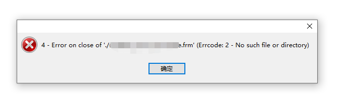

# mysql的不常用命令

1,登录mysql:

```
mysql -uroot -p -h xxx.mysql.rds.aliyuncs.com --default-character-set=utf8
```

2,如果一条sql语句执行慢，怎么排查排哈

```
explain sql_query;    查看有没有用哪个index
set profiling = 1;
sql sql_query;
show profiles;
show profile for query sql_query_id;   查看是在哪个status上慢的
```

3,每秒捕获一次show global status的数据，计算出每秒的查询书，连接数，正在执行查询的线程数：

```
mysqladmin -uroot -p123456 ext -i1 |awk '/Queries/{q=$4-qp;qp=$4} /Threads_connnected/{tc=$4} /Threads_running/{printf "%5d %5d %5d\n",q,tc,$4}'
```

4,按照状态查看processlist：

```
mysql -e 'show processlist\G'| grep State:|sort|uniq -c|sort -rn
```

5,查看某一个表的信息：

```
select * from information_schema.TABLES where information_schema.TABLES.TABLE_SCHEMA = 'db_name' and information_schema.TABLES.TABLE_NAME = 'table_name';
```

6,导出条件where id = 1 的原始insert sql语句：

```
mysqldump -uroot -p123456 --compact --extended-insert=false dbname tbname -w "id =1;"
```

7,添加一个索引index：

```
ALTER TABLE table_name add INDEX idx_name_age (name, age)
```

8,用添加的强制索引：

```
select name from user FORCE INDEX(idx_name_age) where updated_at > UNIX_TIMESTAMP('2017-01-01 00:00:00');
```

9,sql_query执行第一次后有缓存在内存中，需要不加载缓存：

```
select SQL_NO_CACHE field from table_name;
```

10,mysql几种kill pid的方法：

```
#!/bin/bash
users='root'
passwd="123456"
RDS="127.0.0.1"
 
mysql -u$users -p${passwd} -h ${RDS} -e"SHOW FULL PROCESSLIST;" |grep "table_name或者是特殊的字段"|awk 'NR>1{print "kill "$1";"}' >> kill_pid
 
#mysql -u$users -p${passwd} -h ${RDS} -e"select concat('KILL ',id,';') from information_schema.processlist where INFO like 'SELECT%' ;" |awk 'NR>1{print}' >> kill_pid 
 
#mysql -u$users -p${passwd} -h ${RDS} -e"select concat('KILL ',id,';') from information_schema.processlist where Command = 'Sleep' ;" |awk 'NR>1{print}' >> kill_pid 
 
cat kill_pid|xargs -I% mysql -u$users -p${passwd} -h ${RDS} -e"%"
```

11,当然，如果在线改表结构的话肯定用pt-online-schema-change:

```
pt-online-schema-change -u$users -p ${passwd} -h $RDS  --no-version-check --execute --alter "add index name(name)" A=utf8,D='db_name',t='table_name' --recursion-method=none --no-check-replication-filters --quiet --critical-load="Threads_running=50"
```

12,mysql运行时间长了，会发现mysql/data/mysql/general_log.CSV文件较大，几个G或者几十个G，可以关闭，再删除此文件释放空间：

```
show global variables like '%general%';
set global general_log = on; // 打开
set global general_log = off; // 关闭
```

13,从文档导入数据插入到表中：

```
load data  [low_priority] [local] infile 'file_name' [replace | ignore]
into table tbl_name
[fields
[terminated by't']
[OPTIONALLY] enclosed by '']
[escaped by'\' ]]
[lines terminated by'n']
[ignore number lines]
[(col_name,   )]
```

不同于source直接导入

14,centos 6安装mariadb

```
vim /etc/yum.repos.d/mariadb.repo
# MariaDB 5.5 CentOS repository list - created 2013-08-11 14:22 UTC
# http://mariadb.org/mariadb/repositories/
[mariadb]
name = MariaDB
baseurl = http://yum.mariadb.org/5.5/centos6-amd64
gpgkey=https://yum.mariadb.org/RPM-GPG-KEY-MariaDB
gpgcheck=1
 
# MariaDB 5.5 CentOS repository list - created 2013-08-11 14:22 UTC
# http://mariadb.org/mariadb/repositories/
[mariadb]
name = MariaDB
baseurl = http://yum.mariadb.org/5.5/centos6-amd64
gpgkey=https://yum.mariadb.org/RPM-GPG-KEY-MariaDB
gpgcheck=1
 
# On RHEL/CentOS 6/5 and Fedora 19,18,17 #
[root@tecmint]# yum -y install MariaDB MariaDB-server
```


15,修复损坏的表结构



```
移动坏表的 frm到其他目录，
重启mysql，
移动frm到对应目录，（如果没有正确的frm文件，那么新建表结构一致的表）
登录数据库修复表：
repair table newdb.table1;
ALTER TABLE newdb.table1 IMPORT TABLESPACE;
```


2017年03月26日 于 [linux工匠](http://www.bbotte.com/) 发表