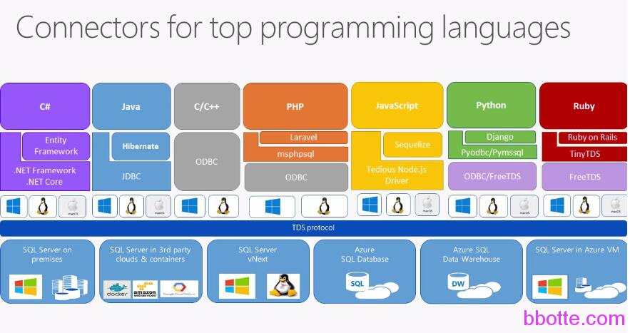

# centos系统pyodbc+MS_ODBC连接azure的SQL Server

centos系统pyodbc+MS_ODBC连接azure的SQL Server

说明
第一步安装odbc
第二步安装msodbcsql
第三步使用odbc连接sql server测试
第四步安装freetds
第五步使用freetds连接sql server
第六步使用python连接sql server

### 说明



FreeTDS提供了ODBC driver所以pyodbc+FreeTDS_ODBC可以访问SQL Server

### **第一步安装odbc**

http://www.unixodbc.org/

```
yum install -y unixODBC-devel glibc libgcc libstdc++ libuuid krb5-libs openssl gcc gcc-c++ python-devel libxslt-devel libffi-devel openssl-devel
curl -O 'ftp://ftp.unixodbc.org/pub/unixODBC/unixODBC-2.3.2.tar.gz'
tar -xz -f unixODBC-2.3.2.tar.gz
cd unixODBC-2.3.2
rm -f /usr/lib64/libodbc*
export CPPFLAGS="-DSIZEOF_LONG_INT=8"
./configure --prefix=/usr --libdir=/usr/lib64 --sysconfdir=/etc --enable-gui=no --enable-drivers=no --enable-iconv --with-iconv-char-enc=UTF8 --with-iconv-ucode-enc=UTF16LE --enable-stats=no 1> configure_std.log 2> configure_err.log
make 1> make_std.log 2> make_err.log
make install 1> makeinstall_std.log 2> makeinstall_err.log
cd /usr/lib64
ln -s libodbccr.so.2 libodbccr.so.1
ln -s libodbcinst.so.2 libodbcinst.so.1
ln -s libodbc.so.2 libodbc.so.1
```

测试安装情况

```
ls -l /usr/lib64/libodbc*
odbc_config --version --longodbcversion --cflags --ulen --libs --odbcinstini --odbcini
odbcinst -j
isql --version
```

### **第二步安装msodbcsql**

下载并安装Microsoft® ODBC Driver 11 for SQL Server® – Red Hat Linux

```
https://www.microsoft.com/en-us/download/details.aspx?id=36437
tar -xz -f msodbcsql-11.0.2270.0.tar.gz
cd msodbcsql-11.0.2270.0
./install.sh install --accept-license --force 1> install_std.log 2> install_err.log
ls -l /opt/microsoft/msodbcsql/lib64/
dltest /opt/microsoft/msodbcsql/lib64/libmsodbcsql-11.0.so.2270.0 SQLGetInstalledDrivers
cat /etc/odbcinst.ini
odbcinst -d -q
```

### **第三步使用odbc连接sql server测试**

```
# cat /tmp/odbc.txt 
[MySQLServerDatabase]
Driver = ODBC Driver 11 for SQL Server
Description = My MS SQL Server
Trace = No
Server = 192.168.100.100
 
odbcinst -i -s -f /tmp/odbc.txt -l
```

查看odbc.ini配置会发现多了上面添加的配置选项

```
# cat /etc/odbc.ini
[PostgreSQL]
Description=ODBC for PostgreSQL
Driver=/usr/lib/psqlodbcw.so
Setup=/usr/lib/libodbcpsqlS.so
Driver64=/usr/lib64/psqlodbcw.so
Setup64=/usr/lib64/libodbcpsqlS.so
FileUsage=1
 
[MySQL]
Description=ODBC for MySQL
Driver=/usr/lib/libmyodbc5.so
Setup=/usr/lib/libodbcmyS.so
Driver64=/usr/lib64/libmyodbc5.so 
Setup64=/usr/lib64/libodbcmyS.so
FileUsage=1
 
[ODBC Driver 11 for SQL Server]
Description=Microsoft ODBC Driver 11 for SQL Server
Driver=/opt/microsoft/msodbcsql/lib64/libmsodbcsql-11.0.so.2270.0
Threading=1
UsageCount=1
 
[FreeTDS]
Description=FreeTDS
Driver=/usr/lib64/libtdsodbc.so
Setup=/usr/lib64/libtdsS.so
FileUsage=1
client charset=utf-8
 
[MySQLServerDatabase]
Driver=ODBC Driver 11 for SQL Server
Description=My MS SQL Server
Trace=No
Server=192.168.100.100
```

odbcinst -d -q

```
vim /etc/odbcinst.ini
[PostgreSQL]
Description=ODBC for PostgreSQL
Driver=/usr/lib/psqlodbcw.so
Setup=/usr/lib/libodbcpsqlS.so
Driver64=/usr/lib64/psqlodbcw.so
Setup64=/usr/lib64/libodbcpsqlS.so
FileUsage=1
 
[MySQL]
Description=ODBC for MySQL
Driver=/usr/lib/libmyodbc5.so
Setup=/usr/lib/libodbcmyS.so
Driver64=/usr/lib64/libmyodbc5.so
Setup64=/usr/lib64/libodbcmyS.so
FileUsage=1
 
[ODBC Driver 11 for SQL Server]
Description=Microsoft ODBC Driver 11 for SQL Server
Driver=/opt/microsoft/msodbcsql/lib64/libmsodbcsql-11.0.so.2270.0
Threading=1
UsageCount=1
 
[FreeTDS]
Description = FreeTDS
Driver = /usr/lib64/libtdsodbc.so
Setup = /usr/lib64/libtdsS.so
FileUsage = 1
client charset = utf-8
```

isql是一个命令行工具，允许用户批量或交互式执行SQL，连接sql server测试：

```
# isql MySQLServerDatabase DB_username DB_passwd
+---------------------------------------+
| Connected! |
| |
| sql-statement |
| help [tablename] |
| quit |
| |
+---------------------------------------+
SQL> SELECT @@version AS version
| Microsoft SQL Azure (RTM) - 12.0.2000.8 
Aug 17 2017 03:51:24 
Copyright (C) 2017 Microsoft Corporation. All rights reserved.
SQLRowCount returns 1
1 rows fetched
SQL> quit
```

### **第四步安装freetds**

```
yum install -y freetds-devel
```

安装freetds-devel会同时把freetds安装上，安装后在freetds.conf配置添加sql server数据库信息，如下：

```
# tsql -C
Compile-time settings (established with the "configure" script)
Version: freetds v0.91
freetds.conf directory: /etc
MS db-lib source compatibility: yes
Sybase binary compatibility: yes
Thread safety: yes
iconv library: yes
TDS version: 4.2
iODBC: no
unixodbc: yes
SSPI "trusted" logins: no
Kerberos: yes
```

### **第五步使用freetds连接sql server**

tsql是FreeTDS组成的一部分，是用以提供诊断的工具。 它直接使用TDS协议连接到Microsoft SQL Server，并允许用户发出测试FreeTDS功能的查询

```
# TDSVER=8.0 tsql -H bbotte.database.chinacloudapi.cn -p 1433 -U DB_username -P DB_passwd
locale is "en_US.UTF-8"
locale charset is "UTF-8"
using default charset "UTF-8"
1> SELECT @@version AS version
2> go
version
Microsoft SQL Azure (RTM) - 12.0.2000.8 
Aug 17 2017 03:51:24 
Copyright (C) 2017 Microsoft Corporation. All rights reserved.
 
(1 row affected)
1> quit
```

### **第六步使用python连接sql server**

```
#!/usr/bin/env python
#ecoding=utf8
 
import pyodbc
 
 
mssqlinfo = [
    {'host':'bbotte-01','SERVER':'bbote.database.chinacloudapi.cn','UID':'bbotte','PWD':"bbotte.com",'DATABASE':"dbname"},
    ]
 
def CheckSQL(host="",SERVER="", UID="", PWD="", DATABASE=""):
    try:
        conn_str="DRIVER={FreeTDS};SERVER=%s;port=1433;DATABASE=%s;UID=%s;PWD=%s;TDS_Version=8.0;" % (SERVER,DATABASE,UID,PWD)
        conn=pyodbc.connect(conn_str)
        contime = 'con_time:{0}'.format(int((t1-t0)*1000))
    except Exception,e:
        message = "Problem:%s \n%s \n%s" % (datetime.datetime.now(),host,e)
    try:
        cursor = conn.cursor()
        cursor.execute("SELECT @@version AS version")
        result = cursor.fetchall()
        exectime = 'exec_time:{0}'.format(int((t3-t2)*1000))
    finally:
        conn.close()
        return contime,exectime
 
 
if __name__ == '__main__':
    for i in mssqlinfo:
        CheckSQL(**i)
```

参考：

<https://docs.microsoft.com/zh-cn/sql/connect/odbc/linux-mac/installing-the-driver-manager>
<https://docs.microsoft.com/en-us/sql/connect/odbc/linux-mac/system-requirements>

2017年09月06日 于 [linux工匠](http://www.bbotte.com/) 发表