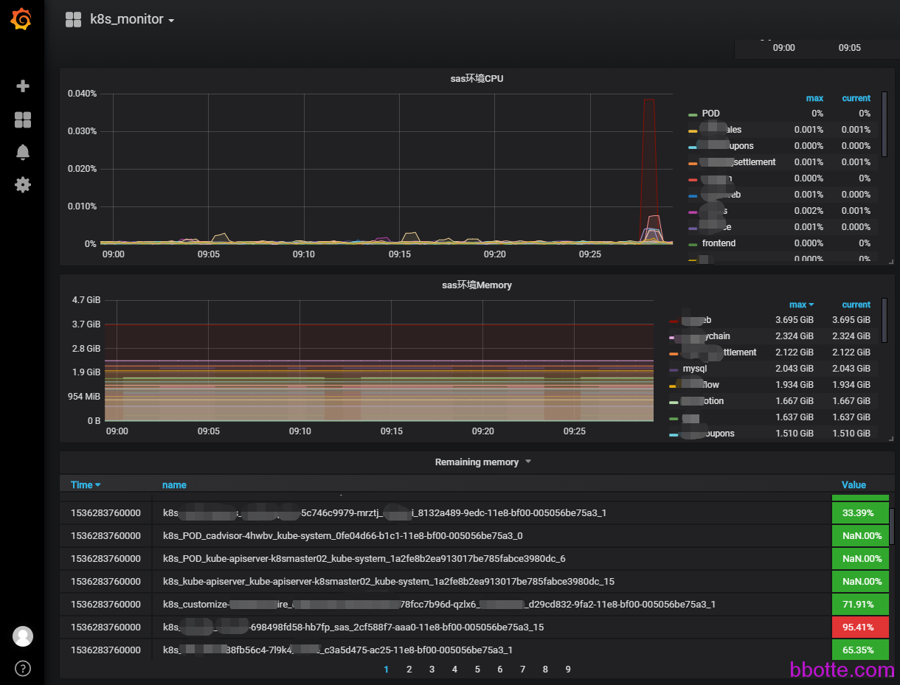

#docker或kubernetes集群的监控（cadvisor+prometheus）

docker或kubernetes集群的监控有多种，比如：

cAdvisor收集本机以及容器的监控数据–Heapster收集数据及汇总–InfluxDB时序数据库–grafana
cAdvisor收集本机以及容器的监控数据–prometheus自带监控及报警的时序数据库（集成leveldb）–grafana

下面简单说一下谷歌cAdvisor和普罗米修斯结合的监控，在grafana展示，各个文档请看官方介绍

<https://prometheus.io/>      <https://github.com/google/cadvisor>

### **cAdvisor**

具体操作是在每台运行docker服务的主机上都跑一个cAdvisor容器，**DaemonSet方式部署，网络是HOST模式**

**如果是docker直接运行：**

```
docker容器：docker.io/google/cadvisor
 
sudo docker run \
  --volume=/:/rootfs:ro \
  --volume=/var/run:/var/run:rw \
  --volume=/sys:/sys:ro \
  --volume=/var/lib/docker/:/var/lib/docker:ro \
  --volume=/dev/disk/:/dev/disk:ro \
  --publish=8080:8080 \
  --detach=true \
  --name=cadvisor \
  google/cadvisor:latest
```

这样访问cAdvisor的8080端口就得到cAdvisor的监控页面

**如果是docker-compose方式：**

```
version: '2.4'
services:
  cadvisor:
    container_name: cadvisor-com
    mem_limit: 1024M
    image: harbor.bbotte.com/k8s/cadvisor:latest
    restart: always
    volumes:
     - /var/run:/var/run
     - type: bind
       source: /sys
       target: /sys
       read_only: true
     - type: bind
       source: /var/lib/docker
       target: /var/lib/docker
       read_only: true
     - type: bind
       source: /dev/disk
       target: /dev/disk
       read_only: true
    ports:
     - 8080:8080
    networks:
     - bbotte
 
#cadvisor服务也可写下面这样，效果一样
  cadvisor:
    container_name: cadvisor-com
    image: harbor.bbotte.com/k8s/cadvisor:latest
    restart: always
    ports:
      - "8080:8080"
    volumes:
      - /:/rootfs:ro
      - /var/run:/var/run:rw
      - /sys:/sys:ro
      - /var/lib/docker/:/var/lib/docker:ro
    networks:
      - bbotte
 
networks:
  bbotte:
    external: false
```

**如果是kubernetes上运行：**

如果docker是运行在虚拟主机，或者灵雀云上，可以用上面的方式。而我们的docker服务是运行在自己部署的kubernetes集群上面，所以用下面方式：

kubernetes配置如下：

```
# cat cadvisor.yaml
apiVersion: apps/v1 # for Kubernetes versions before 1.9.0 use apps/v1beta2
kind: DaemonSet
metadata:
  name: cadvisor
  namespace: kube-system
  labels:
    app: cadvisor
  annotations:
      seccomp.security.alpha.kubernetes.io/pod: 'docker/default'
spec:
  selector:
    matchLabels:
      name: cadvisor
  template:
    metadata:
      labels:
        name: cadvisor
    spec:
      tolerations:
      # Tolerate master taint
      - key: node-role.kubernetes.io/master
        operator: Exists
        effect: NoSchedule
      tolerations:
      - key: node-role.kubernetes.io/master
        effect: NoSchedule
      containers:
      - name: cadvisor
        #image: k8s.gcr.io/cadvisor:v0.30.2
        image: harbor.bbotte.com/k8s/cadvisor:latest
        resources:
          requests:
            memory: 200Mi
            cpu: 150m
          limits:
            cpu: 300m
        volumeMounts:
       # - name: rootfs
       #   mountPath: /rootfs
       #   readOnly: true
        - name: var-run
          mountPath: /var/run
          readOnly: true
        - name: sys
          mountPath: /sys
          readOnly: true
        - name: docker
          mountPath: /var/lib/docker
          readOnly: true
        ports:
          - name: http
            containerPort: 8080
            protocol: TCP
        args:
          - --housekeeping_interval=10s
      automountServiceAccountToken: false
      terminationGracePeriodSeconds: 30
      imagePullSecrets:
        - name: harbor-auth-kube
      volumes:
     # - name: rootfs
     #   hostPath:
     #     path: /
      - name: var-run
        hostPath:
          path: /var/run
      - name: sys
        hostPath:
          path: /sys
      - name: docker
        hostPath:
          path: /var/lib/docker
 
---
kind: Service
apiVersion: v1
metadata:
  name: cadvisor
  namespace: kube-system
spec:
  type: NodePort
  externalTrafficPolicy: Local
  selector:
    name: cadvisor
  ports:
  - name: http
    protocol: TCP
    port: 8188
    targetPort: 8080
    nodePort: 30101
 
# Failed to start container manager: inotify_add_watch /sys/fs/cgroup/cpuacct,cpu: no such file or directory
# fixed it:
#    mount -o remount,rw '/sys/fs/cgroup'
#    ln -s /sys/fs/cgroup/cpu,cpuacct /sys/fs/cgroup/cpuacct,cpu
 
# rootfs volume is not mount, because kubernetes pod is update, docker containers cannot be remove device ,tips:
# Error: "UnmountVolume.TearDown failed for volume remove /var/lib/kubelet/pods/ device or resource busy
```

上面是nodeport暴露端口的，访问主机IP:30101端口即可打开cadvisor页面，centos主机需要上述配置文件最后面2步，重新挂载/sys/fs/cgroup文件夹

cadvisor的监控接口:

```
http://IP:30101/metrics
http://IP:30101/containers
http://IP:30101/docker
```

### **prometheus**

下载官方prometheus的tar.gz包，解压就可以，targets里面写各个cAdvisor的ip和端口

```
# egrep -v "^$|.*#" /data/prometheus/prometheus.yml
global:
  external_labels:
      monitor: 'codelab-monitor'
rule_files:
scrape_configs:
  - job_name: 'prometheus'
    static_configs:
      - targets: ['localhost:9090']
  - job_name: 'bbotte-test'
    static_configs:
      - targets: ['192.168.1.1:30101','192.168.1.2:30101','192.168.1.3:30101'] #各个k8s master、node节点都加上
        labels:
          group: 'test'
```

```
nohup prometheus --config.file prometheus.yml &
```

在哪个目录运行prometheus，就会在当前目录生成data文件夹，里面是监控的数据库

运行prometheus后监听在9090端口，访问http://192.168.2.1:9090/graph


在Status-Configuration里面可以看到配置文件，Targets里面查看已经建立的节点。普罗米修斯Graph搜索查看条件语法见 [https://prometheus.io/docs/querying/basics/ ](https://prometheus.io/docs/querying/basics/)

### **grafana**

grafana是从prometheus获取数据并展示，第一步添加prometheus数据库，第二步用网上的模板画图

```
yum localinstall grafana-5.0.3-1.x86_64.rpm
/bin/systemctl daemon-reload
/bin/systemctl enable grafana-server
/bin/systemctl start grafana-server
```

访问IP:3000，用户名密码为admin，如果prometheus和grafana在一台主机，http setting这里写：

http://localhost:9090   proxy即可，如果不在一台主机，那么需要prometheus访问链接，access：direct


打开Grafana Labs，查找prometheus的模板， <https://grafana.com/dashboards?dataSource=prometheus&search=docker>，每个模板都有一个id，在grafana里面输入id导入到grafana

选择import，举例输入893（https://grafana.com/dashboards/893），再选择prometheus的数据源，即上面添加的top-prometheus，4170（https://grafana.com/dashboards/4170）模板也不错


也可以自己画图：


```
sort_desc(sum(rate(container_cpu_user_seconds_total{image!="",job="bbotte-test",group="test"}[1m])) by (container_label_io_kubernetes_container_name))
 
{{container_label_io_kubernetes_container_name}}
 
container_cpu_user_seconds_total
```

```
如果需要查看每个pod的状态，可以配置如下：
sort_desc(sum(rate(container_cpu_user_seconds_total{image!="",job="k8s",group="test",container_label_io_kubernetes_pod_namespace="default"}[1m])) by (container_label_io_kubernetes_container_name))
{{container_label_io_kubernetes_container_name}}
```

详细的监控和报警请查阅官方文档，照步骤操作

那么监控的数据准确吗？

查看cadvisor里面某一个docker服务的监控图形


可以看到从57分到58分，一共有6次数据采集，因为每10s获取一次监控数据，此docker服务配置是2c6g，在grafana里面查看cpu的利用率，平均53.713%


可以确定此监控是准确的




2017年11月06日 于 [linux工匠](http://www.bbotte.com/) 发表

