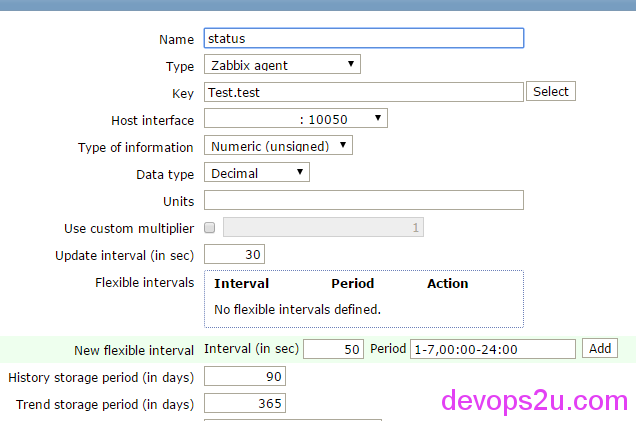
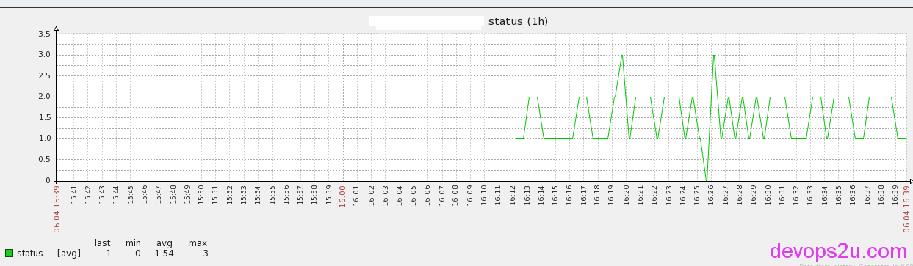
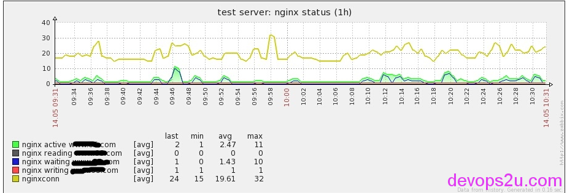

# 通过zabbix监控nginx和php状态

1. nginx和php的status
2. shell通过zabbix画图
3. zabbix对端口port和进程的监控

### 说明

nginx 和php 当然可以用zabbix监控，配置大家也都知道的。不过nginx和php都有status页面，刚好可以取得活动连接数、连接总数、握手次数、请求数，现在使用多少php的进程，空余多少php进程。下面就按status页面通过shell取值方式，由zabbix监控，再出图，报警的过程说明一下。

### **nginx和php的status**

先说一下nginx的配置文件：

```
$ less /usr/local/nginx/conf/server/status.conf
server{
         listen 80;
         server_name localhost;
         location /nstatus {
                         stub_status on;
                         access_log off;
          }
          location ~ ^/status$ {
           include fastcgi_params;
           fastcgi_pass 127.0.0.1:9000;
           fastcgi_param SCRIPT_FILENAME $fastcgi_script_name;
           }
 
}
```

nginx分老版本和新版本，老版本获取状态配置如上，如果新版本：

```
新版本nginx
 location /nstatus { check_status; access_log off;allow 1.1.1.1;deny all;}
老版本nginx
location /nstatus { stub_status on; access_log off;allow 1.1.1.1.;deny all; }
```

定义了nginx的页面nstatus，php的状态页面status。因为server_name是localhost，所以并没有加allow IP; deny all;  。并且php-fpm.conf里面需要开启status页面，要不会出现Access denied.

```
# grep status_path /usr/local/php/etc/php-fpm.conf
pm.status_path = /status
```

在本机curl一下

```
# curl localhost/status
pool:                 www
process manager:      static
start time:           06/Apr/2016:15:37:04 +0800
start since:          8
accepted conn:        1
listen queue:         0
max listen queue:     0
listen queue len:     32768
idle processes:       7
active processes:     1
total processes:      8
max active processes: 1
max children reached: 0
slow requests:        0

```

```
# curl localhost/nstatus
Active connections: 5 
server accepts handled requests
 3034 3034 6261 
Reading: 0 Writing: 2 Waiting: 0
```

已经通过此页面得到结果，只需要用shell把想要的值取出来即可。

### **shell通过zabbix画图**

下面举个例子，说一下定义一个shell，每次就取一个数字，user的cpu usage，把shell通过zabbix画图：

```
# cat /tmp/test.sh&nbsp;
#!/bin/bash
/usr/bin/dstat 1 1 |awk 'NR>3{print $1}'
 
# chmod +x /tmp/test.sh
```

在zabbix监控端的配置文件最后面添加此行，就是使用zabbix UserParameter选项：

Format: UserParameter=<key>,<shell command>

```
# vim /etc/zabbix/zabbix_agentd.conf
UserParameter=Test.test, /tmp/test.sh
```

测试一下：

```
# zabbix_agentd -c /etc/zabbix/zabbix_agentd.conf -t Test.test
Test.test                                     [t|2]
```

zabbix中 Configuration–Hosts– Host_Name–Items–Create item 添加自定义的这个shell，其中“Key”选项写：Test.test



Configuration–Hosts — Host_Name–Graphs–Create graphs 创建一个图形，再添加一个报警，和用zabbix直接监控一样的效果，



这就是通过shell取值传递给zabbix的一个过程，可能你会觉得这么办挺麻烦的，倒不如用zabbix提供的nginx监控（如下图）。这篇文章只是说明线上需要获取应用服务的状态，并且要监控应用的状态 这么一种方式。相同的道理，通过这种方法可以对其他应用服务的状态做监控，带着监控上线，及时发现处理问题。



### **zabbix对端口port和进程的监控**

如果一个程序运行有对外的端口，比如nginx，redis，mongodb，rabbitmq，可以通过端口对进程做监控；另一些进程运行没有端口，比如java语言开发的好些程序，我们可以通过zabbix proc.num对进程做判断确定是否存活 <https://www.zabbix.com/documentation/2.4/manual/config/items/itemtypes/zabbix_agent>

```
proc.num[<name>,<user>,<state>,<cmdline>]
说明：
name - process name (default is all processes)
user - user name (default is all users)
state - possible values: all (default), run, sleep, zomb
cmdline - filter by command line (it is a regular expression)	
 
Examples:
⇒ proc.num[,mysql] → number of processes running under the mysql user
⇒ proc.num[apache2,www-data] → number of apache2 processes running under the www-data user
⇒ proc.num[,oracle,sleep,oracleZABBIX] → number of processes in sleep state running under oracle having oracleZABBIX in its command line
```

我们可以试验一下：

```
# zabbix_agent -t proc.num[,,,java]
proc.num[,,,java]                             [u|4]
# zabbix_agent -t proc.num[,,,kafka]
proc.num[,,,kafka]                            [u|2]
# zabbix_agent -t proc.num[,,,zookeeper]
proc.num[,,,zookeeper]                        [u|3]
# zabbix_agent -t proc.num[,root,,java]
proc.num[,root,,java]                         [u|3]
```

在zabbix中添加此项目的监控，如果不等于监控的值，则发邮件通知

zabbix报错：

zabbix Error in query [INSERT INTO applications (name,hostid,applicationid) VALUES ()

原因：在zabbix–组态Configuration–模板–分类 里面是否有重复的键，修改此选项即可

2016年04月06日 于 [linux工匠](http://www.bbotte.com/) 发表


