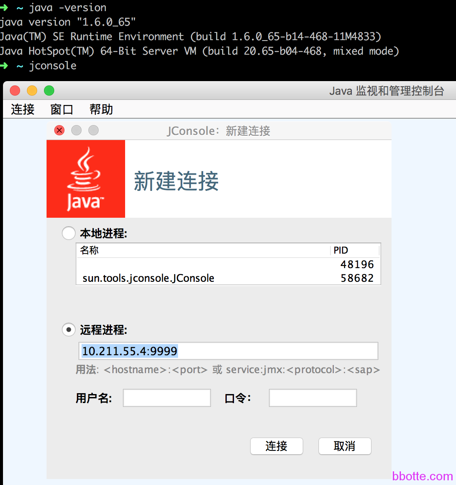
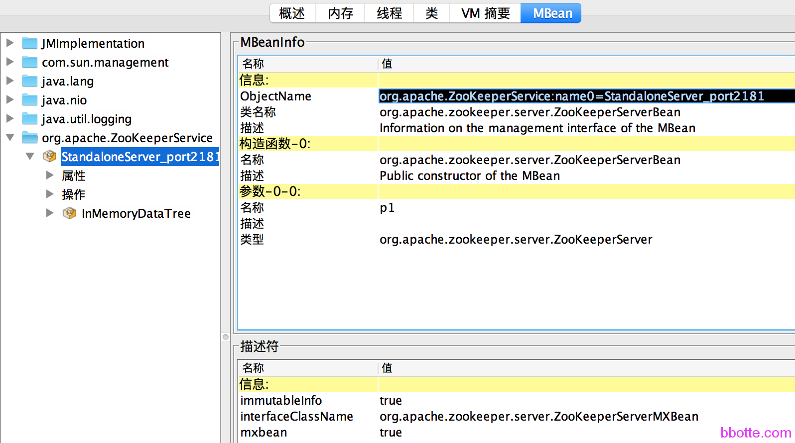
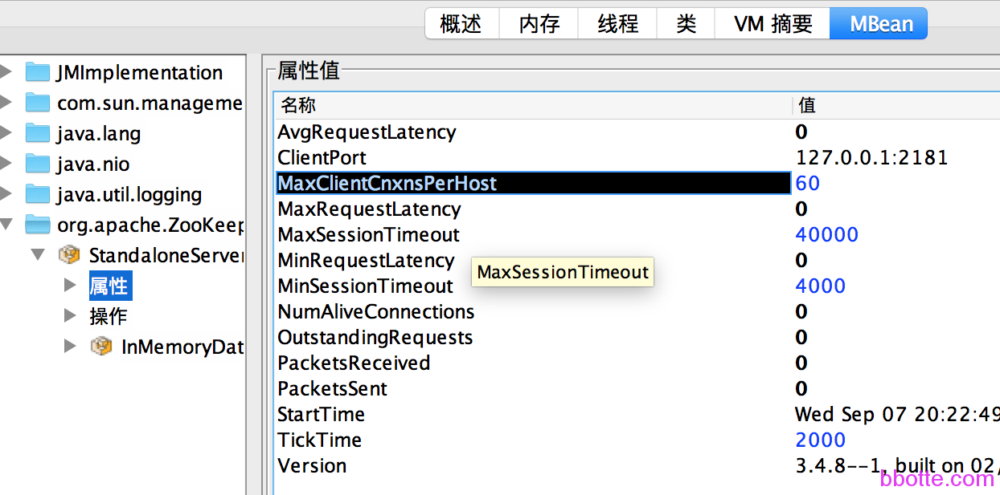
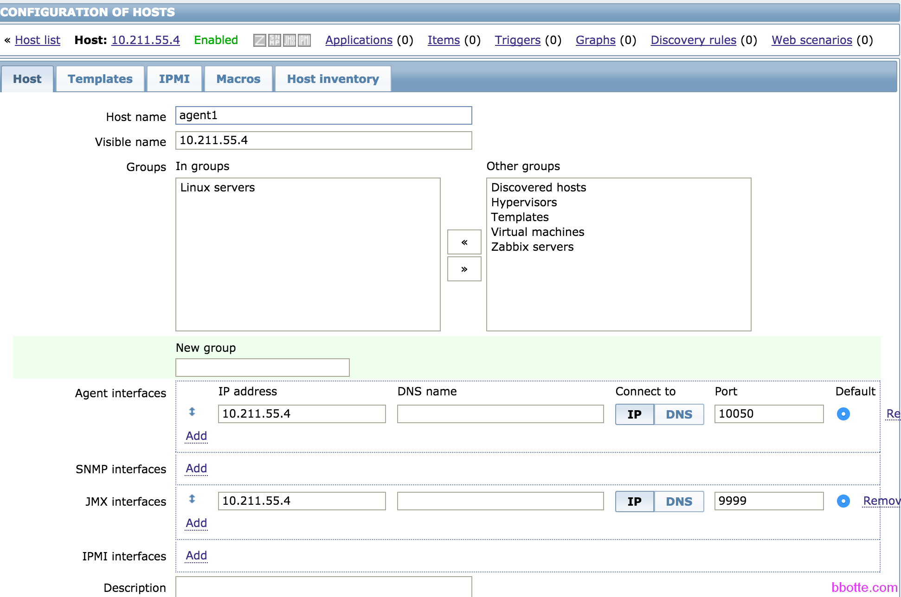
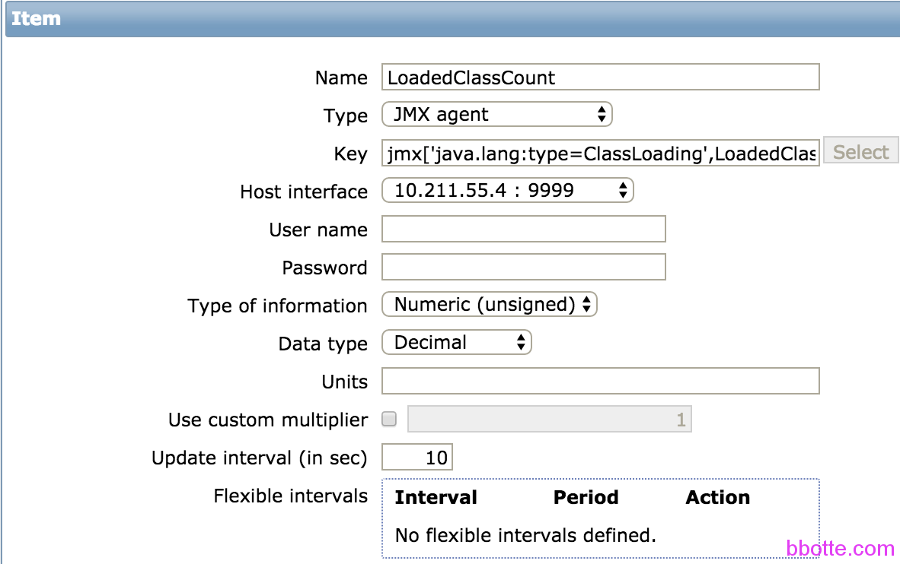

# linux工匠之java的zabbix监控

1. 开启zabbix_java服务
2. 首先开启jmxremote
3. 在jconsole里面查看参数和属性
4. 在zabbix里面添加监控项

老生常谈一个问题，zabbix对java程序的监控，下面以新版的zookeeper和kafka举例

[使用VisualVM](http://bbotte.com/monitor-safe/the-java-monitoring-tool-visualvm/)可以直接看到性能的图形变化，java自带的jconsole可以显示项目运行状态的数值，从而提供给zabbix得以出图

### **一，开启zabbix_java服务**

下载个zabbix，编译安装只为enable-java

```
yum install python-devel vim vim-enhanced bash glibc wget lrzsz bc mutt ntpdate sysstat dstat wget man mail mlocate mtr lsof iotop iptraf openssl-devel readline-devel sqlite-devel bzip2-devel python-pip git libxml2-devel curl-devel autoconf automake autoheader gcc gcc-c++ patch make flex bison file libtool libtool-libs libjpeg-devel libpng libpng-devel gd gd-devel freetype-devel libxml2 zlib zlib-devel glib2 glib2-devel bzip2 libevent libevent-devel ncurses ncurses-devel curl  e2fsprogs e2fsprogs-devel libidn libidn-devel gettext-devel gmp-devel unzip libcap apr* openssl  perl compat* mpfr cpp glibc-devel libgomp libstdc++-devel ppl cloog-ppl keyutils keyutils-libs-devel libcom_err-devel libsepol-devel krb5-devel libXpm* php-common php-gd pcre-devel openldap net-snmp net-snmp-devel libssh2-devel OpenIPMI-devel unixODBC perl-DBI

tar -xzf zabbix-2.4.8.tar.gz
cd zabbix-2.4.8
yum install mysql-devel net-snmp-devel
./configure --prefix=/usr/local/zabbix --enable-server  --enable-agent  --enable-java  --with-libxml2 --with-net-snmp --with-libcurl --with-mysql
make -j4
make install
 
不编译的话，可以yum安装 
 yum install -y zabbix-java-gataway
/etc/init.d/zabbix-java-gataway start
 
启动服务
/usr/local/zabbix/sbin/zabbix_java/startup.sh
# lsof -i:10052
COMMAND   PID USER   FD   TYPE DEVICE SIZE/OFF NODE NAME
java    11819 root   12u  IPv6  77069      0t0  TCP *:10052 (LISTEN)
 
再yum安装zabbix-server和zabbix-agent
rpm -ivh http://repo.zabbix.com/zabbix/2.4/rhel/6/x86_64/zabbix-release-2.4-1.el6.noarch.rpm
yum install zabbix-server-mysql zabbix-web-mysql zabbix-agent
 
zabbix-server的配置，mysql_IP为10.211.55.4，本机IP为10.211.55.5
# egrep -v "^$|^#" /etc/zabbix/zabbix_server.conf
LogFile=/var/log/zabbix/zabbix_server.log
LogFileSize=0
DebugLevel=3
PidFile=/var/run/zabbix/zabbix_server.pid
DBHost=10.211.55.4
DBName=zabbix
DBUser=zabbix
DBPassword=zabbix
DBSocket=/var/lib/mysql/mysql.sock
JavaGateway=10.211.55.5
JavaGatewayPort=10052
StartJavaPollers=5
SNMPTrapperFile=/var/log/snmptt/snmptt.log
AlertScriptsPath=/usr/lib/zabbix/alertscripts
ExternalScripts=/usr/lib/zabbix/externalscripts
```

zabbix的其他配置略,安装见 http://bbotte.blog.51cto.com/6205307/1612664

### **二，首先开启jmxremote**

一般会在java程序启动前添加

```
-Dcom.sun.management.jmxremote.port=9999 \
-Dcom.sun.management.jmxremote.ssl=false \
-Dcom.sun.management.jmxremote.authenticate=false \
-Djava.rmi.server.hostname=IP_Address
```

以Tomcat举例，修改bin/catalina.sh，添加如下，hostname是Tomcat本机的ip，在zabbix配置JMX接口中填入192.168.1.100，端口写12345即可。如果是Tomcat多实例，那么更改jmxremote.port为不同的端口

```
CATALINA_OPTS="-Dcom.sun.management.jmxremote \
-Dcom.sun.management.jmxremote.authenticate=false \
-Dcom.sun.management.jmxremote.ssl=false \
-Dcom.sun.management.jmxremote.port=12345 \
-Djava.rmi.server.hostname=192.168.1.100"
```

比如zookeeper的zabbix监控，zookeeper-3.4.8要开启jmxremote的话，需要在bin/zkEnv.sh里面或者bin/zkServer.sh里面添加如下一行即可

```
JMXPORT='9999'
```

网上搜索到的都是像下面一样，在bin/zkServer.sh里面修改ZOOMAIN，可是新版本的需要添加一个JMXPORT=’9999’的变量就可以的，而不是修改ZOOMAIN

```
bin/zkServer.sh    #不是修改这里
ZOOMAIN="-Dcom.sun.management.jmxremote -Dcom.sun.management.jmxremote.port=$JMXPORT -Dcom.sun.management.jmxremote.authenticate=$JMXAUTH -Dcom.sun.management.jmxremote.ssl=$JMXSSL -Dzookeeper.jmx.log4j.disable=$JMXLOG4J org.apache.zookeeper.server.quorum.QuorumPeerMain"
```

```
# ./bin/zkServer.sh start
ZooKeeper JMX enabled by default
ZooKeeper remote JMX Port set to 9999
ZooKeeper remote JMX authenticate set to false
ZooKeeper remote JMX ssl set to false
ZooKeeper remote JMX log4j set to true
Using config: /tmp/zookeeper-3.4.8/bin/../conf/zoo.cfg
Starting zookeeper ... STARTED
```

另外[zookeeper四字监控](https://zookeeper.apache.org/doc/trunk/zookeeperAdmin.html#sc_zkCommands)请看官方文档， echo conf|nc 127.0.0.1 2181 查看结果

再说到kafka的zabbix监控，kafka_2.10-0.10.0.0的java选项监控，需要在bin/kafka-server-start.sh添加export JMX_PORT=’9999′

```
bin/kafka-server-start.sh
if [ "x$KAFKA_HEAP_OPTS" = "x" ]; then
    export KAFKA_HEAP_OPTS="-Xmx1G -Xms1G"
    export JMX_PORT='9999'
fi
```

之所以kafka像zk一样这么简单是因为kafka-run-class.sh里面定义了jmxremote

```
bin/kafka-run-class.sh
# JMX settings
if [ -z "$KAFKA_JMX_OPTS" ]; then
  KAFKA_JMX_OPTS="-Dcom.sun.management.jmxremote -Dcom.sun.management.jmxremote.authenticate=false  -Dcom.sun.management.jmxremote.ssl=false "
fi
```

我们可以看到，要么是自己定义java启动的jmxremote，要么是程序里面已经设置好开关了，只需要打开

如果是添加jmx密码

```
[root@localhost ~]# vim bin/kafka-run-class.sh
 
# JMX settings
if [ -z "$KAFKA_JMX_OPTS" ]; then
  KAFKA_JMX_OPTS="-Dcom.sun.management.jmxremote -Dcom.sun.management.jmxremote.authenticate=true  -Dcom.sun.management.jmxremote.ssl=false -Dcom.sun.management.jmxremote.password.file=/etc/zabbix/zabbix_agentd.d/jmxremote.password -Dcom.sun.management.jmxremote.access.file=/etc/zabbix/zabbix_agentd.d/jmxremote.access -Djava.rmi.server.hostname=192.168.1.1  "
 
 
[root@localhost ~]# ll /etc/zabbix/zabbix_agentd.d/jmxremote.*
-rw-r--r-- 1 root root 18 Aug 30 12:01 /etc/zabbix/zabbix_agentd.d/jmxremote.access
-r-------- 1 root root 22 Aug 30 12:02 /etc/zabbix/zabbix_agentd.d/jmxremote.password
[root@localhost ~]# cat /etc/zabbix/zabbix_agentd.d/jmxremote.*
bbotte readonly
bbotte bbotte.com
```

### **三，在jconsole里面查看参数和属性**

打开java自带的jconsole，查看MBean下的选项





每一个ObjectName下面都有“属性”，点击查看属性对应的名称和值，我们需要的就是这些   [bbotte.com](http://bbotte.com/)



### **四，在zabbix里面添加监控项**

配置JMX interfaces选项



添加item，type为JMX agent，Key的格式为jmx[<object name>,<attribute name>]




```
key的数值为 jmx["java.lang:type=Threading",TotalStartedThreadCount]
比如       jmx['java.lang:type=ClassLoading',LoadedClassCount]
比如       jmx["java.lang:type=Threading",TotalStartedThreadCount]
再比如     jmx["org.apache.ZooKeeperService:name0=StandaloneServer_port2181",MaxClientCnxnsPerHost]
```

以此，把相应的item添加入zabbix，如果只是需要截取数据：

```
java -jar /root/cmdline-jmxclient-0.10.3.jar - 10.211.55.4:9999 java.lang:type=Threading TotalStartedThreadCount
09/08/2016 19:52:49 +0800 org.archive.jmx.Client TotalStartedThreadCount: 70
```

zabbix模板 https://share.zabbix.com/

2016年09月08日 于 [linux工匠](http://www.bbotte.com/) 发表