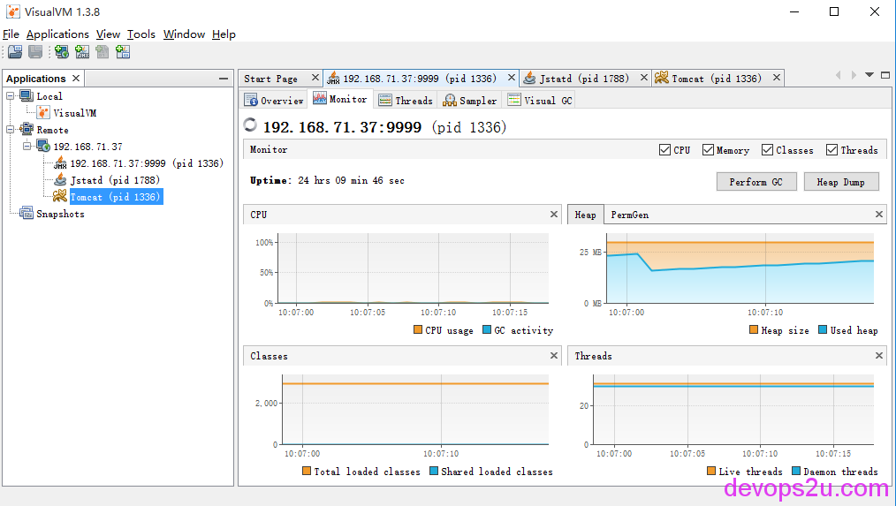
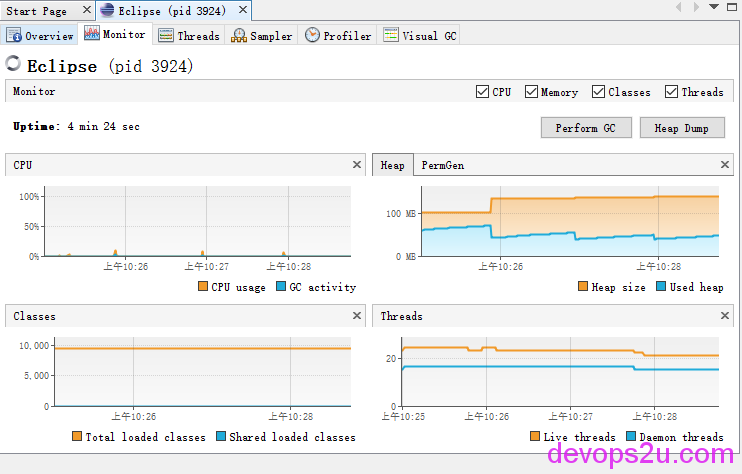
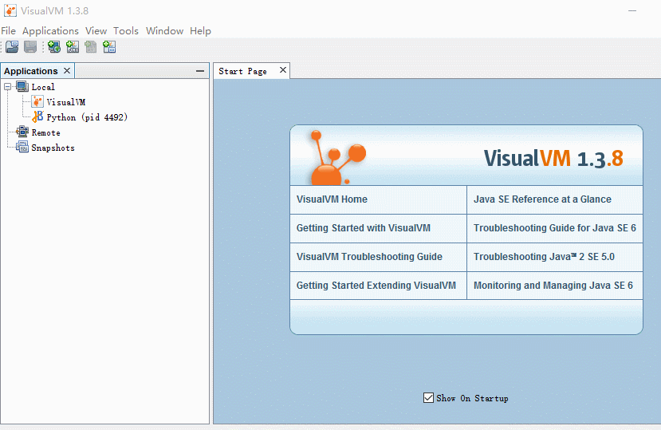
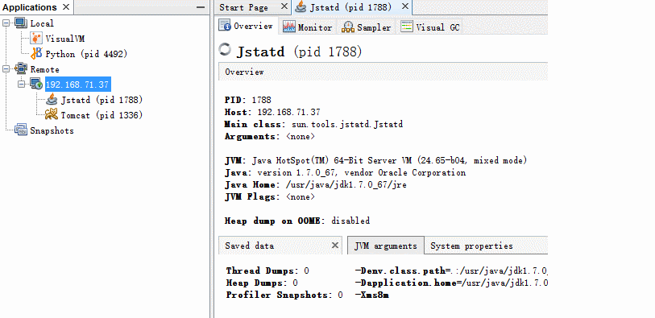

# 小议java监控Java VisualVM

对java来说，自带查看进程、调试、监控的工具挺丰富的，下面是官方介绍

```
**Standard JDK Tools and Utilities**

Basic Tools                                 (javac, java, javadoc, apt, appletviewer, jar, jdb, javah, javap, extcheck)
Security Tools                              (keytool, jarsigner, policytool, kinit, klist, ktab)
Internationalization Tools                  (native2ascii)
Remote Method Invocation (RMI) Tools        (rmic, rmiregistry, rmid, serialver)
Java IDL and RMI-IIOP Tools                 (tnameserv, idlj, orbd, servertool)
Java Deployment Tools                       (pack200, unpack200)
Java Plug-in Tools                          (htmlconverter)
Java Web Start Tools                        (javaws)
Java Troubleshooting, Profiling, Monitoring and Management Tools    (JConsole, Java VisualVM)
Java Web Services Tools                     (schemagen, wsgen, wsimport, xjc)


**Experimental JDK Tools and Utilities**

Monitoring Tools：  
Tool Name       Brief Description

jps             Experimental: JVM Process Status Tool – Lists instrumented HotSpot Java virtual machines on a target system.
jstat           Experimental: JVM Statistics Monitoring Tool – Attaches to an instrumented HotSpot Java virtual machine and collects and logs performance statistics as specified by the command line options.
jstatd          Experimental: JVM jstat Daemon – Launches an RMI server application that monitors for the creation and termination of instrumented HotSpot Java virtual machines and provides a interface to allow remote monitoring tools to attach to Java virtual machines running on the local system.


**Troubleshooting Tools**

Tool Name:           Brief Description:

jinfo               Experimental – Configuration Info for Java – Prints configuration information for a given process or core file or a remote debug server.
jhat                   Experimental – Heap Dump Browser – Starts a web server on a heap dump file (eg, produced by jmap -dump), allowing the heap to be browsed.
jmap                   Experimental – Memory Map for Java – Prints shared object memory maps or heap memory details of a given process or core file or a remote debug server.
jsadebugd              Experimental – Serviceability Agent Debug Daemon for Java – Attaches to a process or core file and acts as a debug server.
jstack                 Experimental – Stack Trace for Java – Prints a stack trace of threads for a given process or core file or remote debug server.
```

上面一段来自oracle官网，可以由此链接查看<http://docs.oracle.com/javase/8/docs/technotes/tools/index.html>

jstat，jstack，jmap，jhat命令的使用可以看此文章<http://www.ibm.com/developerworks/cn/java/j-5things8.html>

还有JVMTI（Java Virtual Machine Toolkit Interface）<https://www.ibm.com/developerworks/cn/java/j-lo-jvmti/>

这篇文章说一下Java VisualVM的使用。


java visualvm是个集大成的故障诊断工具。是一个集成多种命令行JDK工具和轻量级分析功能可视化的工具。专为生产和开发时使用，为Java SE平台进一步提高监测和性能分析
官网：https://visualvm.github.io/index.html
运行后的界面如下：



我们按步骤说明一下：

安装： 从官网下载zip包，解压即可。现在版本为1.3.8

运行：在windows中执行visualvm_138\bin\visualvm.exe即可。如果本机在运行Pycharm或者Eclipse，他就会检测到，可以查看java程序的总览，包括jvm的参数，cpu、Heap，Class，Threads



以监控本地测试机的tomcat举例：

1，添加JAVA_OPTS,第一行是VisualVM连接的端口，最后一行写本机的ip

```
# vim tomcat/bin/catalina.sh
export JAVA_OPTS="$JAVA_OPTS -Dcom.sun.management.jmxremote.port=9999 \
-Dcom.sun.management.jmxremote.ssl=false \
-Dcom.sun.management.jmxremote.authenticate=false \
-Djava.rmi.server.hostname=192.168.71.37"
```

2，jstatd是一个监控 JVM 从创建到销毁过程中资源占用情况并提供远程监控接口的 RMI （ Remote Method Invocation ，远程方法调用）服务器程序，它是一个 Daemon 程序，要保证远程监控软件连接到本地的话需要 jstatd 始终保持运行。
jstatd运行需要通过 -J-Djava.security.policy=___ 指定安全策略，因此我们需要在服务器上建立一个指定安全策略的文件 jstatd.all.policy

```
# vim /usr/java/jdk1.7.0_67/jre/lib/security/java.policy
grant codebase "file:/usr/java/jdk1.7.0_67/lib/tools.jar" {
 permission java.security.AllPermission;
};
```

3,

```
# /usr/local/tomcat/bin/catalina.sh start
 
# jstatd &
# jps
1336 Bootstrap
1788 Jstatd
1842 Jps
```

4,Tools–Plugins–Available Plugins安装个Visual GC插件，可以在线安装，或者离线安装，离线的插件链接上面有写。添加remote 应用服务



5，如果需要监控cpu的话，需要在catalina.sh再添加

```
export JAVA_OPTS="$JAVA_OPTS -Dcom.sun.management.jmxremote.port=9998 \
-Dcom.sun.management.jmxremote.authenticate=false \
-Dcom.sun.management.jmxremote.ssl=false \
-Dcom.sun.management.jmxremote.port=9999"   #这个端口就是刚才定义jmx的端口
```



 

6，并且我们可以对应用服务做快照，再详细分析cpu、内存、threads。

对java程序的zabbix监控请看这里 [小议java的zabbix监控](https://bbotte.github.io/monitor_safe/talking-about-zabbixs-java-monitoring)

2016年04月07日 于 [linux工匠](https://bbotte.github.io/) 发表

