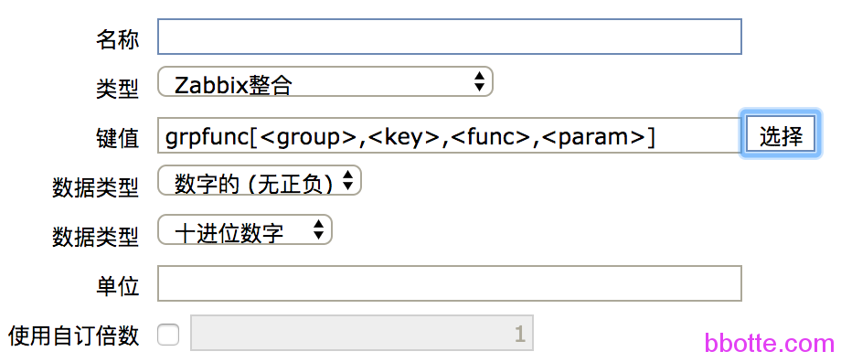
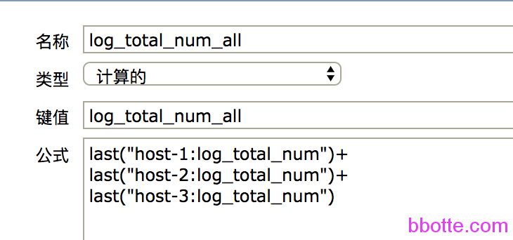
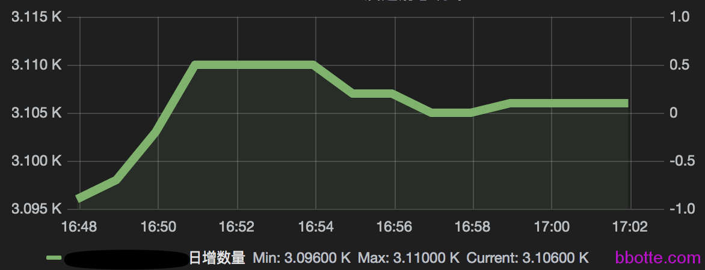
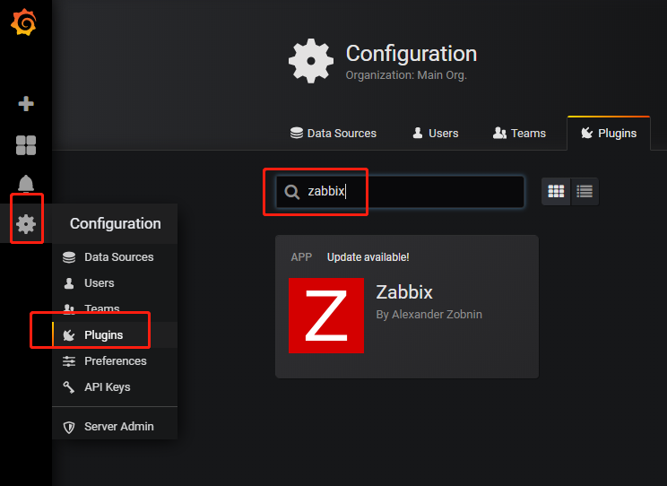

# zabbix整合–获取一段时间内的监控值(附grafana的zabbix插件)

1. 需求说明
2. zabbix配置
3. grafana画图
4. 附：grafana的zabbix插件配置

### 需求说明

从昨天这个时间点到现在的日志数量画个图出来

[zabbix aggregate整合](https://www.zabbix.com/documentation/2.4/manual/config/items/itemtypes/aggregate)(文档点我)可以完成这个事情，只是网络上对此介绍的较少，所以浪费较长的时间。下面简单说一下

### zabbix配置

在zabbix创建监控项菜单，类型选zabbix整合，键值只有一个选项：

```
grpfunc[<group>,<key>,<func>,<param>]
groupfunc["host group","item key",itemfunc,timeperiod]
```



按官方文档的介绍grpfunc可用的选项：

| Group function | Description |
| -------------- | ----------- |
| *grpavg*       | 平均值         |
| *grpmax*       | 最大值         |
| *grpmin*       | 最小值         |
| *grpsum*       | 求和          |

itemfunc可用的选项，就是param：

| Item function | Description      |
| ------------- | ---------------- |
| *avg*         | Average value    |
| *count*       | Number of values |
| *last*        | Last value       |
| *max*         | Maximum value    |
| *min*         | Minimum value    |
| *sum*         | Sum of values    |

例1：求’MySQL Servers’组所占用的磁盘空间

```
grpsum["MySQL Servers","vfs.fs.size[/,total]",last,0]
```

例2：求’MySQL Servers’组近5分钟的qps

```
grpavg["MySQL Servers",mysql.qps,avg,5m]
```

last,0 是取最近一次的值；avg,5m是取最近5分钟的平均值

last(5)是取最近5次的所有值，last(#5)是取离最近的第五个值(只是取一个)，其他函数同理

再来说需要实现的需求，求最近24小时内日增日志数：

1，组态–模板–项目–创建监控项：

通过一个shell脚本把当前主机的日志数量统计出来，在userparameter.conf中加入脚本的统计

```
UserParameter=log_total_num,/etc/zabbix/zabbix_agentd.d/log-total-num.sh
```

2，总和所有的消息数量，再创建一个监控项



3,求一天内所有的日志数量，同样再创建一个监控项,现在才用到zabbix整合，host是host-1,host-2,host-3的主机组，健值：grpsum[“host”,”log_total_num_all”,sum,24h]


因为我是从模板添加的，所以需要除以3台主机统计的数据，自订倍数是0.3333。如果直接加到主机上，就不用自订倍数了

### grafana画图



以上可以了解zabbix整合提供很方便的方式来获取数据，达到需要的要求

### 附：grafana的zabbix插件配置

grafana默认的data source是没有zabbix的，不过zabbix的界面较丑，所以使用grafana连接zabbix的api，获取监控数值

```
wget https://s3-us-west-2.amazonaws.com/grafana-releases/release/grafana-5.0.3-1.x86_64.rpm
yum localinstall grafana-5.0.3-1.x86_64.rpm 
systemctl enable grafana-server
systemctl start grafana-server
```

这样grafana就启动了，浏览器打开IP:3000就是grafana界面，输入用户名admin 密码admin即可登录

安装zabbix插件 <https://grafana.com/plugins/alexanderzobnin-zabbix-app>

```
grafana-cli plugins install alexanderzobnin-zabbix-app
service grafana-server start
chkconfig grafana-server on
systemctl enable grafana-server
/etc/init.d/grafana-server restart
```

如果安装某一个版本的zabbix插件，比如3.4的版本：  grafana-cli plugins install alexanderzobnin-zabbix-app 3.4.0



这样grafana-zabbix就安装完毕，下面进入grafana配置，分2步

grafana首页–Configuration–Plugins–搜索 zabbix–打开zabbix插件–enable开启zabbix插件


grafana首页–Configuration–Data Sources–Add data source–Type选zabbix，下面URL写zabbix的api地址，一般是http://zabbix_IP/zabbix/api_jsonrpc.php–保存


ok，在grafana中展示了zabbix的数据

2017年04月19日 于 [linux工匠](http://www.bbotte.com/) 发表

