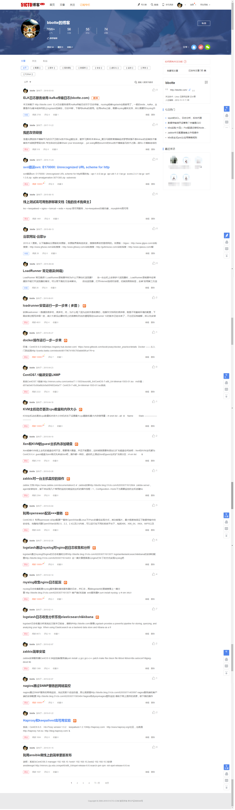
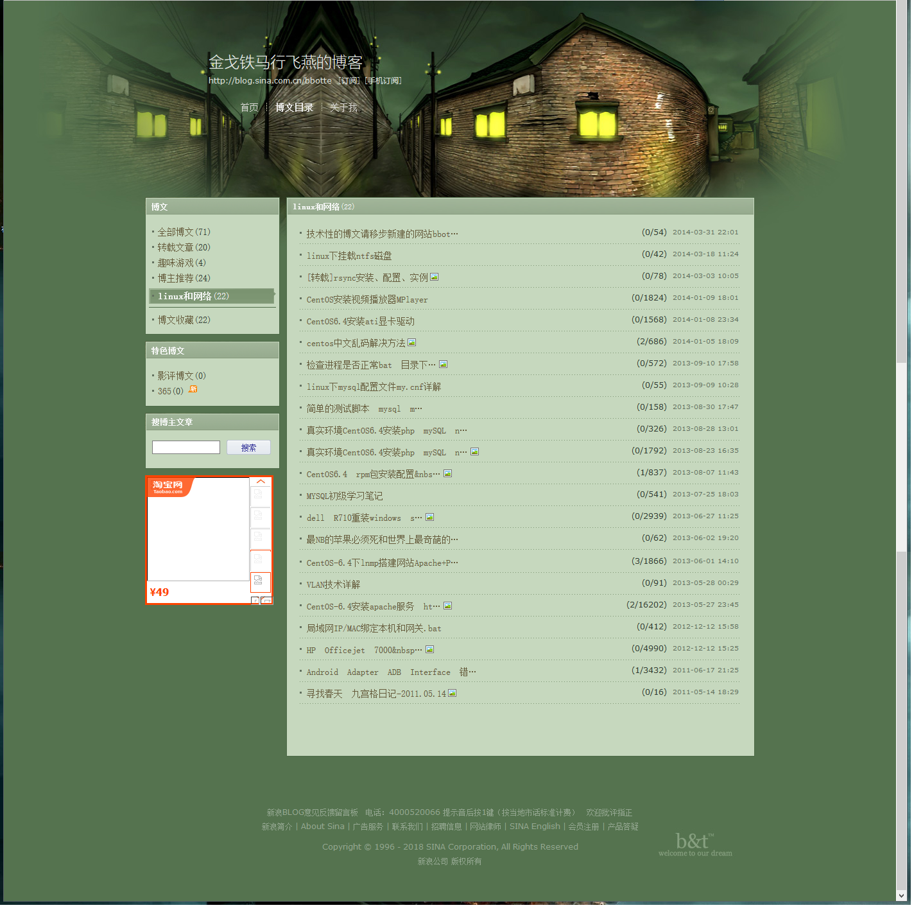

关于本站：

本人从12年开始做运维，崇尚FLOSS，在实践操作中一步步成长为一名运维工程师。

说到个人站点的由来：最初的时候，也就是12年从事运维的工作，写了一些文章，在新浪博客安家链接为 [金戈铁马行飞燕的博客](http://blog.sina.com.cn/bbotte)； 14年初，转到更为专业的51cto博客，51CTO的推荐博客：[金戈铁马行飞燕](http://bbotte.blog.51cto.com/) 写了些运维环境中遇到的问题。只是时间久了，想要的是自己的一个空间，因此借助WordPress做一个博客。

这个个人站点取名“Linux工匠”，[bbotte.com](http://bbotte.com/)域名，一是希望一直保持一个认真打磨工匠的精神，精进自己，打磨积累知识体系，二是也好给大家做个分享，帮助到您。

如有任何问题，请联系我，谢谢！

联系方式：bbotte@163.com
<https://github.com/bbotte>
或者扫描下方添加QQ：

