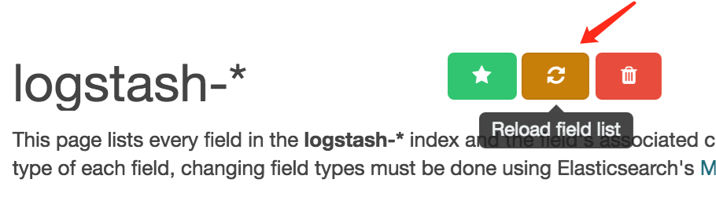
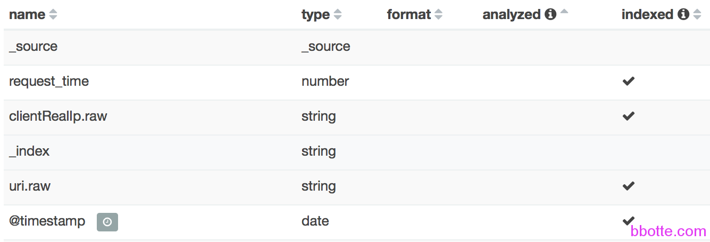

# elasticsearch的template和mapping

### mapping说明

elasticsearch update mapping and template on existing index,就是给字段添加相关的属性

| **属性**         | **描述**                                   | **适用类型**                        |
| -------------- | ---------------------------------------- | ------------------------------- |
| index          | 值为：analyzed，not_analyzed 或者 noanalyzed 索引且分析not_analyzed 索引但是不分析no 不索引这个字段，这样就搜不到默认值是analyzed | String其他类型只能设为no 或 not_analyzed |
| analyzer       | 可以设置索引和搜索时用的分析器，默认下elasticsearch使用的是standard分析器除此之外，你还可以使用 whitespace、simple或english 这三种内置的分析器 | all                             |
| include_in_all | 默认下elasticsearch会为每一个文档定义一个特殊的域_all，它的作用就是每一个字段都将被搜索到，如果你不想让某个字段被搜索到，那么就在这字段里定义一个include_in_all=false ；默认值是true | all                             |
| norms          | norms的作用是根据各种规范化因素去计算权值，这样方便查询；在analyzed定义字段里，值是true, not_analyzed是false | all                             |

使用ELK免不了对template和mapping做更改，使其达到想要的结果。下面说明对模板和映射的修改，使其能出现.raw聚合

生成.raw有什么用？

可以做这个字段的统计，比如根据IP地址生成报表


步骤总的来说，从现有的index导出模板，把现有的删除，修改这个模板后再导入到es，

对于mapping也一样，比如www-2020.01.01,先导出这个已有的mapping

curl "http://localhost:9200/www-*/_mapping?pretty" > 1.json

删除现在已经创建的index: www-2020.01.01

修改1.json的mapping

再PUT上去名字为www-2020.01.01的index

curl -XPUT "http://localhost:9200/www-2020.01.01" -H 'Content-Type: application/json' -d @1.json

最后刷新kibana的 index

### **一，更改template**

先说几个常用的请求，以最原始的logstash-*索引为例：

```
# curl localhost:9200/_cat/indices?v         #查看现有的indices
health status index               pri rep docs.count docs.deleted store.size pri.store.size
yellow open   logstash-2016.08.26   5   1          1            0      9.2kb          9.2kb
yellow open   .kibana               1   1          2            1     11.8kb         11.8kb
 
# curl -XGET http://localhost:9200/_all/_mapping?pretty  #查看所有的mapping
{
  "logstash-2016.08.26" : {
    "mappings" : {
      "logs" : {
        "properties" : {
          "@timestamp" : {
....
 
# curl -XGET localhost:9200/_template  #查看所有的template，默认的template为logstash
{"logstash":{"order":0,"template":"logstash-*","settings":{"index":{"refresh_interval":"5s"}},"mappings":{"_default_":{"dynamic_templates":[{"message_field":{"mapping":{"index":"analyzed","omit_norms":true,"fielddata":{"format":"disabled"},"type":"string"},"match_mapping_type":"string","match":"message"}},{"string_fields":{"mapping":{"index":"analyzed","omit_norms":true,"fielddata":{"format":"disabled"},"type":"string","fields":{"raw":{"index":"not_analyzed","ignore_above":256,"type":"string"}}},"match_mapping_type":"string","match":"*"}}],"properties":{"@timestamp":{"type":"date"},"geoip":{"dynamic":true,"properties":{"location":{"type":"geo_point"},"longitude":{"type":"float"},"latitude":{"type":"float"},"ip":{"type":"ip"}}},"@version":{"index":"not_analyzed","type":"string"}},"_all":{"enabled":true,"omit_norms":true}}},"aliases":{}}} 
             
# curl -XHEAD -i localhost:9200/_template/logstash  #确认是否存在logstash这个模板
HTTP/1.1 200 OK
Content-Type: text/plain; charset=UTF-8
Content-Length: 0
 
# curl -XGET localhost:9200/_cat/nodes                  #查看机器节点
# curl -XGET localhost:9200/_cat/health                 #查看本机的健康状态
# curl -XGET 'http://localhost:9200/_cluster/stats?human&pretty' #集群状态
# curl -XGET http://localhost:9200/_cat                 #其他接口自行查看
=^.^=
/_cat/allocation
/_cat/shards
/_cat/shards/{index}
/_cat/master
/_cat/nodes
/_cat/indices
/_cat/indices/{index}
/_cat/segments
/_cat/segments/{index}
/_cat/count
/_cat/count/{index}
/_cat/recovery
/_cat/recovery/{index}
/_cat/health
/_cat/pending_tasks
/_cat/aliases
/_cat/aliases/{alias}
/_cat/thread_pool
/_cat/plugins
/_cat/fielddata
/_cat/fielddata/{fields}
/_cat/nodeattrs
/_cat/repositories
/_cat/snapshots/{repository}
```

我们已经有了默认的logstash template，那么把现有的logstash模板导出一份，编辑一下格式，导入到一个index，然后在kibana的setting里面刷新此index即可。或者在网上找一个template导入进去

```
# curl -XGET localhost:9200/_template/logstash?pretty > e-template.json
# vim e-template.json
{
  "logstash" : {                 #delete这一行
    "order" : 0,                 #优先级，delete
    "template" : "logstash-*",   #修改名称,比如bbotte-*
    "settings" : {
      "index" : {
        "refresh_interval" : "5s"
      }
    },
    ...
    ...
    "aliases" : { }
  }                              #delete
}
```

因为导入的模板开头是模板的名称，所以把前面的index_name删除，中间添加或更改，得到一个模板，再put给elasticsearch，下面是put名字为bbotte的index(上面更改)

```
curl -X PUT http://localhost:9200/_template/bbotte -d @e-template.json
{"acknowledged":true}
```

删除今天的indices，要不就等到第二天自动生成新的indices

```
curl -X DELETE 'http://localhost:9200/tem_name'
ls /var/lib/elasticsearch/elasticsearch/nodes/0/indices/
```

在kibana刷新此index


因为我们这里对template并木有做更改，所以日志不会有变化,查看template会有显示

```
# curl -XGET localhost:9200/_template
{"bbotte":{"order":0,"template":"bbotte-*","settings":{"index":{"refresh_interval":"5s"}},"mappings":{"_default_":......
```

需要出现.raw的聚合，其实更改的是template的mapping，所以请继续往下看

### **二，更新mapping**

继续以默认的logstash-*为例

```
curl -XGET http://localhost:9200/_mapping                 #查看现有的mapping
curl -XGET http://localhost:9200/logstash-*/_mapping?pretty #查看logstash-*的mapping
或者 curl -X GET 'http://localhost:9200/logstash-*/logs/_mapping?pretty'
格式 curl -X GET 'http://localhost:9200/kibana里面的index-*/type/_mapping
```

格式为 /index_name/type/_mapping

1，第一种方式，先获取logstash-*的mapping，按格式修改。举个栗子?，下面是logstash生成index的mapping，以修改clientRealIp、uri这两个为例：

```
# curl -XGET http://localhost:9200/logstash-2016.08.10/_mapping?pretty
{
  "logstash-2016.08.10" : {       #delete
    "mappings" : {                #delete
      "logs" : {                  
        "properties" : {
          "@timestamp" : {
            "type" : "date",
            "format" : "strict_date_optional_time||epoch_millis"
          },
          "@version" : {
            "type" : "string"
          },
          "args" : {
            "type" : "string"
          },
          "bytes_sent" : {
            "type" : "string"
          },
          "clientRealIp" : {
            "type" : "string"          #delete
            "type" : "string",         #以下几行为添加
            "norms" : {                
              "enabled" : false
            },
            "fielddata" : {
              "format" : "disabled"
            },
            "fields" : {
              "raw" : {
                "type" : "string",
                "index" : "not_analyzed",
                "ignore_above" : 256
              }
            }                          #以上几行为添加
          },
          "domain" : {
            "type" : "string"
          },
          "forwarded" : {
            "type" : "string"
          },
          "host" : {
            "type" : "string"
          },
          "method" : {
            "type" : "string"
          },
          "path" : {
            "type" : "string"
          },
          "port" : {
            "type" : "string"
          },
          "proto" : {
            "type" : "string"
          },
          "protocol" : {
            "type" : "string"
          },
          "remote_addr" : {
            "type" : "string"
          },
          "request_time" : {
            "type" : "double"
          },
          "status" : {
            "type" : "string"
          },
          "tags" : {
            "type" : "string"
          },
          "time" : {
            "type" : "string"
          },
          "uagent" : {
            "type" : "string"
          },
          "upstream_addr" : {
            "type" : "string"
          },
          "upstream_response_time" : {
            "type" : "double"
          },
          "uri" : {
            "type" : "string"       #delete
            "type" : "string",      #以下几行为添加
            "norms" : {
              "enabled" : false
            },
            "fielddata" : {
              "format" : "disabled"
            },
            "fields" : {
              "raw" : {
                "type" : "string",
                "index" : "not_analyzed",
                "ignore_above" : 256
              }
            }                       #以上几行为添加
          }
        }
      }
    }                    #delete
  }                      #delete
}
```

我们修改clientRealIp和uri后，put上去，如下：

```
curl -X POST localhost:9200/logstash-2016.08.10/logs/_mapping?ignore_conflicts=true -d '
#上面{}内的内容
'
{"acknowledged":true}
```

2, 第2种方式，可以用简单的方法，只提交需要更改的field,如果只修改uri：

```
对获取到的index做更改
      "uri" : {
            "type" : "string"
修改为：
      "uri" : {
            "type" : "string",
            "norms" : {
              "enabled" : false
            },
            "fielddata" : {
              "format" : "disabled"
            },
            "fields" : {
              "raw" : {
                "type" : "string",
                "index" : "not_analyzed",
                "ignore_above" : 256
              }
            }
      }
 
# cat e-mapping.json
{
  "logs" : {               #这个就是type，和下面curl -XPUT对应
    "properties" : {
      "uri" : {
            "type" : "string",
            "norms" : {
              "enabled" : false
            },
            "fielddata" : {
              "format" : "disabled"
            },
            "fields" : {
              "raw" : {
                "type" : "string",
                "index" : "not_analyzed",
                "ignore_above" : 256
              }
            }
      }
    }
  }
}
 
curl -s -X PUT 'http://localhost:9200/logstash-2016.08.10/logs/_mapping' -d @e-mapping.json
```

### 查看更新的mapping

```
# curl 'localhost:9200/_cat/indices?v'
health status index               pri rep docs.count docs.deleted store.size pri.store.size
yellow open   logstash-2016.08.10   5   1          2            0     18.1kb         18.1kb
yellow open   .kibana               1   1          5            0     27.5kb         27.5kb
 
格式 curl -XGET http://localhost:9200/name_of_index/_mappings/document_type
# curl -XGET http://localhost:9200/logstash-2016.08.10/_mapping/logs?pretty
```

同样的，删除今天的indices，在kibana刷新index

如果不清楚document_type格式，可以省略，其实就是mappings和properties中间的那一项，如果错误会得到错误提示

```
{"error":{"root_cause":[{"type":"index_not_found_exception","reason":"no such index","index":"logstash-2016.06.17","resource.type":"index_or_alias","resource.id":"logstash-2016.06.17"}],"type":"index_not_found_exception","reason":"no such index","index":"logstash-2016.06.17","resource.type":"index_or_alias","resource.id":"logstash-2016.06.17"},"status":404}
 
{"error":{"root_cause":[{"type":"action_request_validation_exception","reason":"Validation Failed: 1: mapping source is empty;"}],"type":"action_request_validation_exception","reason":"Validation Failed: 1: mapping source is empty;"},"status":400}
```

document_type可以从已有的template或mapping中获取，避免错误

最后我们得到的结果：



2016年08月12日 于 [linux工匠](https://bbotte.github.io/) 发表