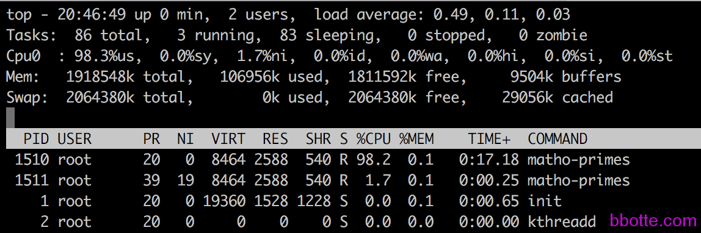
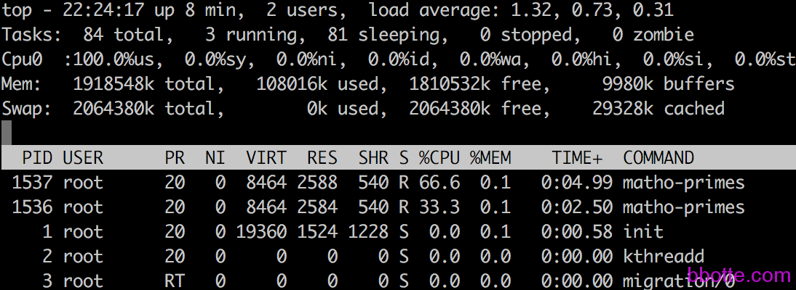

# linux系统限制进程的cpu使用率

cpu是公平的，大多数进程以相同的优先级启动，并且Linux内核在处理器上平均地为每个任务调度时间。在资源紧张时，cpu一般也是平均的分配进程占用cpu的时间片段。不过我们要对某些进程调高优先级，或者降低某进程的优先级呢，我们可以用下面几种方式控制cpu：

- 系统limits配置文件/etc/security/limits.conf
- taskset命令设置
- 手动调整nice值
- cpulimit  <https://github.com/opsengine/cpulimit>
- 使用Linux的cgroup (control group，玩过docker应该都听说过)，这种机制调度程序，限制进程可用的资源量

limits.conf配置文件针对单个回话，可以限制用户、用户组、soft limits、hard limits等

taskset命令用法：taskset -pc cpu的第几核心  pid

```
# taskset -pc 0 1467
pid 1467's current affinity list: 1
pid 1467's new affinity list: 0
# taskset -pc 0,1 1467
pid 1467's current affinity list: 0
pid 1467's new affinity list: 0,1
```

nice命令大家都知道，系统默认启动后进程就有指定的nice值，top命令的NI列就是，越低的数值优先级越高。nice不是优先级，表示进程可被执行的优先级的修正数值，优先级pri = 现在运行进程的pri + nice值

Cpulimit是一个限制进程的CPU使用率（以百分比表示，而不是CPU时间）的工具。当您不希望它们占用太多的CPU周期时，控制批处理作业非常有用。目标是防止进程运行超过指定的时间比率。它不会改变nice值或其他调度优先级设置，但真正的CPU使用率。此外，它能够自动适应总体系统负载，动态和快速。所使用的CPU量的控制是通过向进程发送SIGSTOP和SIGCONT POSIX信号来完成的。所有子进程和指定进程的线程将共享相同百分比的CPU

再说说控制族群（control group），Cgroup 可让您为系统中所运行任务（进程）的用户定义组群分配资源 — 比如 CPU 时间、系统内存、网络带宽或者这些资源的组合。nice或cpulimit仅限制进程的CPU使用率，而cgroup可以限制其他进程资源。根据配置 cgroup，使得拒绝 cgroup 访问某些资源，甚至在运行的系统中动态配置您的 cgroup。可将 cgconfig（“控制组群配置 ”）服务配置为在引导时启动，并重新建立您预先定义的 cgroup，这样可使其在重启过程中保留它们。
使用 cgroup，系统管理员可更具体地控制对系统资源的分配、优先顺序、拒绝、管理和监控。可更好地根据任务和用户分配硬件资源，提高总体效率。[redhat官方文档控制族群](https://access.redhat.com/documentation/zh-CN/Red_Hat_Enterprise_Linux/6/html/Resource_Management_Guide/ch01.html)点我

我们做个测试，网上有个质数生成器mathomatic，能彪高cpu，压缩包地址https://pan.baidu.com/s/1nvhm4op

```
# cat /etc/centos-release
CentOS release 6.7 (Final)
# tar -xf mathomatic-16.0.5.tar.bz2
# cd mathomatic-16.0.5
# make
# make install
Mathomatic is installed.
# cd primes/
# make
# make install
The Prime Number Tools are installed.
# matho-primes -h  查看其用法
# matho-primes 0 9999999 > /dev/null
这将产生一个从0到9999999的素数(就是质数啦)列表
开启另一个终端top观察cpu的利用率
```

下面只试验两个常用的nice和cgroup命令，ps查看进程的信息

```
# ps -eo pid,tid,class,rtprio,ni,pri,psr,pcpu,stat,wchan:14,comm
  PID   TID CLS RTPRIO  NI PRI PSR %CPU STAT WCHAN          COMMAND
    1     1 TS       -   0  19   0  0.0 Ss   poll_schedule_ init
    2     2 TS       -   0  19   0  0.0 S    kthreadd       kthreadd
    3     3 FF      99   - 139   0  0.0 S    migration_thre migration/0
```

**一，nice修改进程的优先级**

```
# matho-primes 0 999999999 > /dev/null & nice -n 20 matho-primes 0 999999999 > /dev/null &
```

在双核的虚拟机执行命令后，得到的结果是cpu使用率一样，并不是nice为0的cpu使用高，20的使用低，没有得到所需要的结果，在top中可以看到其中一个cpu使用率100%，另一个为0。再把cpu由2核改为1核，启动后测试得到正确的结果，下面2张图对比一下，上面是2颗cpu，下面是1颗。由此可以知晓，在多核心的cpu上，用nice命令需要注意，nice命令适用于更改一次优先级的任务。或者说只有出现cpu争用的时候，优先级这个长着才会出来调解，解决谁可以占用多的资源，如果cpu空闲的话，资源充足，当然也就不用限制了




**二，cgroup命令使用**

```
yum install libcgroup
service cgconfig restart
```

配置文件：/etc/cgconfig.conf

测试用两个组来做对比，

```
# cgcreate -g cpu:/cpulimited
# cgcreate -g cpu:/nocpulimited
```

cpu控制器有一个称为cpu.shares的属性。它由内核使用，以确定可用于cgroup中的每个进程的CPU资源的份额。默认值为1024.通过将一个组（nocpulimited）保留为默认值1024，将另一个组（cpulimited）设置为512，我们告诉内核使用2：1的比例分割CPU资源。同时执行两个进程，如果单独执行一个任务，cpu不会限制利用率

```
# cgset -r cpu.shares=512  cpulimited
 
# cgexec -g cpu:cpulimited matho-primes 0 999999999 > /dev/null & cgexec -g cpu:nocpulimited matho-primes 0 999999999 > /dev/null &
```



cgroup的文档中有详细的用法，做饭是：

- 创建层级并设定子系统参数
- 创建组群条目，就是分组，设置cpu.shares
- 附加子系统，即把组群配置信息添加cgconfig.conf配置文件中
- 创建cgroup，即上面的cgcreate命令
- cgset命令设置参数
- 在cgroup中启动一个进程，即上面的cgexec
- 查找某个进程所属 cgroup，命令：ps -O cgroup

由此可以看出cgroup很强大。隔离资源利用率最好还是用cgroup


2017年01月26日 于 [linux工匠](http://www.bbotte.com/) 发表