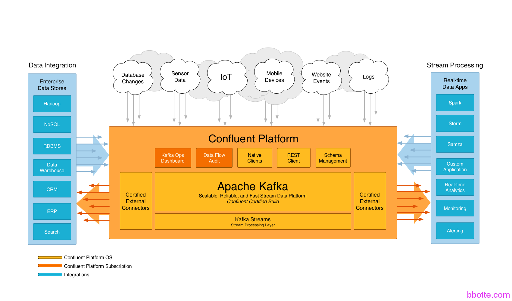

# logstash使用zookeeper建立kafka集群对日志收集

1. 建立zookeeper集群
2. kafka使用zookeeper集群
3. kafka的其他常用命令
4. 配置logstash

### 配置说明

logstash使用zookeeper建立kafka集群对日志收集，总共分为三个步骤，下面为主机的信息：

1，建立zookeeper集群
2，kafka使用zookeeper集群
3，logstash用kafka进行日志传输

| 10.211.55.4 | vm01 | zookeeper1 | kafka0 | logstash_send    |
| ----------- | ---- | ---------- | ------ | ---------------- |
| 10.211.55.5 | vm02 | zookeeper2 | kafka1 |                  |
| 10.211.55.6 | vm03 | zookeeper3 | kafka2 | logstash_receive |

### 一，建立zookeeper集群

myid需要自定义


```
# cat /etc/centos-release
CentOS release 6.7 (Final)
# service iptables stop
# getenforce
Disabled
# ntpdate ntp1.aliyun.com
# rpm -ivh jdk-7u79-linux-x64.rpm
3台机做zookeeper集群
# wget http://apache.fayea.com/zookeeper/zookeeper-3.4.8/zookeeper-3.4.8.tar.gz
# tar -xzf zookeeper-3.4.8.tar.gz -C /usr/local/
# ln -s /usr/local/zookeeper-3.4.8/ /usr/local/zookeeper
# cp /usr/local/zookeeper/conf/zoo_sample.cfg /usr/local/zookeeper/conf/zoo.cfg
# grep -v ^# /usr/local/zookeeper/conf/zoo.cfg
tickTime=2000
initLimit=10
syncLimit=5
dataDir=/usr/local/zookeeper/data
clientPort=2181
server.1=10.211.55.4:2888:3888
server.2=10.211.55.5:2888:3888
server.3=10.211.55.6:2888:3888
# mkdir -p /usr/local/zookeeper/data
三台zookeeper的myid依次为1、2、3
# echo 1 > /usr/local/zookeeper/data/myid
 
依次启动zookeeper服务
# /usr/local/zookeeper/bin/zkServer.sh start
查看状态
# /usr/local/zookeeper/bin/zkServer.sh status
Mode: leader/follower
```

### 二，kafka使用zookeeper集群

建立自己的集群，broker.id需整数且唯一



```
# tar -xf kafka_2.10-0.10.0.0.tgz -C /usr/local/
# ln -s /usr/local/kafka_2.10-0.10.0.0/ /usr/local/kafka
 
# egrep -v "^#|^$" /usr/local/kafka/config/server.properties
broker.id=0
num.network.threads=3
num.io.threads=8
socket.send.buffer.bytes=102400
socket.receive.buffer.bytes=102400
socket.request.max.bytes=104857600
log.dirs=/tmp/kafka-logs
num.partitions=1
num.recovery.threads.per.data.dir=1
log.retention.hours=168
log.segment.bytes=1073741824
log.retention.check.interval.ms=300000
zookeeper.connect=10.211.55.4:2181,10.211.55.5:2181,10.211.55.6:2181
zookeeper.connection.timeout.ms=6000
 
delete.topic.enable=true
host.name=10.211.55.4      #根据主机hostname修改
default.replication.factor=2
auto.create.topics.enable=true
 
三台kafka broker.id分别为0、1、2，host.name根据主机名修改
 
启动kafka服务
nohup /usr/local/kafka/bin/kafka-server-start.sh /usr/local/kafka/config/server.properties &
或 /usr/local/kafka/bin/kafka-server-start.sh -daemon /usr/local/kafka/config/server.properties
 
创建topic
/usr/local/kafka/bin/kafka-topics.sh --create --zookeeper 10.211.55.4:2181,10.211.55.5:2181,10.211.55.6:2181 --partitions 3 --replication-factor 2 --topic log1
 
查看当前的topic
/usr/local/kafka/bin/kafka-topics.sh --list --zookeeper 10.211.55.4:2181,10.211.55.5:2181,10.211.55.6:2181
log1
 
查看当前的topic的详细信息
/usr/local/kafka/bin/kafka-topics.sh --describe --zookeeper localhost:2181 --topic log1
Topic:log1	PartitionCount:3	ReplicationFactor:2	Configs:
	Topic: log1	Partition: 0	Leader: 0	Replicas: 0,1	Isr: 0,1
	Topic: log1	Partition: 1	Leader: 1	Replicas: 1,2	Isr: 2,1
	Topic: log1	Partition: 2	Leader: 2	Replicas: 2,0	Isr: 2,0
 
测试kafka发送接收消息
1，生产者通过kafka发送信息
/usr/local/kafka/bin/kafka-console-producer.sh --broker-list 10.211.55.4:9092,10.211.55.5:9092,10.211.55.6:9092 --topic log1
在此随便输入信息，以便消费者能够收到这里打印的信息
或 tail -f /var/log/nginx/test.log 2>&1| kafka-console-producer.sh --broker-list 10.211.55.4:9092,10.211.55.5:9092,10.211.55.6:9092 --topic log1
 
2，消费者接收信息
/usr/local/kafka/bin/kafka-console-consumer.sh --zookeeper 10.211.55.4:2181,10.211.55.5:2181,10.211.55.6:2181 --topic log1 --from-beginning
```

新版本kafka命令，直接连kafka即可，由kafka连zookeeper

```
./kafka-topics.sh --list --bootstrap-server 10.211.55.4:9092
./kafka-console-producer.sh --broker-list 10.211.55.4:9092 --topic test
./kafka-console-consumer.sh --bootstrap-server 10.211.55.4:9092 --topic test --
from-beginning --partition 0
./kafka-topics.sh --delete --bootstrap-server kafka-com:9094 --topic test
```

### kafka的其他常用命令

```
查看消费者的组
kafka-consumer-groups.sh --zookeeper localhost:2181 --list
logstash
 
查看logstash组信息
kafka-consumer-groups.sh --zookeeper localhost:2181 --describe --group logstash
GROUP                          TOPIC                          PARTITION  CURRENT-OFFSET  LOG-END-OFFSET  LAG             OWNER
logstash                       log2                           0          27              224             197             none
logstash                       log2                           1          51              223             172             none
logstash                       log2                           2          33              205             172             none
 
查看消费者的offset，精确到一个topic
kafka-consumer-offset-checker.sh  --zookeeper localhost:2181 --topic log2 --group logstash
Group           Topic                          Pid Offset          logSize         Lag             Owner
logstash        log2                           0   27              224             197             none
logstash        log2                           1   51              223             172             none
logstash        log2                           2   33              205             172             none
 
更新一个topic, --config <name=value>
kafka-topics.sh --zookeeper localhost:2181 --alter --topic log2 --config x=y
 
删除一个topic，需要在配置文件中添加 delete.topic.enable=true
kafka-topics.sh --zookeeper localhost:2181 --delete --topic log1
 
查看某一时间点的offset
# ipython
In [1]: import time
In [2]: time.time()*1000
Out[2]: 1474441044877.613
# kafka-run-class.sh kafka.tools.GetOffsetShell --broker-list 10.211.55.4:9092 --topic log2 --time -1 1474441044877
log2:2:216
log2:1:234
log2:0:234
 
#修改kafka的分区partitions
grep num.partitions kafka/config/server.properties
num.partitions=16
vim编辑此配置后重启kafka集群并不会更改已经在用topic的partitions，可以用kafka-topics.sh命令行更改，注意最后的数字是最终的分区数
kafka/bin/kafka-topics.sh --zookeeper localhost:2181 --alter --topic topic_name --partitions 16
#查看topic的分区数
zookeeper/bin/zkCli.sh
ls /brokers/topics/topic_name/partitions
```

### 三，配置logstash

logstash1.5和2.3的版本差别较大，output模块中需要注意

```
#发送日志端配置 logstash 2.3版本以上
# cat t1.conf
input {
    file {
        path => [ "/opt/log/java.log" ]
            type => "java_system"
            sincedb_path => "/data/logstash/system"
            codec => multiline {
                pattern => "^\d\d\d\d-\d\d-\d\d \d\d:\d\d:\d\d.\d\d\d\ .+"
                negate => true
                what => "previous"
                max_lines => 200
            }
        }
 
}
output {
    if [type] == 'java_system' {
       kafka {
         bootstrap_servers => "10.211.55.4:9092,10.211.55.5:9092,10.211.55.6:9092"
         topic_id => "system"
          }
}
 
# nohup ./logstash/bin/logstash -f t1.conf &
 
 
#接收日志端配置
# cat t3.conf
input {
        kafka {
                bootstrap_servers =>"10.211.55.4:9092,10.211.55.5:9092,10.211.55.6:9092"
                topics => "system"
                type => 'java_system'
        }
}
 
filter {
    if [type] =~ "java_.*" {
        if "_grokparsefailure" in [tags] {
              drop { }
          }
        grok {
            match => {
                "message" => "%{TIMESTAMP_ISO8601:timestamp} \[%{WORD:exp}.%{WORD:jv}:%{NUMBER:\d+}\] %{LOGLEVEL:severity} %{GREEDYDATA:message}"
            }
        }
    }
}
 
output {
    if [type] == 'java_system' {
        elasticsearch {
            hosts => "127.0.0.1:9200"
            index => "bbotte-java_system-%{+YYYY.MM.dd}"
        }
        file {
            message_format => "%{message}"
            path => "/tmp/3.log"
        }
    }
 
}
 
# nohup ./logstash/bin/logstash -f t3.conf &
 
#注意：如果logstash是2.3以下的版本，上面的output bootstrap_servers需要改为
broker_list
```

日志收集方式较多，各种姿势其实大同小异，根据自己需求来走，做一套适合公司的日志系统。

参考：
[Apache Kafka](https://cwiki.apache.org/confluence/display/KAFKA?src=sidebar) System+Tools


2016年07月21日 于 [linux工匠](http://www.bbotte.com/) 发表


