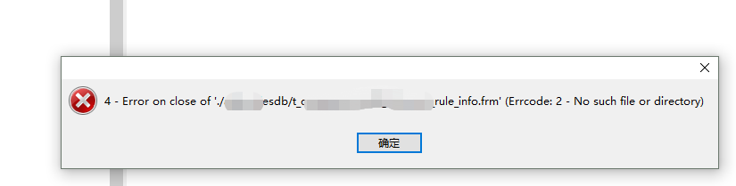

# 运维过程中遇到的一些问题

#### 前人挖坑我来填，自己挖坑自己填

##### 日常操作难免会遇到各种不好的情况，记录如下，不定期更新：


 


```
rsync –delete   加delete参数就是删除咯，一致性同步
rsync + inotify  达到文件数量限制，日志会有提醒
/proc/sys/fs/inotify/max_user_instances：每个用户可创建的inotify实例最大上限数量
/proc/sys/fs/inotify/max_user_watches：每个inotify实例可监听的最大上限数量
/proc/sys/fs/inotify/max_queued_events：对应的inotify实例队列可容纳的最大上限事件数量
```


rm -f  (ln 文件夹不能加/)


php-fpm.conf里面用静态，把数量调高，比如1000，重启后，内存小的话直接溢出，因为一个php-fpm进程占用内存为35M，1000个进程就是35G，单用户登录修改php的配置即可

 

net.nf_conntrack_max 参数小

```
sysctl -a|egrep “net.nf_conntrack_max|net.netfilter.nf_conntrack_max”
cat /proc/net/ip_conntrack | cut -d ‘ ‘ -f 10 | cut -d ‘=’ -f 2 | sort | uniq -c | sort -nr | head -n 10
```


nginx的日志格式一般都是多行，如果最后一行最后面少了;    nginx -t 检查也是ok，不过日志是有问题的

 

ELK中如果日志从应用直接进入到kafka集群，logstash从kafka获取日志再filter更改格式，是更改不了日志的格式的

再说个logstash的问题，日志里面的时间字段和日志信息，不要用 @timestamp 和 message，因为这2个字段本来是logstash内置的，日志里面用这2个字段的话，“真让人头大“

 

### 使用系统自带的time查看curl一个链接的时间

```
for i in {0..9};do (time -p curl -s bbotte.com) 2>&1 >/dev/null|grep real|cut -d' ' -f2;sleep 5;done
```

### zabbix import templates导入模板不能超过2M

”File is too big, max upload size is 2097152 bytes.”，官方也不会修复这个bug，<https://support.zabbix.com/browse/ZBX-8381>，如果用yum安装的php和http是会出现这样的问题，解决方法是自己安装php+nginx

 

### zookeeper绑定外网ip

zookeeper用外网IP做集群，提示如下，需要配置文件里面监听改为0.0.0.0；如果是单机zk，server.1=public_ip:2888:3888

```
Cannot open channe
l to 2 at election address host_name/public_ip:3888
java.net.ConnectException: Connection refused
at java.net.PlainSocketImpl.socketConnect(Native Method)
at java.net.AbstractPlainSocketImpl.doConnect(AbstractPlainSocketImpl.java:350)
at java.net.AbstractPlainSocketImpl.connectToAddress(AbstractPlainSocketImpl.java:206)
 
# egrep -v "^$|^#" /data/zookeeper/conf/zoo.cfg
tickTime=2000
initLimit=10
syncLimit=10
dataDir=/data/zookeeper/data
clientPort=2181
maxClientCnxns=1000
server.1=0.0.0.0:2888:3888
server.2=kafka_server2:2888:3888
server.3=kafka_server3:2888:3888
```

AWS ec2或者azure主机 kafka绑定公网ip

```
# egrep -v "^$|^#" /usr/local/zookeeper/conf/zoo.cfg 
tickTime=2000
initLimit=10
syncLimit=5
dataDir=/data/zk/data
clientPort=2181
server.1=139.219.*.*:2888:3888
 
# egrep -v "^$|^#" /usr/local/kafka/config/server.properties
broker.id=0
listeners=PLAINTEXT://:9092
num.network.threads=3
num.io.threads=8
socket.send.buffer.bytes=102400
socket.receive.buffer.bytes=102400
socket.request.max.bytes=104857600
log.dirs=/data/kafka
num.partitions=1
num.recovery.threads.per.data.dir=1
log.retention.hours=168
log.segment.bytes=1073741824
log.retention.check.interval.ms=300000
zookeeper.connect=139.219.*.*:2181
zookeeper.connection.timeout.ms=10000
delete.topic.enable=true
host.name=139.219.*.*
advertised.host.name=139.219.*.*
auto.create.topics.enable=true
 
# egrep -v "^$|^#" /usr/local/kafka/config/producer.properties
bootstrap.servers=139.219.*.*:9092
compression.type=none
 
# hostname
139.219.*.*
```


### redis版本大于4的安装

redis 4.0.1安装

```
yum install gcc gcc-c++
redis 4.0，解压后
make distclean
make
make install
./utils/install_server.sh

Please select the redis executable path [] /usr/local/bin/redis-server
这里写redis-server的路径，否则提示
Mmmmm... it seems like you don't have a redis executable. Did you run make install yet?

/etc/init.d/redis_6379 restart
```


### 数据库表结构frm文件损坏



移动坏表的 frm到其他目录，
重启mysql，
移动frm到对应目录，
登录数据库修复表，执行下面语句

```
repair table newdb.table1;
ALTER TABLE newdb.table1 IMPORT TABLESPACE;
```

### nginx或tengine代理https

nginx或者tengine proxy_pass 一个https的链接，请求一直没响应

```
     proxy_set_header Host $host;
     proxy_set_header Host $http_host;
     proxy_set_header Host $host:$server_port;
```

```
proxy_set_header X-Forwarded-Proto https;
```

要么把proxy_set_header 去掉，要么在location里面添加 X-Forwarded-Proto https


2017年07月21日 于 [linux工匠](https://bbotte.github.io/) 发表

