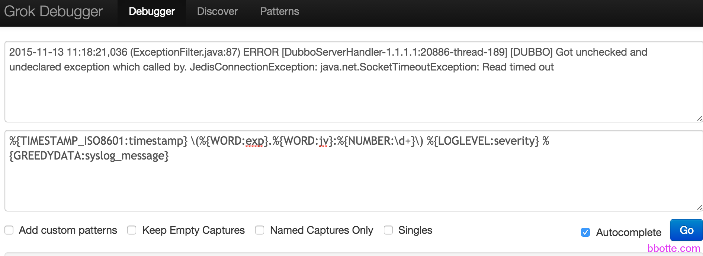

# ELK日志服务使用-服务配置

### **logstash的配置**

先来说一下logstash启动的配置文件/opt/logstash/bin/logstash.lib.sh
里面有一个参数LS_HEAP_SIZE设置每一个logstash进程占用多少内存，一般这个参数不用调，如果内存小的话可以改小一些
6 LS_HEAP_SIZE=”${LS_HEAP_SIZE:=500m}”
logstash配置一般放在/etc/logstash/conf.d/ 文件夹
比如上一篇文章“ELK日志服务使用-基本安装 ”里面对Apache access日志的处理，配置较简单，下面来分析一下处理java的log4j格式日志，下面做详细说明，日志片段如下：

```
2015-11-13 11:18:21,036 (ExceptionFilter.java:87) ERROR [DubboServerHandler-1.1.1.1:20886-thread-189] [DUBBO] Got unchecked and undeclared exception which called by. JedisConnectionException: java.net.SocketTimeoutException: Read timed out
    at redis.clients.util.RedisInputStream.ensureFill(RedisInputStream.java:201)
Caused by: java.net.SocketTimeoutException: Read timed out
    at java.net.SocketInputStream.socketRead0(Native Method)

```

```
input {
  file {
    type => "javalog"
    path => [ "/work/Serivce/nohup.out" ]
    sincedb_path => "/opt/logstash/conf/sincedb_serivce"
    start_position => "beginning"
    codec => multiline {
    #pattern => "%d{yyyy-MM-dd HH:mm:ss,SSS} (%F:%L) %p [%t] %m%n (^\s+at .+)|(^\d+\serror)|(^.+Exception: .+)|(^\s+... \d+ more)|(^\s*Caused by:.+)"
    pattern => "%d{yyyy-MM-dd HH:mm:ss,SSS}"
    what => "next"
    negate => true
    }
    }
}
filter {
  mutate {
    gsub => [ "message", "\r", "" ]
    replace => ["host", "web1"]
  }
  grok {
    type => "javalog"
    add_tag => [ "web1", "commonbase" ]
    match => [ "message", "(?m)%{TIMESTAMP_ISO8601:timestamp} %{LOGLEVEL:severity} %{GREEDYDATA:message}" ]
    overwrite => [ "message" ]
  }
  date {
    match => [ "timestamp" , "yyyy-MM-dd HH:mm:ss,SSS" ]
  }
}
output {
elasticsearch {
    host => "127.0.0.1"
    index => "web1-commonbase-%{+YYYY.MM.dd}"
}
}
```

这个配置文件主要分**input、filter、output三部分**，先说**input配置**：
input里面一般是log file，可以一个或多个日志文件，也可以用通配符匹配文件夹中日志，
type：是给日志一个类型，可以随意修改，不过和下面filter中type要对应
path：可以是一个日志，或者多个日志
sincedb_path：logstash读取日志文件的标记，会有一个标记，比如读到日志的100行，把logstash kill掉后再启动，会读取这个文件，继续从100行往下读
start_position：从日志头开始读取日志，end表示用日志尾开始读取
codec => multiline：这是多行匹配，比如一条日志较长，或者分多行打印，用multiline可以不把日志拆为多行，里面的pattern需要根据自己的日志格式来写，不同日志不一样的pattern，上面是java日志的例子
what => “previous” or “next” what有两个参数，next或previous，是匹配到的日志归为上一条还是下一条日志
negate => “true” or “false”  true表示不匹配pattern也会建立一个多行匹配，默认是true

### multiline多行匹配

对于multiline多行匹配，如果每条日志是以时间为开头的话，直接匹配时间就好。就是说匹配了日志的开头就可以，如果是其他信息，就匹配其他信息，不一定是时间。比如日志开头如下：

```
[09-May-2016 03:40:50 UTC] XXX...
XXX...
 
logstash的配置如下：
input {
   file {
    path => [ "/path/for/logs/file" ]
    start_position => "beginning"
                codec => multiline {
                        pattern => "\[\d+\-\S+\-\d+ \d+\:\d+\:\d+\ UTC\]"
                        negate => true
                        what => "previous"
                }
  }
}
output {
    stdout {codec => "rubydebug"}
  }
```

**filter配置**，过滤、修改日志：
mutate：改变日志，有add_field、add_tag、remove_field、remove_tag、gsub、rename、replace、split等功能，比如

```
filter {
mutate {
add_field => { "foo_%{somefield}" => "Hello world, from %{host}" }
}
}
```

grok：解析任意文本和结构，匹配日志的，可以参考 <https://github.com/logstash-plugins/logstash-patterns-core/tree/master/patterns> 官方文档介绍的很详细 [https://www.elastic.co/guide/en/logstash/1.5/plugins-filters-grok.html ](https://www.elastic.co/guide/en/logstash/1.5/plugins-filters-grok.html)
date：主要是我国用东八区的时区，要不kibana界面显示的时间是格林尼治标准时间

**output配置**：
elasticsearch：把日志格式化处理后，交给elasticsearch，index根据自己实际情况写，默认为logstash。当然outpub可以为TCP/UDP协议、redis、rabbitmq、kafka、activatemq、file、json等

### **grok匹配规则**

一个小插曲：许多人不清楚**grok匹配规则**，以上面日志片段为例,在<http://grokdebug.herokuapp.com/>网站测试，匹配时间，错误类型，日志内容等

```
%{TIMESTAMP_ISO8601:timestamp} \(%{WORD:exp}.%{WORD:jv}:%{NUMBER:\d+}\) %{LOGLEVEL:severity} %{GREEDYDATA:syslog_message}
```

```
(?<time>.*?) \((?<except>.*?)\) (?<loglevel>.*?) %{GREEDYDATA:message}
```

上面两种写法都可以，参考：<http://grokconstructor.appspot.com/RegularExpressionSyntax.txt>



### **elasticsearch的配置**

/opt/elasticsearch/bin/elasticsearch.in.sh 里面

```
if [ "x$ES_MIN_MEM" = "x" ]; then
ES_MIN_MEM=256m
fi
if [ "x$ES_MAX_MEM" = "x" ]; then
ES_MAX_MEM=1g
fi
```

ES_MIN_MEM和ES_MAX_MEM最好相等，根据服务器内存设置，
elasticsearch另一个配置文件 /opt/elasticsearch/config/elasticsearch.yml
可以设置多机集群Cluster，数据分片shards，Network And HTTP，节点的恢复recovery机制，集群的自动发现等，按配置里面的说明修改即可，一般的elasticsearch监听我就让他在服务器内部，network.bind_host: 127.0.0.1，也有添加
bootstrap.mlockall: true #防止内存不足，会切换至交换分区
bootstrap.max_open_files: true #防止文件打开过多系统出错
script.disable_dynamic: true #禁止远程代码执行
这几个选项

### **kibana的配置**

kibana/config/kibana.yml 配置中修改如下：
host: “127.0.0.1”
elasticsearch_url: “http://127.0.0.1:9200”
其他无修改

简单的处理elk的访问安全交由nginx的auth_basic吧，由htpasswd设置密码

```
server {
 
        listen 12345;
        server_name 1.1.1.1;
        access_log  /var/log/nginx/elk.log default;
        error_page  404 = /404.html;
        error_page  500 502 503 504  /50x.html;
        location ~ (\.*)$ {
        proxy_pass http://127.0.0.1:5601;
        proxy_redirect off;
        proxy_set_header Host $host;
        proxy_set_header X-Real-IP $remote_addr;
        proxy_set_header X-Forwarded-For $proxy_add_x_forwarded_for;
        client_max_body_size 10m;
        client_body_buffer_size 128k;
        proxy_connect_timeout 90;
        proxy_send_timeout 90;
        proxy_read_timeout 90;
        proxy_buffer_size 4k;
        proxy_buffers 4 32k;
        proxy_busy_buffers_size 64k;
        proxy_temp_file_write_size 64k;
        auth_basic           "Restricted";
        auth_basic_user_file /usr/local/nginx/conf/server/htpasswd;
        }
        location ~* \.(sql|bak|svn|old|gz)$ {
                return 403;
        }
        location ~.*\.(gif|jpg|jpeg|png|bmp|swf)$ {
                expires      7d;
        }
        location ~ .*\.(js|css)?$ {
                   expires      12h;
        }
}
```

在kibana首页，一般会遇到下面的疑问，不清楚index为啥是灰色，不能出来展示日志的页面，是因为你在logstash的配置output中，自定义了index，所以要写你自定义的，如果不写，默认是logstash。如果还是灰色，建议就写个*放这里吧，先能用，再一步一步调试，如下：


**logstash检测配置**文件正确性：

1，logstash -t -f logstash的配置.conf  -t就是–configtest，检查配置文件是否有语法错误

2，logstash -v -f logstash的配置.conf  等logstash启动好了，手动生成一条日志，看这里是否抛出自己定义好的格式日志

如果input中日志文件较多，在input可以用*.log匹配日志。

如果input或output中，日志类型较多，就需要在logstash的配置中用if语句匹配tag或者type区分不同的日志：

```
output{
if [tag] == "XXX" {
elasticsearch {
hosts => "192.168.1.1"
index => "XXX-%{+YYYY.MM.dd}"
}}
if [tag] == "YYY" {
elasticsearch {
hosts => "192.168.1.2"
index => "YYY-%{+YYYY.MM.dd}"
}}
 
#另外，output一般输出有下面几种方式：
#1，在命令行直接打印输出，主要用于调试
#2，输出到elasticsearch，如果不在本机，加IP，端口等参数
#3，输出到本地文件
    stdout {
        codec=>"rubydebug"
    }
    elasticsearch {
        host => "localhost"
    }
    file {
    path => "/tmp/test.log"
    message_format => "%{message}%"
    }
 
}
```

同样，input也可以定义日志，加不同的tag或type。

rsyslog debug方式： rsyslogd -dn

grok匹配 <http://grokdebug.herokuapp.com/>

<https://github.com/logstash-plugins/logstash-patterns-core/tree/master/patterns>

通过上面叙述，基本的elk服务配置和配置的说明大概熟悉了，下一篇讲解生产环境的elk配置几种方式

<https://discuss.elastic.co/> ELK论坛


2016年02月24日 于 [linux工匠](http://www.bbotte.com/) 发表