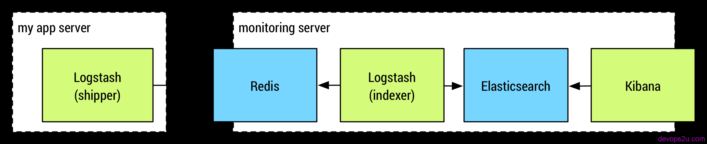

# ELK日志服务使用-shipper-to-indexer

上一篇文章写了用[rsyslog同步日志到elk服务器](http://bbotte.com/logs-service/use-elk-processing-logs-use-rsyslog-transmission-logs/)，可以同步nginx的日志文件，或者直接通过rsyslog到elk主机的某一个端口，用logstash定义的syslog接收两种方式。这篇讲[用logstash的shipper to indexer传送日志](http://bbotte.com/logs-service/use-elk-processing-logs-logstsh-shipper-to-indexer/)。
logstash的type说明：
type
1.Value type is string
2.There is no default value for this setting.
Add a type field to all events handled by this input.

Types are used mainly for filter activation.

The type is stored as part of the event itself, so you can also use the type to search for it in Kibana.

If you try to set a type on an event that already has one (for example when you send an event from a shipper to an indexer) then a new input will not override the existing type. A type set at the shipper stays with that event for its life even when sent to another Logstash server.

下面例子为：logstash的shipper  input读取日志后，filter过滤，通过redis通道output，发送出去

logstash的indexer收集由多台shipper发送的日志(当然这里是一台)，一般会把redis安装到此主机，收到日志后发送给本机的elasticsearch

```
#下面匹配的是java的log4j日志格式
logstash-shipper.conf   
input {
  file {
    type => "commonlog"
    path => [ "/work/dubboCommon/nohup.out" ]
    sincedb_path => "/usr/local/logstash/conf/sincedb_common"
    start_position => "beginning"
    codec => multiline {
    pattern => "%d{yyyy-MM-dd HH:mm:ss,SSS} (%F:%L) %p [%t] %m%n (^\s+... \d+ more)"
    what => "next"
    negate => true
    }
    }
}
filter {
  mutate {
    gsub => [ "message", "\r", "" ]
    replace => ["host", "web1"]
  }
  if "_grokparsefailure" in [tags] {
      drop { }
    }
  grok {
    type => "commonlog"
    add_tag => [ "web1", "web1common" ]
    match => [ "message", "(?m)%{TIMESTAMP_ISO8601:timestamp} %{LOGLEVEL:severity} %{GREEDYDATA:message}" ]
    overwrite => [ "message" ]
  }
  date {
    match => [ "timestamp" , "yyyy-MM-dd HH:mm:ss,SSS" ]
  }
  if !("_grokparsefailure" in [tags]) {
      date {
        match => [ "logdate", "YYYY-MM-dd HH:mm:ss,SSS"]
      }
   }
}
output {
  redis {
    host => "192.168.1.1" 
    port => 6379  
    db => 2
    data_type => "channel"
    key => "logstash_common"
  }
}
 
运行logstash
nohup logstash -f logstash-shipper.conf  >/dev/null 2>&1 &
```

```
logstash-indexer.conf
input {
redis {
    host => "127.0.0.1"
    port => 6379
    db => 2
    key => "logstash_common"
    data_type => "channel"
    codec  => "json"
    tags => [ "web1", "web1common" ]
}
}
output {
elasticsearch {
    host => "127.0.0.1"
    index => "XXX-common-%{+YYYY.MM.dd}"
}
}
 
运行：
nohup logstash -f logstash-indexer.conf  >/dev/null 2>&1 &
```

还是那句老话，日志格式根据自己实际日志来匹配，type、tags、index可随便定义，引用[Ian Unruh](https://ianunruh.com/)大神的一个图片https://ianunruh.com/



2016年02月26日 于 [linux工匠](http://www.bbotte.com/) 发表