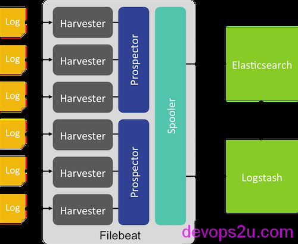
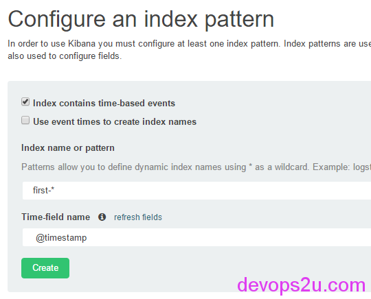

# ELK日志服务使用-filebeat多文件发送

公司应用ELK的实际情况各个不同，如果需要分析的日志文件较多，并且又不能混合在一块，每个日志都有自己的type和tag，官方提供了filebeat，正好可以解决这个问题。
下面参考elastic.co的帮助文档，原页面
<https://www.elastic.co/guide/en/logstash/2.2/advanced-pipeline.html#multiple-input-output-plugins>
说明页面 <https://www.elastic.co/guide/en/logstash/2.2/deploying-and-scaling.html#deploying-filebeat>
<https://www.elastic.co/guide/en/beats/filebeat/current/index.html>



上图来自官网

**filebeat安装**：

```
curl -L -O https://download.elastic.co/beats/filebeat/filebeat-1.1.2-x86_64.rpm
rpm -vi filebeat-1.1.2-x86_64.rpm
# rpm -qla|grep filebeat
/etc/filebeat/filebeat.template.json
/etc/filebeat/filebeat.yml
/etc/init.d/filebeat
/lib/systemd/system/filebeat.service
/usr/bin/filebeat
/usr/bin/filebeat-god
 
# filebeat -h
Usage of filebeat:
  -N	Disable actual publishing for testing
  -c string
    	Configuration file (default "/root/filebeat.yml")
  -configtest
    	Test configuration and exit.
  -cpuprofile string
    	Write cpu profile to file
  -d string
    	Enable certain debug selectors
  -e	Log to stderr and disable syslog/file output
  -httpprof string
    	Start pprof http server
  -memprofile string
    	Write memory profile to this file
  -v	Log at INFO level
  -version
    	Print version and exit
 
# egrep -v "^$|^#|^.*#" /etc/filebeat/filebeat.yml 
filebeat:
  prospectors:
    -
      paths:
        - /var/log/*.log
      input_type: log
  registry_file: /var/lib/filebeat/registry
output:
  elasticsearch:
    hosts: ["localhost:9200"]
shipper:
logging:
  files:
```

新建一个**filebeat.yml配置**

```
filebeat:
  prospectors:
    -
      paths:
        - "/tmp/example.log" 
      fields:
        type: syslog
output:
  elasticsearch:
    enabled: true
    hosts: ["http://localhost:9200"]
 
# /opt/elasticsearch/bin/elasticsearch &
# /opt/kibana/bin/kibana &
# filebeat -e -c filebeat.yml -d "publish"
 
# echo "`date` this is filebeat log test" >> /tmp/example.log
#http://IP:5601/ 浏览器打开kibana界面查看日志
```

上面步骤是试用一下filebeat，按官方文档，下面从两台主机说明一下：
**发送端**（生成日志文件）：
1，安装filebeat-1.1.2-x86_64.rpm
2，编辑filebeat配置

```
# vim filebeat.yml
filebeat:
  prospectors:
    -
      paths:
        - "/tmp/example.log"
      input_type: log
output:
  logstash:
      hosts: ["192.168.71.37:9999"]
3，生成日志
echo "`date` this is filebeat log test" >> /tmp/example.log
 
# filebeat -e -c filebeat.yml -d "publish"   #监控生成的日志
  "@timestamp": "2016-03-09T13:25:58.781Z",
  "beat": {
    "hostname": "host2",
    "name": "host2"
  },
  "count": 1,
  "fields": null,
  "input_type": "log",
  "message": "Wed Mar  9 21:25:54 CST 2016 this is filebeat log test",
  "offset": 80044,
  "source": "/tmp/example.log",
  "type": "log"
}
2016/03/09 13:26:03.673018 output.go:87: DBG  output worker: publish 1 events
2016/03/09 13:26:03.809663 publish.go:104: INFO Events sent: 1
2016/03/09 13:26:03.809843 registrar.go:157: INFO Registry file updated. 1 states written.
```

**接收端**（ELK）：
1，编辑logstash的配置文件

```
# vim filebeat.conf 
 
input {
    beats {
        port => "9999"
  }
}
 
output {
    elasticsearch {
        host => "localhost"
    }
    file {
    path => "/tmp/test.log"
    message_format => "%{message}%"
    }
 
}
 
 
# ./bin/logstash -t -f filebeat.conf
Configuration OK
```

查看接收到的日志：

```
# ./bin/logstash -v -f filebeat.conf
Starting stale files cleanup cycle {:files=>{"/tmp/test.log"=>#<IOWriter:0x65c68379 \
@active=true, @io=#<File:/tmp/test.log>>}, :level=>:info}
 
# tail -f /tmp/test.log 
Wed Mar  9 21:25:54 CST 2016 this is filebeat log test%
```


最后，对elasticsearch加载索引模板

```
# curl -XPUT 'http://localhost:9200/_template/filebeat?pretty' -d@/etc/filebeat/filebeat.template.json
{
  "acknowledged" : true
}
```

在使用filebeat之前，你应该加载这个索引模板，为了让elasticsearch明白哪个字段需要被分析。

其实上面的步骤都是官方文档里面写的，这里只是写一下而已，filebeat的确挺方便的，不用再通过rsyslog那么繁琐去实现日志的发送接收

下面我们测试**多日志文件的发送**：

发送日志端：

```
# mkdir -p /tmp/logs/{first,second}
# less filebeat.yml
filebeat:
  prospectors:
    -
      paths:
        - "/tmp/logs/first/test.log" 
      fields:
        input_type: log
        tag: first
 
    -
      paths:
        - "/tmp/logs/second/test.log"   
      fields:
        tag: second
 
output:
  logstash:
       hosts: ["192.168.71.37:9999"]
```

新建了2个文件夹，给每个日志添加标签，输出到ELK server端

```
# echo "`date` this is first log " >> /tmp/logs/first/test.log
# echo "`date` this is second log " >> /tmp/logs/second/test.log.
 
# filebeat -e -c filebeat.yml -d "publish"
...
2016/03/31 08:44:09.400266 publish.go:109: DBG  Publish: {
  "@timestamp": "2016-03-31T08:44:04.454Z",
  "beat": {
    "hostname": "localhost.localdomain",
    "name": "localhost.localdomain"
  },
  "count": 1,
  "fields": {
    "input_type": "log",
    "tag": "first"
  },
  "input_type": "log",
  "message": "Thu Mar 31 16:44:00 CST 2016 this is first log ",
  "offset": 144,
  "source": "/tmp/logs/first/test.log",
  "type": "log"
}
2016/03/31 08:44:09.400386 output.go:87: DBG  output worker: publish 1 events
2016/03/31 08:44:09.464261 publish.go:104: INFO Events sent: 1
2016/03/31 08:44:09.464479 registrar.go:157: INFO Registry file updated. 2 states written.
```

接收日志端：

启动elasticsearch，kibana。logstash中用tag判断日志的来源，并且索引index更改一下

```
# cd /opt
# ./elasticsearch/bin/elasticsearch &
# ./kibana/bin/kibana &
 
# cd /opt/logstash/
# vim filebeat.conf
input {
    beats {
        port => "9999"
  }
}
 
output {
    if [fields][tag] == "first"{
      elasticsearch {
          host => "localhost"
          index => "first-%{+YYYY.mm.dd}"
      }
      file {
        path => "/tmp/first.log"
        message_format => "%{message}%"
      }
    }
 
    if [fields][tag] == "second"{
      elasticsearch {
          host => "localhost"
          index => "second-%{+YYYY.mm.dd}"
      }
      file {
        path => "/tmp/second.log"
        message_format => "%{message}%"
      }
    }
 
}

# ./bin/logstash -v -f filebeat.conf
```

这时候在发送日志端，生成一条日志，观察各个终端post的log

```
# ./bin/logstash -v -f filebeat.conf 
...
[2016-03-31 16:44:21,068][INFO ][cluster.metadata         ] [Kid Nova] [first-2016.44.31] creating index, cause [auto(bulk api)], templates [], shards [5]/[1], mappings [log]
[2016-03-31 16:44:21,994][INFO ][cluster.metadata         ] [Kid Nova] [first-2016.44.31] update_mapping [log] (dynamic)
Starting stale files cleanup cycle {:files=>{"/tmp/first.log"=>#<IOWriter:0x3236dd83 @active=true, @io=#<File:/tmp/first.log>>}, :level=>:info}
```

kibana 中 Configure an index pattern 索引写定义的 first-*  、second-*



就酱紫，完美的解决了多个日志的input和output。也建议大家使用此方式

2016年03月09日 于 [linux工匠](http://www.bbotte.com/) 发表