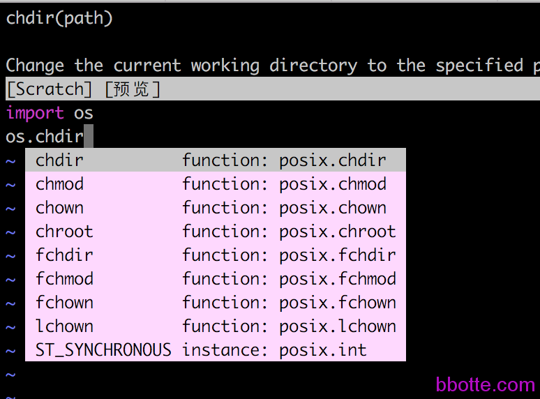

# vim编辑器对python的扩展

vim是我最常用的编辑器，功能足够丰富，并且支持扩展，下面对vim加一个[Vundle](https://github.com/VundleVim/Vundle.vim)插件。Vundle对应vim，就像pip对于python一样，是可以装其他plugin的管理器。再通过Vundle安装[YouCompleteMe](https://github.com/Valloric/YouCompleteMe) engine

```
# cat /etc/centos-release
CentOS release 6.7 (Final)
# vim --version|head -n 1
VIM - Vi IMproved 7.4 (2013 Aug 10, compiled Jul 24 2015 02:23:23)
```

安装Vundle，git克隆 Vundle，要不然其他插件就装不上了。设置.vimrc

```
git clone代码
[root@vm01 ~]# git clone https://github.com/gmarik/Vundle.vim.git ~/.vim/bundle/Vundle.vim
[root@vm01 ~]# cd ~/.vim/bundle/YouCompleteMe/
安装遇到找不到ycmd/build.py
[root@vm01 YouCompleteMe]# ./install.py -clang-completer
File /root/.vim/bundle/YouCompleteMe/third_party/ycmd/build.py does not exist; you probably forgot to run:
	git submodule update --init --recursive
 
[root@vm01 YouCompleteMe]# cd ..
[root@vm01 bundle]# mv YouCompleteMe y
[root@vm01 bundle]# git clone https://github.com/Valloric/YouCompleteMe.git
[root@vm01 bundle]# cd YouCompleteMe/
再次安装
[root@vm01 YouCompleteMe]# ./install.sh
WARNING: this script is deprecated. Use the install.py script instead.
File /root/.vim/bundle/YouCompleteMe/third_party/ycmd/build.py does not exist; you probably forgot to run:
	git submodule update --init --recursive
 
[root@vm01 YouCompleteMe]# git submodule update --init --recursive
安装遇到c++编译器不支持
[root@vm01 YouCompleteMe]# ./install.py --clang-completer
Searching Python 2.6 libraries...
Found Python library: /usr/lib64/python2.6/config/libpython2.6.so
Found Python headers folder: /usr/include/python2.6
-- The C compiler identification is GNU 4.4.7
-- The CXX compiler identification is GNU 4.4.7
-- Check for working C compiler: /usr/bin/cc
-- Check for working C compiler: /usr/bin/cc -- works
-- Detecting C compiler ABI info
-- Detecting C compiler ABI info - done
-- Check for working CXX compiler: /usr/bin/c++
-- Check for working CXX compiler: /usr/bin/c++ -- works
-- Detecting CXX compiler ABI info
-- Detecting CXX compiler ABI info - done
CMake Error at CMakeLists.txt:188 (message):
  Your C++ compiler does NOT support C++11.
 
-- Configuring incomplete, errors occurred!
See also "/tmp/ycm_build_LaVmEo/CMakeFiles/CMakeOutput.log".
ERROR: the build failed.
 
# gcc --version
gcc (GCC) 4.4.7 20120313 (Red Hat 4.4.7-17)
Copyright © 2010 Free Software Foundation, Inc.
升级c++
# wget http://people.centos.org/tru/devtools-2/devtools-2.repo -O /etc/yum.repos.d/devtools-2.repo
# yum install devtoolset-2-gcc devtoolset-2-binutils devtoolset-2-gcc-c++
 
[root@vm01 YouCompleteMe]# scl enable devtoolset-2 bash
[root@vm01 YouCompleteMe]# . /opt/rh/devtoolset-2/enable
[root@vm01 YouCompleteMe]# gcc --version
gcc (GCC) 4.8.2 20140120 (Red Hat 4.8.2-15)
Copyright (C) 2013 Free Software Foundation, Inc.
This is free software; see the source for copying conditions.  There is NO
warranty; not even for MERCHANTABILITY or FITNESS FOR A PARTICULAR PURPOSE.
 
再次安装YouCompleteMe
[root@vm01 YouCompleteMe]# ./install.py
...
Linking CXX shared library /root/.vim/bundle/YouCompleteMe/third_party/ycmd/ycm_core.so
[100%] Built target ycm_core
 
安装完成
发现pyenv不能用了
pyenv不能用
# cat ~/.bash_profile
# .bash_profile
 
# Get the aliases and functions
if [ -f ~/.bashrc ]; then
	. ~/.bashrc
fi
 
# User specific environment and startup programs
PATH=$PATH:$HOME/bin
export PATH
 
export PATH="/root/.pyenv/bin:$PATH"
eval "$(pyenv init -)"
eval "$(pyenv virtualenv-init -)"
 
source bash_profile解决
# . ~/.bash_profile[root@vm01 ~]# git clone https://github.com/gmarik/Vundle.vim.git ~/.vim/bundle/Vundle.vim
 
# cat ~/.vimrc
set nocompatible
filetype off
set rtp+=~/.vim/bundle/Vundle.vim
call vundle#begin()
Plugin 'gmarik/Vundle.vim'
Plugin 'vim-scripts/indentpython.vim'
call vundle#end()            
filetype plugin indent on 
 
Bundle 'Valloric/YouCompleteMe'
 
"vim original configuration
syntax on
set nohlsearch
set encoding=utf-8
 
"python Indentation
au BufNewFile,BufRead *.py
    \ set tabstop=4 |
    \ set softtabstop=4 |
    \ set shiftwidth=4 |
    \ set textwidth=79 |
    \ set expandtab |
    \ set autoindent |
    \ set fileformat=unix |
 
"python with virtualenv support
py << EOF
import os
import sys
if 'VIRTUAL_ENV' in os.environ:
  project_base_dir = os.environ['VIRTUAL_ENV']
  activate_this = os.path.join(project_base_dir, 'bin/activate_this.py')
  execfile(activate_this, dict(__file__=activate_this))
EOF
```

.vimrc配置中，上面一段是启用Vundle，并且安装2个插件gmarik/Vundle.vim 和 vim-scripts/indentpython.vim，即github的项目名称。接着是安装Valloric/YouCompleteMe插件，此插件比较大。再往下依次是vim原来的设置、python缩进、pyenv的设置。完成后上面.vimrc配置文件后，就在vim安装插件吧。

输入vim后，再输入”:BundleInstall”或者”:PluginInstall” 即可安装，因为YouCompleteMe比较大，所以安装要一小时，我这里上传到了网盘(https://pan.baidu.com/s/1nvhm4op)，vimrc的配置在.vim文件夹内，在root目录下解压缩vim.tar.gz ,复制.vim/.vimrc到根目录即可。这样就完事了。

发现另外一个python的vim插件：python-mode，上面的配置文件YouCompleteMe就不用安装了。在配置中添加如下安装

Bundle ‘klen/python-mode’ 即可，所以.vimrc文件如下：

```
# cat ~/.vimrc 
set nocompatible
filetype off
set rtp+=~/.vim/bundle/Vundle.vim
call vundle#begin()
Plugin 'gmarik/Vundle.vim'
call vundle#end()            
filetype plugin indent on 
 
Bundle 'klen/python-mode'
 
syntax on
set nohlsearch
set encoding=utf-8
 
py << EOF
import os
import sys
if 'VIRTUAL_ENV' in os.environ:
	project_base_dir = os.environ['VIRTUAL_ENV']
	activate_this = os.path.join(project_base_dir, 'bin/activate_this.py')
	execfile(activate_this, dict(__file__=activate_this))
EOF
```

编辑好.vimrc文件，打开vim，输入 :PluginInstall 即可安装模块，安装完成后就可以使用



如果玩手动安装YouCompleteMe，请往下看：

vim插件按自己的要求安装，不过上面一般够用了

2017年02月23日 于 [linux工匠](https://bbotte.github.io/) 发表

