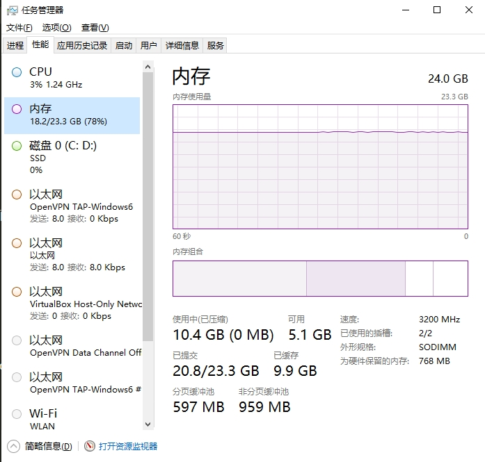
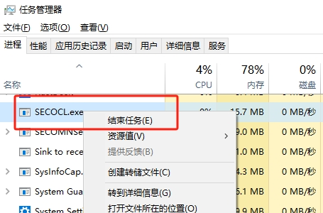
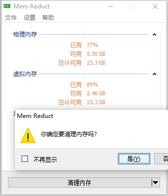
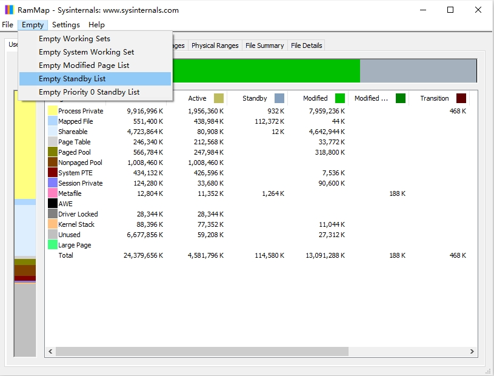
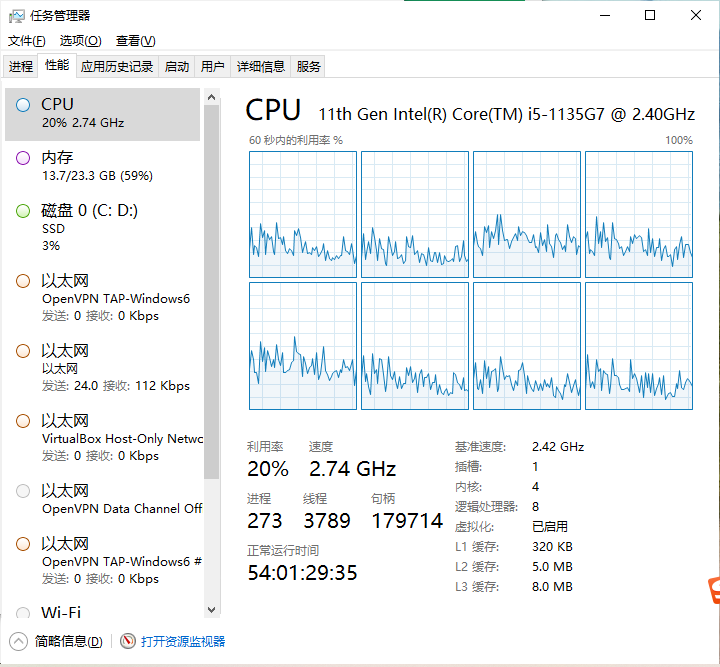
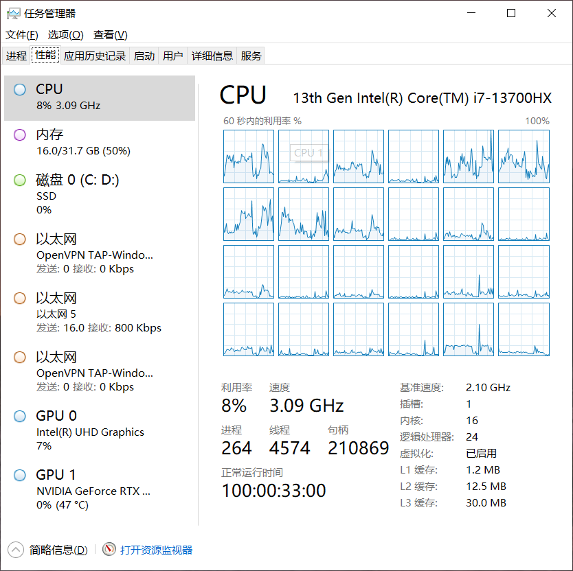

# Windows10内存释放经验

### 说明

Windows使用多少内存一般从任务管理器中查看，比如下图，显示使用18.2G内存，总共23.3G内存(16+8两根内存条)



实际上对系统来说是“已提交”中的 20.8G，并不是18.2G，如果“已提交”达到23G那么电脑就会卡起来，甚至无响应。而不是“使用”的18.2G。

那有什么方式可以把内存“打下来”

#### 结束secocl进程

如图，结束 SECOCL.exe进程，内存会直接降下来，并且系统没有任何影响



#### 使用Mem Reduct释放内存

释放使用不到的内存，点第一次没反应，一般点第二次才会释放



下载网页 https://memreduct.org/mem-reduct-download/

#### 使用RAMMap清理备用缓存

这个软件可以做一个bat脚本，因为提供了参数,路径改成你自己电脑的，可以做个定时任务，定时去清理备用缓存

清理备用缓存.bat
```
C:\Users\user\Downloads\RAMMap\RAMMap64.exe -Et
```



下载网页 https://learn.microsoft.com/zh-cn/sysinternals/downloads/rammap

上面3种方法没有什么副作用，可以放心使用


我的Windows运行54天了，还好吧，2个月重启一次






2024年06月1日 于 [linux工匠](https://bbotte.github.io/) 发表
