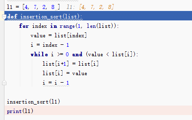

# python插入排序算法

需求：把一个数字列表按大小顺序排列

怎么做：
1,先把第二个元素和第一个元素对比，小的放前面
2,把第三个元素和第二个元素对比
a，如果第三比第二大，就不用往前比较了
b，如果第三比第二小，和第二交换位置；再和第一比较大小
3，如此循环，后面一个数和前面比较大小

```python
# coding:utf-8
#插入排序 insertion sort
l1 = [4, 7, 2, 8, 3, 7]
def insertion_sort(list):
    for index in range(1, len(list)):
        value = list[index]
        i = index - 1
        while i >= 0:
            if value < list[i]:
                list[i+1] = list[i]
                list[i] = value
                i = i - 1
            else:
                break
 
insertion_sort(l1)
print(l1)
```

```
range(1,len(list)) 是从第二个元素到最后一个元素
for index in range 循环是遍历range范围依次从中取一个下标
value： 拿到的list[index]就是对应列表的值
我们要做的是此value和他前一个值比较大小，所以定义一个i: i = index - 1
下一步需要定义一个循环，来完成此value一直与他前面的值比大小，遇到比value大，则交换位置，直到对比到第一个元素；如果比value小，就不用比较了，就是while循环
 
下面两行是把list[i] 右移一个位置，把value这个值放到 list[i]这个位置，完成两个值互换
list[i+1] = list[i]
list[i] = value
完事再和前面一个值比较大小，再次循环
```

因为while循环里面有if，else，最后break，所以对此优化一下

```
# coding:utf-8
#插入排序 insertion sort
l1 = [4, 7, 2, 8, 3, 7]
def insertion_sort(list):
    for index in range(1, len(list)):
        value = list[index]
        i = index - 1
        while i >= 0 and (value < list[i]):
            list[i+1] = list[i]
            list[i] = value
            i = i - 1
 
insertion_sort(l1)
print(l1)
[2, 3, 4, 7, 7, 8]
```

我们用pycharm debug循环的过程，就选4个数字看一下过程



也可以<http://pythontutor.com/>网站查看过程

摘自网易公开课-可汗学院公开课：计算机科学

2016年03月25日 于 [linux工匠](http://www.bbotte.com/) 发表