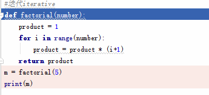
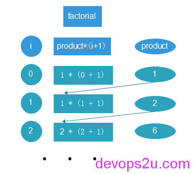
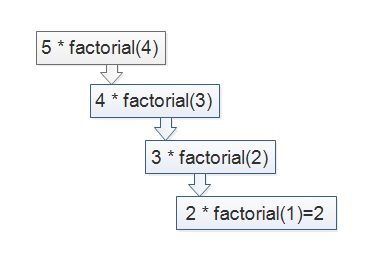

# 小议python的迭代iterative和递归recursive

先说一下迭代和递归的定义，迭代：循环或者反复执行，由旧值递推出新值。每一次对过程的重复称为一次“迭代”，而每一次迭代得到的结果会作为下一次迭代的初始值

递归：程序在运行过程中直接或间接调用自己。需要有边界条件、递归前进段和递归返回段，当边界条件不满足时，递归前进；当边界条件满足时，递归返回

概念清晰的话就很容易分辨。下面说一下阶乘factorial中迭代iterative和递归recursive的区别

迭代：

```
#迭代iterative
def factorial(number):
    product = 1
    for i in range(number):
        product = product * (i+1)
    return product
m = factorial(5)
print(m)
```

依次把number = 0的结果返回，赋给product，递推出新值，再计算下一个number，运行过程如下





递归：

```
#递归recursive
def factorial(number):
    if number <= 1:
        return 1
    else:
        return number * factorial(number-1)
n = factorial(5)
print(n)
```

一个函数套着一个函数，一直调用自己，直到number=1, return 1后，再一层层返回来




我们可以测试一下运行的时间

```
# vim iterative.py
import time
from functools import wraps
 
def timer(function):
    @wraps(function)
    def function_timer(*args, **kwargs):
        t0 = time.time()
        result = function(*args, **kwargs)
        t1 = time.time()
        print('total time: {0}'.format(str(t1-t0)))
        return result
    return function_timer
 
@timer
def factorial(number):
    product = 1
    for i in range(number):
        product = product * (i+1)
    return product
 
if __name__ == "__main__":
   factorial(200)

```

```
# vim recursive.py
import time
from functools import wraps
 
def timer(function):
    @wraps(function)
    def function_timer(*args, **kwargs):
        t0 = time.time()
        result = function(*args, **kwargs)
        t1 = time.time()
        print('total time: {0}'.format(str(t1-t0)))
        return result
    return function_timer
 
@timer
def factorial(number):
    def _factorial(number):
        if number <= 1:
            return 1
        else:
            return number * _factorial(number-1)
    return _factorial(number)
 
if __name__ == "__main__":
    factorial(200)
 
#因为这里是递归，按照上面迭代的写法，会把每一次递归的时间打印出来，因为每一次递归里面都加油装饰器
```

$ python iterative.py
total time: 3.7670135498046875e-05

$ python recursive.py
total time: 0.00012040138244628906

看到时间，差距还是挺明显的

2016年03月31日 于 [linux工匠](http://www.bbotte.com/) 发表


