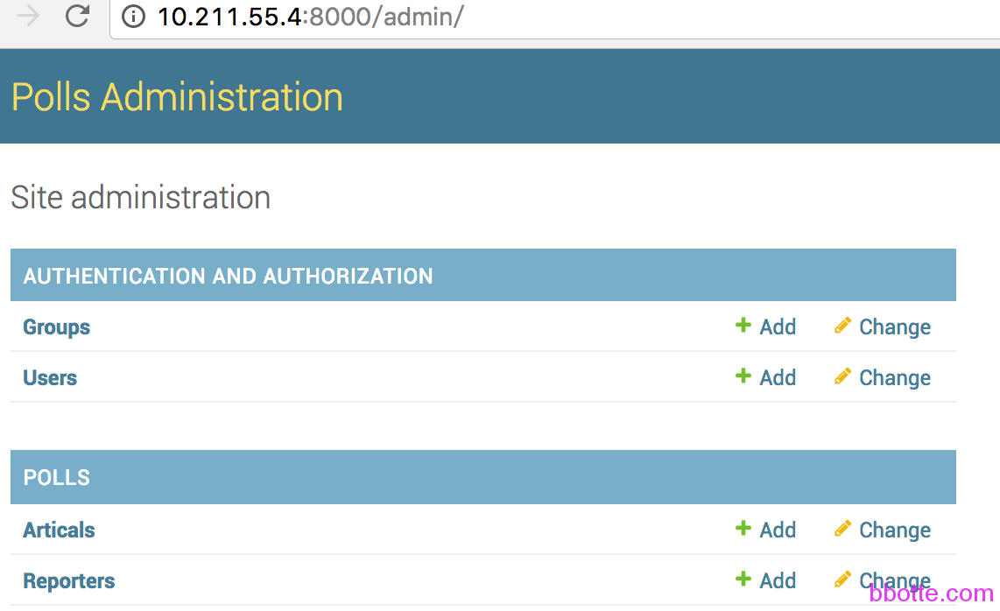
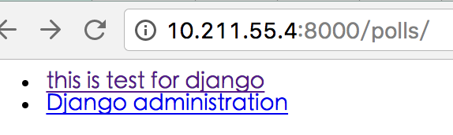
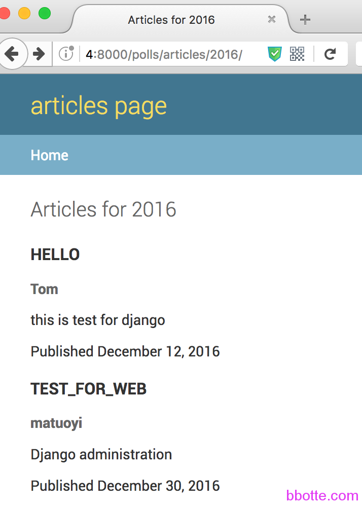

# linux工匠之django入门学习

一，创建project 启动django应用
二，建立一个应用
2.0 创建应用
2.1 model层
2.2 django的shell操作
2.3 创建登录后台的超级用户
2.4 注册model定义的类 Artical
2.5 在project里注册urls
2.6 添加一个views视图
2.7 添加templates模板
2.8 sqlite操作

### **一，创建project 启动django应用**

继续python学习，配置完[pyenv建立独立的python环境](http://bbotte.com/python-dev/pyenv-and-virtualenv-to-build-an-independent-python-environment/)后新建django应用

```
[root@vm01 ~]# cd /data/
(2.7.11/envs/myenv) [root@vm01 data]# pip install django==1.10.2
(2.7.11/envs/myenv) [root@vm01 data]# python -c "import django;print(django.get_version())"
1.10.2
# whereis django-admin
django-admin: /usr/bin/django-admin.pyc /usr/bin/django-admin.py
# django-admin startproject mysite  #创建一个project
# tree mysite/
mysite/
├── mysite
│   ├── __init__.py
│   ├── settings.py
│   ├── urls.py
│   └── wsgi.py
└── manage.py
 
1 directory, 5 files
```

django安装完成后启动创建的项目

```
# cd mysite/
# python manage.py runserver 0.0.0.0:8000 #django的运用WSGI Server启动服务
# python manage.py -h #查看django支持的模块
```

遇到错误及方法：

```
# python manage.py migrate
raise ImproperlyConfigured("Error loading either pysqlite2 or sqlite3 modules (tried in that order): %s" % exc)
django.core.exceptions.ImproperlyConfigured: Error loading either pysqlite2 or sqlite3 modules (tried in that order): No module named '_sqlite3'
yum list python-sqlite
 
# yum install sqlite-devel -y
# locate _sqlite3.so
/usr/lib64/apr-util-1/apr_dbd_sqlite3.so
/usr/lib64/python2.6/lib-dynload/_sqlite3.so
要不会提示
raise ImproperlyConfigured("Error loading either pysqlite2 or sqlite3 modules (tried in that order): %s" % exc)
django.core.exceptions.ImproperlyConfigured: Error loading either pysqlite2 or sqlite3 modules (tried in that order): No module named _sqlite3
 
(2.7.11/envs/myenv) [root@vm01 mysite]# cp /usr/lib64/python2.6/lib-dynload/_sqlite3.so /root/.pyenv/versions/2.7.11/envs/myenv/lib/python2.7/
```

创建models定义的表，默认用sqlite数据库，migrate命令是更新数据库，把model中定义的表结构直接以sql语句运行，而不用自己写建表的sql语句

```
# python manage.py migrate
```

```
# vim mysite/settings.py
ALLOWED_HOSTS = ['*']
要不我们通过IP访问会提示
[08/Dec/2016 06:42:17] "GET / HTTP/1.1" 400 66728
Invalid HTTP_HOST header: '10.211.55.4:8000'. You may need to add u'IP' to ALLOWED_HOSTS.
```

```
# python manage.py runserver 0.0.0.0:8000
Performing system checks...
 
System check identified no issues (0 silenced).
December 08, 2016 - 06:52:12
Django version 1.10.4, using settings 'mysite.settings'
Starting development server at http://0.0.0.0:8000/
Quit the server with CONTROL-C.
```

浏览器访问本机地址 http://IP_ADDRESS:8000/

### **二，建立一个应用**

#### **2.0 创建应用**

项目mysite已经建立，再建一个应用，名字为polls。一个项目project可以有多个应用app，就像一个网站有了名字后，还有多个菜单栏

```
# python manage.py startapp polls
```

完成后需要在mysite里面注册此应用

```
# vim mysite/settings.py
INSTALLED_APPS = [
    'polls',
]
```

下面应用polls用记者Reporter和文章Artical的对应关系举例

#### **2.1 model层**

model层是定义数据库表结构字段等，用migrate命令可以生成sql语句。下面定义reporter和artical 2个表结构

```
# vim polls/models.py
from __future__ import unicode_literals
 
from django.db import models
 
# Create your models here.
class Reporter(models.Model):
    full_name = models.CharField(max_length=70)
    def __str__(self):
        return self.full_name
 
class Artical(models.Model):
    pub_date = models.DateField()
    headline = models.CharField(max_length=200)
    content = models.TextField()
    reporter = models.ForeignKey(Reporter)
    def __str__(self):
        return self.headline
```

创建及更改表结构后,makemigrations负责根据您对模型所做的更改创建新的迁移

```
# python manage.py makemigrations polls 
Migrations for 'polls':
polls/migrations/0001_initial.py:
- Create model Artical
- Create model Reporter
- Add field reporter to artical
```

查看创建表生成的SQL语句

```
# python manage.py sqlmigrate polls 0001
```

创建模型所对应的表,更新数据库

```
# python manage.py migrate
```

#### **2.2 django的shell操作**

django提供shell接口，可对其操作

```
# ./manage.py shell
In [ ]: from polls.models import Reporter,Artical
In [ ]: name = Reporter(full_name="Tom")
In [ ]: name.save()
 
In [ ]: art = Artical(pub_date=timezone.now(), headline='hello', content='''this is test for django''', reporter=name)
In [ ]: art.save()
 
In [ ]: Reporter.objects.get(id=1)
<Reporter: Tom>
 
In [ ]: name.full_name
Out: 'Tom'
In [ ]: art.content
Out: 'this is test for django'
```

#### **2.3 创建登录后台的超级用户**

```
# python manage.py createsuperuser
sername (leave blank to use 'root'): admin
Email address:
Password:
Password (again):
Superuser created successfully.
 
# ./manage.py runserver 0.0.0.0:8000
```

浏览器访问http://10.211.55.4:8000/admin/，输入用户名密码登录

#### **2.4 注册model定义的类 **Artical

```
# cat polls/admin.py
from django.contrib import admin
 
# Register your models here.
from .models import Artical
admin.site.register(Artical)
```

http://10.211.55.4:8000/admin/ 访问查看,不过对于Reporter来说，只有Tom一个人，可以同样方式注册Reporter，修改admin.py

```
# vim polls/admin.py
from django.contrib import admin
from .models import Artical, Reporter
 
admin.site.register(Artical)
admin.site.register(Reporter)
```



#### **2.5 在project里注册urls**

上面几步是其实说了2点：1，建立个应用并注册  2，编辑models.py生成数据库建表语句。下面urls、views、template是对页面展示处理的核心，urls可以理解为传送带，把不同的访问(泥土或陶土)分发到不同的views中；views是混合搅拌机，处理url请求，并且根据模板template(砖头或者瓷砖样式)加工为指定样式的产品，至于出来的产品是什么样的，内容由views决定，外形有template决定，然后发给用户

```
# cat mysite/urls.py
from django.conf.urls import url, include
from django.contrib import admin
 
urlpatterns = [
    url(r'^admin/', admin.site.urls),
    url(r'^polls/', include('polls.urls')),
]
```

编辑urls链接

```
# cat polls/urls.py
from django.conf.urls import url
from . import views
 
urlpatterns = [
    url(r'^$', views.index, name='index'),
]
```

#### **2.6 添加一个views视图**

```
# cat polls/views.py
from django.shortcuts import render
 
# Create your views here.
from django.http import HttpResponse
from django.template import RequestContext, loader
from .models import Artical
 
def index(request):
    latest_artical_list = Artical.objects.order_by('pub_date')[0:5]
    template = loader.get_template('../templates/polls/index.html')
    context = {
        'latest_artical_list':latest_artical_list,
    }
    return HttpResponse(template.render(context, request))
```

#### **2.7 添加templates模板**

在mysite/settings.py的TEMPLATES = [] 中

```
修改'DIRS': [],
为 'DIRS': [os.path.join(BASE_DIR, 'templates')],
```

```
# mkdir -p templates/polls
# cat templates/polls/index.html

    <ul>
    
        <!--<p>{{ art.content }}</p>-->
        <li><a href="/polls/{{ art.id }}/">{{ art.content }}</a></li>
    
    </ul>

    <p>No polls are available.</p>

```

访问http://10.211.55.4:8000/polls/



#### **2.8 sqlite操作**

```
# sqlite3 db.sqlite3
SQLite version 3.6.20
Enter ".help" for instructions
Enter SQL statements terminated with a ";"
sqlite> .databases
seq name file
--- --------------- ------------------------------
0 main /data/mysite/db.sqlite3
sqlite> .tables
auth_group django_admin_log
auth_group_permissions django_content_type
auth_permission django_migrations
auth_user django_session
auth_user_groups polls_artical
auth_user_user_permissions polls_reporter
cmdb_blog
sqlite> .tables auth_user_groups
auth_user_groups
sqlite> .schema auth_user_groups
CREATE TABLE "auth_user_groups" ("id" integer NOT NULL PRIMARY KEY AUTOINCREMENT, "user_id" integer NOT NULL REFERENCES "auth_user" ("id"), "group_id" integer NOT NULL REFERENCES "auth_group" ("id"));
CREATE INDEX "auth_user_groups_0e939a4f" ON "auth_user_groups" ("group_id");
CREATE INDEX "auth_user_groups_e8701ad4" ON "auth_user_groups" ("user_id");
CREATE UNIQUE INDEX "auth_user_groups_user_id_94350c0c_uniq" ON "auth_user_groups" ("user_id", "group_id");
sqlite> select * from auth_user_groups;
sqlite> select * from auth_permission where id=1;
1|1|add_logentry|Can add log entry
sqlite> .help
sqlite> .exit
```


django运行的流程图如上，遵循MVC(model，view，control),也有说法django是MTV(model,template,views)模式，2中模式都可以说通。数字序号为request，字母序号为response。一般我们需要设置的为绿色的入口文件urls.py，请求和响应的封装视图view，数据抽象层model，和模板template。

manage.py runserver运行后(下面标题数字不对应上图的步骤数字)

1，加载django的execute_from_command_line和配置(mysite/settings.py)，配置中包含定义的应用、中间件、模板、urls、wsgi

2，通过定义的apps和urls,读取polls包和”mysite/urls.py”，网址链接通过此urls文件路由

```
Using the URLconf defined in mysite.urls, Django tried these URL patterns, in this order:
1. ^admin/
2. ^polls/
```

3，由配置的urlpatterns得到apps的urls(polls/urls.py)，我们在此定义了url正则、views

4，views中引入了modle，并且定义了请求和响应的返回数据，和template中需要使用的变量

5，到了modle层，从数据库中取出所需数据，再通过template加载，由views返回给客户端

上面只是最简单的测试，了解了django的运行模式，我们可以再丰富一下内容：

```
# cat polls/urls.py
from django.conf.urls import url
from . import views
 
urlpatterns = [
    url(r'^$', views.index, name='index'),
    url(r'^(?P<artical_id>[0-9]+)/$', views.artical, name='artical'),
    url(r'^articles/(?P<year>[0-9]{4})/$', views.year_archive, name='year'),
]
```

```
# cat polls/views.py
from django.shortcuts import render
 
# Create your views here.
from django.http import HttpResponse
from django.template import RequestContext, loader
from .models import Artical
 
def index(request):
    latest_artical_list = Artical.objects.order_by('pub_date')[0:5]
    template = loader.get_template('../templates/polls/index.html')
    context = {
        'latest_artical_list':latest_artical_list,
    }
    return HttpResponse(template.render(context, request))
 
def artical(request, artical_id):
    response = "this artical_id is %s"
    return HttpResponse(response % artical_id)
 
def year_archive(request, year):
    a_list = Artical.objects.filter(pub_date__year=year)
    context = {'year':year, 'article_list': a_list}
    return render(request, '../templates/polls/year.html', context)
```

```
# vim templates/polls/year.html
```


```
 Articles for {{ year }}
 

<h1 id="site-name"><a href="">articles page<h1>

 

<h1>Articles for {{year}}</h1>

<h2>
  <p>{{ art.headline|upper }}</p>
</h2>
<h3>
  <p>{{ art.reporter.full_name }}</p>
</h3>
  <p>{{ art.content }}</p>
  <p>Published {{ art.pub_date|date:"F j, Y"}}</p>


```

通过访问以下链接查看结果：

```
http://10.211.55.4:8000/polls/
http://10.211.55.4:8000/polls/1/
http://10.211.55.4:8000/polls/articles/2016/
```



代码在[mysite example github](https://github.com/bbotte/bbotte.github.io/tree/master/mysite)

2017年01月10日 于 [linux工匠](http://www.bbotte.com/) 发表

