# (转载)JAVA服务治理实践之无侵入的应用服务监控

张真  原文链接 http://www.uml.org.cn/j2ee/201610172.asp

之前在分享微智能的话题中提到了应用服务监控，本文将会着重介绍Java环境下如何实现无侵入的监控，以及无侵入模式对实现各种技术架构统一服务治理的意义，还会破解“监控系统如何监控自己”的悖论。此次分享包含宜信众多关键技术实践和落地办法，内容提纲如下：

1. 服务治理监控，机房监控，APM的区别与联系
2. “无侵入”的应用服务监控
3. 无侵入引领统一服务治理
4. 打破悖论：监控系统如何监控自己

在开始之前，先解释一下几个概念。首先，APM（Application Performance Management）即应用性能管理，按照Gartner提出的抽象模式，它应该涵盖以下内容：

End User Experience：关注终端用户对性能的真实体验

Runtime Application Architecture：应该反映应用的架构

Business Transactions：能够支持分析应用与用户交互的操作事务

Deep Dive Component Monitoring：深度应用诊断，特别是代码级的性能追踪

Analytics / Reporting：按照业务模型对大量性能数据进行（实时）精确分析

下图是Gartner对APM的抽象模型。APM领域目前已经有不少商用系统，比如国外的Dynatrace， IBM APM，国内的OneAPM，听云APM等等。

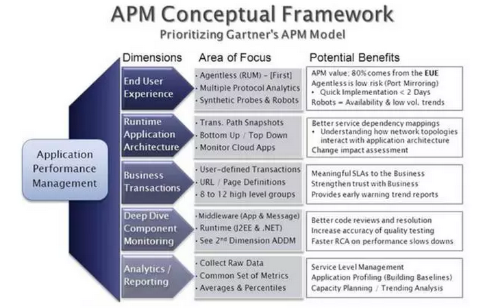

接下来说说机房监控。机房监控又被称为IT监控，这是咱们最常见的监控系统类别，它一般涵盖以下内容：

操作系统级监控：例如CPU、内存、网络流量、磁盘IO、连接数、系统日志等等。

基础设施监控：例如交换机、路由器负载、存储设备IO等等。

基础设施环境监控：例如UPS电源、动力监控、环境温度、电力负荷监控等等。

以操作系统级监控为主的机房监控，目前有不少的实现，例如Nagios、Zabbix、Open-Falcon；针对基础设施的监控以及环境的监控通常需要借助额外的硬件采集设备来完成。

最后说说服务治理监控。先简单解释一下什么是服务治理。服务治理是针对面向服务架构的系统进行监控和管理的过程。面向服务的架构包括传统SOA，分布式服务，微服务等。

服务治理的核心内容涵盖四个层面：

服务注册与发现：服务接口信息被注册到服务配置中心的过程；服务调用方可以通过服务唯一标识从服务配置中心查找服务接口信息。

应用/服务监控：针对应用以及服务接口进行监控，包括性能监控，业务指标监控，安全监控等。

服务SLA协调：评估并量化各个层面的服务等级指标，这些层面包括应用，应用实例，服务实例，服务接口等。

服务运行时控制：是服务之间调用过程的干预，包括路由规则，负载均衡，Failover切换，服务安全，保护降级，弹性伸缩。

服务治理的四个核心内容实际上也是一个层级关系（Layers Topology），上层的实现需要依赖下层的实现。

服务治理的监控主要涉及服务注册与发现和应用服务监控两个层级。在实践中，我们又将这两个层级扩展了辅助层级：

服务画像：对服务接口特征信息（技术协议、入参出参、方法、类等）进行描述。

应用画像：对应用的架构、组成、技术栈、部署信息进行描述。

应用上下文画像：应用的运行是受上下文环境的影响，包括应用所处的容器（物理机OS、虚拟机、Docker等），同一个容器内的兄弟服务进程的状态描述。

应用上下文监控：针对上下文环境的容器，同一容器内的兄弟服务进程的性能监控。

下图展示服务治理的层级关系和服务治理监控包含的内容：

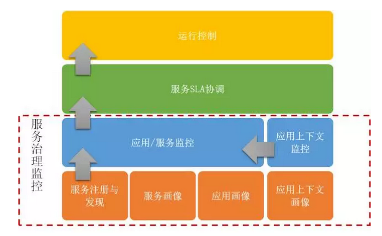

这三者由于关注点不同，所以在各自领域会有差异，但也有交集的地方。根据需要也可扩展各自的外延。

下图展示了APM，服务治理监控，机房监控的区别与联系：

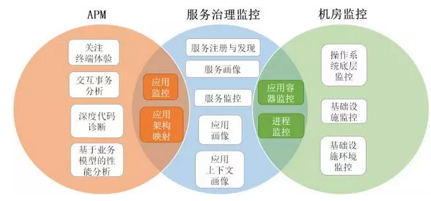

“无侵入”的应用服务监控

这个部分主要介绍如何实现JAVA环境下的“无侵入”应用服务监控。如前文提到，要实现应用服务监控，就要先实现服务注册。

经典的服务注册方法有两种：

显式配置：通过人工将服务的接口信息（服务名，服务URI等）通过配置的方式存储到服务注册中心。经典的WebService UDDI就是这种模式。这种方式的问题在于服务接口信息都是由人工收集的，出现滞后或者谬误可能性高，较高的运维代价，无法适应快速迭代的节奏。

代码实现：通过代码调用服务注册中心客户端，将服务的接口信息发送到服务注册中心。使用ZooKeeper客户端实现服务注册就是这种模式。这种方式的进步之处在于服务接口的URI可能是通过代码收集出来的，例如获得IP，context路径，接口相对地址从而拼接成服务接口的URI。

我们在早期服务化实现中，采用的是这种模式，但它的问题是需要代码埋点，也就是“侵入”，这引发了如下问题：

与服务注册中心客户端的紧耦合：如果使用ZooKeeper，需要依赖它的jar包。

服务注册代码与服务接口代码上下文紧耦合：必须在特定位置去使用服务注册的代码，而且可能还会包含特定服务的信息，这些信息可能是人工编排进去的。

由于不同系统是由不同团队开发的，需要行政制度，“TopDown”规定服务注册的编程，一旦有“不按套路出牌”的情况就会出现各种运维问题。

无侵入的服务注册思路也用到了”微智能”的思想。

全自动的收集应用实例，服务实例，服务接口的信息。这些信息包括应用唯一标识（AppID），服务名（Service ID），服务实例的URI，服务接口的URI，服务接口的元数据（类，方法，入参出参，注解，部署描述符），即自动发现。

收集过程对应用透明，不可有任何直接依赖（API依赖，jar包依赖），对系统的研发团队同样透明，即无侵入。

收集过程能够自动适应应用，服务，服务接口的变化，即自我维护。

接下来分析一下JEE应用的特点：

以应用服务器（Tomcat，Jetty，IBM WAS，JBoss）为容器，JEE应用的启动或停止都被其应用容器感知。

遵守JEE规范，服务以servlet，JAXWS，JAXRS等落地；或遵守“事实”规范，比如Spring，服务以Spring MVC落地。

servlet是HTTP的唯一入口（当然还有RMI，RPC等，其实类似，这里不做详细展开）。

于是解决方案如下：

从应用服务器的层面来对应用进行画像，即应用画像，服务画像。这个过程发生在每次应用启动的时候，因为这样就能自然捕获应用的变化。就好比电影《星际穿越》里，从四维空间能够更容易，更直接解决三维空间的问题，且更具通用性。

这里用到两种技术：

中间件劫持

应用画像技术

中间件劫持就是将我们自己的代码行为植入到中间件的各种行为中。实现画像和监控主要依靠四种关键行为：应用启动，停止，接收请求，响应回复。

应用启动：用于应用画像，服务画像

应用停止：失效服务摘除

接收请求，响应回复：用于应用，服务监控（稍后会介绍）

对JEE应用服务器的劫持核心是掌控classloader tree，获得优先加载权，从而可以改变这些行为。尽管各家实现不同，但其classloader tree结构基本类似。

下面以Tomcat为例进行说明，下图是Tomcat的classloader tree：

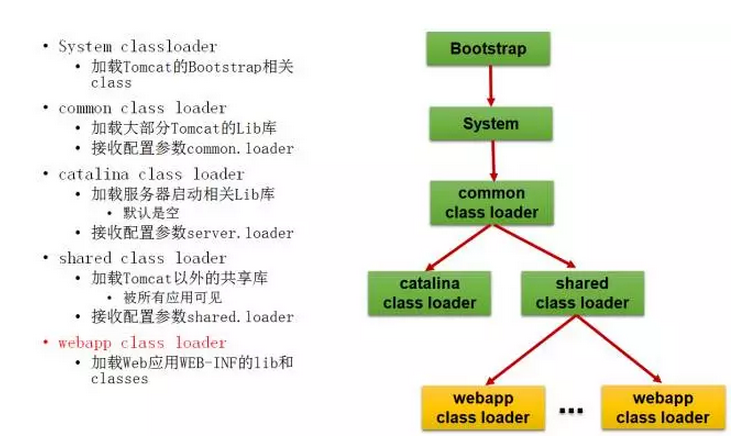

值得注意的是，每个JEE应用都会被分配一个WebAppClassloader来加载其所有class。那么如果我们能够感知应用启动的行为，通过WebAppClassloader就可以收集到前文提到的各种画像信息。

那么我们需要植入一个自己的classloader来获取优先加载权。通过加载改写后的class，来改变行为。我们把这个classloader成为UAVClassLoader（无人机类加载器）。

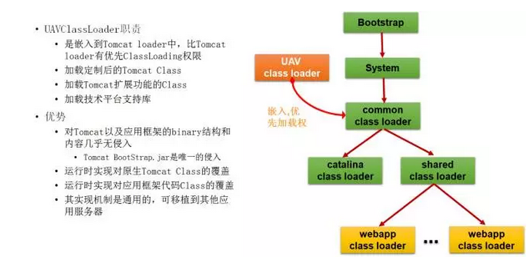

UAVClassLoader算法基本原理

UAVClassLoader创建时，将能够读取到的Class文件对应的Class名存储到ClassMap中

将TomcatLoader设置为UAVClassLoader的Parent

将UAVClassLoader设置为TomcatLoader的一个属性

重写TomcatLoader的loadClass方法

1、如果UseUAVClassLoaderFlag为true，则使用UAVClassLoader.loadClass

2、加载成功则返回Class

3、失败则使用TomcatLoader自己的loadClass

UAVClassLoader的LoadClass方法

1、如果ClassMap中含有要加载的Class，则使用自己的findClass加载Class

2、否则，将UseUAVClassLoaderFlag设置为false

3、使用TomcatLoader.loadClass（注：这时TomcatLoader会直接用自己的loadClass）

将UsePlusLoader Flag设置为true

具备中间件劫持能力之后，就可以进行应用画像和服务画像了。

JEE应用服务器的应用启动实际是Web容器的创建过程。在Tomcat中的StandardContext就是Web容器的根类，在其加载的时候，UAVClassLoader会感知，通过改写或bytecode weave手段在其start方法的最后植入代码，完成两个步骤：

收集将Web容器的上文信息：包括WebAppClassLoader实例、Context Path、应用名、ServletContext、BasePath（应用实际路径）、WorkDir（应用工作目录）等。

植入应用、服务画像的代码。

应用画像包含了应用相关信息的收集，下面列举几个关键画像信息：

应用标识（AppID）：先取部署的应用名（由应用服务器配置决定），如果应用名为空则取Context Path（通常可能就是war包的名字），应用标识对于应用实例自动归类有妙用，就是实现应用实例自动归类。

应用名称：使用WebAppClassLoader可以获得web.xml的路径，通过解析web.xml提取display-name（这个也是servlet规范），如果为空，则使用应用标识作为名称。

应用的URI：应用URI=http(s)://<本地IP>:<端口>/。本地IP的获取方式很多，这里不做说明；端口的获取是通过劫持CoyoteAdapter（启动监听的入口）来获得；Context Path已经获得。

应用的类库信息：通过WebAppClassLoader可以获取所有类库信息，通过类库信息可以掌握应用的技术栈，可以扩展做很多有趣的事情。

服务画像是按照技术规范（参见JEE应用的特点2），常见的技术规范：

Servlet规范

JAXWS规范

JAXRS规范

Spring规范

RMI规范

RPC规范（Netty，Thrift，Hessian等）

针对每种技术规范从3个方面进行收集：

Class和Method：通过Java的反射方式提取信息，如服务类名，方法名，入参出参。

Annotation：通过注解扫描工具提取具有相关注解的类，然后通过注解API提取注解信息。

部署描述符：通过WebAppClassLoader获取web.xml, spring-config.xml, log4j.xml等部署描述符文件路径，然后使用DOM解析提取关注的tag信息。

下面以Servlet为例对服务画像过程进行说明：

使用FastClasspathScanner（轻量的开源类扫描工具）将带有javax.servlet.annotation.WebServlet（ Servlet 3.0的注解类）的Class扫描，这个过程需要WebAppClassLoader支持。并提取注解的信息（比如urlPatterns，loadOnStartup）。

通过WebAppClassLoader获取应用的实际路径（BasePath），而web.xml就在/WEB-INF下，加载web.xml提取所有的元素值（就是servlet class），同时也提取,等元素值。

对通过注解获得的Servlet与通过web.xml获得的Servlet进行合并。

3.1 只有注解有或只有web.xml有的，直接保留。

3.2 web.xml与注解重叠的servlet，保留web.xml的信息（Servlet规范，部署描述符替换注解）

对Servlet画像数据进行整理

4.1 ServiceID：由Servlet Class定义，保证唯一性

4.2 Service URI：ServiceURI=<应用URI>+

JAXWS，JAXRS，SpringMVC等的画像过程基本一致，主要区别在第1步时，需要通过注解提取“服务接口的相对路径”信息。例如：

JAXWS需要服务名

ServiceURI=<应用URI>+<Servlet Url Pattern>+<JAXWS Service Name>

JAXRS或SpringMVC的每个服务接口路径都是到方法级的

ServiceURI=<应用URI>+<Servlet Url Pattern>+<Class的Path信息>+<Method的Path信息>

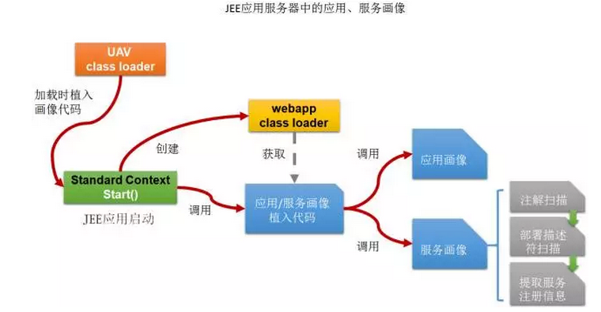

有同学可能会问：“讲了半天，虽然我们已经拿到了应用，服务的画像数据，哪服务注册是怎么发生的呢？”这个问题会在第三部分揭秘。

接下来，看看如何实现“无侵入”的应用服务监控。应用服务监控实际上是对应用实例，服务实例，服务接口的性能指标进行捕获的过程，常用的性能指标：响应时间，请求计数，错误计数，响应代码计数等等。这些值的捕获是发生在请求进入和出去的地方。

下图是JEE应用服务器的Http CallFlow展示了HTTP的请求响应过程：

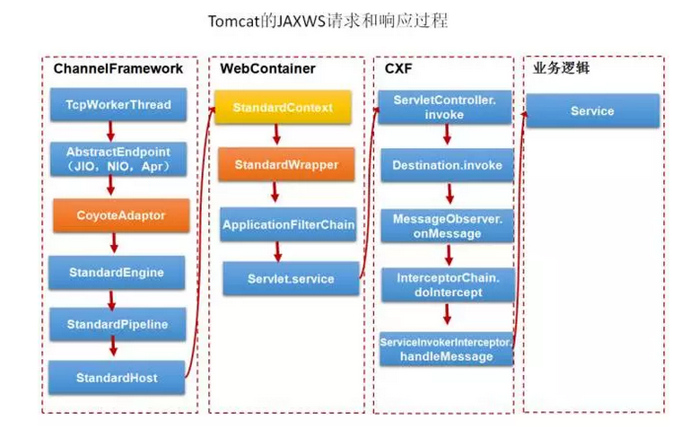

应用服务监控的落地方法：

运用中间件劫持技术改写CoyoteAdaptor.service()方法， 它负责整个Tomcat的请求处理，在方法开头拦截请求，方法结尾拦截响应。这里可以监控应用服务器，应用，所有的URL的性能指标。

运用中间件劫持技术改写StandardWrapper.service()方法，它负责Servlet的请求处理，同上如法炮制。这里可以监控所有Http服务的性能指标（参见JEE应用特点3）。

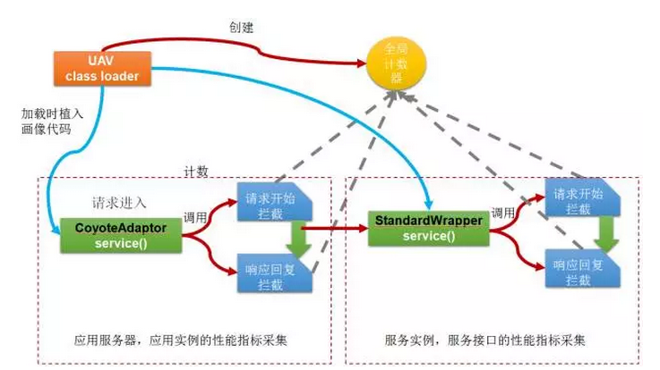

总结起来，通过中间件劫持和应用画像技术，可以轻松的实现对应用/服务的画像以及监控。由于Tomcat的服务器架构比较古老，所以我们采用了改写或bytecode weave的方式，但是也仅仅只是改写了Tomcat的3个方法。如果是Jetty，可以通过实现它的InterceptChain来实现，完全没有代码改写，只是增加了植入代码。而Jboss可以通过扩展它的listener来实现，也没有代码改写。

那么捕获到这些数据之后如何监控呢？这也会在第三部分解答。

无侵入模式引领统一服务治理

无侵入模式除了解决前面提到的诸多技术问题以外，还与我们自身的实际需要相关。

面临“微服务”的转型关口，但十年沉淀下来上百的系统也需要时间来逐步重构，这个过程可能很长。

各个系统虽然基本都是JAVA的，但是使用的JEE技术还是各有不同的，比如JAXWS，JAXRS，纯Servlet，SpringMVC，Thrift，SpringBoot等等。

系统架构差异大，包含单体架构，分布式服务架构，半SOA化架构，微服务架构。

系统的迭代很快，几乎每天都有更新，新型技术栈引入的可能不断增加。

从服务治理的角度，非统一的技术栈意味着像Dubbo之类统一技术栈的玩法不可行。所以“反转”这个思路，把从以服务调用技术栈为中心的治理方式转向以服务自动画像与注册为基础，逐步接管调用链路的治理方式。

而对JEE应用完全无侵入的模式恰好适应了这一需求。

我们的服务治理系统的代号叫无人机（UAV），寓意是无人机能够7*24的不间断巡航，随时随地收集地理，建筑，物品，人的变化，随时随地监控他们的行为，甚至精确的打击或操控。

我们把UAV定位为统一服务治理的模式，一种与“服务调用”技术栈基本无关的治理方法。

下图是UAV的架构图：

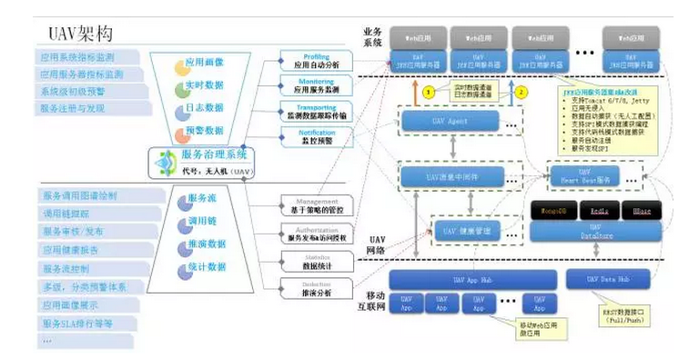

接下来解答第二部分遗留的两个问题：

收集了应用和服务画像之后，如何实现服务注册

捕获到监控数据之后如何监控呢

先来看看UAV的捕获流图：

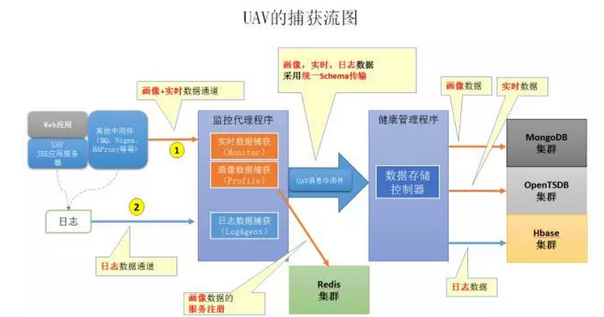

数据捕获步骤：

无论是画像数据，还是性能数据（实时数据）暂存在内存中。JEE应用服务器中可以暂存到MBean中

监控代理程序每隔5秒（可调节），采集Mbean中的画像和性能数据

监控代理程序将收集的数据发送给消息系统

健康管理程序负责各种数据落地

同时健康管理程序会提取服务实例以及接口的信息注册到缓存中，这个缓存作为服务注册的存储中心。由于每个一定周期（5秒）都有画像数据推送，也意味着维持了服务心跳

下面的图展示了实现细节：

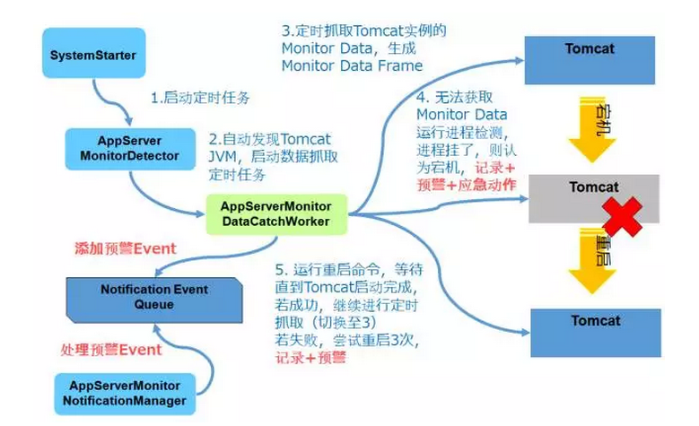

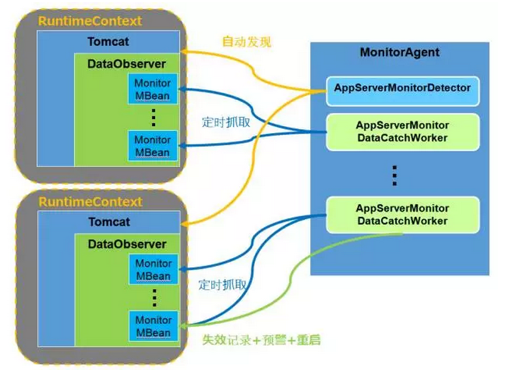

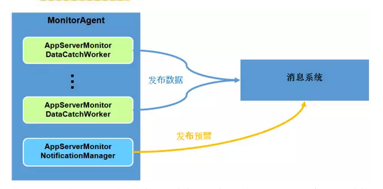

通过UAV的捕获流图，可以发现在数据传输格式上采用了统一的Schema，实现对画像数据，性能数据，日志数据的统一。这样不仅仅统一了三种数据的传输，也对实现后期数据的各种转换和处理提供了统一的处理模板，具有更好的扩展性。

下图是性能监控数据的Sample：

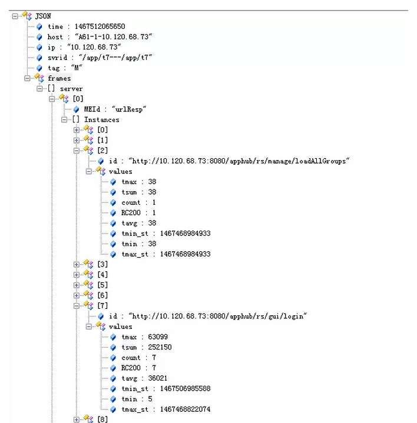

下图是画像数据的Sample：

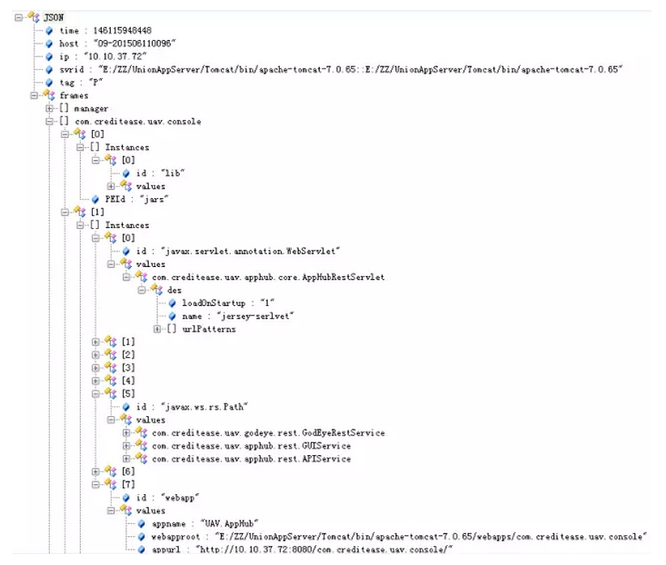

打破悖论：监控系统如何监控自己

监控系统通常都面临一个问题：如何监控自己。监控系统不能监控自己的原因也很明显，因为不能处理来自自身的异常。

其实破解之法也很直接，就是“冗余”。不过这里“冗余”不是简单的冗余资源，而是在处理机制上实现“冗余”。

破解之法：双通道+双心跳

UAV采用双通道+双心跳的方式：

双通道就是一条Http传输通道，用来传输容器/节点画像数据和监控数据；一条MQ传输通道，用来传输实时数据，画像数据，日志数据。

双心跳是指不管来自Http通道还是MQ通道的数据实际上即可以看成业务数据，也可以看成心跳数据（远端的节点还活着并且在工作）。

来自每个通道数据都会通过健康管理程序“签到”。因此UAV的任何节点（监控代理程序，健康管理程序）出现宕机，都能够被发现；并且它们的进程状态，应用状态也被自己监控。

这样的做法并不是为了冗余而冗余，而是有以下考虑：

从分布式系统的考虑，UAV实现了心跳服务，并且允许多活，也允许多级心跳上行，那么Http通信方式更加适合这样的场景；同时，Http通信意味着每次携带的数据payload不能太大，所以更适合容器，节点的画像和监控数据，这些数据以及指标比较固定。

应用，服务的个数是未知的，且无论是画像还是指标（性能，业务等）也可能很多，意味着数据payload可能较大，而MQ适合payload较大的场景；MQ可以一定程度保证数据有序，且队列可以暂时持久化数据，防止了由于接收端宕机导致的数据丢失；同时“多活”的消费者，可以动态扩展，也能在某些消费者宕机后，快速接替继续消费。

两种通信方式意味着更高的可靠性，即便当某些服务不可用时，监控系统的另一部分依然可以继续工作。例如如果UAV的实时数据服务都挂了，那么应用的性能数据就看不了，但是应用的进程（比如Tomcat）的性能数据还是能看的。

下面是一部分UAV实际监控的效果图。

应用容器监控：包含UAV节点，所有服务进程，JAVA进程的监控

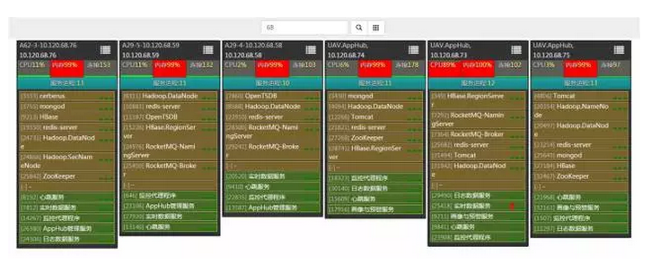

容器画像，UAV节点画像，进程画像

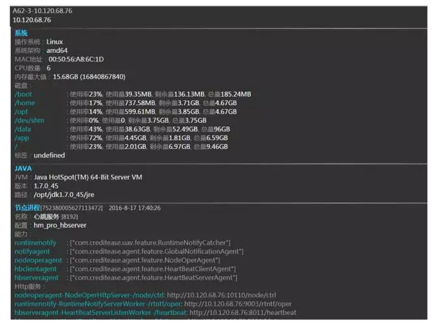

进程监控：Tomcat为例

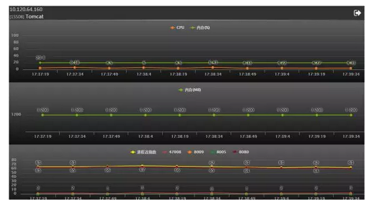

应用监控：应用，应用实例

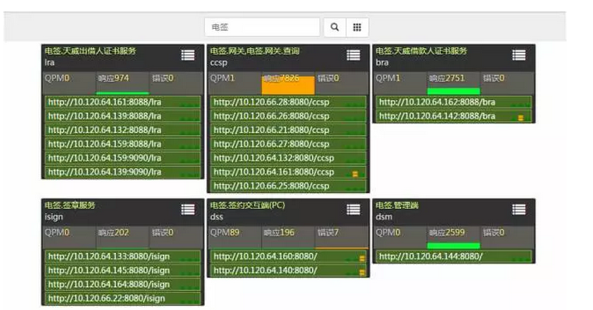

应用画像，服务画像

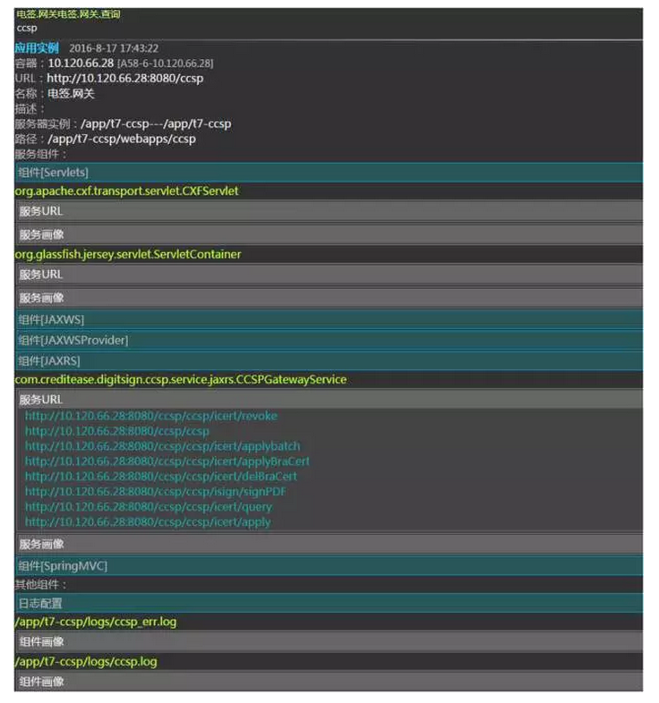

应用监控

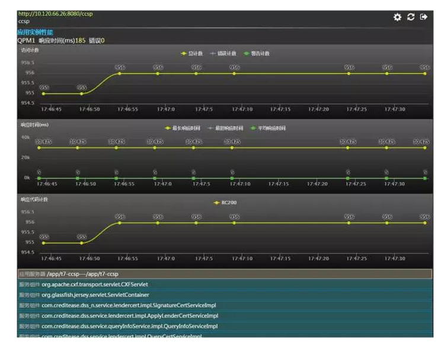

JEE应用服务器监控：

Tomcat为例

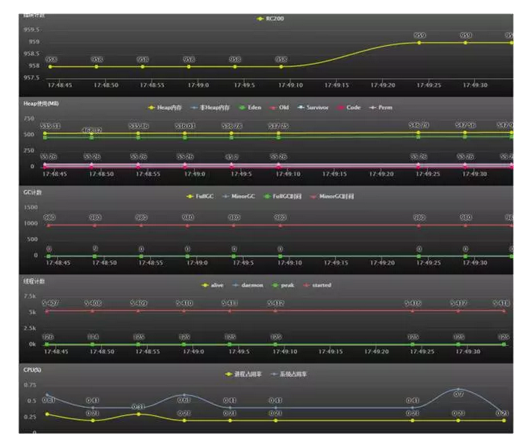

服务监控

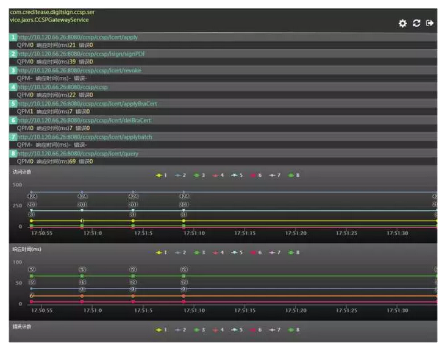

应用日志监控

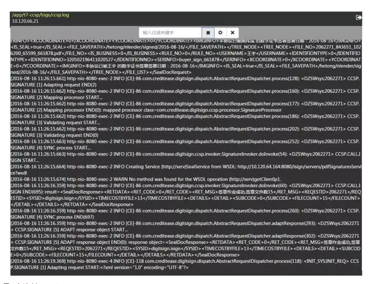

最后总结一下：

APM，服务治理监控，机房监控由于关注点不同，所以监控内容有差异，但也有交集。服务治理监控可以根据实际需要扩展外延到APM或机房监控的范畴。

“无侵入”应用服务监控的关键是实现中间件劫持和应用画像技术。

无侵入模式的玩法颠覆了传统以服务调用技术栈为中心的服务治理模式，可以容纳更多技术栈，具有更好的可扩展性，适合混合架构下的服务治理需要。

监控系统如何监控自己的破解之法就是实现双通道+双心跳，从容器、进程的角度，或从应用，服务的角度来两个维度来落地心跳和性能监控。

