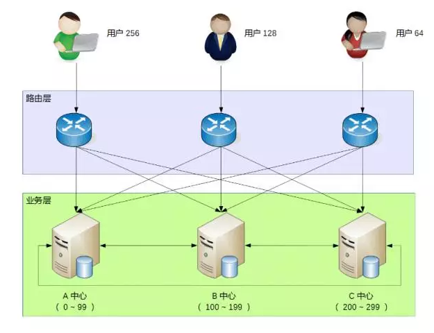
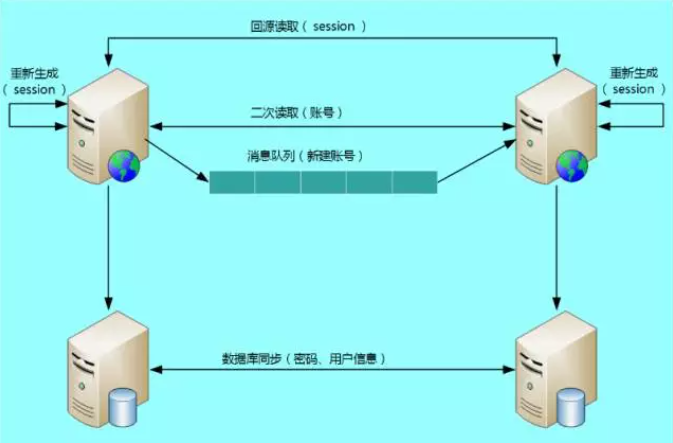

# (转载)异地多活设计难？其实是你陷入了这四大误区出不来

李运华  原文链接 http://mp.weixin.qq.com/s?__biz=MjM5MDE0Mjc4MA==&mid=2650993345&idx=1&sn=f460c51ad3dfd1da4d41e0a408969c54

```
“异地多活”的方案价值非常大，尤其是互联网行业，规模稍微大一点几乎都必须是标配；但同时大家都觉得“异地多活”的方案设计又很难，网络、数据、事务等各种问题混杂在一起，很多问题看似是无法解决的。但其实只要避开这几大思维误区，异地多活也没那么难
```

其实大部分问题我们之前也遇到过，这些问题当时也困扰着我们，后来我们经过讨论和思考，发现其实很多时候我们困扰的主要原因是**过于“追求完美的异地多活方案”**，这样导致“异地多活”设计中出现很多了的思维误区，而如果不意识到这些思维误区，就会陷入死胡同，导致无法实现真正的“异地多活”方案。

接下来我将总结常见的思维误区，看看你踩中了哪个坑？

*1*

**所有业务异地多活**

“异地多活”是为了保证业务的高可用，但很多朋友在考虑这个“业务”的时候，会不自觉的陷入**一个思维误区：我要保证所有业务的“异地多活”！**

比如说假设我们需要做一个“用户子系统”，这个子系统负责“注册”、“登录”、“用户信息”三个业务。为了支持海量用户，我们设计了一个“用户分区”的架构，即：正常情况下用户属于某个主分区，每个分区都有其它数据的备份，用户用邮箱或者手机号注册，路由层拿到邮箱或者手机号后，通过hash计算属于哪个中心，然后请求对应的业务中心。基本的架构如下：



考虑这样一个系统，如果3个业务要同时实现异地多活，我们会发现如下一些难以解决的问题：

**注册**

A中心注册了用户，数据还未同步到B中心，此时A中心宕机，为了支持注册业务多活，那我们可以挑选B中心让用户去重新注册。看起来很容易就支持多活了，但仔细思考一下会发现这样做会有问题：一个手机号只能注册一个账号，A中心的数据没有同步过来，B中心无法判断这个手机号是否重复，如果B中心让用户注册，后来A中心恢复了，发现数据有冲突，怎么解决？

实际上是无法解决的，因为注册账号不能说挑选最后一个生效；而如果B中心不支持本来属于A中心的业务进行注册，注册业务的双活又成了空谈。

有的朋友可能会说：那我修改业务规则，允许一个手机号注册多个账号不就可以了么？

这样做是不可行的，类似一个手机号只能注册一个账号这种规则，是核心业务规则，修改核心业务规则的代价非常大，几乎所有的业务都要重新设计，为了架构设计去改变业务规则，而且是这么核心的业务规则是得不偿失的。

**用户信息**

用户信息的修改和注册有类似的问题，即：A、B两个中心在异常的情况下都修改了用户信息，如何处理冲突？

由于用户信息并没有账号那么关键，一种简单的处理方式是按照时间合并，即：最后修改的生效。业务逻辑上没问题，但实际操作也有一个很关键的坑：怎么保证多个中心所有机器时间绝对一致？在异地多中心的网络下，这个是无法保证的，即使有时间同步也无法完全保证，只要两个中心的时间误差超过1s，数据就可能出现混乱，即：先修改的反而生效。

还有一种方式是生成全局唯一递增ID，这个方案的成本很高，因为这个全局唯一递增ID的系统本身又要考虑异地多活，同样涉及数据一致性和冲突的问题。

综合上面的简单分析，我们可以发现，如果“注册”“登录”、“用户信息”全部都要支持异地多活的话，实际上是挺难的，有的问题甚至是无解的。那这种情况下我们应该如何考虑“异地多活”的方案设计呢？答案其实很简单：**优先实现核心业务的异地多活方案！**

对于我们的这个模拟案例来说，“登录”才是最核心的业务，“注册”和“用户信息”虽然也是主要业务，但并不一定要实现异地多活。主要原因在于业务影响。对于一个日活1000万的业务来说，每天注册用户可能是几万，修改用户信息的可能还不到1万，但登录用户是1000万，很明显我们应该保证登录的异地多活。

对于新用户来说，注册不了影响并不很明显，因为他还没有真正开始业务；用户信息修改也类似，用户暂时修改不了用户信息，对于其业务不会有很大影响，而如果有几百万用户登录不了，就相当于几百万用户无法使用业务，对业务的影响就非常大了：公司的客服热线很快就被打爆了，微博微信上到处都在传业务宕机，论坛里面到处是在骂娘的用户，那就是互联网大事件了！

而登录实现“异地多活”恰恰是最简单的，因为每个中心都有所有用户的账号和密码信息，用户在哪个中心都可以登录。用户在A中心登录，A中心宕机后，用户到B中心重新登录即可。

有的朋友可能会问，如果某个用户在A中心修改了密码，此时数据还没有同步到B中心，用户到B中心登录是无法登录的，这个怎么处理？这个问题其实就涉及另外一个思维误区了，我们稍后再谈。

*2*

**实时一致性**

异地多活本质上是通过异地的数据冗余，来保证在极端异常的情况下业务也能够正常提供给用户，因此数据同步是异地多活设计方案的核心，但我们大部分人在考虑数据同步方案的时候，也会不知不觉的陷入**完美主义误区：我要所有数据都实时同步！**

数据冗余就要将数据从A地同步到B地，从业务的角度来看是越快越好，最好和本地机房一样的速度最好，但让人头疼的问题正在这里：异地多活理论上就不可能很快，因为这是物理定律决定的，即：光速真空传播是每秒30万公里，在光纤中传输的速度大约是每秒20万公里，再加上传输中的各种网络设备的处理，实际还远远达不到光速的速度。

除了距离上的限制外，中间传输各种不可控的因素也非常多，例如挖掘机把光纤挖断，中美海底电缆被拖船扯断、骨干网故障等，这些故障是第三方维护，我们根本无能为力也无法预知。例如广州机房到北京机房，正常情况下RTT大约是50ms左右，遇到网络波动之类的情况，RTT可能飙升到500ms甚至1s，更不用说经常发生的线路丢包问题，那延迟可能就是几秒几十秒了。

因此异地多活方案面临一个无法彻底解决的矛盾：业务上要求数据快速同步，物理上正好做不到数据快速同步，**因此所有数据都实时同步，实际上是一个无法达到的目标。**

既然是无法彻底解决的矛盾，那就只能想办法尽量减少影响。有几种方法可以参考：

> 1. 尽量减少异地多活机房的距离，搭建高速网络；
> 2. 尽量减少数据同步；
> 3. 保证最终一致性，不保证实时一致性；

**减少距离：同城多中心**

为了减少两个业务中心的距离，选择在同一个城市不同的区搭建机房，机房间通过高速网络连通，例如在北京的海定区和通州区各搭建一个机房，两个机房间采用高速光纤网络连通，能够达到近似在一个机房的性能。

这个方案的优势在于对业务几乎没有影响，业务可以无缝的切换到同城多中心方案；缺点就是无法应对例如新奥尔良全城被水淹，或者2003美加大停电这种极端情况。所以即使采用这种方案，也还必须有一个其它城市的业务中心作为备份，最终的方案同样还是要考虑远距离的数据传输问题。

**减少数据同步**

另外一种方式就是减少需要同步的数据。简单来说就是不重要的数据不要同步，同步后没用的数据不同步。

以前面的“用户子系统”为例，用户登录所产生的token或者session信息，数据量很大，但其实并不需要同步到其它业务中心，因为这些数据丢失后重新登录就可以了。

有的朋友会问：这些数据丢失后要求用户重新登录，影响用户体验的呀！

确实如此，毕竟需要用户重新输入账户和密码信息，或者至少要弹出登录界面让用户点击一次，但相比为了同步所有数据带来的代价，这个影响完全可以接受，其实这个问题也涉及了一个异地多活设计的典型思维误区，后面我们会详细讲到。

**保证最终一致性**

第三种方式就是业务不依赖数据同步的实时性，只要数据最终能一致即可。例如：A机房注册了一个用户，业务上不要求能够在50ms内就同步到所有机房，正常情况下要求5分钟同步到所有机房即可，异常情况下甚至可以允许1小时或者1天后能够一致。

**最终一致性在具体实现的时候，还需要根据不同的数据特征，进行差异化的处理，以满足业务需要。**例如对“账号”信息来说，如果在A机房新注册的用户5分钟内正好跑到B机房了，此时B机房还没有这个用户的信息，为了保证业务的正确，B机房就需要根据路由规则到A机房请求数据（这种处理方式其实就是后面讲的“二次读取”）。

而对“用户信息”来说，5分钟后同步也没有问题，也不需要采取其它措施来弥补，但还是会影响用户体验，即用户看到了旧的用户信息，这个问题怎么解决呢？这个问题实际上也涉及到了一个思维误区，在最后我们统一分析。

*3*

**只使用存储系统的同步功能**

数据同步是异地多活方案设计的核心，幸运的是基本上存储系统本身都会有同步的功能，例如MySQL的主备复制、Redis的Cluster功能、elasticsearch的集群功能。这些系统本身的同步功能已经比较强大，能够直接拿来就用，但这也无形中将我们引入了一个**思维误区：只使用存储系统的同步功能！**

既然说存储系统本身就有同步功能，而且同步功能还很强大，为何说只使用存储系统是一个思维误区呢？因为虽然绝大部分场景下，存储系统本身的同步功能基本上也够用了，但在某些比较极端的情况下，存储系统本身的同步功能可能难以满足业务需求。

以MySQL为例，MySQL5.1版本的复制是单线程的复制，在网络抖动或者大量数据同步的时候，经常发生延迟较长的问题，短则延迟十几秒，长则可能达到十几分钟。而且即使我们通过监控的手段知道了MySQL同步时延较长，也难以采取什么措施，只能干等。

Redis又是另外一个问题，Redis 3.0之前没有Cluster功能，只有主从复制功能，而为了设计上的简单，Redis主从复制有一个比较大的隐患：从机宕机或者和主机断开连接都需要重新连接主机，重新连接主机都会触发全量的主从复制，这时候主机会生成内存快照，主机依然可以对外提供服务，但是作为读的从机，就无法提供对外服务了，如果数据量大，恢复的时间会相当的长。

综合上述的案例可以看出，存储系统本身自带的同步功能，在某些场景下是无法满足我们业务需要的。尤其是异地多机房这种部署，各种各样的异常都可能出现，当我们只考虑存储系统本身的同步功能时，就会发现无法做到真正的异地多活。

**解决的方案就是拓开思路，避免只使用存储系统的同步功能，可以将多种手段配合存储系统的同步来使用**，甚至可以不采用存储系统的同步方案，改用自己的同步方案。

例如，还是以前面的“用户子系统”为例，我们可以采用如下几种方式同步数据：

1. 消息队列方式：对于账号数据，由于账号只会创建，不会修改和删除（假设我们不提供删除功能），我们可以将账号数据通过消息队列同步到其它业务中心。
2. 二次读取方式：某些情况下可能出现消息队列同步也延迟了，用户在A中心注册，然后访问B中心的业务，此时B中心本地拿不到用户的账号数据。为了解决这个问题，B中心在读取本地数据失败的时候，可以根据路由规则，再去A中心访问一次（这就是所谓的二次读取，第一次读取本地，本地失败后第二次读取对端），这样就能够解决异常情况下同步延迟的问题。
3. 存储系统同步方式：对于密码数据，由于用户改密码频率较低，而且用户不可能在1s内连续改多次密码，所以通过数据库的同步机制将数据复制到其它业务中心即可，用户信息数据和密码类似。
4. 回源读取方式：对于登录的session数据，由于数据量很大，我们可以不同步数据；但当用户在A中心登录后，然后又在B中心登录，B中心拿到用户上传的session id后，根据路由判断session属于A中心，直接去A中心请求session数据即可，反之亦然，A中心也可以到B中心去拿取session数据。
5. 重新生成数据方式：对于第4中场景，如果异常情况下，A中心宕机了，B中心请求session数据失败，此时就只能登录失败，让用户重新在B中心登录，生成新的session数据。

（注意：以上方案仅仅是示意，实际的设计方案要比这个复杂一些，还有很多细节要考虑）

综合上述的各种措施，最后我们的“用户子系统”同步方式整体如下：



*4*

**100%可用性**

前面我们在给出每个思维误区对应的解决方案的时候，其实都遗留了一些小尾巴：某些场景下我们无法保证100%的业务可用性，总是会有一定的损失。例如密码不同步导致无法登录、用户信息不同步导致用户看到旧的用户信息等等，这个问题怎么解决？

其实这个问题涉及异地多活设计方案中一个**典型的思维误区：我要保证业务100%可用！**但极端情况下就是会丢一部分数据，就是会有一部分数据不能同步，怎么办呢，有没有什么巧妙和神通的办法能做到？

很遗憾，答案是没有！异地多活也无法保证100%的业务可用，这是由物理规律决定的，光速和网络的传播速度、硬盘的读写速度、极端异常情况的不可控等，都是无法100%解决的。所以针对这个思维误区，**我的答案是“忍”！也就是说我们要忍受这一小部分用户或者业务上的损失**，否则本来想为了保证最后的0.01%的用户的可用性，做个完美方案，结果却发现99.99%的用户都保证不了了。

对于某些实时强一致性的业务，实际上受影响的用户会更多，甚至可能达到1/3的用户。以银行转账这个业务为例，假设小明在北京XX银行开了账号，如果小明要转账，一定要北京的银行业务中心是可用的，否则就不允许小明自己转账。

如果不这样的话，假设在北京和上海两个业务中心实现了实时转账的异地多活，某些异常情况下就可能出现小明只有1万存款，他在北京转给了张三1万，然后又到上海转给了李四1万，两次转账都成功了。这种漏洞如果被人利用，后果不堪设想。

当然，针对银行转账这个业务，可以有很多特殊的业务手段来实现异地多活。例如分为“实时转账”和“转账申请”。

实时转账就是我们上述的案例，是无法做到“异地多活”的；但“转账申请”是可以做到“异地多活”的，即：小明在上海业务中心提交转账请求，但上海的业务中心并不立即转账，而是记录这个转账请求，然后后台异步发起真正的转账操作，如果此时北京业务中心不可用，转账请求就可以继续等待重试；假设等待2个小时后北京业务中心恢复了，此时上海业务中心去请求转账，发现余额不够，这个转账请求就失败了。

小明再登录上来就会看到转账申请失败，原因是“余额不足”。不过需要注意的是“转账申请”的这种方式虽然有助于实现异地多活，但其实还是牺牲了用户体验的，对于小明来说，本来一次操作的事情，需要分为两次：一次提交转账申请，另外一次要确认是否转账成功。

虽然我们无法做到100%可用性，但并不意味着我们什么都不能做，为了让用户心里更好受一些，我们可以采取一些措施进行安抚或者补偿，例如：

1. **挂公告：**说明现在有问题和基本的问题原因，如果不明确原因或者不方便说出原因，可以说“技术哥哥正在紧急处理”比较轻松和有趣的公告。
2. **事后对用户进行补偿：**例如送一些业务上可用的代金券、小礼包等，降低用户的抱怨。
3. **补充体验：**对于为了做异地多活而带来的体验损失，可以想一些方法减少或者规避。以“转账申请”为例，为了让用户不用确认转账申请是否成功，我们可以在转账成功或者失败后直接给用户发个短信，告诉他转账结果，这样用户就不用不时的登录系统来确认转账是否成功了。

*5*

**一句话谈“异地多活”**

综合前面的分析，异地多活设计的理念可以总结为一句话：**采用多种手段，保证绝大部分用户的核心业务异地多活！**