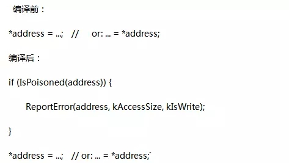
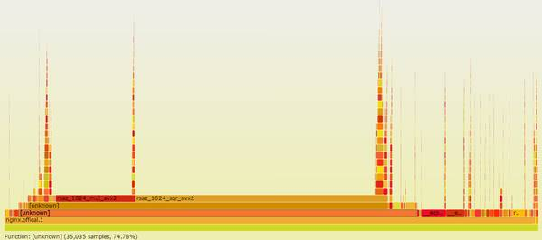

## (转载)腾讯高级工程师：一道面试题引发的高并发性能调试思考

罗成  原文链接 http://dbaplus.cn/news-21-625-1.html


4月份的时候看到一道面试题，据说是腾讯校招面试官提的：**在多线程和高并发环境下，如果有一个平均运行一百万次才出现一次的bug，你如何调试这个bug？**

遗憾的是知乎很多答案在抨击这道题本身的正确性，虽然我不是这次的面试官，但我认为这是一道非常好的面试题。当然，只是道加分题，答不上，不扣分。答得不错，说明解决问题的思路和能力要超过应届生平均水平。

之所以写上面这段，是因为我觉得大部分后台服务端开发都有可能遇到这样的BUG，即使没有遇到，这样的题目也能够激发大家不断思考和总结。非常凑巧的是，我在4月份也遇到了一个类似的而且要更加严重的BUG，这是我自己挖的一个很深的坑，不填好，整个项目就无法上线。

现在已经过去了一个多月，趁着有时间，自己好好总结一下，希望里面提到的一些经验和工具能够带给大家一点帮助。

### 项目背景

我们针对Nginx事件框架和openssl协议栈进行了一些深度改造，以提升Nginx的HTTPS完全握手计算性能。

由于原生Nginx使用本地CPU做RSA计算，ECDHE_RSA算法的单核处理能力只有400 qps左右。前期测试时的并发性能很低，就算开了24核，性能也无法超过1万。

核心功能在去年底就完成了开发，线下测试也没有发现问题。经过优化后的性能提升几倍，为了测试最大性能，使用了很多客户端并发测试https性能。很快就遇到了一些问题：

**1、第一个问题是Nginx有极低概率（亿分之一）在不同地方core dump。**白天线下压力测试2W qps一般都要两三个小时才出一次core。每次晚上睡觉之前都会将最新的调试代码编译好并启动测试，到早上醒来第一眼就会去查看机器并祈祷不要出core，不幸的是，一般都会有几个到几十个core，并且会发现经常是在一个时间点集中core dump。线上灰度测试运行了6天，在第6天的早上才集中core dump了几十次。这样算来，这个core dump的概率至少是亿分之一了。 不过和面试题目中多线程不同的是，Nginx采用的是多进程+全异步事件驱动的编程模式（目前也支持了多线程，但只是针对IO的优化，核心机制还是多进程加异步）。在webserver的实现背景下，多进程异步相比多线程的优点是性能高，没有太多线程间的切换，而且内存空间独立，省去线程间锁的竞争。当然也有缺点，就是异步模式编程非常复杂，将一些逻辑上连续的事件从空间和时间切割，不符合人的正常思考习惯，出了问题后比较难追查。另外异步事件对网络和操作系统的底层知识要求较高，稍不小心就容易挖坑。

**2、第二个问题是高并发时Nginx存在内存泄漏。**在流量低的时候没有问题，加大测试流量就会出现内存泄漏。

**3、第三个问题，因为我们对Nginx和openssl的关键代码都做了一些改造，希望提升它的性能。**那么如何找到性能热点和瓶颈并持续优化呢？

其中第一和第二个问题的背景都是，只有并发上万qps以上时才有可能出现，几百或者一两千qps时，程序没有任何问题。

### core dump的调试

首先说一下core的解决思路，主要是如下几点：

- gdb及Debug log定位，发现作用不大。
- 如何重现BUG？
- 构造高并发压力测试系统。
- 构造稳定的异常请求。

### gdb及Debug log效率太低

因为有core dump ，所以这个问题初看很容易定位。gdb找到core dump点，btrace就能知道基本的原因和上下文了。 

core的直接原因非常简单和常见，**全部都是NULL指针引用导致的**。不过从函数上下文想不通为什么会出现NULL值，因为这些指针在原生Nginx的事件和模块中都是这么使用的，不应该在这些地方变成NULL。由于暂时找不到根本原因，还是先解决core dump吧，修复办法也非常简单，直接判断指针是否NULL，如果是NULL就直接返回，不引用不就完事了，这个地方以后肯定不会出CORE了。

这样的防守式编程并不提倡，指针NULL引用如果不core dump，而是直接返回，那么这个错误很有可能会影响用户的访问，同时这样的BUG还不知道什么时候能暴露。所以core dump在NULL处，其实是非常负责任和有效的做法。

在NULL处返回，确实避免了在这个地方的core，但是过几个小时又core在了另外一个NULL指针引用上。于是我又继续加个判断并避免NULL指针的引用。**悲剧的是，过了几个小时，又CORE出现在了其他地方**，就这样过了几天，我一直在想为什么会出现一些指针为NULL的情况？为什么会core在不同地方？为什么我用浏览器和curl这样的命令工具访问却没有任何问题？

熟悉Nginx代码的同学应该很清楚，Nginx极少在函数入口及其他地方判断指针是否为NULL值。特别是一些关键数据结构，比如‘ngx_connection_t’及SSL_CTX等，在请求接收的时候就完成了初始化，所以不可能在后续正常处理过程中出现NULL的情况。

于是我更加迷惑，显然NULL值导致出core只是表象，真正的问题是，这些关键指针为什么会被赋值成NULL？ 

这个时候异步事件编程的缺点和复杂性就暴露了，好好的一个客户端的请求，从逻辑上应该是连续的，但是被读写及时间事件拆成了多个片断。虽然GDB能准确地记录core dump时的函数调用栈，但是却无法准确记录一条请求完整的事件处理栈。根本就不知道上次是哪个事件的哪些函数将这个指针赋值为NULL的，甚至都不知道这些数据结构上次被哪个事件使用了。

**举个例子：**客户端发送一个正常的get请求，由于网络或者客户端行为，需要发送两次才完成。服务端第一次read没有读取完全部数据，这次读事件中调用了 A，B函数，然后事件返回。第二次数据来临时，再次触发read事件，调用了A，C函数。并且core dump在了C函数中。这个时候，btrace的stack frame已经没有B函数调用的信息了。

所以**通过GDB无法准确定位 core 的真正原因**。

### log Debug的新尝试

这时候强大的GDB已经派不上用场了。怎么办？打印Nginx调试日志。 

但是打印日志也很郁闷，只要将Nginx的日志级别调整到Debug，core就无法重现。为什么？因为Debug的日志信息量非常大，频繁地写磁盘严重影响了Nginx的性能，打开Debug后性能由几十万直线下降到几百qps。 

调整到其他级别比如 INFO，性能虽然好了，但是日志信息量太少，没有帮助。尽管如此，日志却是个很好的工具，于是又尝试过以下办法：

1. 针对特定客户端IP开启Debug日志，比如IP是10.1.1.1就打印Debug，其他IP就打印最高级别的日志，Nginx本身就支持这样的配置。
2. 关闭Debug日志，自己在一些关键路径添加高级别的调试日志，将调试信息通过EMERG级别打印出来。
3. Nginx只开启一个进程和少量的connection数。抽样打印连接编号（比如尾号是1）的调试日志。

总体思路依然是在不明显降低性能的前提下打印尽量详细的调试日志，遗憾的是，上述办法还是不能帮助问题定位，当然了，在不断的日志调试中，对代码和逻辑越来越熟悉。

### BUG如何重现？

这时候的调试效率已经很低了，几万QPS连续压力测试，几个小时才出一次core，然后修改代码，添加调试日志。几天过去了，毫无进展。所以必须要在线下构造出稳定的core dump环境，这样才能加快Debug效率。

虽然还没有发现根本原因，但是发现了一个很可疑的地方： **出core比较集中，经常是在凌晨4、5点，早上7、8点的时候dump几十个core。**

### 弱网络环境的构造 traffic control

联想到夜间有很多的网络硬件调整及故障，我猜测这些core dump可能跟网络质量相关。**特别是网络瞬时不稳定，很容易触发BUG导致大量的CORE DUMP。**

最开始我考虑过使用TC(traffic control)工具来构造弱网络环境，但是转念一想，弱网络环境导致的结果是什么？显然是网络请求的各种异常啊,所以还不如直接构造各种异常请求来复现问题。于是准备构造测试工具和环境，需要满足两个条件：

1. 并发性能强，能够同时发送数万甚至数十万级以上qps。
2. 请求需要一定概率的异常。特别是TCP握手及SSL握手阶段，需要异常中止。

**traffic control是一个很好的构造弱网络环境的工具**，我之前用过测试SPDY协议性能。能够控制网络速率、丢包率、延时等网络环境，作为iproute工具集中的一个工具，由linux系统自带。但比较麻烦的是TC的配置规则很复杂，facebook在tc的基础上封装成了一个开源工具apc，有兴趣的可以试试。

### WRK压力测试工具

由于高并发流量时才可能出core，所以首先就需要找一个性能强大的压测工具。 

WRK是一款非常优秀的开源HTTP压力测试工具，采用多线程 + 异步事件驱动的框架，其中事件机制使用了redis的ae事件框架，协议解析使用了Nginx的相关代码。 

相比ab（apache bench）等传统压力测试工具的优点就是性能好，基本上单台机器发送几百万pqs，打满网卡都没有问题。 

wrk的缺点就是只支持HTTP类协议，不支持其他协议类测试，比如protobuf，另外数据显示也不是很方便。

Nginx的测试用法： wrk -t500 -c2000 -d30s https://127.0.0.1:8443/index.html

### 分布式自动测试系统的构建

由于是HTTPS请求，使用ECDHE_RSA密钥交换算法时，客户端的计算消耗也比较大，单机也就10000多qps。也就是说如果server的性能有3W qps，那么一台客户端是无法发送这么大的压力的，所以需要构建一个多机的分布式测试系统，即通过中控机同时控制多台测试机客户端启动和停止测试。

之前也提到了，调试效率太低，整个测试过程需要能够自动化运行，比如晚上睡觉前，可以控制多台机器在不同的协议，不同的端口，不同的cipher suite运行整个晚上。白天因为一直在盯着，运行几分钟就需要查看结果。

这个系统有如下功能： 

1. 并发控制多台测试客户端的启停，最后汇总输出总的测试结果。 
2. 支持https，http协议测试，支持webserver及revers proxy性能测试。 
3. 支持配置不同的测试时间、端口、URL。 
4. 根据端口选择不同的SSL协议版本，不同的cipher suite。 
5. 根据URL选择webserver、revers proxy模式。

### 异常测试请求的构造

压力测试工具和系统都准备好了，还是不能准确复现core dump的环境。接下来还要完成异常请求的构造。构造哪些异常请求呢？ 

由于新增的功能代码主要是和SSL握手相关，这个过程是紧接着TCP握手发生的，所以异常也主要发生在这个阶段。于是我考虑构造了如下三种异常情形：

1. **异常的tcp连接。**即在客户端tcp connent系统调用时，10%概率直接close这个socket。
2. **异常的ssl连接。**考虑两种情况，full handshake第一阶段时，即发送client hello时，客户端10%概率直接close连接。full handshake第二阶段时，即发送clientKeyExchange时，客户端10%概率直接直接关闭TCP连接。
3. **异常的HTTPS请求**，客户端10%的请求使用错误的公钥加密数据，这样Nginx解密时肯定会失败。

### Core Bug fix小结

构造好了上述高并发压力异常测试系统，果然，几秒钟之内必然出core。有了稳定的测试环境，那Bug fix的效率自然就会快很多。 

虽然此时通过gdb还是不方便定位根本原因，但是测试请求已经满足了触发core的条件，打开Debug调试日志也能触发core dump。于是可以不断地修改代码，不断地GDB调试，不断地增加日志，一步步地追踪根源，一步步地接近真相。

最终通过不断地重复上述步骤找到了core dump的根本原因。其实在写总结文档的时候，core dump的根本原因是什么已经不太重要，最重要的还是解决问题的思路和过程，这才是值得分享和总结的。很多情况下，千辛万苦排查出来的，其实是一个非常明显甚至愚蠢的错误。

**比如这次core dump的主要原因是： **
由于没有正确地设置non-reusable，并发量太大时，用于异步代理计算的connection结构体被Nginx回收并进行了初始化，从而导致不同的事件中出现NULL指针并出core。

 

### 内存泄漏

虽然解决了core dump，但是另外一个问题又浮出了水面，就是**高并发测试时，会出现内存泄漏，大概一个小时500M的样子****。**

### valgrind的缺点

出现内存泄漏或者内存问题，大家第一时间都会想到**valgrind。**

valgrind是一款非常优秀的软件，不需要重新编译程序就能够直接测试。功能也非常强大，能够检测常见的内存错误包括内存初始化、越界访问、内存溢出、free错误等都能够检测出来。推荐大家使用。

valgrind运行的基本原理是： **待测程序运行在valgrind提供的模拟CPU上，valgrind会纪录内存访问及计算值，最后进行比较和错误输出。**

我通过valgrind测试Nginx也发现了一些内存方面的错误，简单分享下valgrind测试Nginx的经验：

1. Nginx通常都是使用master fork子进程的方式运行，使用–trace-children=yes来追踪子进程的信息
2. 测试Nginx + openssl时，在使用rand函数的地方会提示很多内存错误。比如Conditional jump or move depends on uninitialised value，Uninitialised value was created by a heap allocation等。这是由于rand数据需要一些熵，未初始化是正常的。如果需要去掉valgrind提示错误，编译时需要加一个选项：-DPURIFY
3. 如果Nginx进程较多，比如超过4个时，会导致valgrind的错误日志打印混乱，尽量减小Nginx工作进程,保持为1个。因为一般的内存错误其实和进程数目都是没有关系的。

上面说了valgrind的功能和使用经验，但是valgrind也有一个非常大的缺点，**就是它会显著降低程序的性能，官方文档说使用memcheck工具时，降低10-50倍**。

也就是说，如果Nginx完全握手性能是20000 qps，那么使用valgrind测试，性能就只有400 qps左右。对于一般的内存问题，降低性能没啥影响，但是我这次的内存泄漏是在大压力测试时才可能遇到的，如果性能降低这么明显，内存泄漏的错误根本检测不出来。

只能再考虑其他办法了。

### AddressSanitizer的优点

address sanitizer（简称asan）是一个用来检测c/c++程序的快速内存检测工具。相比valgrind的优点就是速度快，官方文档介绍对程序性能的降低只有2倍。 

对Asan原理有兴趣的同学可以参考asan的算法这篇文章，它的实现原理就是在程序代码中插入一些自定义代码，如下：



和valgrind明显不同的是，asan需要添加编译开关重新编译程序，好在不需要自己修改代码。而valgrind不需要编程程序就能直接运行。 

address sanitizer集成在了clang编译器中，GCC 4.8版本以上才支持。我们线上程序默认都是使用gcc4.3编译，于是我测试时直接使用clang重新编译Nginx：

```
--with-cc="clang" \
--with-cc-opt="-g -fPIC -fsanitize=address -fno-omit-frame-pointer"

其中with-cc是指定编译器，with-cc-opt指定编译选项， -fsanitize=address就是开启AddressSanitizer功能。
```

由于AddressSanitizer对Nginx的影响较小，所以大压力测试时也能达到上万的并发，内存泄漏的问题很容易就定位了。

这里就不详细介绍内存泄漏的原因了，因为跟openssl的错误处理逻辑有关，是我自己实现的，没有普遍的参考意义。 

**最重要的是，知道valgrind和asan的使用场景和方法，遇到内存方面的问题能够快速修复。**

### 性能热点分析

到此，经过改造的Nginx程序没有core dump和内存泄漏方面的风险了。但这显然不是我们最关心的结果（因为代码本该如此），我们最关心的问题是：

1. 代码优化前，程序的瓶颈在哪里？能够优化到什么程度？ 
2. 代码优化后，优化是否彻底？会出现哪些新的性能热点和瓶颈？ 

这个时候我们就需要一些工具来检测程序的性能热点。

perf，oprofile，gprof，systemtap

Linux世界有许多非常好用的性能分析工具，我挑选几款最常用的简单介绍下： 

1. **[perf](Perf Wiki)**应该是最全面最方便的一个性能检测工具。由linux内核携带并且同步更新，基本能满足日常使用。推荐大家使用。 
2. **oprofile**，我觉得是一个较过时的性能检测工具了，基本被perf取代，命令使用起来也不太方便。比如opcontrol --no-vmlinux , opcontrol --init等命令启动，然后是opcontrol --start， opcontrol --dump， opcontrol -h停止，opreport查看结果等，一大串命令和参数。有时候使用还容易忘记初始化，数据就是空的。 
3. **gprof**主要是针对应用层程序的性能分析工具，缺点是需要重新编译程序，而且对程序性能有一些影响。不支持内核层面的一些统计，优点就是应用层的函数性能统计比较精细，接近我们对日常性能的理解，比如各个函数时间的运行时间，，函数的调用次数等，很人性易读。 
4. **systemtap **其实是一个运行时程序或者系统信息采集框架，主要用于动态追踪，当然也能用做性能分析，功能最强大，同时使用也相对复杂。不是一个简单的工具，可以说是一门动态追踪语言。**如果程序出现非常麻烦的性能问题时，推荐使用systemtap。**

这里再多介绍一下perf命令，Linux系统上默认都有安装，比如通过perf top就能列举出当前系统或者进程的热点事件，函数的排序。 

perf record能够纪录和保存系统或者进程的性能事件，用于后面的分析，比如接下去要介绍的火焰图。

### 火焰图 flame graph

perf有一个缺点就是不直观。火焰图就是为了解决这个问题。它能够以矢量图形化的方式显示事件热点及函数调用关系。 

比如我通过如下几条命令就能绘制出原生Nginx在ecdhe_rsa cipher suite下的性能热点：

1. perf record -F 99 -p PID -g -- sleep 10
2. perf script | ./stackcollapse-perf.pl > out.perf-folded
3. /flamegraph.pl out.perf-folded>ou.svg



直接通过火焰图就能看到各个函数占用的百分比，比如上图就能清楚地知道rsaz_1024_mul_avx2和rsaz_1024_sqr_avx2函数占用了75%的采样比例。那我们要优化的对象也就非常清楚了，能不能避免这两个函数的计算？或者使用非本地CPU方案实现它们的计算？ 

当然是可以的，我们的异步代理计算方案正是为了解决这个问题。


从上图可以看出，热点事件里已经没有RSA相关的计算了。至于是如何做到的，后面有时间再写专门的文章来分享。

心态

为了解决上面提到的core dump和内存泄漏问题，花了大概三周左右时间。压力很大，精神高度紧张， 说实话有些狼狈，看似几个很简单的问题，搞了这么长时间。心里当然不是很爽，会有些着急，特别是项目的关键上线期。但即使这样，整个过程我还是非常自信并且斗志昂扬。我一直在告诉自己：

1. **调试BUG是一次非常难得的学习机会，不要把它看成是负担。**不管是线上还是线下，能够主动地，高效地追查BUG特别是有难度的BUG，对自己来说一次非常宝贵的学习机会。面对这么好的学习机会，自然要充满热情，要如饥似渴，回首一看，如果不是因为这个BUG，我也不会对一些工具有更深入地了解和使用，也就不会有这篇文档的产生。
2. **不管什么样的BUG，随着时间的推移，肯定是能够解决的。**这样想想，其实会轻松很多，特别是接手新项目，改造复杂工程时，由于对代码，对业务一开始并不是很熟悉，需要一个过渡期。但关键是，你要把这些问题放在心上。白天上班有很多事情干扰，上下班路上，晚上睡觉前，大脑反而会更加清醒，思路也会更加清晰。特别是白天上班时容易思维定势，陷入一个长时间的误区，在那里调试了半天，结果大脑一片混沌。睡觉前或者上下班路上一个人时，反而能想出一些新的思路和办法。
3. **开放地讨论。**遇到问题不要不好意思，不管多简单，多低级，只要这个问题不是你google一下就能得到的结论，大胆地，认真地和组内同事讨论。这次BUG调试，有几次关键的讨论给了我很大的启发，特别是最后reusable的问题，也是组内同事的讨论才激发了我的灵感。谢谢大家的帮助。