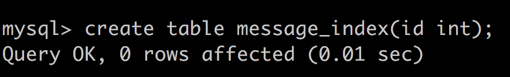
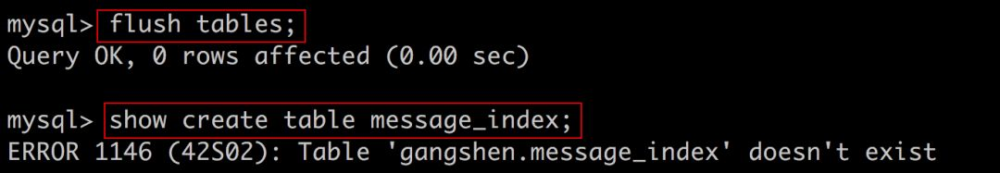
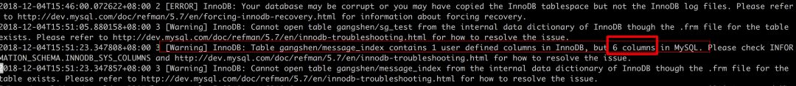
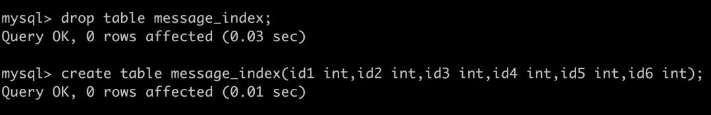

# (转载)通过ibd和frm文件恢复数据

沈刚 原文链接 http://www.woqutech.com/docs_info.php?id=383


**一、背景**
**1.1、需求来源**
需要给客户将生产环境的数据恢复到测试环境，但是线上环境的xtrabackup全备数据量太大，拷贝下来比较麻烦，并且需要恢复的数据只有整库中的两张表的数据，所以客户只是将全备中的对应表的ibd文件以及frm文件拷贝下来了，要求根据ibd文件以及frm文件进行数据恢复。

**1.2、环境介绍**
数据库版本：MySQL-5.7.22
数据库要求：innodb_file_per_table=1

**二、解决方案步骤**
**2.1、准备工作**
准备好需要进行数据恢复的表ibd文件以及frm文件

安装一个新的MySQL实例

innodb_file_per_table
安装步骤省略

**2.2、表结构恢复**
在数据库中创建一张表名与被恢复表表名一致的表，表结构不限制



使用被恢复的frm文件替换新创建的同名表的frm文件

```
# cp /data2/message_index.frm ./
cp：是否覆盖"./message_index.frm"？ y
# chown -R mysql:mysql ./*
```

在数据库中执行show create table语句

注意需要在show create table 查看表结构之前执行flush tables语句，因为如果message_index表之前被打开过，那么表结构会被缓存在内存中，show create table不会报错，也就无法从错误日志 中拿到我们需要的信息。



查看error.log，获取被恢复表的字段数
错误日志中会打印我们需要恢复的表的字段数，这边可以看到我们需要恢复的表中含有6个字段



删除message_index表，并重新创建message_index表
从上面的步骤中我们知道被恢复表中含有6个字段，所以重新创建的message_index表需要含有6个字段，字段名以及字段类型不限制



再次使用被恢复的frm文件替换新创建的同名表的frm文件

```
# cp /data2/message_index.frm ./
cp：是否覆盖"./message_index.frm"？ y
# chown -R mysql:mysql ./*
```

在MySQL配置文件中添加innodb_force_recovery=6，并重启数据库

通过show create table \G 语句拿到message_index表的表结构

至此，我们就拿到了我们需要进行恢复的表的表结构。

**2.3、表数据恢复**
拿到表结构之后，表数据恢复步骤相对表结构恢复步骤而言会简单一些

将innodb_force_recovery=6从配置文件中注释，重启数据库

拿到message_index表的表结构后，把原来的表清理，再根据表结构新建这个表

```
mysql> drop table message_index;
mysql> CREATE TABLE `message_index` ( *******); -- 根据上面的表结构创建表，现在是空表，只有结构没数据
mysql> select * from message_index;
Empty set (0.00 sec)
```

执行alter table discard tablespace语句

```
mysql> alter table message_index discard tablespace;
```

将要恢复的表的ibd文件拷贝到当前库下，并更改属主以及属组

```
# cp /data2/message_index.ibd ./
# chown -R mysql:mysql ./*
```

执行alter table import tablespace语句

```
mysql> alter table message_index import tablespace;
mysql> select count(*) from message_index;
```

可以看到数据已经都恢复回来了。

**三、总结**
以上我们通过xtrabackup全备中的ibd文件以及frm文件恢复了数据，这样也就代表着xtrabackup就算备份失败，只要有部分ibd文件以及frm文件保证完好，MySQL也是可以进行数据恢复的，在极端情况下也能尽可能地减少损失。但是由于xtrabackup是通过记录redo日志的方式来保存备份过程中产生的增量数据，这一部分增量数据目前还没有办法恢复。