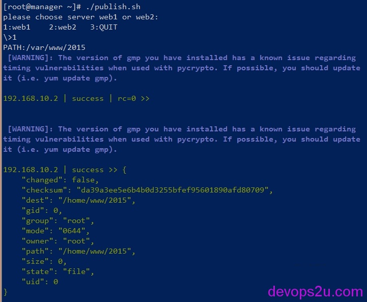

# ansible的入门帮助-命令查找与使用

### 说明

Ansible – IT高度自动化工具。可以做系统配置、软件部署、管理运行很多高级的自定义任务，比如连续发布、无感知自动更新。

Ansible的目标是最简单和最易用。也相当关注安全性和可靠性,他使用Open SSh来做管理(加速套接字模式和拉取模式选择),就算不熟悉程序，也可以使用以可审核性设计的语言来管理。

系统为CentOS6.5
manager 192.168.10.1
web1      192.168.10.2
web2      192.168.10.3

### 安装ansible

```
# wget http://mirrors.zju.edu.cn/epel/6/x86_64/epel-release-6-8.noarch.rpm
# rpm -ivh epel-release-6-8.noarch.rpm
# yum install ansible
# ansible --version
ansible 2.0.1.0
  config file = /etc/ansible/ansible.cfg
  configured module search path = Default w/o overrides
#双机互信
[root@manager ~]# ssh-keygen -t rsa -f ~/.ssh/id_rsa -P ''
for i in web1 web2;do ssh-copy-id -i root@$i;done
```

ansible帮助文档：<https://galaxy.ansible.com/explore#/>     <http://www.ansible.cn/docs/>     <http://ansible.com.cn/>

### ansible 帮助支持

安装完成了ansible，ansible 怎么用？查看几个常用的命令

```
# ansible<Tab>
ansible           ansible-galaxy    ansible-pull
ansible-doc       ansible-playbook  ansible-vault
```

\# **ansible -h**              #ansible的用法，后面可加的参数，比如connection、sudo、module-name、timeout。是一个汇总的帮助列表
\# **ansible-doc -l**       #ansible的工具书，查看支持的modules，可以说是可以使用的命令目录，查找自己所需要的模块，这个功能最方便了
\# **ansible-doc ping**  #查看ping模块的使用方法，同理查看file的用法# ansible-doc file

下面就简单开始，先对hosts文件做更改，再查看几个命令的用法

```
cd /etc/ansible/  #修改ansible的hosts文件
vim hosts #注释所有，添加以下
[web1]
192.168.10.2
[web2]
192.168.10.3
```

```
ansible web1 -a uptime                                   #等同于ansible web1 -m command -a uptime
ansible web1 -m yum -a "name=dstat state=latest"         #执行yum install dstat
ansible web1 -m raw -a "rpm -qa|grep dstat"              #执行rpm -qa |grep dstat
ansible web1 -m shell -a "service mysqld restart"        #执行service mysqld restart
ansible web1 -m service -a "name=mysqld state=stopped"   #执行service mysqld stop 
ansible web1 -m setup                                    #查看web1的综合信息
```

**#那么ansible到底怎么用呢**，还是上面已经写了想要使用哪个模块的查找帮助过程（粗体标记的），ansible默认执行的是command，可以省略，如果不是command，那就ansible-doc -l 里面查找要用的模块命令，还以file模块举例：

那么ansible web1 -m file 后面怎么写？

\# ansible-doc file 查看file模块的帮助，里面有详细的介绍，例：

file: path=/etc/foo.conf owner=foo group=foo mode=0644

\#下面举个栗子，ansible file的用法，前提是web1的/tmp下有file这个文件，并且web1有mysql用户和组，就是更改一个文件的属主、属组、权限

```
# ansible web1 -m file -a "path=/tmp/file  owner=mysql group=mysql mode=0755"
192.168.10.2 | success >> {
    "changed": true, 
    "gid": 500, 
    "group": "mysql", 
    "mode": "0755", 
    "owner": "mysql", 
    "path": "/tmp/path", 
    "size": 20, 
    "state": "file", 
    "uid": 500
}
```

ansible可用的命令很多，并且随着版本更新，用法越来越广。所有的命令都可以这样查看具体的用法
下面只是一个简单的发布例子，或者说是思路，具体的根据公司自己情况做改动
如果要做的比较完善，那么需加入对输入的路径和文件做检测，并且对线上正式机的备份做更详细些，这个不支持回滚，如果更新出错，需要到web服务器备份的文件夹backup再次覆盖线上文件

```
[root@manager ~]# cat publish.sh 
#!/bin/bash
#
echo "please choose server web1 or web2: "
echo "1:web1    2:web2   3:QUIT"
read -p "\>" SERVER
case $SERVER in
1)
read -p "PATH:" DIR
NEWDIR=`echo $DIR|sed 's/var/home/'`            #发布机的目录是/home/www而不是/var/www，根据自己环境
ansible web1 -a "cp $NEWDIR /backup"            #把web1上文件做一个备份,复制到/backup
ansible web1 -m copy -a "src=$DIR dest=$NEWDIR" #把当前路径的文件copy到web1上
 ;;
2)
read -p "PATH:" DIR
ansible web2 -a "cp $DIR /backup"
ansible web2 -m copy -a "src=$DIR dest=$DIR"
;;
3)
 exit
;;
*)
 echo "you are wrong"
esac
```



上面是简单的入门，目的是找到想要使用的模块，并且从帮助信息获得模块的使用方式，并且ansible有setup命令，可以查看主机的状态和变量

ansible 192.168.10.1 -m setup

### **ansible的高级用法：变量**

以上面hosts文件为例：

```
# cat bbotte.yml
---
- hosts: "web1"
  gather_facts: True
  roles:
   - role: bbotte
 
# mkdir -p bbotte/{files,handlers,tasks,templates}
# tree bbotte
├── files
├── handlers
├── tasks
│      └── main.yml
└── templates
        └── bbotte.j2
 
# vim bbotte/bbotte.j2

{{ host }}

 

{{ "".join(host.split('.')) }}

 

{{ "".join(host.split('.')) }} tcp@{{ host }}:8000

 
 
{{ group_names }}
{{ play_hosts }}
{{ inventory_hostname }}
 
{{ host_name }}
 
{{ hostvars[inventory_hostname] }}
 
{{ i_im_var }}
 
# vim bbotte/task/main.yml
---
  - name: config
    template: src=bbotte.j2 dest=/tmp/bbotte.conf mode=0644
 
# mkdir host_vars
# vim host_vars/192.168.10.2
i_im_var: 'hello'
 
# ansible-playbook -i hosts bbotte.yml
```

ansible的变量还是挺有意思的，尤其是hosts文件不能添加变量、ansible-playbook命令执行的时候不想后面–extra-vars 追加变量的时候，可以在host_vars文件夹内用主机ip作为文件名来使用，同理group_vars文件夹也如此

2016年04月29日 于 [linux工匠](http://www.bbotte.com/) 发表


