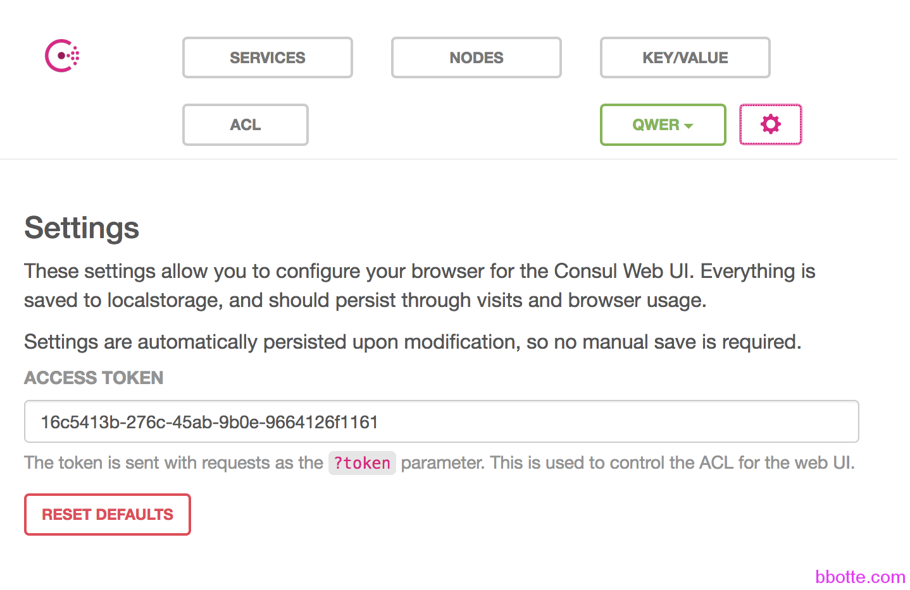
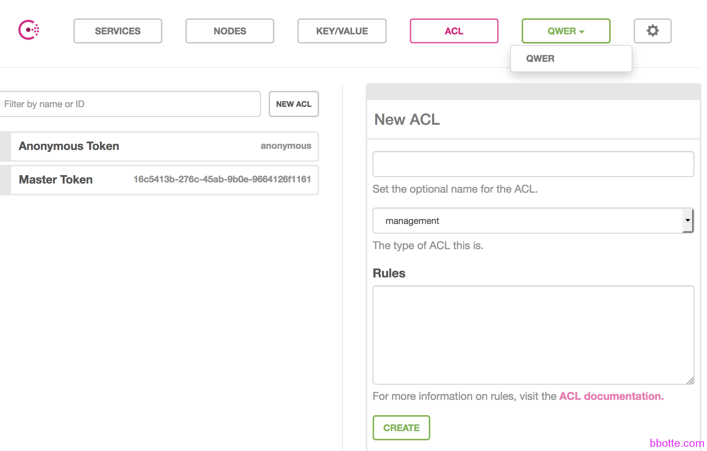
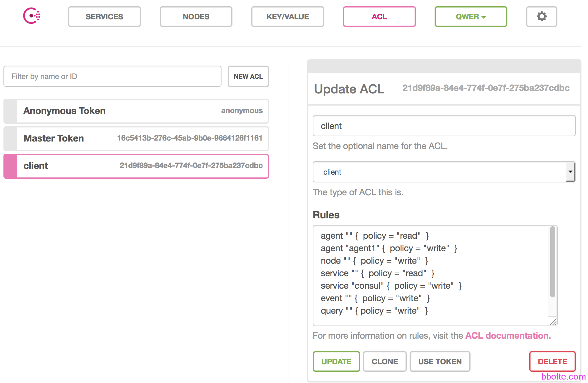
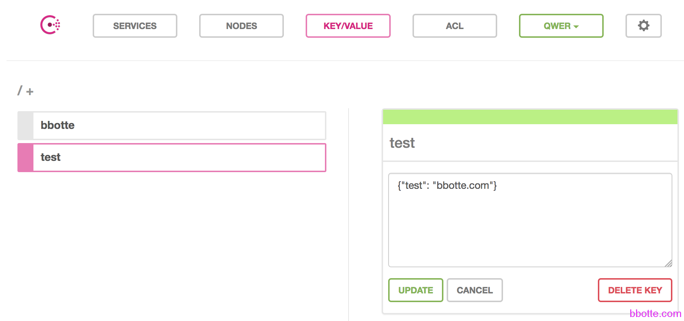

# consul的ACL规则用法

使用consul的ACL遇到些问题，比如

```
[ERR] agent: failed to sync remote state: ACL not found
[ERR] agent: coordinate update error: ACL not found
[ERR] consul: RPC failed to server 10.211.55.4:8300: rpc error: Permission denied
[ERR] agent: coordinate update error: Permission denied
```

consul的ACL网址https://www.consul.io/docs/guides/acl.html 写的比较简单，下面再详细说明一下，简便起见，在ui下操作，下面是一主一从

server端运行进程为，可查看[consul集群的服务注册发现和模板使用](https://bbotte.github.io/service_config/consul-cluster-service-with-registry-and-discovery-and-template-usage/)：

```
cat /etc/consul.d/acl.json
{
	"datacenter": "qwer",
	"acl_datacenter": "qwer",
	"acl_master_token": "16c5413b-276c-45ab-9b0e-9664126f1161",
	"acl_default_policy": "deny",
	"server": true,
	"log_level": "DEBUG",
	"bootstrap_expect": 1,
	"client_addr": "0.0.0.0"
}
上面的acl_master_token是uuidgen | awk '{print tolower($0)}'生成的，每台主机都不相同
nohup consul agent -server -data-dir=/tmp/consul -node=server1 -bind=10.211.55.4 -config-dir=/etc/consul.d -client 0.0.0.0 -ui -atlas-token=16c5413b-276c-45ab-9b0e-9664126f1161 &
```

上面的datacenter、acl_datacenter是随便命名的，acl_master_token是uuidgen | awk ‘{print tolower($0)}’生成，acl_master_token只有server端可以配置，是获取集群管理用的。server端运行起来了，可以tail -f nohup.out查看运行的日志，用nginx代理本地的8500端口，在ui界面的设置里面，填入上面的token，否则提示 access deny



填入token后其他选项就可以访问了，上面运行consul后面带有-atlas-token=XXX的参数，所以打开此页面就有，不过这里权限很大，需要保护好此页面的访问控制



ACL默认是有anonymous token、master token, anonymous的type是client，master的type是management

现在我们添加一个ACL，命名为client，rules里面写规则，规则其实比较简单，规则对象有：agent、event、key、keyring、node、operator、query、service、session。规则权限有：read、write、deny。



一般的rule写法如下：

规则对象 “” { policy = “read” }

规则对象 “某一个项目名称” { policy = “write” }

也就是所有请求都有访问的权限，只有特别的项目才有写入的权限。加完client这个策略后，我们设置agent：

```
cat /etc/consul.d/acl.json
{
	"datacenter": "qwer",
	"acl_datacenter": "qwer",
	"acl_token": "21d9f89a-84e4-774f-0e7f-275ba237cdbc",
	"server": false,
	"log_level": "DEBUG",
	"client_addr": "0.0.0.0"
}
 
nohup consul agent -advertise 10.211.55.5 -data-dir=/tmp/consul -config-dir=/etc/consul.d -node=agent1 -bind=10.211.55.5 -join 10.211.55.4 -rejoin -node-id=$(uuidgen | awk '{print tolower($0)}') &

```

acl_tokey这个选项一般是客户端设置的，acl_tokey的value就是上面添加的client的token，需要注意一点，**agent上配置了acl_token，server端的配置文件也需要添加此行配置**。
我们现在查看命令或者curl发出请求都必须带上token：

```
[root@vm01 ~]# consul members
[root@vm01 ~]# consul members -token=16c5413b-276c-45ab-9b0e-9664126f1161
Node     Address           Status  Type    Build  Protocol  DC
agent1   10.211.55.5:8301  alive   client  0.8.1  2         qwer
server1  10.211.55.4:8301  alive   server  0.8.1  2         qwer
 
[root@vm01 ~]# curl --header "X-Consul-Token: 16c5413b-276c-45ab-9b0e-9664126f1161" http://10.211.55.4:8500/v1/agent/services?pretty
{
    "consul": {
        "ID": "consul",
        "Service": "consul",
        "Tags": [],
        "Address": "",
        "Port": 8300,
        "EnableTagOverride": false,
        "CreateIndex": 0,
        "ModifyIndex": 0
    }
}
 
[root@vm01 ~]# curl  --header "X-Consul-Token: 16c5413b-276c-45ab-9b0e-9664126f1161" http://10.211.55.4:8500/v1/catalog/node/agent1?pretty
{
    "Node": {
        "ID": "dff01fd1-7949-4856-8a39-19c35c0425ee",
        "Node": "agent1",
        "Address": "10.211.55.5",
        "TaggedAddresses": {
            "lan": "10.211.55.5",
            "wan": "10.211.55.5"
        },
        "Meta": {},
        "CreateIndex": 263,
        "ModifyIndex": 289
    },
    "Services": {}
}
```

现在测试一下，我们在client的rules加入key的权限设置，update

```
key "" {
  policy = "read"
}
 
使用master的token：
curl -XPUT --data '{"web_link": "bbotte.com"}' --header "X-Consul-Token: 16c5413b-276c-45ab-9b0e-9664126f1161" http://10.211.55.4:8500/v1/kv/bbotte
true
使用client的token：
curl -XPUT --data '{"test": "bbotte.com"}' --header "X-Consul-Token: 21d9f89a-84e4-774f-0e7f-275ba237cdbc"  http://10.211.55.4:8500/v1/kv/test
Permission denied
```

由于权限被拒绝。我们在ui界面的ACL，再给client的rule添加写权限，才可以post上去

```
key "test" { policy = "write" }
 
# curl -XPUT --data '{"test": "bbotte.com"}' --header "X-Consul-Token: 21d9f89a-84e4-774f-0e7f-275ba237cdbc"  http://10.211.55.4:8500/v1/kv/test
true
```

现在ACL中client的rule如下：

```
agent "" {  policy = "read"  }
agent "agent1" {  policy = "write"  }
node "" {  policy = "write"  }
service "" {  policy = "read"  }
service "consul" {  policy = "write"  }
event "" {  policy = "write"  }
query "" { policy = "write"  }
key "" {
  policy = "read"
}
key "test" { policy = "write" }
```



总结一下，就是(server端)服务端先设置acl_master_token，作为服务端选举的令牌。在ui界面的ACL新建acl_tokey，并配置权限，然后在agent端应用此配置。

2017年05月10日 于 [linux工匠](https://bbotte.github.io/) 发表

