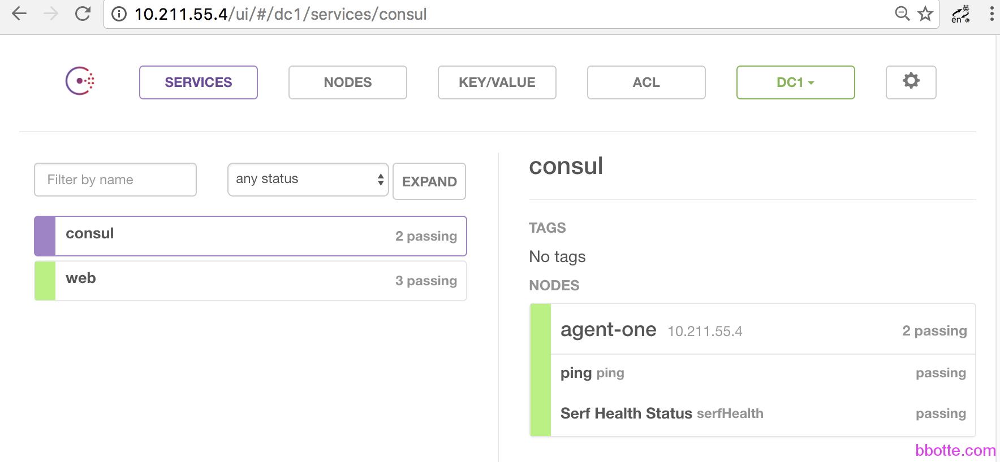
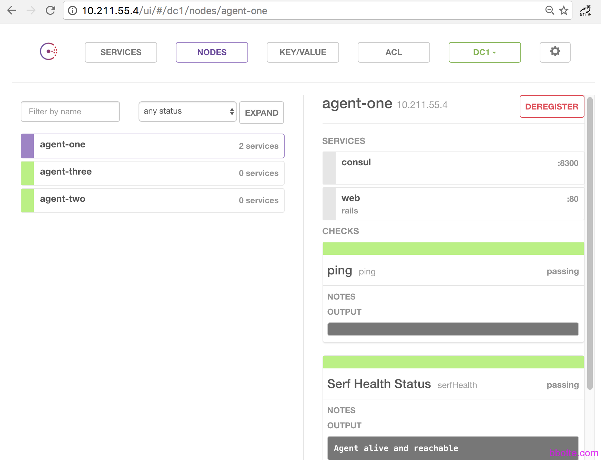

# consul集群的服务注册发现和模板使用

1. consul说明
2. consul集群服务建立
3. consul的DNS服务发现
4. consul的http api
5. consul的图形界面dashboard
6. consul模板的使用

### consul说明

consul经常拿来和etcd和zookeeper来对比，他有和etcd一样的服务发现、服务注册功能，也有和etcd、zookeeper一样的配置存储功能，详细的比对这里就不扯了。用过，就明白了。下面是consul集群的服务注册，服务发现，健康检查，和模板使用

官网：<https://www.consul.io/>    下载：<https://releases.hashicorp.com/consul/>

```
consol客户端      |     | consul服务端      |    |nginx代理      |    |应用服务
做健康检查         |    |接收客户端发送的健康  |    |如果nginx的模板 |    |
确定本地服务是否正常 |----|检查信息做服务的注册  |----|更改，则       |----|
通报给服务端       |    |如果客户端有变动，则   |    |nginx reload  |    |
                 |    |更新代理的配置        |    |              |    |
```

### **consul集群服务建立**

vm01  server    10.211.55.4   agent-one
vm02  client     10.211.55.5   agent-two
vm03  client     10.211.55.6   agent-three

```
[root@vm01 ~]# unzip consul_0.7.0_linux_amd64.zip -d /opt/
Archive:  consul_0.7.0_linux_amd64.zip
  inflating: /opt/consul
[root@vm01 ~]# ln -s /opt/consul /usr/local/bin/consul
[root@vm01 ~]# mkdir /etc/consul.d
 
# consul agent -server -bootstrap-expect=1 -data-dir=/tmp/consul -node=agent-one -bind=10.211.55.4 -config-dir=/etc/consul.d -client 0.0.0.0
==> WARNING: BootstrapExpect Mode is specified as 1; this is the same as Bootstrap mode.
==> WARNING: Bootstrap mode enabled! Do not enable unless necessary
==> Starting Consul agent...
==> Starting Consul agent RPC...
==> Consul agent running!
           Version: 'v0.7.0'
         Node name: 'agent-one'
        Datacenter: 'dc1'
            Server: true (bootstrap: true)
       Client Addr: 127.0.0.1 (HTTP: 8500, HTTPS: -1, DNS: 8600, RPC: 8400)
      Cluster Addr: 10.211.55.4 (LAN: 8301, WAN: 8302)
    Gossip encrypt: false, RPC-TLS: false, TLS-Incoming: false
             Atlas: <disabled>
 
==> Log data will now stream in as it occurs:
 
    2016/11/28 16:45:57 [INFO] raft: Initial configuration (index=1): [{Suffrage:Voter ID:10.211.55.4:8300 Address:10.211.55.4:8300}]
    2016/11/28 16:45:57 [INFO] raft: Node at 10.211.55.4:8300 [Follower] entering Follower state (Leader: "")
    2016/11/28 16:45:57 [INFO] serf: EventMemberJoin: agent-one 10.211.55.4
    2016/11/28 16:45:57 [INFO] serf: EventMemberJoin: agent-one.dc1 10.211.55.4
    2016/11/28 16:45:57 [INFO] consul: Adding LAN server agent-one (Addr: tcp/10.211.55.4:8300) (DC: dc1)
    2016/11/28 16:45:57 [INFO] consul: Adding WAN server agent-one.dc1 (Addr: tcp/10.211.55.4:8300) (DC: dc1)
```

```
[root@vm01 ~]# consul join 10.211.55.5
Successfully joined cluster by contacting 1 nodes.
[root@vm01 ~]# consul join 10.211.55.6
Successfully joined cluster by contacting 1 nodes.
 
[root@vm02 ~]# consul agent -node=agent-two -bind=10.211.55.5 -config-dir=/etc/consul.d -data-dir=/tmp/consul 
 
[root@vm03 ~]# consul agent -node=agent-three -bind=10.211.55.6 -config-dir=/etc/consul.d -data-dir=/tmp/consul

```

```
master:
    2016/11/28 16:47:47 [INFO] agent.rpc: Accepted client: 127.0.0.1:29989
    2016/11/28 16:47:47 [INFO] agent: (LAN) joining: [10.211.55.5]
    2016/11/28 16:47:47 [INFO] serf: EventMemberJoin: agent-two 10.211.55.5
    2016/11/28 16:47:47 [INFO] agent: (LAN) joined: 1 Err: <nil>
    2016/11/28 16:47:47 [INFO] consul: member 'agent-two' joined, marking health alive
slave:
    2016/11/28 16:47:47 [INFO] serf: EventMemberJoin: agent-one 10.211.55.4
    2016/11/28 16:47:47 [INFO] consul: adding server agent-one (Addr: tcp/10.211.55.4:8300) (DC: dc1)
    2016/11/28 16:47:47 [INFO] consul: New leader elected: agent-one
    2016/11/28 16:47:47 [INFO] agent: Synced node info
```

如果不想在vm01中每次consul join 各个节点的ip，那么在slave端可以加上-join选项，如：

```
[root@vm02 ~]# consul agent -advertise 10.211.55.5 -data-dir=/tmp/consul -config-dir=/etc/consul.d -node=agent-two -bind=10.211.55.5 -join 10.211.55.4
 
[root@vm01 ~]# consul members
Node         Address           Status  Type    Build  Protocol  DC
agent-one    10.211.55.4:8301  alive   server  0.7.0  2         dc1
agent-three  10.211.55.6:8301  alive   client  0.7.0  2         dc1
agent-two    10.211.55.5:8301  alive   client  0.7.0  2         dc1
 
[root@vm01 ~]# consul info consul
agent:
	check_monitors = 2
	check_ttls = 0
	checks = 2
	services = 2
build:
	prerelease =
	revision = 'a189091
	version = 0.7.0
consul:
	bootstrap = true
	known_datacenters = 1
	leader = true
	leader_addr = 10.211.55.4:8300
	server = true
```

### **consul的DNS服务发现**

```
consul支持dns的服务注册
[root@vm01 ~]# dig @127.0.0.1 -p 8600 agent-one.node.consul +short
10.211.55.4
[root@vm01 ~]# dig @127.0.0.1 -p 8600 agent-two.node.consul +short
10.211.55.5
```

### **consul的http api**

对consul来说一个重要的接口就是RESTful HTTP API，http api可用于操作nodes, services, checks, configuration等等的CRUD(*create, read, update and delete)。*详见[Consul Http Api](https://www.consul.io/docs/agent/http.html)，下面只是几个例子?说明

```
[root@vm01 ~]# cat /etc/consul.d/web.json
{"service": {"name": "webserver", "tags": ["rails"], "port": 80,
  "check": {"script": "curl bbotte.com  >/dev/null 2>&1", "interval": "10s"}}}
[root@vm01 ~]# dig  @127.0.0.1 -p 8600 webserver.service.consul
 
http api可以通过链接请求：
查看当前consul节点的服务
# curl localhost:8500/v1/agent/checks |python -m json.tool
查看当前consul集群的leader
# curl localhost:8500/v1/status/leader
查看当前节点的信息
# curl localhost:8500/v1/operator/raft/configuration |python -m json.tool
查看agent-one节点的健康检查信息
# curl localhost:8500/v1/health/node/agent-one |python -m json.tool
查看webserver服务的信息
# curl -s http://localhost:8500/v1/catalog/service/webserver | python -m json.tool
```

### **consul的图形界面dashboard**

```
[root@vm01 ~]# wget https://releases.hashicorp.com/consul/0.7.0/consul_0.7.0_web_ui.zip
[root@vm01 ~]# unzip consul_0.7.0_web_ui.zip -d /tmp/consul/ui
[root@vm01 ~]# consul agent -server -bootstrap-expect=1 -data-dir=/tmp/consul -node=agent-one -bind=10.211.55.4 -config-dir=/etc/consul.d -client 0.0.0.0 -ui
 
[root@vm01 ~]# cat /usr/local/nginx/conf/vhost/test.conf
upstream webserver {
        server 127.0.0.1:8500;
}
server {
        listen  80;
        server_name 10.211.55.4;
        error_page  404 = /404.html;
        index index.html;
 
        location / {
        proxy_pass   http://webserver;
        }
 
}
```





### **consul模板的使用**

下面vm01为nginx的proxy,端口为8000，同时vm01,vm02,vm03都作为web service，vm01的8000端口代理vm01,vm02,vm03的80端口。我们所要的结果是其中web server主机异常，会从proxy配置中摘除；当web server正常后会自动添加，完成web server主机的故障和恢复自动化

vm01  server    10.211.55.4   agent-one       proxy/8000       nginx/80
vm02  client     10.211.55.5   agent-two                                nginx/80
vm03  client     10.211.55.6   agent-three                              nginx/80

```
[root@vm01 ~]# cat /etc/consul.d/web.json  #本地webserver的健康检查
{"service": {
  "name": "webserver",
  "tags": ["bbotte"],
  "port": 80,
  "check": {
    "id": "webserver_up",
    "name": "nginx",
    "http": "http://localhost/index.html",
    "interval": "5s",
    "timeout": "1s"
    }
  }
}
```

vm02 和vm03 都一样，放置一个web.json文件
三台主机都重新加载一次consul，保证consul读取此配置

```
先保证在每台主机 curl http://localhost/index.html 正常
[root@vm03 ~]# /usr/local/nginx/sbin/nginx
[root@vm03 ~]# curl http://localhost/index.html
hello
```

consul的日志:

```
  2016/11/28 18:14:19 [INFO] agent: Synced check 'service:webserver'
```

如果把nginx服务关闭，则报错如下：

```
   2016/11/28 18:14:24 [WARN] agent: http request failed 'http://localhost/index.html': Get http://localhost/index.html: dial tcp [::1]:80: getsockopt: connection refused
```

consul的DNS服务发现测试:

```
[root@vm01 ~]# dig @127.0.0.1 -p 8600 webserver.service.consul +short
10.211.55.5
10.211.55.6
10.211.55.4
把其中一台主机web.json的http项更改为不可达，再次查看即可验证
```

现在nginx的配置如下：

```
root@vm01 ~]# egrep -v "^$|^.*#" /usr/local/nginx/conf/server/www.conf
server {
        listen  80;
        server_name localhost;
        index index.html index.htm;
        root  /var/www/test.com;
}
```

新建一个模板文件  

```
[root@vm01 ~]# mkdir /etc/consul-template.d
[root@vm01 ~]# cat /etc/consul-template.d/nginx.conf.ctmpl
upstream consul{
    {{range service "webserver"}}
    server {{.Address}}:{{.Port}};
    {{end}}
}
server {
        listen  8000;
        server_name localhost;
        index index.html index.htm;
        root  /var/www/test.com;
        location / {
            proxy_pass http://consul;
}
}
```

下载consul-template程序，也可以自己编译

```
https://github.com/hashicorp/consul-template
wget https://releases.hashicorp.com/consul-template/0.18.0-rc1/consul-template_0.18.0-rc1_linux_amd64.zip
```

通过模板生成nginx代理配置–web.conf:

```
[root@vm01 ~]# ./consul-template -consul 127.0.0.1:8500 -template "/etc/consul-template.d/nginx.conf.ctmpl:/usr/local/nginx/conf/server/web.conf:service nginx restart" -once
Stopping nginx:                                            [  OK  ]
Starting nginx:                                            [  OK  ]
```

我们看看nginx的配置文件，生成了nginx主代理文件

```
[root@vm01 ~]# cat /usr/local/nginx/conf/server/web.conf
upstream consul{
 
    server 10.211.55.4:80;
 
    server 10.211.55.6:80;
 
    server 10.211.55.5:80;
 
}
server {
        listen  8000;
        server_name localhost;
        index index.html index.htm;
        root  /var/www/test.com;
        location / {
            proxy_pass http://consul;
}
}
```

我们已经通过consul对vm01,vm02,vm03的健康检查对主机的80端口做监控，并且在vm01代理这三台主机的80端口，访问localhost:8000可以得到三台主机的访问页面

```
[root@vm01 ~]# while true;do curl localhost:8000/index.html;sleep 1;done
```

这次用模板对主机一直做健康检查来测试

```
[root@vm01 ~]# ./consul-template -consul 127.0.0.1:8500 -template "/etc/consul-template.d/nginx.conf.ctmpl:/usr/local/nginx/conf/server/web.conf:service nginx restart"
```

通过查看[root@vm01 ~]# cat /usr/local/nginx/conf/server/web.conf 代理的配置，确定是否正确修改了nginx代理的配置
测试过程：把三台机其中一台的nginx服务停止，上面web.conf的主机会自动删除
如果再把nginx服务启动，web.conf的配置会自动添加

```
[root@vm03 ~]# service nginx stop
Stopping nginx:                                            [  OK  ]
 
[root@vm01 ~]# cat /usr/local/nginx/conf/server/web.conf
upstream consul{
 
    server 10.211.55.4:80;
 
    server 10.211.55.5:80;
 
}
server {
        listen  8000;
        server_name localhost;
        index index.html index.htm;
        root  /var/www/test.com;
        location / {
            proxy_pass http://consul;
}
}
```

上面proxy的配置已经把vm03剔除，启动vm03的nginx服务，会发现proxy配置中server 10.211.55.6:80;自动会添加。由此可以配置web代理自动化：consul发现主机就添加，发现主机异常就剔除。再结合对cpu的检测、请求数的监控，添加或删除主机，完成一套web自动化方案。

更多模板例子参考<https://github.com/hashicorp/consul-template/tree/master/examples>

以此，consul对服务的健康检查和通过模板更改配置文件已经完成

2016年11月29日 于 [linux工匠](http://www.bbotte.com/) 发表


