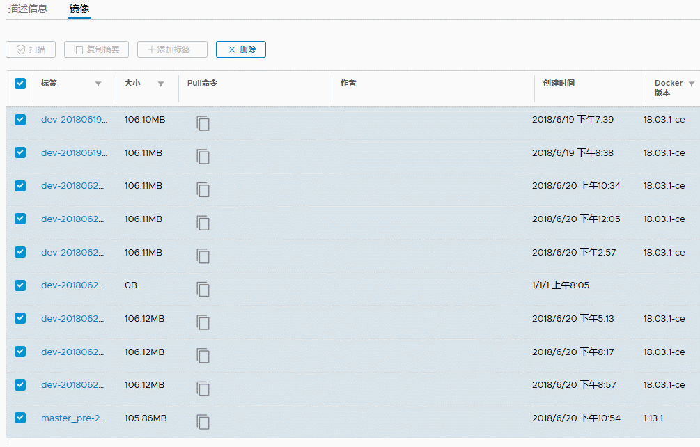

# harbor仓库简单配置说明

1. 说明
2. 安装docker和docker-compose
3. 配置harbor.cfg
4. 登录harbor管理后台
5. 推送镜像到harbor
6. clair插件
7. notary插件
8. harbor仓库删除docker images镜像

### 说明

harbor仓库以其易用性和功能强大被大家所用，并且安装也简单，用docker-compose方式启动。安装步骤官方写的已经很详细：<https://github.com/bbotte/harbor/blob/master/docs/installation_guide.md>

```
版本：
docker         1.12.6
docker-compose 1.9.0
OS             CentOS Linux release 7.4.1708 (Core)
harbor         v1.3.0
```

官网说的在线安装会节省空间，不过网络比较慢，所以下载离线安装包898M，下面是离线安装的操作

```
https://storage.googleapis.com/harbor-releases/harbor-online-installer-v1.3.0.tgz
 
https://storage.googleapis.com/harbor-releases/harbor-offline-installer-v1.3.0.tgz
```

如果需要在线安装，配置好依赖软件版本后，执行 install.sh在线安装，使用离线安装包，下面可忽略

```
需要注意版本
python 2.7.5
make 3.82
go 1.8.3
 
# ./checkenv.sh 
➜ No golang package in your enviroment. You should use golang docker image build binary.
Note: docker version: 1.12.6
Note: docker-compose version: 1.9.0
 
设置golang的环境变量后，再次验证
# tar -xf go1.8.3.linux-amd64.tar.gz -C /usr/local/
# export PATH=$PATH:/usr/local/go/bin
 
# ./checkenv.sh 
Note: golang version: 1.8.3
Note: docker version: 1.12.6
Note: docker-compose version: 1.9.0
# ./prepare
# install.sh
```

不管是离线安装还是在线安装，都需要

### 安装docker和docker-compose

```
安装docker和docker-compose
yum install docker -y
systemctl enable docker
systemctl start docker
yum install epel-release
yum install docker-compose -y
```

解压下载的harbor-offline-installer-v1.3.0.tgz，并进入harbor文件夹。

注意：默认安装的harbor在/data文件夹

### 配置harbor.cfg

为了简单，仅修改hostname为本机ip（不能用localhost或者127.0.0.1），其他都默认，install.sh 安装即可。生产环境肯定是设置域名，而非IP地址，下面可用自己的域名代替实验的IP地址，比如 hub.bbotte.com 代替 192.168.22.69

```
# ls harbor
common                     harbor_1_1_0_template  LICENSE
docker-compose.clair.yml   harbor.cfg             NOTICE
docker-compose.notary.yml  harbor.v1.3.0.tar.gz   prepare
docker-compose.yml         install.sh             upgrade
 
# vim harbor.cfg
hostname = 192.168.22.69
 
# ./install.sh
[Step 0]: checking installation environment ...
 
Note: docker version: 1.13.1
 
Note: docker-compose version: 1.9.0
 
[Step 1]: loading Harbor images ...
 
[Step 2]: preparing environment ...
Generated and saved secret to file: /data/secretkey
Generated configuration file: ./common/config/nginx/nginx.conf
Generated configuration file: ./common/config/adminserver/env
Generated configuration file: ./common/config/ui/env
Generated configuration file: ./common/config/registry/config.yml
Generated configuration file: ./common/config/db/env
Generated configuration file: ./common/config/jobservice/env
Generated configuration file: ./common/config/log/logrotate.conf
Generated configuration file: ./common/config/jobservice/app.conf
Generated configuration file: ./common/config/ui/app.conf
Generated certificate, key file: ./common/config/ui/private_key.pem, cert file: ./common/config/registry/root.crt
The configuration files are ready, please use docker-compose to start the service.
 
 
[Step 3]: checking existing instance of Harbor ...
 
 
[Step 4]: starting Harbor ...
Creating network "harbor_harbor" with the default driver
Creating harbor-log
Creating harbor-db
Creating registry
Creating harbor-adminserver
Creating harbor-ui
Creating nginx
Creating harbor-jobservice
 
✔ ----Harbor has been installed and started successfully.----
 
Now you should be able to visit the admin portal at http://hub.iris.com. 
For more details, please visit https://github.com/vmware/harbor .
 
 
安装完毕
# docker-compose ps
       Name                     Command               State                                Ports                              
------------------------------------------------------------------------------------------------------------------------------
harbor-adminserver   /harbor/start.sh                 Up                                                                      
harbor-db            /usr/local/bin/docker-entr ...   Up      3306/tcp                                                        
harbor-jobservice    /harbor/start.sh                 Up                                                                      
harbor-log           /bin/sh -c /usr/local/bin/ ...   Up      127.0.0.1:1514->10514/tcp                                       
harbor-ui            /harbor/start.sh                 Up                                                                      
nginx                nginx -g daemon off;             Up      0.0.0.0:443->443/tcp, 0.0.0.0:4443->4443/tcp, 0.0.0.0:80->80/tcp
registry             /entrypoint.sh serve /etc/ ...   Up      5000/tcp
```

浏览器打开hostname IP，输入用户名密码 admin/Harbor12345

### 登录harbor管理后台

我们用自建的一个nginx镜像推送到harbor仓库：

```
登录harbor出错
# docker login 192.168.22.69
Username (admin): admin
Password: 
Error response from daemon: Get https://192.168.22.69/v1/users/: dial tcp 192.168.22.69:443: getsockopt: connection refused<br>
```

在docker的daemon.json添加安全的仓库ip或者域名

```
# cat /etc/docker/daemon.json
{
  "exec-opts": ["native.cgroupdriver=systemd"],
  "insecure-registries":["192.168.22.69"]
}
[root@node nginx]# systemctl restart docker
```

### 推送镜像到harbor

把现有的nginx镜像打标签：

```
# docker images|grep nginx
bbotte/nginx v0.1 85a2412ecda1 54 minutes ago 367 MB
 
# docker tag bbotte/nginx:v0.1 192.168.22.69/nginx:v0.1
```

这时候直接推送：

```
docker push 192.168.22.69/nginx:v0.1
received unexpected HTTP status: 500 Internal Server Error
```

是因为harbor没有nginx这个项目，因此在harbor新建nginx项目，访问级别为公开(所有人都可不经过认证push、pull)


再次打标签，前一个nginx是项目名，后一个nginx是镜像名称，v0.1是版本

```
docker tag 本地镜像名：版本  harbor仓库域名/项目名称/镜像名称：版本
# docker tag bbotte/nginx:v0.1 192.168.22.69/nginx/nginx:v0.1
# docker push 192.168.22.69/nginx/nginx:v0.1
```

在kubernetes新建项目，拉取镜像为

```
docker pull 192.168.22.69/nginx/nginx:v0.1
```

使用默认配置，简单的推送images，拉取images就完成了。当然harbor还有2个高级功能，clair、notary

### clair插件

clair 是coreos 开源的容器漏洞扫描工具
Notary 是一套docker镜像的签名工具， 用来保证镜像在pull，push和传输工程中的一致性和完整性。避免中间人攻击，避免非法的镜像更新和运行

使用notary需要设置ssl证书：<https://github.com/goharbor/harbor/blob/master/docs/configure_https.md>，下面用自建ssl证书举例，使用ssl即harbor仓库访问地址也用ssl证书加密

```
生成一个自签名证书
# openssl req -newkey rsa:4096 -nodes -sha256 -keyout ca.key  -x509 -days 365 -out ca.crt
Country Name (2 letter code) [XX]:SH
State or Province Name (full name) []:ShangHai
Locality Name (eg, city) [Default City]:JingAn
Organization Name (eg, company) [Default Company Ltd]:bbotte
Organizational Unit Name (eg, section) []:blog
Common Name (eg, your name or your server's hostname) []:192.168.22.69
Email Address []:bbotte@163.com
 
生成证书签名请求
# openssl req -newkey rsa:4096 -nodes -sha256 -keyout 192.168.22.69.key -out 192.168.22.69.csr
 
生成注册主机的证书
a,使用IP
echo subjectAltName = IP:192.168.22.69 > extfile.cnf
openssl x509 -req -days 365 -in 192.168.22.69.csr -CA ca.crt -CAkey ca.key -CAcreateserial -extfile extfile.cnf -out 192.168.22.69.crt
b,使用域名
openssl x509 -req -days 365 -in yourdomain.com.csr -CA ca.crt -CAkey ca.key -CAcreateserial -out yourdomain.com.crt
 
复制证书到harbor默认证书目录
mkdir -p /data/cert
cp 192.168.22.69.crt /data/cert/server.crt
cp 192.168.22.69.key /data/cert/server.key
```

编辑harbor.cfg，访问链接协议http改为https，并安装clair插件

```
# vim harbor.cfg
ui_url_protocol = https
 
# ./install.sh --with-clair
```

安装完成后火狐浏览器访问 https://IPADDR，输入用户名密码登录即可

### notary插件

notary插件（–with-notary）安装完成后，安装文档操作了，提示.cert不知道怎么弄，有做好的小伙伴请留言，求学习

```
# docker -D pull hub.bbotte.com/nginx/nginx:v0.3
DEBU[0000] reading certificate directory: /root/.docker/tls/192.168.22.69:4443 
DEBU[0000] crt: /root/.docker/tls/192.168.22.69:4443/hub.bbotte.com.crt 
DEBU[0000] key: /root/.docker/tls/192.168.22.69:4443/hub.bbotte.com.key 
Error establishing connection to trust repository: Missing client certificate hub.bbotte.com.cert for key hub.bbotte.com.key
Missing client certificate hub.bbotte.com.cert for key hub.bbotte.com.key
```

notary插件之后继续查看

查看/data文件夹，是仓库默认存储位置和配置文件

```
# ls /data/
ca_download  clair-db  database      job_logs   psc       secretkey
cert         config    defaultalias  notary-db  registry
# ls /data/registry/docker/registry/v2/repositories/
nginx
```

当然也有mysql数据库，创建的nginx项目在registry目录

### harbor仓库删除docker images镜像

下面是1.5版本：

1，首先在harbor dashboard界面删除，这一步不是真正删除，只是标记，正常情况下，删除都是成功的，如果”删除失败”, Size 大小变为0，那么重新docker push这个镜像，再删除，一般可以成功

如果没有这个镜像，那么随便找一个镜像，再docker tag 随便的镜像 大小为0的镜像

docker push 大小为0的镜像

在ui界面刷新后删除

2，停止harbor服务后删除磁盘的docker images

```
$ docker-compose stop
$ docker run -it --name gc --rm --volumes-from registry vmware/registry-photon:v2.6.2-v1.5.0 garbage-collect --dry-run /etc/registry/config.yml
$ docker run -it --name gc --rm --volumes-from registry vmware/registry-photon:v2.6.2-v1.5.0 garbage-collect /etc/registry/config.yml
$ docker-compose start
```

这时候再df -h 查看磁盘空间

2018年01月18日 于 [linux工匠](http://www.bbotte.com/) 发表