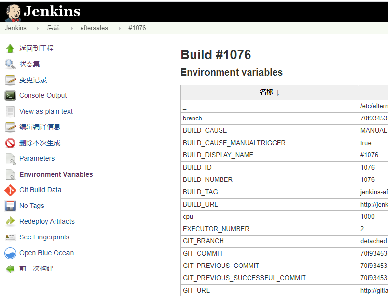
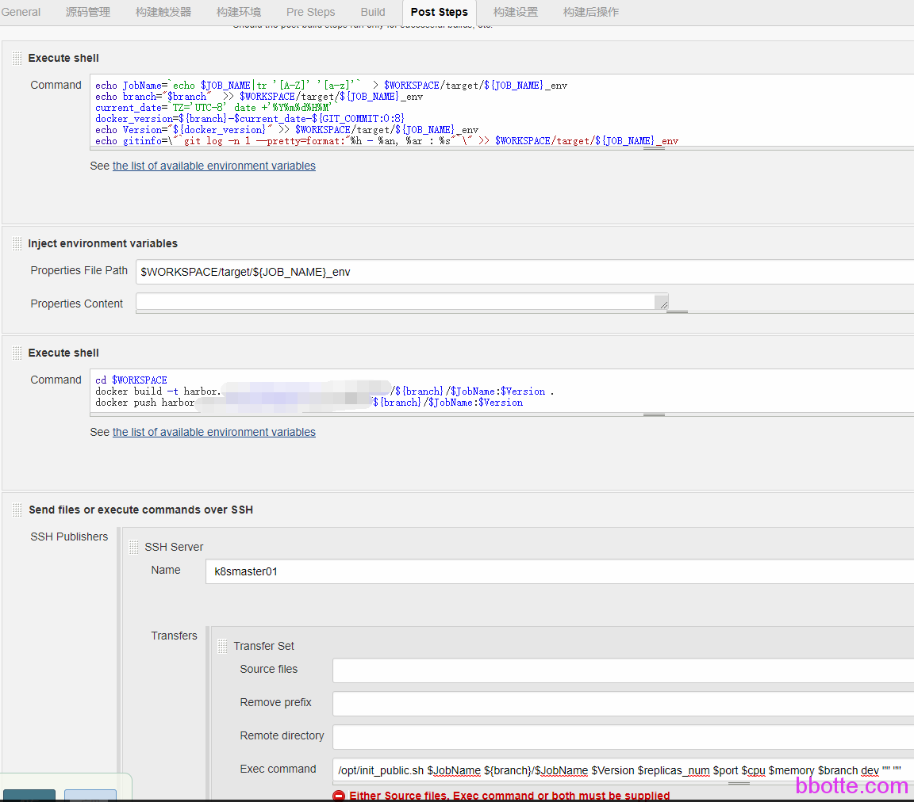
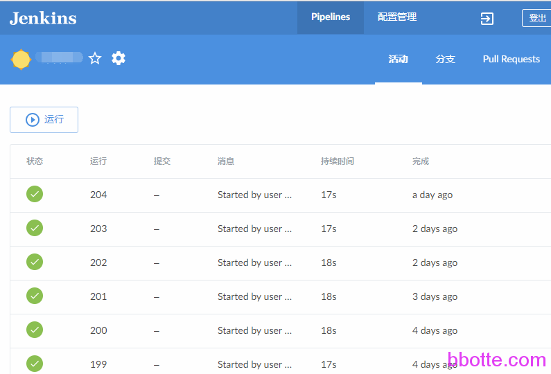

# jinja和jenkins结合做为kubernetes的服务发布平台

公司使用java开发语言，使用kubernetes集群运行这些java服务，为了试发布便捷，使用jenkins构建，利用jinja对模板渲染，利用Jenkins做一套kubernetes的发布平台。流程如下：

gitlab提交代码–jenkins构建(maven(jar包),Dockerfile(docker包))–镜像推送到harbor仓库–生成Deployment模板–kubectl create pod.yaml

jinja渲染模板配置,为生成deployment 配置文件

### pip安装jinja2

```
yum install python-pip python-devel 
pip install jinja2
```

### kubernetes pod的jinja模板

配置文件还是看github吧，这里变量都不显示了，

<https://github.com/bbotte/bbotte.github.io/blob/master/service_config/jinja-and-jenkins-as-service-delivery-platforms-for-kubernetes.md>

```
# cat /opt/template
\{\%- if replicas_num|length == 0 -\%\}
  \{\%- set replicas_num = 2 -\%\}
\{\%- endif -\%\}
\{\%- if cpu|length == 0 -\%\}
  \{\%- set cpu = '1000' -\%\}
\{\%- endif -\%\}
\{\%- if memory|length == 0 -\%\}
  \{\%- set memory = '1024Mi' -\%\}
\{\%- endif -\%\}
\{\%- if script|length == 0 -\%\}
  \{\%- set script = "" -\%\}
\{\%- endif -\%\}

kind: Deployment
apiVersion: apps/v1beta2
metadata:
  name: \{\{ name \}\}
  labels:
    k8s-app: \{\{ name \}\}
  annotations:
    kubernetes.io/change-cause: \{\{ version \}\}
spec:
  replicas: \{\{ replicas_num \}\}
  revisionHistoryLimit: 1
  strategy:
    rollingUpdate:
      maxSurge: 1
      maxUnavailable: 1
  selector:
    matchLabels:
      k8s-app: \{\{ name \}\}
  template:
    metadata:
      labels:
        k8s-app: \{\{ name \}\}
    spec:
      containers:
      - name: \{\{ name \}\}
        image: \{\{ image -\}\}:\{\{ version \}\}
        imagePullPolicy: IfNotPresent
        resources:
          limits:
            memory: \{\{ memory \}\}Mi
            #cpu: \{\{ cpu \}\}m
        ports:
        - containerPort: \{\{ port \}\}
        livenessProbe:
          tcpSocket:
            port: \{\{ port \}\}
          initialDelaySeconds: 15
          periodSeconds: 20
        volumeMounts:
          - name: \{\{branch\}\}-\{\{ name \}\}-data-storage
            mountPath: /opt
      imagePullSecrets:
        - name: harbor-auth
      volumes:
      - name: \{\{branch\}\}-\{\{ name \}\}-data-storage
        hostPath:
          path: "/tmp/data"   #线上为gfs集群，非本地存储
 
---
kind: Service
apiVersion: v1
metadata:
  name: \{\{ name \}\}-com
  labels:
    k8s-app: \{\{ name \}\}
spec:
  selector:
    k8s-app: \{\{ name \}\}
  ports:
  - port: \{\{ port \}\}
    targetPort: \{\{ port \}\}
```

简单说明一下上面deployment配置:

cpu不做限制是因为限制了cpu核数，服务启动会特别慢

各个变量都是通过jenkins传过来的，比如branch、name、port、memory

kubernetes内部各个服务中调用是通过{{name}}-com, 要全部小写，并且不能有特殊字符和 .，这是因为DNS的限制，因为实际DNS内部地址是

```
\{\{name\}\}-com.default.svc.cluster.local
```

程序之间相互调用是{{ name }}-com:{{ port }}

### python发布脚本

```
# cat /opt/public.py 
#!/usr/bin/env python
#encoding=utf8
import sys
from jinja2 import Template
 
#template
def RenderTemplate(name="",image="",version="",replicas_num="",port="",branch="",namespace="",env_name="",env_value="",cpu="",memory=""):
    if namespace == "dev":
        with open('/opt/template', "r") as f:
            print(Template(f.read()).render(name=name,image=image,version=version,replicas_num=replicas_num,port=port,branch=branch,namespace=namespace,env_name=env_name,env_value=env_value,cpu=cpu,memory=memory))
 
#value
d = {}
jenkinsfile="/tmp/{0}jenkins".format(sys.argv[1])
with open(jenkinsfile,'r') as f:
    for line in f:
        (k,v) = line.split(':')
        if k == '':
            d[str(k)] = ""
        else:
            d[str(k)] = v.replace('\n','')
 
RenderTemplate(**d)
```

下面是jenkins配置

### 安装Jenkins和插件

下载最新 Java SE Development Kit 8u161：

http://www.oracle.com/technetwork/java/javase/downloads/jdk8-downloads-2133151.html?ssSourceSiteId=otnpt

下载最新Jenkins：

https://jenkins.io/download/

```
rpm -ivh jdk-8u161-linux-x64.rpm
rpm -ivh jenkins-2.89.4-1.1.noarch.rpm
systemctl status jenkins
systemctl enable jenkins
systemctl start jenkins
```

Jenkins启动后浏览器打开默认的8080端口，安装[Build With Parameters Plugin](https://wiki.jenkins.io/display/JENKINS/Build+With+Parameters+Plugin)插件或者[Environment Injector](https://wiki.jenkins-ci.org/display/JENKINS/EnvInject+Plugin)  ，此插件可以设置自定义变量，2种插件都可以。Environment Injector插件是可以把需要的变量都在项目构建的Environment Variables 下显示出来



### Jenkins新建项目配置

Build With Parameters插件配置方式：

```
General
  参数化构建过程
    下面添加branch、port、replicas_num、cpu、memory变量，变量可以为Choices，string类型
 
中间添加git代码仓库、maven打jar包忽略
 
Pre Steps
  Execute shell
    sed "s/9999/$port/" /opt/Dockerfile > $WORKSPACE/Dockerfile
    cp /opt/docker-entrypoint.sh $WORKSPACE/docker-entrypoint.sh

Build
  Root POM: pom.xml
  Goals and options: clean package  -e -U -Dmaven.test.skip=true
  
Post Steps  添加对变量的整理，并把jar包打为docker包
  Execute shell
    JobName=`echo $JOB_NAME|tr '[A-Z]' '[a-z]'`
    current_date=`TZ='UTC-8' date +'%Y%m%d%H%M'`
    Version=${branch}-$current_date-${GIT_COMMIT:0:8}

    cd $WORKSPACE
    docker build -t harbor.bbotte.com/${branch}/$JobName:$Version .
    docker push harbor.bbotte.com/${branch}/$JobName:$Version

     /opt/init_public.sh $JobName ${branch}/$JobName $Version $replicas_num $port $cpu $memory $branch dev "" ""
```


Environment Injector 插件配置方式：

```
General
  参数化构建过程
    下面添加branch、port、replicas_num、cpu、memory变量，变量可以为Choices，string类型
 
中间添加git代码仓库、maven打jar包忽略
 
Pre Steps
  Execute shell
    sed "s/9999/$port/" /opt/Dockerfile > $WORKSPACE/Dockerfile
    cp /opt/docker-entrypoint.sh $WORKSPACE/docker-entrypoint.sh
    
Build
  Root POM: pom.xml
  Goals and options: clean package  -e -U -Dmaven.test.skip=true
 
Post Steps  添加对变量的整理，并把jar包打为docker包
  Execute shell
    echo JobName=`echo $JOB_NAME|tr '[A-Z]' '[a-z]'`  > $WORKSPACE/${JOB_NAME}_env
    echo branch="$branch"  >> $WORKSPACE/${JOB_NAME}_env
    current_date=`TZ='UTC-8' date +'%Y%m%d%H%M'`
    docker_version=${branch}-$current_date-${GIT_COMMIT:0:8}
    echo Version="${docker_version}" >> $WORKSPACE/${JOB_NAME}_env
    echo gitinfo=\"`git log -n 1 --pretty=format:"%h - %an, %ar : %s"`\" >> $WORKSPACE/${JOB_NAME}_env
 
  Inject environment variables
    $WORKSPACE/${JOB_NAME}_env
 
  Execute shell
    cd $WORKSPACE
    docker build -t harbor.bbotte.com/${branch}/$JobName:$Version .
    docker push harbor.bbotte.com/${branch}/$JobName:$Version
 
  Send file or execute commands over SSH
    SSH server 选择模板和脚本所在的主机
    Exec command
      /opt/init_public.sh $JobName ${branch}/$JobName $Version $replicas_num $port $cpu $memory $branch dev "" "
```




```
# cat /opt/Dockerfile 
FROM openjdk:8-alpine
WORKDIR /
ADD ./target/*.jar app.jar
EXPOSE 9999
COPY docker-entrypoint.sh /
RUN chmod +x /docker-entrypoint.sh
ENTRYPOINT ["/docker-entrypoint.sh"]
CMD ["java","-server","-Duser.timezone=GMT+08","-jar","/app.jar"]
```

```
cat /opt/docker-entrypoint.sh
#!/bin/sh
set -e
if [ -z $(echo $HOSTNAME|grep -) ];then
export HostN=`echo $HOSTNAME|cut -c 1-5`
else
export HostN=`echo $HOSTNAME|awk -F'-' '{print $3}'`
fi
exec "$@"
```

设置如上变量，如果没有则为空，下面是python使用jinja渲染模板，kubernetes创建服务

```
# cat /opt/init_public.sh 
#!/bin/bash
cat /dev/null > /tmp/${9}jenkins
echo name:$1 > /tmp/${9}jenkins
echo image:$2 >> /tmp/${9}jenkins
echo version:$3 >> /tmp/${9}jenkins
echo replicas_num:$4 >> /tmp/${9}jenkins
echo port:$5 >> /tmp/${9}jenkins
echo cpu:$6 >> /tmp/${9}jenkins
echo memory:$7 >> /tmp/${9}jenkins
echo branch:$8 >> /tmp/${9}jenkins
echo namespace:$9 >> /tmp/${9}jenkins
echo env_name:${10} >> /tmp/${9}jenkins
echo env_value:${11} >> /tmp/${9}jenkins
 
python /opt/public.py ${9} > /opt/yaml/$8-$1.yaml
kubectl apply -f /opt/yaml/$8-$1.yaml --record=false
```

下面是Jenkins添加Blue Ocean插件执行结果



上面配置即可完成Jenkins调用gitlab，通过maven打包后，发送给自建的docker仓库，并传送变量生成kubernetes deployment配置模板，从而创建服务的需要

2018年03月10日 于 [linux工匠](https://bbotte.github.io/) 发表


