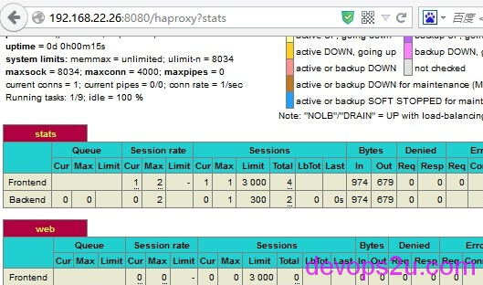
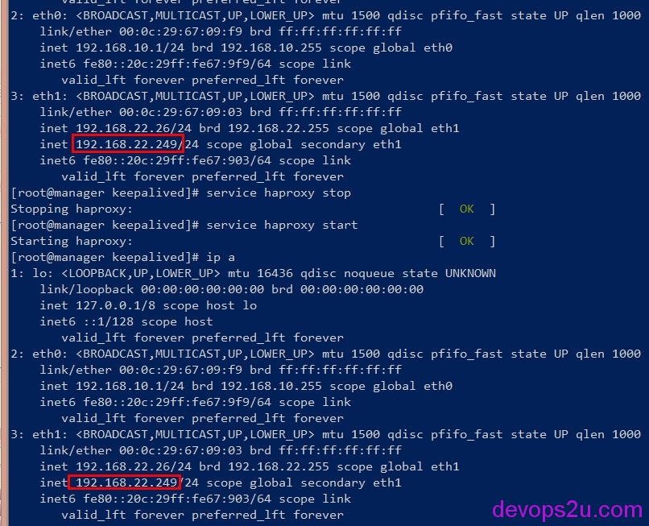

# Haproxy keepalived的线上高可用

1. 配置说明
2. 安装软件包
3. 配置haproxy
4. 配置keepalived
5. keepalived互为主从
6. Load balancing
7. High availability
8. Application performance
9. Security
10. Integration and administration

### 配置说明

系统：CentOS 6.5 HA-Proxy version 1.5.2 keepalived-1.2.13
<http://haproxy.com/>
<http://www.haproxy.org/>社区，也就是[http://haproxy.1wt.eu](http://haproxy.1wt.eu/)
<http://blog.haproxy.com/>
<http://www.keepalived.org/>
<http://cbonte.github.io/haproxy-dconv/configuration-1.5.html#2.1> haproxy文档
eth0 192.168.10.1 manager   外网  eth1 192.168.22.26/24
eth0 192.168.10.2 backup     外网  eth1 192.168.22.118/24
192.168.10.3   web1   静态
192.168.10.4   web2   动态


### **安装软件包**

manager和backup 安装haproxy、keepalived

```
yum install haproxy #HA-Proxy version 1.5.2
yum install keepalived #keepalived-1.2.13
```

web1安装httpd服务，并启动httpd服务

```
# yum install httpd
[root@web1 ~]# cat /var/www/html/index.html 
web1 static
# route add default gw 192.168.10.1 #添加默认路由
```

web2安装httpd和php服务，并启动httpd服务

```
# yum install mysql mysql-server mysql-devel httpd php php-mysql
[root@web2 ~]# cat /var/www/html/index.php
<?php
echo phpinfo();
?>
# route add default gw 192.168.10.1 #添加默认路由
```

### **配置haproxy**

```
[root@manager haproxy]# grep -v ^\# /etc/haproxy/haproxy.cfg |sed '/^$/d'
global                                           #全局设置
    log         127.0.0.1 local2   debug         #err warning info debug 4种模式
    chroot      /var/lib/haproxy
    pidfile     /var/run/haproxy.pid
    maxconn     4000                             #haproxy的最大连接数
    user        haproxy                          #进程所属用户
    group       haproxy
    daemon
    # turn on stats unix socket
    stats socket /var/lib/haproxy/stats          #统计数据
defaults                                         #默认设置
    mode                    http                 #指定frontend和backend工作模式{tcp|http|health},代理后端web站点用http模式，这里是7层
    log                     global
    option                  httplog
    option                  dontlognull          #不记录空信息，不记录只用于检测状态的心跳包
    option http-server-close                     #启用后端服务器连接关闭功能
    option forwardfor       except 127.0.0.0/8   # forwardfor将用户请求转发后端服时，在HTTP请求报文中添加"X-Forwarded-For"特殊首部，以便后端服记录真实发起请求的客户端IP地址，而不是代理服务器内网卡地址
    option                  redispatch           #当原分配用户请求的后端服故障时，允许把用户请求重新分发给其他后端服务器
    option                  abortonclose         #当Haproxy服务器负载很高的时候，自动结束掉当前队列处理比较久的连接
    retries                 3                    #后端重新连接次数
    timeout http-request    10s                  #http请求超时
    timeout queue           1m                   #后端服务器队列已满，等待发送请求的超时时间
    timeout connect         10s                  #和后端服务器建立连接
    timeout client          1m                   #客户端处于非活动连接的超时
    timeout server          1m                   #后端服务器非活动连接的超时时间
    timeout http-keep-alive 10s                  #长连接
    timeout check           10s                  #健康状态监测
    maxconn                 3000                 
listen stats
mode http
bind :8080                                       #stats的端口
stats enable
stats hide-version
stats uri /haproxy?stats                         #stats的管理页面
stats realm no\ entrance                         #提示信息
stats auth admin:admin                           #登录用户名和密码
stats admin if TRUE
frontend web                                     #定义前端，这个名字随便起
bind :80
mode http
log global
option httpclose                                 #每次请求完毕后主动关闭http通道
option logasap
option dontlognull
capture request header Host len 20               #haproxy日志设置  只记录host头20字节
capture request header X-Forwarded-For len 15    #请求客户端的ip地址
capture request header Referer len 60            #点击链接所在的页面引用位置
    acl url_static       path_beg       -i /static /image /js  #-i为不区分大小写，定义一个acl的规则，规则开始
    acl url_static       path_end       -i .html .jpg .gif .png .css .js   #acl规则结束
#如果设置下面两条path_end也是可以的，不过打开的时候后缀名html或php必须添加，例如http://192.168.1.1/index.php
#acl url_static       path_end       .html .jpg .gif .png .css .js
#acl url_dynamic      path_end       .php
#use_backend static_servers         if url_static
#use_backend dynamic_servers        if url_dynamic
    use_backend static_servers          if url_static #满足url_static规则，则匹配下面规则中的static_servers
    default_backend             dynamic_servers       #默认按照dynamic_servers规则，就是转发到动态服务器
backend static_servers                                #定义后端，名字肯定和上面定义规则的一样
     mode http
#    balance    roundrobin                            #虽然定义轮询，不过这里就一个，所以注释
     option     redispatch
     option     abortonclose
     server     web1 192.168.10.3:80 check maxconn 5000   #后端是静态服务器web1
backend dynamic_servers                               #定义后端，动态服务器规则
     mode http
     balance     source                               #负载均衡方式，原地址hash
     hash-type consistent                             #hash类型，consistent-hash一致性hash动态
     option  redispatch
     option    abortonclose
     server  web2 192.168.10.4:80 check maxconn 500   #后端动态服务器web2
```

负载均衡方式一般用cookie识别或session识别
这里把haproxy的日志改一个路径，为/var/log/haproxy.log

```
# yum install rsyslog
[root@manager haproxy]# grep -v ^\# /etc/rsyslog.conf|sed '/^$/d'
$ModLoad imuxsock # provides support for local system logging (e.g. via logger command)
$ModLoad imklog   # provides kernel logging support (previously done by rklogd)
$ModLoad imudp                                          #开启
$UDPServerRun 514                                       #开启
$ActionFileDefaultTemplate RSYSLOG_TraditionalFileFormat
$IncludeConfig /etc/rsyslog.d/*.conf
*.info;mail.none;authpriv.none;cron.none;local2.none                /var/log/messages #messages里面不记录local2的日志
local2.*  /var/log/haproxy.log                          #为local2单独设置一个日志文件
authpriv.*                                              /var/log/secure
mail.*                                                  -/var/log/maillog
cron.*                                                  /var/log/cron
*.emerg                                                 *
uucp,news.crit                                          /var/log/spooler
local7.*                                                /var/log/boot.log
[root@manager haproxy]# service rsyslog restart
```

web1和web2日志添加X-Forwarded-For首部，让后端服务器记录真实请求ip，web1和web2都做以下改动

```
# vim /etc/httpd/conf/httpd.conf
497 LogFormat "%h %l %u %t \"%r\" %>s %b \"%{Referer}i\" \"%{User-Agent}i\"" combined 改为：
LogFormat "%{X-Forwarded-For}i %h %l %u %t \"%r\" %>s %b \"%{Referer}i\" \"%{User-Agent}i\"" combined
```

```
#采用标准的X-Fowarded-For字段获取, 在web服务器上修改日志的格式即可
# Nginx示例
log_format  upstream  '$time_iso8601 $http_x_forwarded_for $host $upstream_response_time $request $status $upstream_addr';
# Apache示例
SetEnvIf REMOTE_ADDR "(.+)" CLIENTIP=$1
SetEnvIf X-Forwarded-For "^([0-9.]+)" CLIENTIP=$1
LogFormat "%{CLIENTIP}e %D %u %t \"%r\" %>s %O \"%{Referer}i\" \"%{User-Agent}i\"" trueip_combined
```

[root@manager haproxy]# scp haproxy.cfg root@backup:/etc/haproxy 把配置复制一份给backup

检查并启动服务查看

\# haproxy -f /etc/haproxy/haproxy.cfg

\# service haproxy restart

浏览器打开192.168.22.26，Ctrl+F5刷新查看页面

打开manager和backup的页面都会出现phpinfo的页面，是因为不满足url_static，走dynamic_servers规则

查看haproxy和web1，web2的日志来检查

http://192.168.22.26:8080/haproxy?stats 这个页面查看haproxy的后台状态



### **配置keepalived**

manager主节点keepalived配置

```
[root@manager keepalived]# vim keepalived.conf
! Configuration File for keepalived
global_defs {
   notification_email {
        your_email@163.com                     #收件
   }
   notification_email_from root@localhost      #发件
   smtp_server 127.0.0.1                       #smtp服务器地址
   smtp_connect_timeout 3                      ##smtp服务器超时时间
   router_id LVS_HAPROXY                       #VRRP组名
}
vrrp_script chk_haproxy {                      #定义chk_haproxy
script "killall -0 haproxy"                    #执行的脚本
interval 2                                     #执行的间隔时间
weight 2                                       #如果由主变为备，那么优先级-2
}
vrrp_instance VI_1 {
    state MASTER                               #VI_1为主
    interface eth1                             #VIP的网卡，外网网卡，这里eth1
    virtual_router_id 77                       #virtual_router_id号
    priority 100                               #优先级
    garp_master_delay 1                        #主从切换时间
    advert_int 1                               
    authentication {                           #认证机制
        auth_type PASS
        auth_pass 11111
    }
    virtual_ipaddress {                        #设置VIP
        192.168.22.249/24 dev eth1
    }
    track_script {                             #执行脚本检测
    chk_haproxy
    }
    track_interface {                          #跟踪接口,设置额外的监控
    eth1
    }
}
```

keepalived备节点配置

```
[root@backup keepalived]# vim keepalived.conf
! Configuration File for keepalived
global_defs {
   notification_email {
        your_email@163.com
   }
   notification_email_from root@localhost
   smtp_server 127.0.0.1
   smtp_connect_timeout 3
   router_id LVS_HAPROXY
}
vrrp_script chk_haproxy {
script "killall -0 haproxy"
interval 2
weight 2
}
vrrp_instance VI_1 {
    state BACKUP
    interface eth1
    virtual_router_id 77
    priority 99
    garp_master_delay 1
    advert_int 1
    authentication {
        auth_type PASS
        auth_pass 11111
    }
    virtual_ipaddress {
        192.168.22.249/24 dev eth1
    }
    track_script {
    chk_haproxy
    }
    track_interface {
    eth1
    }
}
```

此时VIP192.168.22.249在manager上面，当把主节点haproxy服务停止，那么VIP将漂移到备节点，自己在浏览器查看,

\~~~分割线~~~

### **keepalived互为主从**

下面是**keepalived互为主从**的配置，manager节点跑一个web应用，backup也跑一个web应用，不浪费服务器资源。当一个节点挂死，两个VIP会在另一个节点上面,这时候网卡上配置两个VIP资源

manager的keepalived配置

```
[root@manager ~]# vim /etc/keepalived/keepalived.conf
global_defs {
notification_email {                         
root@localhost
}
notification_email_from root@localhost 
smtp_connect_timeout 3                      
smtp_server 127.0.0.1                       
router_id LVS_DEVEL                         
}
vrrp_script chk_haproxy {
script "killall -0 haproxy"
interval 2                      
weight 2                             
}
vrrp_instance VI_1 {
interface eth1         
state MASTER                              
priority 100                             
virtual_router_id 100                     
garp_master_delay 1                        
authentication {
auth_type PASS                         
auth_pass 11111                        
}
track_interface {                         
eth1
}
virtual_ipaddress {
192.168.22.249/24 dev eth1              
}
track_script {
chk_haproxy                            
}
}
vrrp_instance VI_2 {
interface eth1                             
state BACKUP                               
priority 99                                
virtual_router_id 101                      
garp_master_delay 1                      
authentication {
auth_type PASS                     
auth_pass 22222                     
}
track_interface {                          
eth1
}
virtual_ipaddress {
192.168.22.147/24 dev eth1            
}
}
```

backup的keepalived配置

```
[root@backup ~]# vim /etc/keepalived/keepalived.conf
global_defs {
notification_email {
root@localhost
}
notification_email_from root@localhost
smtp_connect_timeout 3
smtp_server 127.0.0.1
router_id LVS_DEVEL
}
vrrp_script chk_haproxy {
script "killall -0 haproxy"
interval 2
weight 2                            
}
vrrp_instance VI_1 {
interface eth1                  
state BACKUP                        
priority 99                       
virtual_router_id 100                    
garp_master_delay 1                      
authentication {
auth_type PASS
auth_pass 11111
}
track_interface {
eth1
}
virtual_ipaddress {
192.168.22.249/24 dev eth1
}
track_script {
chk_haproxy
}
}
vrrp_instance VI_2 {
interface eth1
state MASTER
priority 100
virtual_router_id 101
garp_master_delay 1
authentication {
auth_type PASS
auth_pass 22222
}
track_interface {
eth1
}
virtual_ipaddress {
192.168.22.147/24 dev eth1
}
}
```

主备都启动haproxy和keepalived服务，查看haproxy和keepalived的日志
/var/log/haproxy.log
/var/log/messages
在manager上把haproxy服务停止，查看节点ip地址，和keepalived日志，此时VIP192.168.22.249就会转移到backup上面,日志就不贴了
manager网卡：



backup网卡


haproxy在公司内常用于负载均衡，配置的强大和灵活、不出故障。官方介绍haproxy主要特点：

### Load balancing

- Numerous balancing algorithms may be applied by server or by server group, with weighting
- Content switching: request routing based on their content
- SSL (one of the best SSL stack on the market)
- Multi criteria session persistence management
- HTTP header management via access control lists (ACL)
- Support web services and web sockets

### High availability

- Smooth server shutdown and startup
- Overload protection
- Continuous server monitoring
- High availability (VRRP / Route Health Injection)

### Application performance

- HTTP compression
- Management of server logs in offload mode
- Traffic analytic logs with customizable log format
- TCP/HTTP acceleration via buffering
- Dynamic connection control
- Early release of connections
- no limit in number of servers, farms, services (validated in production with 300.000 of each object)

### Security

- Reverse-Proxy
- Protocol validation
- Information leaks prevention
- Protection against DoS, DDoS, worms, brute force, backdoor and Advanced persistent threat (APT)
- Real time behavior analysis
- Management of white/blacklists and URL restrictions
- Filtering of HTTP / HTTPS queries and replies

### Integration and administration

- Protocol compliance
- full support of IPv6
- syslog
- proxy protocol (Amazon ELB, nginx, …)
- Integration with standard operating systems
- Backwards compatible with HAProxy configurations


2016年03月18日 于 [linux工匠](http://www.bbotte.com/) 发表