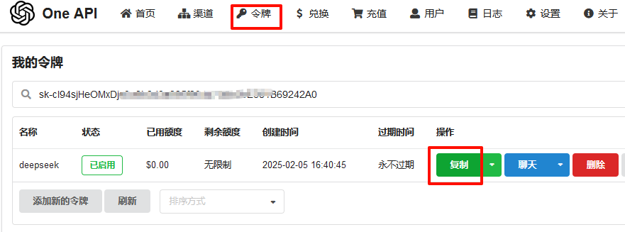

# 阿里云运行大模型deepseek r1

阿里云提供了人工智能平台PAI，我们在上面做一个测试，运行deepseek-r1（DeepSeek-R1-Distill-Qwen-1.5B）

##### 第一步，进入阿里云人工智能平台PAI

创建一个工作空间，使用默认的创建就可以，相当于k8s的namespace。选择模型在线服务，开始部署需要的模型。

"模型类别" 中有千问、DeepSeek、Llama、ocr、百川等模型。


主要是资源部署这点，需要创建主机/GPU资源。因为大模型支持gn7及以上型号，所以选ecs.gn7i-c8g1.2xlarge规格，这个规格只能运行DeepSeek-R1-Distill-Qwen-1.5B，7B会报错


随后等服务运行成功，如果失败查看日志，一般是资源不够用。这时候需要进入资源组，清空节点，并且停止EAS服务。再更改eas主机为重新调度，启动或更新模型

服务正常运行后，查看调用信息


可以不用下面的2步操作，模型部署后，本地启动一个 Web 应用进行推理。下载 Web UI 代码：[webui_client](https://github.com/aliyun/pai-examples/blob/master/model-gallery/deploy/llm/vLLM/webui_client.py) ，在本地运行，即可通过 UI 界面进行推理

```
python webui_client.py --eas_endpoint "<EAS API Endpoint>" --eas_token "<EAS API Token>"
```

##### 第二步，使用one-api，获取兼容gpt的令牌

[one-api](https://github.com/songquanpeng/one-api) 统一了各个大模型的api接口，这样使用起来更方便，

使用docker-compose运行one-api，第一次启动后，用户名为root，密码是123456，需要更改密码

```
version: '3'
services:
  oneapi:
    container_name: oneapi
    image: swr.cn-north-4.myhuaweicloud.com/ddn-k8s/docker.io/justsong/one-api:v0.6.6
    restart: always
    ports:
     - 5001:3000
    networks:
      - oneapi
    volumes:
      - ./oneapi:/data

networks:
  oneapi:
    driver: bridge
    ipam:
      driver: default
      config:
      - subnet: 192.168.101.0/24
```

配置如下，类型选deepseek，模型添加一个gpt-4，这里是因为许多gpt客户端默认都支持gpt-4的api接口，而不认识deepseek或新诞生的一个大模型。

模型重定向是把deepseek认为是gpt-4，这样多数web客户端认得，因为每个大模型的api是不一样的，这里给统一成gpt-4。再配置令牌，复制生成的sk开头的字符串





##### 第三步，在web端访问大模型

这次用chatgpt-web，[chatgpt-web](https://github.com/Chanzhaoyu/chatgpt-web)

OPENAI_API_KEY是one-api上生成的令牌，OPENAI_API_BASE_URL是one-api的地址，OPENAI_API_MODEL是one-api做的模型重定向，


```
version: '3'
services:
  chatweb:
    container_name: chatweb
    image: swr.cn-north-4.myhuaweicloud.com/ddn-k8s/docker.io/chenzhaoyu94/chatgpt-web:latest
    restart: always
    environment:
      OPENAI_API_KEY: "sk-1234567890wertyuiop"
      OPENAI_API_BASE_URL: "http://10.4.227.56:5001"
      OPENAI_API_MODEL: "gpt-4"
    ports:
     - 3002:3002
    networks:
      - chatweb

networks:
  chatweb:
    driver: bridge
    ipam:
      driver: default
      config:
      - subnet: 192.168.102.0/24
```


使用总结：
1，在阿里云的人工智能平台PAI 运行一个模型在线服务 (EAS)，模型是DeepSeek-R1-Distill-Qwen-1.5B，主机规格为ecs.gn7i-c8g1.2xlarge，7B的模型需要更高的配置，价格也更高

2，使用one-api对大模型做统一管理，对deepseek做了一个gpt-4的映射，因为多数gpt客户端都支持gpt-4，而不会对每个新生成的大模型匹配一个api接口

3，使用chatgpt-web可以直接和deepseek聊天问答。配置过程比较简单，在云上部署的话，价格得考虑进去


2025年2月6日 于 [linux工匠](https://bbotte.github.io/) 发表