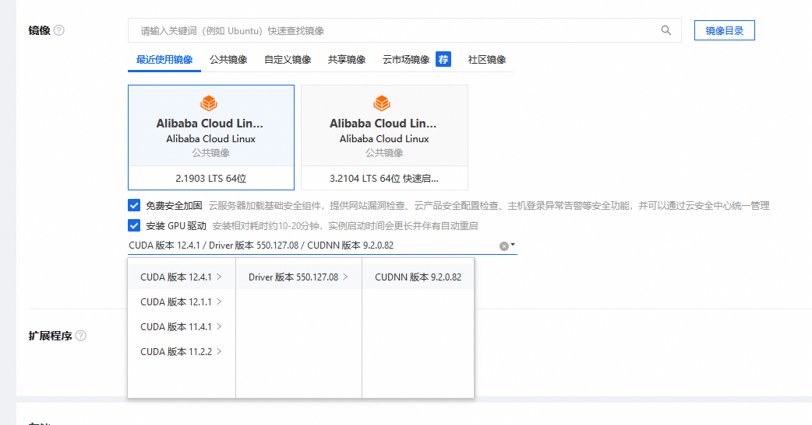
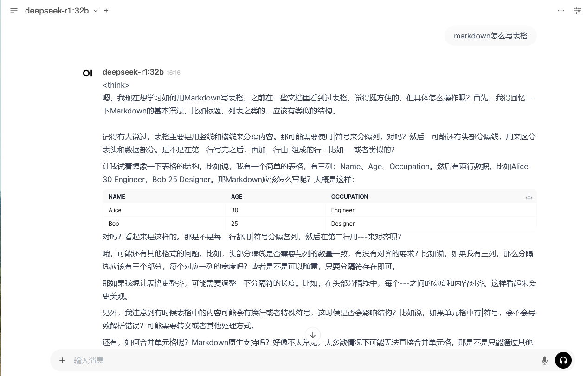

# 在linux上运行大模型deepseek r1

先来看运行deepseek大模型需要的配置，以阿里云主机为例，[deepseek-r1](https://ollama.com/library/deepseek-r1)

| 模型规格|	显卡显存|	磁盘占用|	ECS主机规格|	主机配置 |
|:---:|:---:|:---:|:---:|:---:|
| 1.5b|	-|	1.1G	|ecs.c7.xlarge|	4核8G|
| 7b	|8G|	4.7G|	ecs.gn7r-c16g1.4xlarge|	16核64G/ NVIDIA GA107 16G|
| 8b	|8G|	4.7G|	ecs.gn7r-c16g1.4xlarge|	16核64G/ NVIDIA GA107 16G|
|14b	|16G|	9G|	ecs.gn7r-c16g1.4xlarge	|16核64G/ NVIDIA GA107 16G|
|32b	|24G|	20G	|ecs.gn7i-c16g1.4xlarge	|16核60G/        NVIDIA A10 24G|
|70b	|48G	|43G|	ecs.gn7i-2x.8xlarge	|32核128G/2 * NVIDIA A10 24G|
|671b	|480G	|404G	|ecs.ebmgn8v.48xlarge(768G显存)	|192核1024G/8 * NVIDIA H 96G|

运行deepseek-r1:1.5b 没有显卡也是可以的，其他模型需要独立显卡

#### 第一步，创建主机，安装驱动



选择镜像时，把GPU驱动安装一下，如果没有安装后续可以手动安装

#### 二，安装ollama，启动服务

```
wget https://github.com/ollama/ollama/releases/download/v0.5.7/ollama-linux-amd64.tgz
tar -C /usr -xzf ollama-linux-amd64.tgz
useradd -r -s /bin/false -U -m -d /usr/share/ollama ollama
usermod -a -G ollama $(whoami)
cat > /etc/systemd/system/ollama.service << EOF
[Unit]
Description=Ollama Service
After=network-online.target
 
[Service]
ExecStart=/usr/bin/ollama serve
User=ollama
Group=ollama
Restart=always
RestartSec=3
Environment="PATH=$PATH"
Environment="OLLAMA_HOST=0.0.0.0"
 
[Install]
WantedBy=default.target
EOF
 
systemctl daemon-reload
systemctl start ollama
ollama pull deepseek-r1:32b
ollama list
```

#### 三，安装docker

```
yum-config-manager --add-repo http://mirrors.aliyun.com/docker-ce/linux/centos/docker-ce.repo
yum install docker-ce-24.0.9 docker-ce-cli-24.0.9 containerd.io
systemctl enable docker
systemctl start docker
```

上传docker-compose二进制文件到 /usr/bin/ 下，docker-compose文件官方下载 https://docs.docker.com/compose/install/

#### 四，使用open-webui界面与deepseek聊天

```
# cat docker-compose.yaml
version: '3'
services:
  openwebui:
    container_name: openwebui
    image: swr.cn-north-4.myhuaweicloud.com/ddn-k8s/ghcr.io/open-webui/open-webui:v0.5.4
    restart: always
    environment:
      OPENAI_API_BASE_URL: "None"
      OLLAMA_BASE_URL: "http://127.0.0.1:11434"
      HF_HUB_OFFLINE: 1
      GUPS: "all"
      ADD_HOST: "host.docker.internal:host-gateway"
    network_mode: "host"
    volumes:
      - ./openwebui:/app/backend/data
```

浏览器打开 http://IP_address:8080 输入用户名 admin,邮箱 admin@123.com, 密码123456，就能登录到后台。这样直接在web端聊天




2025年2月10日 于 [linux工匠](https://bbotte.github.io/) 发表