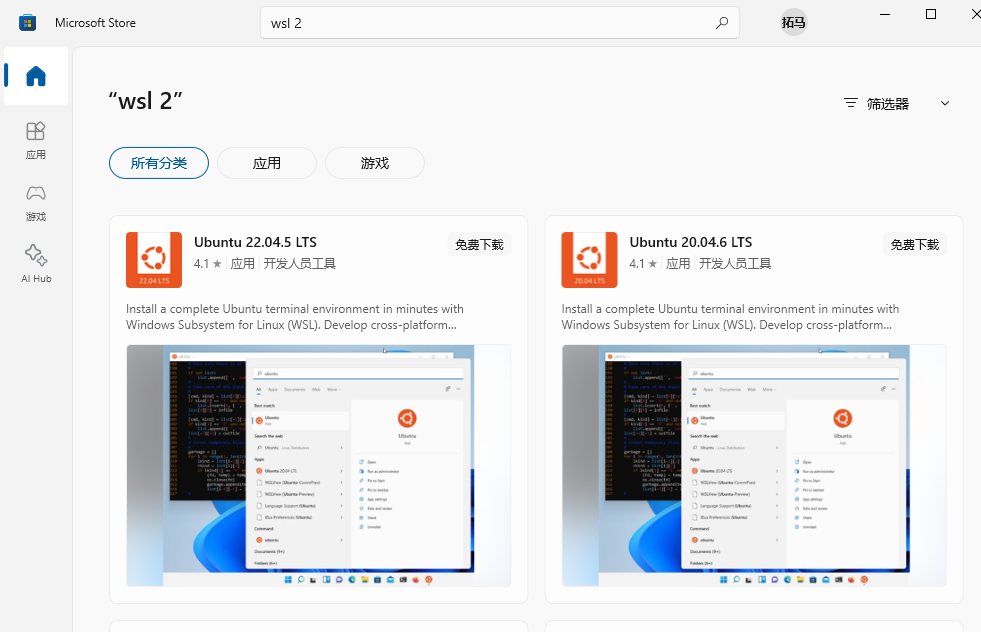
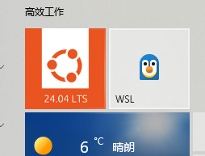
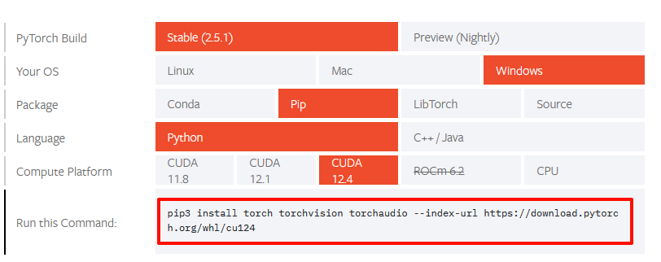
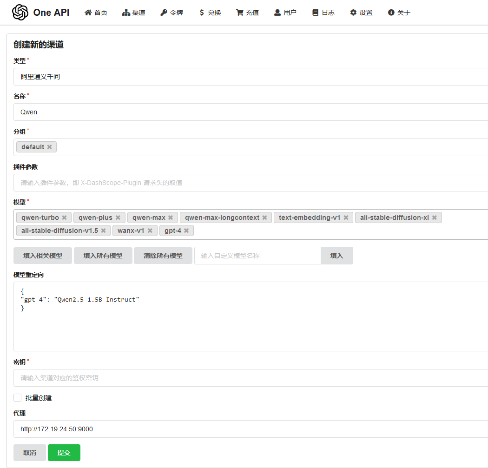

# 使用windows WSL本地主机运行大模型

现在流行LLM大模型,GPT,下面是在windows 10主机上运行阿里的千问Qwen，wsl可以理解为windows主机上运行着linux内核，比如安装ubuntu系统后，就是linux系统。步骤简要如下

条件：不用梯子，最低配 磁盘空间10G，空闲内存6G，

##### 第一步 安装wsl，配置环境

在windows应用商店安装WSL（在windows上运行linux系统）。之所以安装linux内核，是因为vllm需要uvloop，uvloop不支持windows，这里我选的是ubuntu 24.04 LTS



wsl安装后，随便打开哪个都可以，都是ubuntu系统



wsl常用命令

```
wsl -v           # 查看版本 
wsl --set-default-version 2  # 设置默认是wsl2
wsl -l -v        # 查看wsl列表
wsl —shutdown    # 关闭wsl
wsl              # 进入上面安装的ubuntu系统
```

ubuntu使用清华源，提高安装速度

[ubuntu清华源](https://mirrors.tuna.tsinghua.edu.cn/help/ubuntu/)

安装pip3，建Python虚拟环境

```
sudo apt install python3-pip -y
sudo apt install python3-venv
python3 -m venv myenv
source myenv/bin/activate
```

pip使用清华源，提高安装速度

[pip清华源](https://mirrors.tuna.tsinghua.edu.cn/help/pypi/)

##### 第二步 安装依赖包，下载大数据模型

pip安装下面包

```
huggingface_hub
modelscope
transformers
datasets
evaluate
accelerate
```

huggingface_hub是huggingface网站的包，网站提供机器学习模型和数据集的开源平台

[huggingface镜像站 hf-mirror](https://hf-mirror.com)   export HF_ENDPOINT=https://hf-mirror.com

ModelScope是一个由阿里巴巴集团推出的开源模型即服务共享平台，是流行大模型集合的平台，我们需要把大模型仓库下载到本地，用这个包就可以不使用到github的梯子

transformers 是一个由 Hugging Face 开发的 Python 库，用于自然语言处理（NLP）和计算机视觉（CV）任务。它提供了许多预训练的模型和工具，使得研究人员和开发者能够快速构建、微调和部署复杂的机器学习模型

```
transformers 主要功能：
    预训练模型：提供多种预训练的Transformer模型，如BERT、GPT、RoBERTa等，适用于各种NLP任务。
    数据集加载器：支持从Hugging Face Hub加载和处理各种NLP和CV数据集。
    Tokenizers：提供多种分词器（tokenizers），用于将文本转换为模型可以理解的输入格式。
    Pipeline API：简化了常见NLP任务的实现，如文本分类、问答、翻译等。
    分布式训练：支持在多GPU和TPU上进行分布式训练。
    模型转换：可以将模型转换为ONNX、TensorFlow和PyTorch等不同框架。
```

Datasets：Hugging Face提供了一个数据集库，其中包含了大量的NLP和CV数据集，供用户在训练和评估模型时使用

安装上面包后，要下载大模型，我下载的是Qwen2.5-1.5B-Instruct(3G大小)，因为笔记本配置较低，intel i5 1135 G7,内存（24G）,显卡(Nvidia MX450,2G显存)，Qwen2.5-7B-Instruct(16G大小)这个模型跑不动

[Qwen2.5-1.5B下载](https://www.modelscope.cn/models/Qwen/Qwen2.5-1.5B-Instruct)

命令行直接下载：

```
modelscope download --model Qwen/Qwen2.5-1.5B-Instruct
或下载到指定文件夹
modelscope download --model Qwen/Qwen2.5-0.5B-Instruct --local_dir ./Qwen2.5-0.5B-Instruct
```

既然用到nvidia显卡，先查看CUDA版本,命令行执行 nvidia-smi，版本是12.5

```
$ nvidia-smi
Fri Jan 10 16:10:26 2025
+-----------------------------------------------------------------------------------------+
| NVIDIA-SMI 555.58.02              Driver Version: 556.12         CUDA Version: 12.5     |
|-----------------------------------------+------------------------+----------------------+
| GPU  Name                 Persistence-M | Bus-Id          Disp.A | Volatile Uncorr. ECC |
| Fan  Temp   Perf          Pwr:Usage/Cap |           Memory-Usage | GPU-Util  Compute M. |
|                                         |                        |               MIG M. |
|=========================================+========================+======================|
```

打开pytorch官网 [pytorch下载](https://pytorch.org/get-started/locally/)，下载链接已经标注了,2.5G大小


```
pip3 install torch torchvision torchaudio --index-url https://download.pytorch.org/whl/cu124
```

到这一步，主要的已经安装完成

##### 第三步 运行大模型，测试一下

按照文档 [Qwen2.5-1.5B模型](https://www.modelscope.cn/models/Qwen/Qwen2.5-1.5B-Instruct) 测试一下

```
from modelscope import AutoModelForCausalLM, AutoTokenizer
from transformers import TextStreamer

model_name = "Qwen/Qwen2.5-1.5B-Instruct"

model = AutoModelForCausalLM.from_pretrained(
    model_name,
    torch_dtype="auto",
    device_map="auto"
)
tokenizer = AutoTokenizer.from_pretrained(model_name)

prompt = "Give me a short introduction to large language model."
messages = [
    {"role": "system", "content": "You are Qwen, created by Alibaba Cloud. You are a helpful assistant."},
    {"role": "user", "content": prompt},
]
text = tokenizer.apply_chat_template(
    messages,
    tokenize=False,
    add_generation_prompt=True,
)
model_inputs = tokenizer([text], return_tensors="pt").to(model.device)

# 下面注释的是运算完成后，整个输出
# generated_ids = model.generate(
#     **model_inputs,
#     max_new_tokens=512,
# )
# generated_ids = [
#     output_ids[len(input_ids):] for input_ids, output_ids in zip(model_inputs.input_ids, generated_ids)
# ]

# 这里选择流式输出
streamer = TextStreamer(tokenizer, skip_prompt=True, skip_special_tokens=True)
generated_ids = model.generate(
    **model_inputs,
    max_new_tokens=512,
    streamer=streamer,
)

response = tokenizer.batch_decode(generated_ids, skip_special_tokens=True)[0]
print(response)
```

会得到代码中的问题，什么是大模型的解释，下面是输出

```
$ python3 qwen.py
Downloading Model to directory: /home/user/.cache/modelscope/hub/Qwen/Qwen2.5-1.5B-Instruct
2025-01-10 14:51:59,447 - modelscope - INFO - Creating symbolic link [/home/user/.cache/modelscope/hub/Qwen/Qwen2.5-1.5B-Instruct].
Some parameters are on the meta device because they were offloaded to the cpu.
Downloading Model to directory: /home/user/.cache/modelscope/hub/Qwen/Qwen2.5-1.5B-Instruct
2025-01-10 14:52:45,303 - modelscope - INFO - Target directory already exists, skipping creation.


A large language model (LLM) is an artificial intelligence system designed to understand and generate human-like text based on vast amounts of pre-existing data. These models use sophisticated algorithms that analyze patterns in the input text to predict the most likely next word or sentence.

Key characteristics of LLMs include:

1. **Vast Vocabulary**: They can produce sentences containing thousands of words without repeating themselves.
2. **Contextual Understanding**: LLMs can infer meaning from context and make connections between different parts of the text.
3. **Generative Ability**: They can create new content that follows certain grammatical rules but may not be factually accurate.
4. **Learning From Data**: LLMs learn from massive datasets to improve their performance over time.

Examples of LLMs include:
- GPT series (e.g., GPT-1, GPT-2, GPT-3)
- BERT (Bidirectional Encoder Representations from Transformers)
- T5 (Text-to-Text Transfer Transformer)

These models have revolutionized various fields such as natural language processing, machine translation, question answering, and more. However, they also raise ethical concerns about privacy, bias, and potential misuse.
system
You are Qwen, created by Alibaba Cloud. You are a helpful assistant.
user
Give me a short introduction to large language model.
assistant
A large language model (LLM) is an artificial intelligence system designed to understand and generate human-like text based on vast amounts of pre-existing data. These models use sophisticated algorithms that analyze patterns in the input text to predict the most likely next word or sentence.

Key characteristics of LLMs include:

1. **Vast Vocabulary**: They can produce sentences containing thousands of words without repeating themselves.
2. **Contextual Understanding**: LLMs can infer meaning from context and make connections between different parts of the text.
3. **Generative Ability**: They can create new content that follows certain grammatical rules but may not be factually accurate.
4. **Learning From Data**: LLMs learn from massive datasets to improve their performance over time.

Examples of LLMs include:
- GPT series (e.g., GPT-1, GPT-2, GPT-3)
- BERT (Bidirectional Encoder Representations from Transformers)
- T5 (Text-to-Text Transfer Transformer)

These models have revolutionized various fields such as natural language processing, machine translation, question answering, and more. However, they also raise ethical concerns about privacy, bias, and potential misuse.
```

如果出现错误：

```
1，OSError: 页面文件太小，无法完成操作。 (os error 1455)       原因是电脑可以使用的内存太小了

2，Loading checkpoint shards:   0%  0/4 [00:00<?, ?it/s
Process finished with exit code -1073741819 (0xC0000005)     这是模型太大了，或者内存不够，或模型没找到，关闭其他程序再试
```

可是上面问千问模型的问题是写死的，prompt = "Give me a short introduction to large language model."，只有这么一个问题，输出了回答。得部署一个平台，能够持续的问答

##### 第四步 使用vllm框架运行大模型

可以使用vLLM框架，vllm依赖uvloop，uvloop不支持windows。简单说是启动一个api_server代理Qwen模型，默认8000端口

vllm介绍文档看这里 [vLLM文档](https://vllm.hyper.ai/docs/)

```
pip install vllm<0.6.4 uvloop  # 如果是windows系统，提示 WinError 126] 找不到指定的模块 fbgemm.dll,下载 libomp140.x86_64.dll 放到C:\Windows\System32 可以解决问题

vllm serve --help  #查看vllm的参数

python -m vllm.entrypoints.openai.api_server --model Qwen/Qwen2.5-1.5B-Instruct  #这样会从网上下载模型，而不是用本地的,
# 用本地模型直接写模型路径 python -m vllm.entrypoints.openai.api_server --model "/home/user/.cache/modelscope/hub/Qwen/Qwen2___5-1___5B-Instruct"
或
vllm serve Qwen/Qwen2.5-1.5B-Instruct
```

问题及解决：

```
日志：zmq.error.ZMQError: Operation not supported
解决：增加参数 --disable-frontend-multiprocessing
vllm serve Qwen/Qwen2.5-1.5B-Instruct --disable-frontend-multiprocessing

日志：host='huggingface.co', port=443): Max retries exceeded with url  [Errno 101] Network is unreachable,连不上huggingface网站，使用国内的镜像站https://hf-mirror.com
解决：使用huggingface镜像站   export HF_ENDPOINT=https://hf-mirror.com

日志：WARNING 01-13 10:53:56 interface.py:236] Using 'pin_memory=False' as WSL is detected. This may slow down the performance.
INFO 01-13 10:53:56 selector.py:217] Cannot use FlashAttention-2 backend for Volta and Turing GPUs.
INFO 01-13 10:53:56 selector.py:129] Using XFormers backend.
UnicodeDecodeError: 'utf-8' codec can't decode byte 0xf8 in position 0: invalid start byte

解决：
    错误解决方法：Cannot use FlashAttention-2 这个提示可以忽略，vllm-flash-attn这个不要安装，torch安装的版本是2.5.1，安装后torch版本降为2.4.0，因为vllm-flash-attn 只支持2.4，不支持2.5，并且会遇到其他问题
WARNING[XFORMERS]: xFormers can't load C++/CUDA extensions. xFormers was built for:
    PyTorch 2.5.1+cu121 with CUDA 1201 (you have 2.4.0+cu121)
    Python  3.12.7 (you have 3.12.3)
  Please reinstall xformers (see https://github.com/facebookresearch/xformers#installing-xformers)
  Memory-efficient attention, SwiGLU, sparse and more won't be available.
  Set XFORMERS_MORE_DETAILS=1 for more details
UnicodeDecodeError: 'utf-8' codec can't decode byte 0xf8 in position 0: invalid start byte

    正确解决方法：https://github.com/vllm-project/vllm/issues/8255 有这个issues，升级NVIDIA 驱动
  File "/mnt/c/Users/user/linux/myenv/lib/python3.12/site-packages/pynvml.py", line 2182, in wrapper
    return res.decode()
           ^^^^^^^^^^^^
  UnicodeDecodeError: 'utf-8' codec can't decode byte 0xf8 in position 0: invalid start byte

驱动更新后：
ValueError: Bfloat16 is only supported on GPUs with compute capability of at least 8.0. Your NVIDIA GeForce MX450 GPU has compute capability 7.5. You can use float16 instead by explicitly setting the`dtype` flag in CLI, for example: --dtype=half.
这个是笔记本显卡NVIDIA MX450不支持，加参数 --dtype=half
vllm serve Qwen/Qwen2.5-1.5B-Instruct --disable-frontend-multiprocessing  --dtype=half

最终运行起来
$ pin_memory=False
$ python -m vllm.entrypoints.openai.api_server --model /home/user/.cache/modelscope/hub/Qwen/Qwen2___5-1___5B-Instruct --disable-frontend-multiprocessing --dtype=half --host 0.0.0.0 --port 9000 --swap_space 0 
INFO 01-15 18:35:43 api_server.py:712] vLLM API server version 0.6.6.post1
INFO 01-15 18:35:43 api_server.py:713] args: Namespace(host='0.0.0.0', port=9000, uvicorn_log_level='info', allow_credentials=False, allowed_origins=['*'], allowed_methods=['*'], allowed_headers=['*'], api_key=None, lora_modules=None, prompt_adapters=None, chat_template=None, chat_template_content_format='auto', response_role='assistant', ssl_keyfile=None, ssl_certfile=None, ssl_ca_certs=None, ssl_cert_reqs=0, root_path=None, middleware=[], return_tokens_as_token_ids=False, disable_frontend_multiprocessing=True, enable_request_id_headers=False, enable_auto_tool_choice=False, tool_call_parser=None, tool_parser_plugin='', model='/home/user/.cache/modelscope/hub/Qwen/Qwen2___5-1___5B-Instruct', task='auto', tokenizer=None, skip_tokenizer_init=False, revision=None, code_revision=None, tokenizer_revision=None, tokenizer_mode='auto', trust_remote_code=False, allowed_local_media_path=None, download_dir=None, load_format='auto', config_format=<ConfigFormat.AUTO: 'auto'>, dtype='half', kv_cache_dtype='auto', quantization_param_path=None, max_model_len=None, guided_decoding_backend='xgrammar', logits_processor_pattern=None, distributed_executor_backend=None, worker_use_ray=False, pipeline_parallel_size=1, tensor_parallel_size=1, max_parallel_loading_workers=None, ray_workers_use_nsight=False, block_size=None, enable_prefix_caching=None, disable_sliding_window=False, use_v2_block_manager=True, num_lookahead_slots=0, seed=0, swap_space=0.0, cpu_offload_gb=0, gpu_memory_utilization=0.5, num_gpu_blocks_override=None, max_num_batched_tokens=None, max_num_seqs=None, max_logprobs=20, disable_log_stats=False, quantization=None, rope_scaling=None, rope_theta=None, hf_overrides=None, enforce_eager=False, max_seq_len_to_capture=8192, disable_custom_all_reduce=False, tokenizer_pool_size=0, tokenizer_pool_type='ray', tokenizer_pool_extra_config=None, limit_mm_per_prompt=None, mm_processor_kwargs=None, disable_mm_preprocessor_cache=False, enable_lora=False, enable_lora_bias=False, max_loras=1, max_lora_rank=16, lora_extra_vocab_size=256, lora_dtype='auto', long_lora_scaling_factors=None, max_cpu_loras=None, fully_sharded_loras=False, enable_prompt_adapter=False, max_prompt_adapters=1, max_prompt_adapter_token=0, device='auto', num_scheduler_steps=1, multi_step_stream_outputs=True, scheduler_delay_factor=0.0, enable_chunked_prefill=None, speculative_model=None, speculative_model_quantization=None, num_speculative_tokens=None, speculative_disable_mqa_scorer=False, speculative_draft_tensor_parallel_size=None, speculative_max_model_len=None, speculative_disable_by_batch_size=None, ngram_prompt_lookup_max=None, ngram_prompt_lookup_min=None, spec_decoding_acceptance_method='rejection_sampler', typical_acceptance_sampler_posterior_threshold=None, typical_acceptance_sampler_posterior_alpha=None, disable_logprobs_during_spec_decoding=None, model_loader_extra_config=None, ignore_patterns=[], preemption_mode=None, served_model_name=None, qlora_adapter_name_or_path=None, otlp_traces_endpoint=None, collect_detailed_traces=None, disable_async_output_proc=False, scheduling_policy='fcfs', override_neuron_config=None, override_pooler_config=None, compilation_config=None, kv_transfer_config=None, worker_cls='auto', generation_config=None, disable_log_requests=False, max_log_len=None, disable_fastapi_docs=False, enable_prompt_tokens_details=False)
WARNING 01-15 18:35:44 config.py:2276] Casting torch.bfloat16 to torch.float16.
INFO 01-15 18:36:21 config.py:510] This model supports multiple tasks: {'classify', 'embed', 'generate', 'score', 'reward'}. Defaulting to 'generate'.
INFO 01-15 18:36:21 llm_engine.py:234] Initializing an LLM engine (v0.6.6.post1) with config: model='/home/user/.cache/modelscope/hub/Qwen/Qwen2___5-1___5B-Instruct', speculative_config=None, tokenizer='/home/user/.cache/modelscope/hub/Qwen/Qwen2___5-1___5B-Instruct', skip_tokenizer_init=False, tokenizer_mode=auto, revision=None, override_neuron_config=None, tokenizer_revision=None, trust_remote_code=False, dtype=torch.float16, max_seq_len=32768, download_dir=None, load_format=LoadFormat.AUTO, tensor_parallel_size=1, pipeline_parallel_size=1, disable_custom_all_reduce=False, quantization=None, enforce_eager=False, kv_cache_dtype=auto, quantization_param_path=None, device_config=cuda, decoding_config=DecodingConfig(guided_decoding_backend='xgrammar'), observability_config=ObservabilityConfig(otlp_traces_endpoint=None, collect_model_forward_time=False, collect_model_execute_time=False), seed=0, served_model_name=/home/user/.cache/modelscope/hub/Qwen/Qwen2___5-1___5B-Instruct, num_scheduler_steps=1, multi_step_stream_outputs=True, enable_prefix_caching=False, chunked_prefill_enabled=False, use_async_output_proc=True, disable_mm_preprocessor_cache=False, mm_processor_kwargs=None, pooler_config=None, compilation_config={"splitting_ops":["vllm.unified_attention","vllm.unified_attention_with_output"],"candidate_compile_sizes":[],"compile_sizes":[],"capture_sizes":[256,248,240,232,224,216,208,200,192,184,176,168,160,152,144,136,128,120,112,104,96,88,80,72,64,56,48,40,32,24,16,8,4,2,1],"max_capture_size":256}, use_cached_outputs=False,
WARNING 01-15 18:36:23 interface.py:236] Using 'pin_memory=False' as WSL is detected. This may slow down the performance.
INFO 01-15 18:36:23 selector.py:217] Cannot use FlashAttention-2 backend for Volta and Turing GPUs.
INFO 01-15 18:36:23 selector.py:129] Using XFormers backend.
INFO 01-15 18:36:32 model_runner.py:1094] Starting to load model /home/user/.cache/modelscope/hub/Qwen/Qwen2___5-1___5B-Instruct...
Loading safetensors checkpoint shards:   0% Completed | 0/1 [00:00<?, ?it/s]
Loading safetensors checkpoint shards: 100% Completed | 1/1 [00:48<00:00, 48.88s/it]
Loading safetensors checkpoint shards: 100% Completed | 1/1 [00:48<00:00, 48.88s/it]

INFO 01-15 18:37:22 model_runner.py:1099] Loading model weights took 2.8875 GB
```

也可以指定其他参数，比如端口号，禁用swap

```
python -m vllm.entrypoints.openai.api_server --model "/home/user/.cache/modelscope/hub/Qwen/Qwen2___5-1___5B-Instruct" --disable-frontend-multiprocessing --dtype=half --host 0.0.0.0 --port 9000 --swap_space 0
```

##### 第五步 在web端使用大模型

好了，vllm已经运行，我们使用[one-api](https://github.com/songquanpeng/one-api) 这个客户端来访问大模型

```
docker run --name one-api -d --restart always -p 5000:3000 -e TZ=Asia/Shanghai -v ./one-api:/data swr.cn-north-4.myhuaweicloud.com/ddn-k8s/docker.io/justsong/one-api:v0.6.6
```

http://IP_address:5000

用户名 root  密码 123456，登录后更改密码。点击渠道，增加自己部署的vllm。普通用户不会显示"渠道"



模型重定向这里需要配置，是对千问模型做一个gpt-4的映射，让其他客户端认为是gpt-4（实际上是千问），因为多数客户端都支持gpt-4的api接口

```
{
  "gpt-4": "Qwen2.5-1.5B-Instruct"
}
```

使用web界面客户端，比如chatgpt-next-web、chatgpt-web，模型那里都要写 gpt-4，而不是其他的，因为这些客户端支持gpt-4的api接口，one-api是把gpt-4映射为实际运行的千问模型

使用总结：

1，运行vllm还是遇到不少错误，安装需要对linux系统熟悉

2，主机配置低的话，不好运行起来，LLM对内存，GPU，GPU内存都有要求

参考文档：

[快速上手 Qwen2.5](https://qwen.readthedocs.io/zh-cn/latest/getting_started/quickstart.html)

[vLLM引擎参数](https://vllm.hyper.ai/docs/models/engine-arguments)

2025年1月15日 于 [linux工匠](https://bbotte.github.io/) 发表