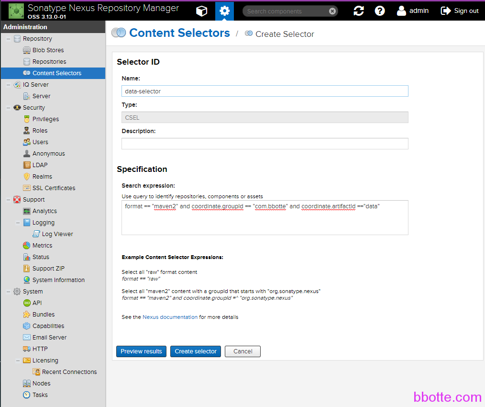

# Nexus Repository权限配置管理

java仓库nexus的权限配置管理，比如开通nexus仓库只读权限给指定的开发者



加入某开发需要访问Components： maven-releases 的 data文件夹下所有jar包
仓库配置：
Repository — Conten Selectors
Name: data-selector
Specification:

```
format == "maven2" and coordinate.groupId == "com.bbotte" and coordinate.artifactId =="data"
```

安全设置：

Security — Privileges — Create privilege — Repository Content Selector
Name:  bbotte.com.data.release.read
Content Selector:  data-selector
Reposltory:  maven-releases
Actions:  browse,read

安全规则：
Security — Roles — Create role
Role ID: data-read
Role name: data读权限
Privileges — Given：

```
nx-repository-view-maven2-maven-public-browse #添加公共库读权限
bbotte.com.data.release.read #data文件夹读权限
```

创建开发者用户：

Security — Users — Create user
ID:
First name:
Last name:
Email:
Status: Active
Roles — Granted:

```
data-geign读权限
```

使用此用户登录nexus即可

nexus新版本增加了上传jar包的功能，不用命令行也可上传

http://nexu_IP:8081/#browse/upload:maven-releases

2018年09月06日 于 [linux工匠](http://www.bbotte.com/) 发表