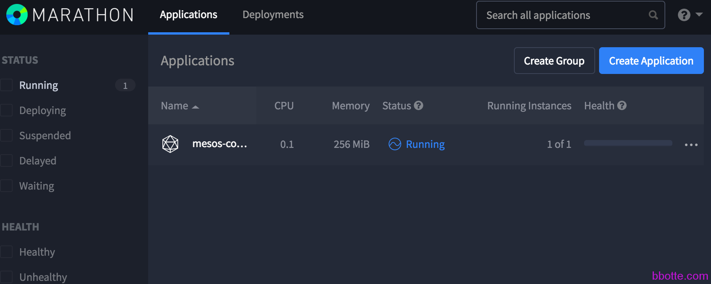
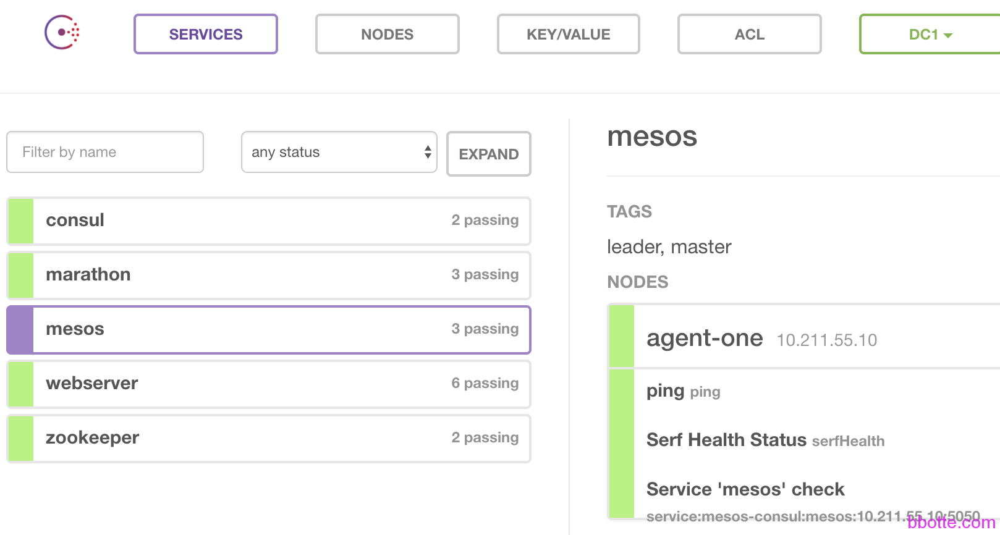

# linux工匠之mesos marathon consul的集群试验

1. 服务说明
2. consul的配置如下
3. bind服务配置
4. 注册consul服务

### 服务说明

我们今天做mesos、marathon和consul的集成试验，通过consul的自动发现，配合named服务，在docker容器中能够自动识别服务的域名，以便在mesos+marathon中部署docker实例能够通过域名互通。也就是consul在docker容器中的自动发现。

如果是线上，consul server最少是3台做集群，consul client是每个mesos-slave上跑一个，mesos-master也最少3台集群，marathon和zookeeper、bind都应该是集群的模式。集群配置在前两篇博文有说明，[consul集群的服务注册发现和模板使用](http://bbotte.com/server-config/consul-cluster-service-with-registry-and-discovery-and-template-usage/)  [小议mesos marathon和chronos构建分布式系统](http://bbotte.com/server-config/use-mesos-and-marathon-and-chronos-to-construction-distributed-systems/)，请予查看。

```
# cat /etc/centos-release
CentOS Linux release 7.2.1511 (Core)
# named -v
BIND 9.9.4-RedHat-9.9.4-29.el7_2.4 (Extended Support Version)
# consul -v
Consul v0.7.0
# docker -v
Docker version 1.12.2, build bb80604
```

部署结构说明，总共3台虚拟机：

```
master     mesos-master  marathon   consul-server  bind  10.211.55.10
slave      mesos-slave   docker     consul-client        10.211.55.16
vm01        zookeeper               consul-client        10.211.55.4
```

### consul的配置如下

```
[root@master ~]# consul agent -server -bootstrap-expect=1 -data-dir=/tmp/consul -node=agent-one -bind=10.211.55.10 -config-dir=/etc/consul.d -client 0.0.0.0 -dc=dc1 -ui &
[root@slave ~]# consul agent -advertise 10.211.55.16 -data-dir=/tmp/consul -config-dir=/etc/consul.d -node=agent-slave -bind=10.211.55.16 -join 10.211.55.10 -dc=dc1 &
[root@vm01 ~]# consul agent -advertise 10.211.55.4 -data-dir=/tmp/1/consul -config-dir=/etc/consul.d -node=zookeeper -bind=10.211.55.4 -join 10.211.55.10 -dc=dc1 &
 
[root@master ~]# consul members
    2016/12/07 03:57:02 [INFO] agent.rpc: Accepted client: 127.0.0.1:55339
Node         Address            Status  Type    Build  Protocol  DC
agent-one    10.211.55.10:8301  alive   server  0.7.0  2         dc1
agent-slave  10.211.55.16:8301  alive   client  0.7.0  2         dc1
zookeeper    10.211.55.4:8301   alive   client  0.7.0  2         dc1
```

### bind服务配置

```
[root@master ~]# yum install bind-utils -y   #dig命令
[root@master ~]# yum install bind 
[root@master ~]# cat /etc/named.conf
options {
        listen-on port 53 { 127.0.0.1; };
        listen-on-v6 port 53 { ::1; };
        directory       "/var/named";
        dump-file       "/var/named/data/cache_dump.db";
        statistics-file "/var/named/data/named_stats.txt";
        memstatistics-file "/var/named/data/named_mem_stats.txt";
        allow-query     { localhost; };
 
        recursion yes;
 
        #dnssec-enable yes;
        dnssec-enable no;
        #dnssec-validation yes;
        dnssec-validation no;
 
        /* Path to ISC DLV key */
        bindkeys-file "/etc/named.iscdlv.key";
 
        managed-keys-directory "/var/named/dynamic";
 
        pid-file "/run/named/named.pid";
        session-keyfile "/run/named/session.key";
};
 
logging {
        channel default_debug {
                file "data/named.run";
                severity dynamic;
        };
};
 
zone "." IN {
        type hint;
        file "named.ca";
};
 
include "/etc/named.rfc1912.zones";
include "/etc/named.root.key";
include "/etc/named/consul.conf";
 
[root@master ~]# cat /etc/named/consul.conf
zone "consul" IN {
  type forward;
  forward only;
  forwarders { 127.0.0.1 port 8600; };
};
 
# systemctl restart named
```

### 注册consul服务

在master主机注册marathon服务

```
[root@master ~]# cat /etc/consul.d/marathon.json
{"service": {"name": "marathon", "tags": ["marathon"], "port": 8080, "check": {"script": "curl 127.0.0.1:8080 >/dev/null 2>&1", "interval": "10s"}}}
```

在vm01主机注册zookeeper服务

```
[root@vm01 ~]# cat /etc/consul.d/zookeeper.json
{"service": {"name": "zookeeper", "tags": ["zookeeper"], "port": 2181}}
```


ok，来master主机测试dig的结果

```
[root@master ~]# dig @localhost -p 8600 consul.service.consul +short
10.211.55.10
[root@master ~]# dig @127.0.0.1 -p 8600 consul.service.consul SRV +short
1 1 8300 agent-one.node.dc1.consul.
[root@master ~]# dig @localhost -p 8600 zookeeper.service.consul +short
10.211.55.4
[root@master ~]# dig @localhost -p 53 zookeeper.service.consul +short
10.211.55.4
[root@master ~]# dig @localhost zookeeper.service.consul +short
10.211.55.4
```

因为在docker中用到bind服务，所以修改docker的配置，添加dns选项：

```
[root@slave ~]# egrep -v "^$|^#" /etc/sysconfig/docker
OPTIONS='--log-driver=journald --dns 10.211.55.10 --dns-search service.consul'
DOCKER_CERT_PATH=/etc/docker
# systemctl restart docker
```

终于上面都完成了，开始最后的试验：在mesos-master中新建一个application，并且在mesos-slave主机查看docker的运行情况

```
[root@master ~]# cat mesos-consul.json
{
  "args": [
    "--zk=zk://zookeeper.service.consul:2181/mesos",
    "--log-level=debug",
    "--consul",
    "--refresh=5s"
  ],
  "container": {
    "type": "DOCKER",
    "docker": {
      "network": "BRIDGE",
      "image": "ciscocloud/mesos-consul"
    }
  },
  "id": "mesos-consul",
  "instances": 1,
  "cpus": 0.1,
  "mem": 256
}
[root@master ~]# curl -X POST -H "Content-Type: application/json" http://10.211.55.10:8080/v2/apps -d @mesos-consul.json
{"id":"/mesos-consul","cmd":null,"args":["--zk=zk://zookeeper.service.consul:2181/mesos","--log-level=debug","--consul","--refresh=5s"],"user":null,"env":{},"instances":1,"cpus":0.1,"mem":256,"disk":0,"gpus":0,"executor":"","constraints":[],"uris":[],"fetch":[],"storeUrls":[],"backoffSeconds":1,"backoffFactor":1.15,"maxLaunchDelaySeconds":3600,"container":{"type":"DOCKER","volumes":[],"docker":{"image":"ciscocloud/mesos-consul","network":"BRIDGE","portMappings":null,"privileged":false,"parameters":[],"forcePullImage":false}},"healthChecks":[],"readinessChecks":[],"dependencies":[],"upgradeStrategy":{"minimumHealthCapacity":1,"maximumOverCapacity":1},"labels":{},"acceptedResourceRoles":null,"ipAddress":null,"version":"2016-12-07T08:23:23.720Z","residency":null,"secrets":{},"taskKillGracePeriodSeconds":null,"ports":[0],"portDefinitions":[{"port":0,"protocol":"tcp","labels":{}}],"requirePorts":false,"tasksStaged":0,"tasksRunning":0,"tasksHealthy":0,"tasksUnhealthy":0,"deployments":[{"id":"f9c87ccd-1d1d-4718-9004-1ab1b49249b0"}],"tasks":[]}
 
因为docker没有ciscocloud/mesos-consul这个image，所以等待他下载完成后自动运行
[root@master ~]# curl http://0.0.0.0:8080/v2/apps/mesos-consul | python -m json.tool
```

```
[root@slave ~]# docker images|grep consul
docker.io/ciscocloud/mesos-consul                     latest              9733c42aa65d        4 months ago        15.01 MB
[root@slave ~]# docker ps
CONTAINER ID        IMAGE                     COMMAND                  CREATED              STATUS              PORTS               NAMES
0e4bfbc51998        ciscocloud/mesos-consul   "/bin/mesos-consul --"   About a minute ago   Up About a minute                       mesos-ecfc0bd0-dc7f-48c0-a2ba-21de888e9230-S0.10f970f3-08f3-46cc-a07f-727a61e88ae3
```



这时候已经完成了试验，不过似乎没发现什么，我们再来看consul的service，发现多了一个mesos



最终的结果是需要在docker中能够和consul提供的域名通信，所以启动一个docker镜像，在里面ping consul.service.consul 此域名查看

```
[root@slave ~]# docker run -it docker.io/nginx /bin/bash
root@a5959acf6785:/# ping consul.service.consul -c 1
PING consul.service.consul (10.211.55.10): 56 data bytes
64 bytes from 10.211.55.10: icmp_seq=0 ttl=63 time=0.262 ms
--- consul.service.consul ping statistics ---
1 packets transmitted, 1 packets received, 0% packet loss
round-trip min/avg/max/stddev = 0.262/0.262/0.262/0.000 ms
root@a5959acf6785:/#
root@a5959acf6785:/# ping zookeeper.service.consul -c 1
PING zookeeper.service.consul (10.211.55.4): 56 data bytes
64 bytes from 10.211.55.4: icmp_seq=0 ttl=63 time=0.366 ms
--- zookeeper.service.consul ping statistics ---
1 packets transmitted, 1 packets received, 0% packet loss
round-trip min/avg/max/stddev = 0.366/0.366/0.366/0.000 ms
```

你会发现，在docker中已经可以访问consul服务注册的域名，这个才是重要的结果。我们不是常常用一个域名反代多个主机提供的服务来做集群的吗，consul正合适！

2016年12月08日 于 [linux工匠](http://www.bbotte.com/) 发表


