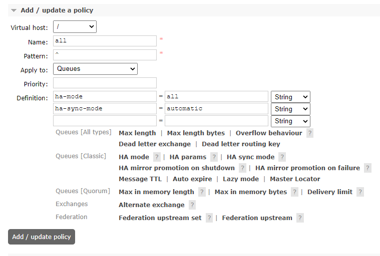

# 使用ansible-playbook一键安装rabbitmq集群

上一篇文章写了[ansible的入门帮助-命令查找与使用](https://bbotte.github.io/service_config/ansible-entry-help-command-find-and-use/)，通过ansible的帮助文档找到自己所需要的命令使用方法。这次用一个实例演示一下，使用ansible-playbook安装rabbitmq，下面直接放脚本

```
# egrep -v "^#|^$" /etc/ansible/hosts
[server]
10.211.55.4 host_name=vm01
10.211.55.5 host_name=vm02
10.211.55.6 host_name=vm03
```

```
# cat /root/ansible/hosts
127.0.0.1   localhost localhost.localdomain localhost4 localhost4.localdomain4
::1         localhost localhost.localdomain localhost6 localhost6.localdomain6
 
10.211.55.4 vm01
10.211.55.5 vm02
10.211.55.6 vm03
```

上面是ansible的hosts文件和本级的hosts文件，下面是rabbitmq的playbook，主要分为三个步骤：

1，设置hostname，关闭iptables

2，安装启动rabbitmq

3，配置rabbitmq的集群，vm01为rabbitmq的磁盘节点，vm02、vm03为内存节点

```
# vim rabbitmq.j2
#jinja2:  variable_start_string: "[%" , variable_end_string: "%]"
---
  - hosts: server
    remote_user: root
    vars:
      hostname: '[% host_name %]'
    tasks:
    - name: time sync
      command: ntpdate ntp1.aliyun.com
    - name: copy hosts file
      copy: src=/root/ansible/hosts dest=/etc/hosts owner=root group=root mode=0644 force='yes'
    - name: set hostname
      shell: 'hostname {{host_name}}'
      register: host_name_change
    - debug: msg='{{host_name_change.stdout}}'
    - name: close iptables
      service: name=iptables enabled=yes state=stopped
    - name: copy rabbitmq rpm
      copy: src=/root/rabbitmq-server-3.5.6-1.noarch.rpm dest=/tmp/  owner=root group=root mode=0644
    - name: yum erlang
      yum: name=erlang state=present
    - name: install rabbitmq.rpm
      yum: name=/tmp/rabbitmq-server-3.5.6-1.noarch.rpm state=present
    - name: mkdir /var/lib/rabbitmq
      shell: mkdir -p /var/lib/rabbitmq
    - name: create .erlang.cookie
      shell: echo PKPNUVGNFXZXIQYKLTTG > /var/lib/rabbitmq/.erlang.cookie
    - name: change .erlang.cookie attribute
      shell: chown rabbitmq.rabbitmq /var/lib/rabbitmq/.erlang.cookie; chmod 0400 /var/lib/rabbitmq/.erlang.cookie
    - name: copy erlang.cookie
      copy: src=/var/lib/rabbitmq/.erlang.cookie dest=/var/lib/rabbitmq/ owner=rabbitmq group=rabbitmq mode=0400
    - name: kill rabbitmq
      shell: rabbitmqctl stop; ps aux|grep rabbitmq|grep -v grep|awk '{print $2}'|xargs kill -9; rabbitmq-server -detached
    - name: start rabbitmq
      service: name=rabbitmq-server enabled=yes state=restarted
    - name: rabbitmq status
      shell: rabbitmqctl cluster_status
      register: result
    - debug: msg='{{result.stdout}}'
    - name: config rabbit cluster node 1
      shell: rabbitmqctl stop_app ;rabbitmqctl join_cluster --ram rabbit@vm01 ;rabbitmqctl start_app
      when: ansible_hostname == "vm02"
    - name: config rabbit cluster node 2
      shell: rabbitmqctl stop_app ;rabbitmqctl join_cluster --ram rabbit@vm01 ;rabbitmqctl start_app
      when: ansible_hostname == "vm03"
    - name: rabbitmq cluster status
      shell: rabbitmqctl cluster_status
      register: rabbit_cluster_status
    - debug: msg='{{rabbit_cluster_status.stdout}}'
```

上述ansible-playbook用到了shell、yum、复制文件、新建文件夹、启动关闭服务、输出task的日志、根据主机名执行task等

下面是ansible-playbook的结果显示

```
# ansible-playbook rabbitmq.j2
 
PLAY ***************************************************************************
 
TASK [setup] *******************************************************************
ok: [10.211.55.5]
ok: [10.211.55.6]
ok: [10.211.55.4]
 
TASK [copy hosts file] *********************************************************
ok: [10.211.55.5]
ok: [10.211.55.6]
ok: [10.211.55.4]
 
TASK [set hostname] ************************************************************
changed: [10.211.55.5]
changed: [10.211.55.6]
changed: [10.211.55.4]
 
TASK [debug] *******************************************************************
ok: [10.211.55.5] => {
    "msg": ""
}
ok: [10.211.55.4] => {
    "msg": ""
}
ok: [10.211.55.6] => {
    "msg": ""
}
 
TASK [close iptables] **********************************************************
changed: [10.211.55.5]
changed: [10.211.55.6]
changed: [10.211.55.4]
 
TASK [copy rabbitmq rpm] *******************************************************
ok: [10.211.55.5]
ok: [10.211.55.6]
ok: [10.211.55.4]
 
TASK [yum erlang] **************************************************************
ok: [10.211.55.5]
ok: [10.211.55.6]
ok: [10.211.55.4]
 
TASK [install rabbitmq.rpm] ****************************************************
ok: [10.211.55.5]
ok: [10.211.55.6]
ok: [10.211.55.4]
 
TASK [mkdir /var/lib/rabbitmq] *************************************************
changed: [10.211.55.5]
 [WARNING]: Consider using file module with state=directory rather than running mkdir
 
changed: [10.211.55.6]
changed: [10.211.55.4]
 
TASK [create .erlang.cookie] ***************************************************
changed: [10.211.55.5]
changed: [10.211.55.6]
changed: [10.211.55.4]
 
TASK [change .erlang.cookie attribute] *****************************************
changed: [10.211.55.5]
 [WARNING]: Consider using file module with owner rather than running chown
 
changed: [10.211.55.6]
changed: [10.211.55.4]
TASK [copy erlang.cookie] ******************************************************
ok: [10.211.55.5]
ok: [10.211.55.6]
ok: [10.211.55.4]
 
TASK [kill rabbitmq] ***********************************************************
changed: [10.211.55.5]
changed: [10.211.55.6]
changed: [10.211.55.4]
 
TASK [start rabbitmq] **********************************************************
changed: [10.211.55.6]
changed: [10.211.55.5]
changed: [10.211.55.4]
 
TASK [rabbitmq status] *********************************************************
changed: [10.211.55.6]
changed: [10.211.55.5]
changed: [10.211.55.4]
 
TASK [debug] *******************************************************************
ok: [10.211.55.5] => {
    "msg": "Cluster status of node rabbit@vm02 ...\n[{nodes,[{disc,[rabbit@vm01]},{ram,[rabbit@vm03,rabbit@vm02]}]},\n {running_nodes,[rabbit@vm01,rabbit@vm03,rabbit@vm02]},\n {cluster_name,<<\"rabbit@vm01\">>},\n {partitions,[]}]"
}
ok: [10.211.55.4] => {
    "msg": "Cluster status of node rabbit@vm01 ...\n[{nodes,[{disc,[rabbit@vm01]},{ram,[rabbit@vm03,rabbit@vm02]}]},\n {running_nodes,[rabbit@vm02,rabbit@vm03,rabbit@vm01]},\n {cluster_name,<<\"rabbit@vm01\">>},\n {partitions,[]}]"
}
ok: [10.211.55.6] => {
 
 
    "msg": "Cluster status of node rabbit@vm03 ...\n[{nodes,[{disc,[rabbit@vm01]},{ram,[rabbit@vm03,rabbit@vm02]}]},\n {running_nodes,[rabbit@vm01,rabbit@vm02,rabbit@vm03]},\n {cluster_name,<<\"rabbit@vm01\">>},\n {partitions,[]}]"
}
 
TASK [config rabbit cluster node 1] ********************************************
skipping: [10.211.55.4]
skipping: [10.211.55.6]
changed: [10.211.55.5]
 
TASK [config rabbit cluster node 2] ********************************************
skipping: [10.211.55.5]
skipping: [10.211.55.4]
changed: [10.211.55.6]
 
TASK [rabbitmq cluster status] *************************************************
changed: [10.211.55.5]
changed: [10.211.55.6]
changed: [10.211.55.4]
 
TASK [debug] *******************************************************************
ok: [10.211.55.5] => {
    "msg": "Cluster status of node rabbit@vm02 ...\n[{nodes,[{disc,[rabbit@vm01]},{ram,[rabbit@vm03,rabbit@vm02]}]},\n {running_nodes,[rabbit@vm03,rabbit@vm01,rabbit@vm02]},\n {cluster_name,<<\"rabbit@vm01\">>},\n {partitions,[]}]"
}
ok: [10.211.55.4] => {
    "msg": "Cluster status of node rabbit@vm01 ...\n[{nodes,[{disc,[rabbit@vm01]},{ram,[rabbit@vm03,rabbit@vm02]}]},\n {running_nodes,[rabbit@vm03,rabbit@vm02,rabbit@vm01]},\n {cluster_name,<<\"rabbit@vm01\">>},\n {partitions,[]}]"
}
ok: [10.211.55.6] => {
    "msg": "Cluster status of node rabbit@vm03 ...\n[{nodes,[{disc,[rabbit@vm01]},{ram,[rabbit@vm03,rabbit@vm02]}]},\n {running_nodes,[rabbit@vm02,rabbit@vm01,rabbit@vm03]},\n {cluster_name,<<\"rabbit@vm01\">>},\n {partitions,[]}]"
}
 
PLAY RECAP *********************************************************************
10.211.55.4                : ok=19   changed=10    unreachable=0    failed=0
10.211.55.5                : ok=20   changed=11    unreachable=0    failed=0
10.211.55.6                : ok=20   changed=11    unreachable=0    failed=0
```

因为一直在测试运行，所以changed数量不等于修改task的数量

Consider using file module with state=directory rather than running mkdir的提示是说：最好用 state=directory 代替mkdir


### rabbitmq界面

我们要查看rabbitmq的界面，需要启用图形化界面插件，并且设置登录的用户名、密码和权限

```
# rabbitmq-plugins enable rabbitmq_management
# rabbitmq-plugins list
 Configured: E = explicitly enabled; e = implicitly enabled
 | Status:   * = running on rabbit@vm01
 |/
[e*] amqp_client                       3.5.6
[  ] cowboy                            0.5.0-rmq3.5.6-git4b93c2d
[  ] eldap                             3.5.6-gite309de4
[e*] mochiweb                          2.7.0-rmq3.5.6-git680dba8
[  ] rabbitmq_amqp1_0                  3.5.6
[  ] rabbitmq_auth_backend_ldap        3.5.6
[  ] rabbitmq_auth_mechanism_ssl       3.5.6
[  ] rabbitmq_consistent_hash_exchange 3.5.6
[  ] rabbitmq_federation               3.5.6
[  ] rabbitmq_federation_management    3.5.6
[E*] rabbitmq_management               3.5.6
[e*] rabbitmq_management_agent         3.5.6
[  ] rabbitmq_management_visualiser    3.5.6
[  ] rabbitmq_mqtt                     3.5.6
[  ] rabbitmq_shovel                   3.5.6
[  ] rabbitmq_shovel_management        3.5.6
[  ] rabbitmq_stomp                    3.5.6
[  ] rabbitmq_test                     3.5.6
[  ] rabbitmq_tracing                  3.5.6
[e*] rabbitmq_web_dispatch             3.5.6
[  ] rabbitmq_web_stomp                3.5.6
[  ] rabbitmq_web_stomp_examples       3.5.6
[  ] sockjs                            0.3.4-rmq3.5.6-git3132eb9
[e*] webmachine                        1.10.3-rmq3.5.6-gite9359c7
 
 
# rabbitmqctl add_user admin admin
# rabbitmqctl set_user_tags admin administrator
```

保证15672端口在使用

```
# lsof -i:15672
COMMAND    PID     USER   FD   TYPE DEVICE SIZE/OFF NODE NAME
beam.smp 22246 rabbitmq   23u  IPv4 281650      0t0  TCP *:15672 (LISTEN)
beam.smp 22246 rabbitmq   24r  IPv4 285017      0t0  TCP vm01:15672->10.211.55.2:57264 (ESTABLISHED)
```

在浏览器打开http://IP:15672/

rabbitmq的文档<http://www.rabbitmq.com/documentation.html>

<http://mysql.taobao.org/index.php?title=Rabbitmq>


在rabbitmq上面截图的两个RAM节点有遇到: Node statistics not available,在两个RAM节点执行下面即可

```
[root@vm02 ~]# rabbitmq-plugins enable rabbitmq_management
The following plugins have been enabled:
  mochiweb
  webmachine
  rabbitmq_web_dispatch
  amqp_client
  rabbitmq_management_agent
  rabbitmq_management
 
Applying plugin configuration to rabbit@vm02... started 6 plugins.
```


### rabbitmq的HA

rabbitmq的HA高可用需要设置policy



virtual host选自建的，下面name名字随意起的，pattern 为 ^ 表示匹配所有，下面ha-mode选all，这样node1节点故障，queue会在其他节点上继续运行，不会出现 queue down的情况

ha-sync-mode 选automatic，默认新加入的镜像不会同步消息，即默认的选项是manual，如果不加此选项，rabbitmq node节点重启后，会提示unsynchronised mirrors


2016年04月29日 于 [linux工匠](https://bbotte.github.io/) 发表

