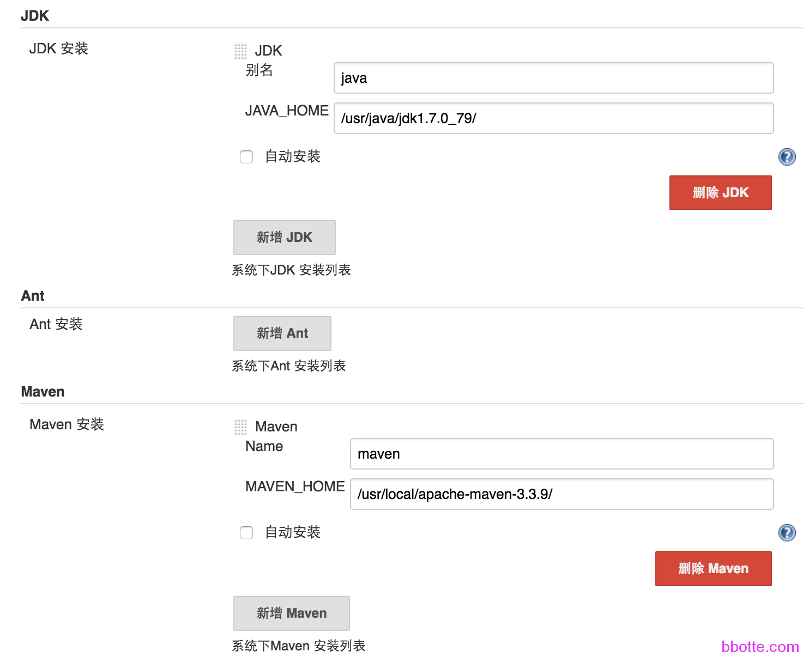
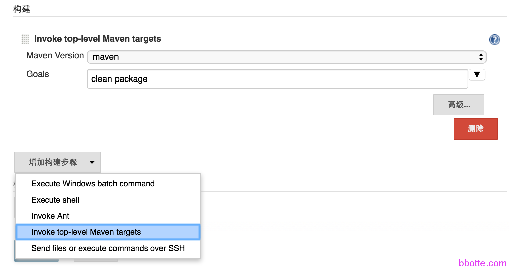
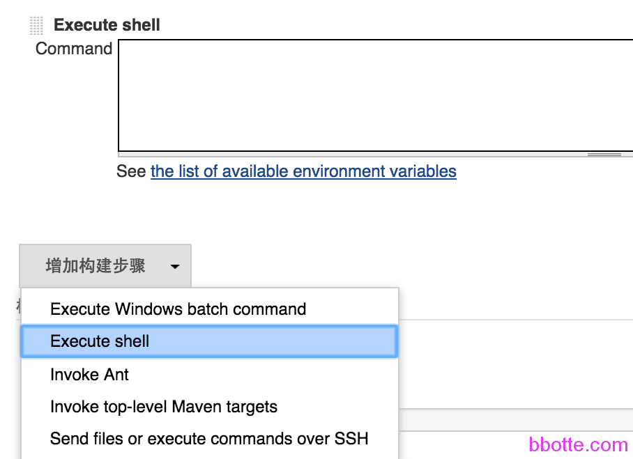
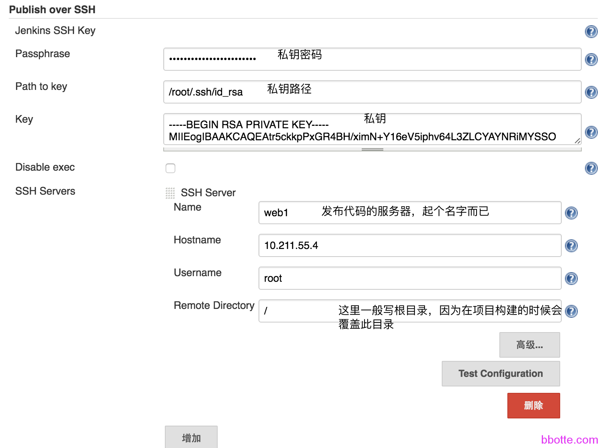
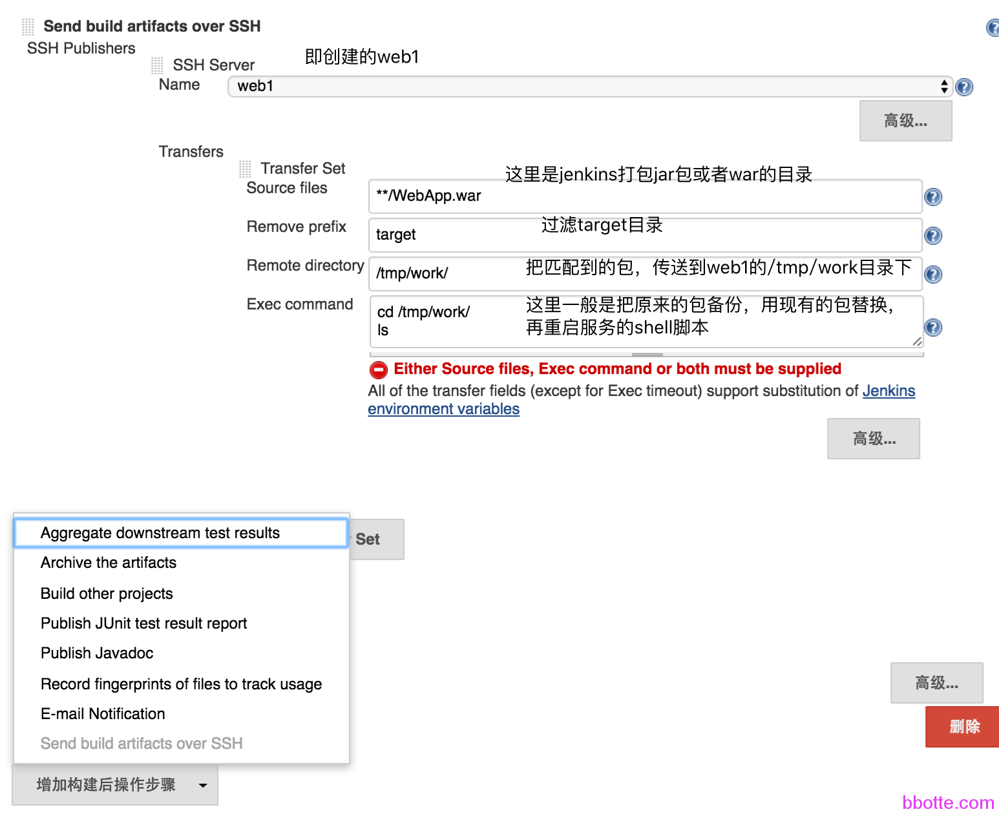
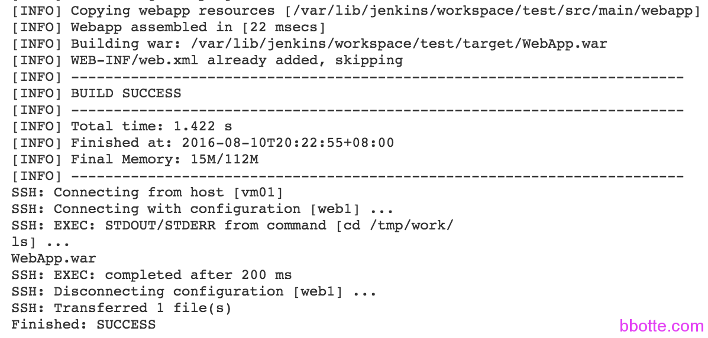

# 发布系统之jenkins-maven-svn

1. 说明
2. 安装jenkins
3. 安装maven
4. 安装svn（支持http）
5. 构建最简单的项目
6. 配置jenkins
7. 一，系统设置
8. 二，jenkins配置
9. 使用tomcat查看

### 说明

公司的更新发布系统刚开始一般用shell，再升级为jenkins，最后是自写的发布平台，下面介绍一下jenkins+maven的发布系统，可以理解为shell操作的图形化平台。
jenkins是开源的自动化服务提供者，java平台，有数以百计的插件，为几乎任何项目提供构建,测试,部署的自动化程序
maven是一个管理包、打包工具。Maven可以从svn、git仓库管理一个项目的构建、报告、文档.

<http://jenkins-ci.org/>

<http://maven.apache.org/>

```
# cat /etc/centos-release 
CentOS release 6.6 (Final)
# setenforce 0
# service iptables stop
# yum install vim gcc dstat lrzsz zlib-devel unzip gcc-c++ -y
```

### **安装jenkins**


```
#安装jenkins
# rpm -ivh jdk-7u67-linux-x64.rpm 
Preparing...                ########################################### [100%]
   1:jdk                    ########################################### [100%]
Unpacking JAR files...
	rt.jar...
	jsse.jar...
	charsets.jar...
	tools.jar...
	localedata.jar...
	jfxrt.jar...
# vim ~/.bashrc	
export JAVA_HOME=/usr/java/jdk1.7.0_67
export JRE_HOME=${JAVA_HOME}/jre
export CLASSPATH=.:${JAVA_HOME}/lib:${JRE_HOME}/lib
export PATH=${JAVA_HOME}/bin:$PATH
# . ~/.bashrc
# java -version
java version "1.7.0_67"
Java(TM) SE Runtime Environment (build 1.7.0_67-b01)
Java HotSpot(TM) 64-Bit Server VM (build 24.65-b04, mixed mode)
# rpm -ivh jenkins-1.609.3-1.1.noarch.rpm 
warning: jenkins-1.609.3-1.1.noarch.rpm: Header V4 DSA/SHA1 Signature, key ID d50582e6: NOKEY
Preparing...                ########################################### [100%]
   1:jenkins                ########################################### [100%]
# rpm -ql jenkins
/etc/init.d/jenkins
/etc/logrotate.d/jenkins
/etc/sysconfig/jenkins
/usr/lib/jenkins
/usr/lib/jenkins/jenkins.war
/usr/sbin/rcjenkins
/var/cache/jenkins
/var/lib/jenkins
/var/log/jenkins
# vim /etc/sysconfig/jenkins #jinkins的配置文件
JENKINS_PORT="9000"
tips：
如果需要jenkins以其他用户运行（启动是root，运行为其他用户），那么需要更改一下文件夹的权限，假如用户为admin
# egrep -v "^$|^#" /etc/sysconfig/jenkins |grep USER
JENKINS_USER="admin"
# chown admin.admin -R /var/lib/jenkins
# chown admin.admin -R /var/log/jenkins
# chown admin.admin -R /var/cache/jenkins
 
# service jenkins start
Starting Jenkins                                           [  OK  ]
http://IP:9000/  页面访问
```

### **安装maven**

```
#安装maven
# tar -xzf apache-maven-3.3.3-bin.tar.gz
# mv apache-maven-3.3.3 /usr/local/maven
# vim ~/.bashrc
export PATH=/usr/local/maven/bin:$PATH
. ~/.bashrc
# mvn --version
Apache Maven 3.3.3 (7994120775791599e205a5524ec3e0dfe41d4a06; 2015-04-22T19:57:37+08:00)
Maven home: /usr/local/maven
Java version: 1.7.0_67, vendor: Oracle Corporation
Java home: /usr/java/jdk1.7.0_67/jre
Default locale: en_US, platform encoding: UTF-8
OS name: "linux", version: "2.6.32-504.el6.x86_64", arch: "amd64", family: "unix"
 
下面安装svn支持svn和http协议：
所需的包：
apr-1.4.6.tar.gz  apr-util-1.4.1.tar.gz  scons-2.4.1.tar.gz  serf-1.3.8.zip  sqlite-amalgamation-3071300.zip  subversion-1.8.9.tar.gz
#安装svn
# yum remove subversion
# tar -xzf apr-1.4.6.tar.gz
# cd apr-1.4.6
# ./configure
# ./configure --prefix=/usr/local/apr
# make
# make install
# cd ..
  
# tar -xzf apr-util-1.4.1.tar.gz
# cd apr-util-1.4.1
# ./configure --prefix=/usr/local/apr-util --with-apr=/usr/local/apr/
# make
# make install
# cd ..
```

### **安装svn**（支持http）

```
svn 1.8版本之前的需要neon，1.8版本之后弃用neon而改使用serf
serf需要安装scons，由scons安装serf
# tar -xzf scons-2.4.1.tar.gz 
# cd scons-2.4.1
# python setup.py install
# scons
# yum -y install expat-devel
#   
# cd /data/serf-1.3.8
# scons PREFIX=/usr/local/serf APR=/usr/local/apr APU=/usr/local/apr-util
# scons -Y /data/serf-1.3.8
# scons PREFIX=/usr/local/serf LIBDIR=/usr/lib64
# scons PREFIX=/usr/local/serf install
# 
# tar -xzf subversion-1.8.9.tar.gz
# wget http://www.sqlite.org/sqlite-amalgamation-3071300.zip
# unzip sqlite-amalgamation-3071300.zip
# mv sqlite-amalgamation-3071300 ./subversion-1.8.9/sqlite-amalgamation
# cd subversion-1.8.9
# ./configure --prefix=/usr/local/svn --with-apr=/usr/local/apr --with-apr-util=/usr/local/apr-util/ --with-# serf=/usr/local/serf/
# make
# make install
# svn help
# svn --version
svn, version 1.8.9 (r1591380)
   compiled Nov 24 2015, 13:18:50 on x86_64-unknown-linux-gnu
Copyright (C) 2014 The Apache Software Foundation.
This software consists of contributions made by many people;
see the NOTICE file for more information.
Subversion is open source software, see http://subversion.apache.org/
The following repository access (RA) modules are available:
* ra_svn : Module for accessing a repository using the svn network protocol.
  - handles 'svn' scheme
* ra_local : Module for accessing a repository on local disk.
  - handles 'file' scheme
* ra_serf : Module for accessing a repository via WebDAV protocol using serf.
  - using serf 1.3.8
  - handles 'http' scheme
  - handles 'https' scheme
# cd ..
# vim ~/.bashrc
export PATH=/usr/local/svn/bin:$PATH
# . ~/.bashrc
 
#svn启动停止脚本
#!/bin/bash
# build thisfile in /etc/init.d/svn
# chmod 755/etc/init.d/svn
SVN_HOME=/data/svn
if [ ! -f "/usr/local/svn/bin/svnserve" ]
then
echo "svnserver startup: cannot start"
exit
fi
case "$1" in
start)
echo "Starting svnserve..."
/usr/local/svn/bin/svnserve -d --listen-port 3690 -r $SVN_HOME
echo "Finished!"
;;
stop)
echo "Stoping svnserve..."
killall svnserve
echo "Finished!"
;;
restart)
$0 stop
$0 start
;;
*)
echo "Usage: svn { start | stop | restart } "
exit 1
esac
```

创建文件夹，

### **构建最简单的项目**

```
# mkdir -p /data/svn
# mkdir -p /data/www
# svnadmin create /data/svn/
# cd /data/svn/conf
# vim passwd
[users]
bbotte = 123456
 
# vim authz
[aliases]
[groups]
bbottegroup = bbotte
[/]
@bbottegroup = rw
* =
 
# grep -v ^\# svnserve.conf
[general]
anon-access = none
auth-access = write
password-db = passwd
authz-db = authz
realm = /data/svn
[sasl]
 
# svnserve -d -r /data/svn/
#在windows主机登录svn账号
 
使用Maven创建Web项目，打一个hello world的jar包：     
1.从Maven模板创建Web应用程序
命令格式如下：
mvn archetype:generate -DgroupId={project-packaging} -DartifactId={project-name} -DarchetypeArtifactId=maven-archetype-webapp -DinteractiveMode=false
下面为mvn archetype:generate  根据向导创建：
# cd /data/www/
# mvn archetype:generate
[INFO] No archetype defined. Using maven-archetype-quickstart (org.apache.maven.archetypes:maven-archetype-quickstart:1.0)
Choose archetype:
1: remote -> org.apache.maven.archetypes:maven-archetype-quickstart (An archetype which contains a sample Maven project.)
 
 
Choose a number or apply filter (format: [groupId:]artifactId, case sensitive contains): 1: 1
Define value for property 'groupId': 300
Define value for property 'artifactId': Hello
Define value for property 'version' 1.0-SNAPSHOT: : 
Define value for property 'package' 300: : com.hello
Confirm properties configuration:
groupId: 300
artifactId: Hello
version: 1.0-SNAPSHOT
package: com.hello
 Y: : y
 
[INFO] ----------------------------------------------------------------------------
[INFO] Using following parameters for creating project from Old (1.x) Archetype: maven-archetype-quickstart:1.1
[INFO] ----------------------------------------------------------------------------
[INFO] Parameter: basedir, Value: /root
[INFO] Parameter: package, Value: com.hello
[INFO] Parameter: groupId, Value: 300
[INFO] Parameter: artifactId, Value: Hello
[INFO] Parameter: packageName, Value: com.hello
[INFO] Parameter: version, Value: 1.0-SNAPSHOT
[INFO] project created from Old (1.x) Archetype in dir: /root/Hello
[INFO] ------------------------------------------------------------------------
[INFO] BUILD SUCCESS
[INFO] ------------------------------------------------------------------------
[INFO] Total time: 01:43 min
[INFO] Finished at: 2018-04-08T15:35:12+08:00
[INFO] ------------------------------------------------------------------------
 
# tree CounterWebApp/
Hello
├── pom.xml
└── src
    ├── main
    │ └── java
    │    └── com
    │         └── hello
    │             └── App.java
    └── test
        └── java
            └── com
                └── hello
                    └── AppTest.java
 
9 directories, 3 files
 
测试代码，用mvn打包
# mvn clean package -e -U -Dmaven.test.skip=true
# java -jar target/Hello-1.0-SNAPSHOT.jar 
Error: Could not find or load main class com.hello.Hello.App
 
需要更改pom.xml
 
# cat pom.xml
<project xmlns="http://maven.apache.org/POM/4.0.0" xmlns:xsi="http://www.w3.org/2001/XMLSchema-instance"
  xsi:schemaLocation="http://maven.apache.org/POM/4.0.0 http://maven.apache.org/xsd/maven-4.0.0.xsd">
  <modelVersion>4.0.0</modelVersion>
 
  <groupId>300</groupId>
  <artifactId>Hello</artifactId>
  <version>1.0-SNAPSHOT</version>
  <packaging>jar</packaging>
 
  <name>Hello</name>
  <url>http://maven.apache.org</url>
 
  <properties>
    <project.build.sourceEncoding>UTF-8</project.build.sourceEncoding>
  </properties>
 
  <dependencies>
    <dependency>
      <groupId>junit</groupId>
      <artifactId>junit</artifactId>
      <version>3.8.1</version>
      <scope>test</scope>
    </dependency>
  </dependencies>
 
  <build>
    <plugins>
      <plugin>
        <groupId>org.apache.maven.plugins</groupId>
        <artifactId>maven-shade-plugin</artifactId>
        <version>3.1.1</version>
        <executions>
          <execution>
            <phase>package</phase>
            <goals>
              <goal>shade</goal>
            </goals>
            <configuration>
              <transformers>
                <transformer implementation="org.apache.maven.plugins.shade.resource.ManifestResourceTransformer">
                  <manifestEntries>
                    <Main-Class>com.hello.App</Main-Class>
                    <Build-Number>123</Build-Number>
                  </manifestEntries>
                </transformer>
              </transformers>
            </configuration>
          </execution>
        </executions>
      </plugin>
    </plugins>
  </build>
 
</project>
```

```
或者按如下直接创建，打一个war包：
# mvn archetype:generate -DgroupId=com.bbotte -DartifactId=WebApp -DarchetypeArtifactId=maven-archetype-webapp -DinteractiveMode=false
# tree WebApp/
WebApp/
├── pom.xml
└── src
    └── main
        ├── resources
        └── webapp
            ├── index.jsp
            └── WEB-INF
                └── web.xml
 
在此修改index.jsp的内容，这里面是页面的显示
此乃帮助文档： http://maven.apache.org/guides/getting-started/index.html
把创建的项目加入svn
# cd /data/www/CounterWebApp/  #这个是要打jar包的
# svn import . svn://192.168.22.130/CounterWebApp -m "initial import"
同样把要打为war包的WebApp文件夹也加入svn
在windows主机svn更新
或者linux下在某一个文件夹下面
svn checkout svn://192.168.22.130/CounterWebApp
svn info  查看此项目svn的地址
# ls
pom.xml  src
```

上面即helloworld的jar包和war包构建方式

### **配置jenkins**

```
jenkins的设置
http://IP:9000/
1，新建
左上角“新建”--构建一个maven项目
    项目名称 -- CounterWebApp
	源码管理--Subversion-- svn://IP/CounterWebApp -- 点击红色字体部分的enter credential链接输入svn的用户名和密码(保存密码)，刷新此页面
	
	构建触发器 -- 选择：Build whenever a SNAPSHOT dependency is built
	Build--Maven Version 因为Jenkins找不到maven（Jenkins needs to know where your Maven is installed. Please do so from the system configuration.）
	点击"system configuration"配置
	JDK 安装 
	    别名：java
	    JAVA_HOME：/usr/java/jdk1.7.0_67
	Maven 安装
	    Name：maven
	    MAVEN_HOME：/usr/local/maven
	
	Post Steps -- Add post-build step --Invoke top-level Maven targets -- 
	    Maven Version-- maven
		Goals -- clean package
	
 
构建后在目录 /var/lib/jenkins/workspace/ 项目的目录下生成 target 目录，这里是
# tree /var/lib/jenkins/workspace/CounterWebApp/target/
/var/lib/jenkins/workspace/CounterWebApp/target/
├── classes
│   └── com
│       └── bbotte
│           └── App.class
├── CounterWebApp-1.1.jar
├── maven-archiver
│   └── pom.properties
├── maven-status
│   └── maven-compiler-plugin
│       ├── compile
│       │   └── default-compile
│       │       ├── createdFiles.lst
│       │       └── inputFiles.lst
│       └── testCompile
│           └── default-testCompile
│               ├── createdFiles.lst
│               └── inputFiles.lst
├── surefire-reports
│   ├── com.bbotte.AppTest.txt
│   └── TEST-com.bbotte.AppTest.xml
└── test-classes
    └── com
        └── bbotte
            └── AppTest.class
 
同样的操作，我们打一个war包
# tree /var/lib/jenkins/workspace/WebApp/target/
/var/lib/jenkins/workspace/WebApp/target/
├── classes
├── maven-archiver
│   └── pom.properties
├── WebApp
│   ├── index.jsp
│   ├── META-INF
│   └── WEB-INF
│       ├── classes
│       └── web.xml
└── WebApp.war
```

上面的步骤打了一个jar包，一个war包，过程不清楚的话参考下面图片介绍：

### 一，系统设置

jenkins–系统管理–系统设置–设置jdk和maven的安装路径

### 二，jenkins配置

新建–**构建一个自由风格的软件项目**（当然可以选择构建maven项目，不过这样会更自由）名字叫test吧

1，源码管理–Subversion–Repository URL 这里写项目的svn地址，就是包含pom.xml文件的svn地址。有红色的错误是因为svn没有认证，enter credential链接输入svn的用户名和密码(保存密码)，刷新此页面

2，设置maven打包命令

3，打包之后的操作

在maven打包完成后，可以执行rsync或者scp删除远程服务器的包，并且把新生成的包发送过去，可以用execute shell,把传输的shell脚本放里面



构建后操作–增加构建后操作步骤，如果是下面这种方式，需要安装Publish over SSH插件，并且在系统管理–系统设置–Publish over SSH配置主机的信息，私钥的密码，私钥地址，私钥，下面是用此私钥登录远程服务器的ip，用户名，端口等信息，比如



上面对web1的配置，有一个remote directory，所以下面的配置/tmp/work就覆盖了此目录

比如我们生成了一个jar包，路径为 /var/lib/jenkins/workspace/external/external-service/target/external.jar

Source files:  直接写jar包或者war包名称，  **/external.jar

Remove profix:  即生成的jar包或war包路径，是在jenkins的workspace项目文件夹下路径， external-service/target

Remote directory:  上传到远程服务器路径





### **使用tomcat查看**

```
#安装tomcat
wget http://mirrors.cnnic.cn/apache/tomcat/tomcat-8/v8.0.26/bin/apache-tomcat-8.0.26.tar.gz
# tar -xzf apache-tomcat-8.0.26.tar.gz 
# mv apache-tomcat-8.0.26 /usr/local/tomcat
/usr/local/tomcat/bin/catalina.sh start
http://192.168.22.130:8080/
# cd /usr/local/tomcat/webapps
# rm -rf *
# cp /tmp/work/WebApp.war .
# cat /usr/local/tomcat/conf/Catalina/localhost/test.xml
<!-- Tomcat Manager Context --> 
     <Context path="/WebApp" docBase="WebApp" debug="0"privileged="true"/>
# /usr/local/tomcat/bin/shutdown.sh
# /usr/local/tomcat/bin/catalina.sh start
http://IP:8080/WebApp/    浏览器访问
```

tips：
如果maven要跳过测试打包：
mvn clean install -Dmaven.test.skip=true
如果不用maven打包，配置jenkins时，选择“构建一个自由风格的软件项目”
maven常用插件：
Publish Over SSH
SSH Agent Plugin
Subversion Plug-in

我们一般线上肯定不止这么配置，为了方便一般对服务分组，更简单的做发布

1，对服务分组，比如 web组，server组
2，发布前，先备份(一样在jenkins中设置)
3，如果有测试，按整个组发布；如果木有测试，先发web组的一台机，在ELK后台查看日志，没问题再按组发
4，用shell写个邮件，发布完成，邮件通知大家发布完成，这一步可以忽略


每一个项目中，可以添加多台服务器（SSH Publishers），这样不至于烦死
最后，记得给jenkins添加密码

2016年03月02日 于 [linux工匠](https://bbotte.github.io/) 发表


