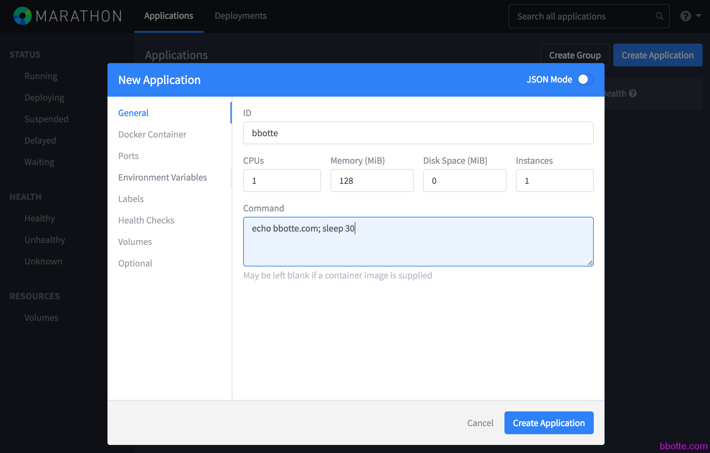
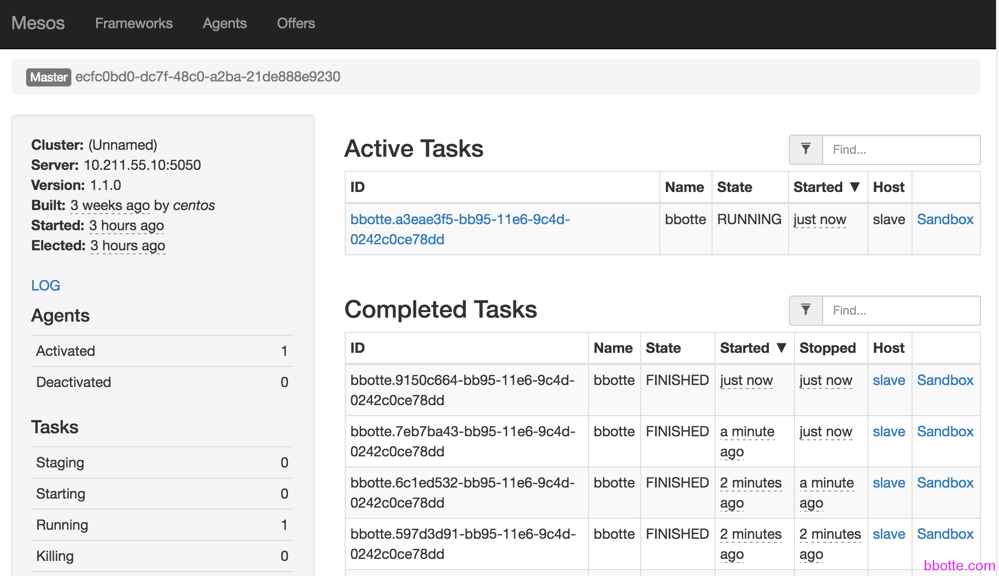
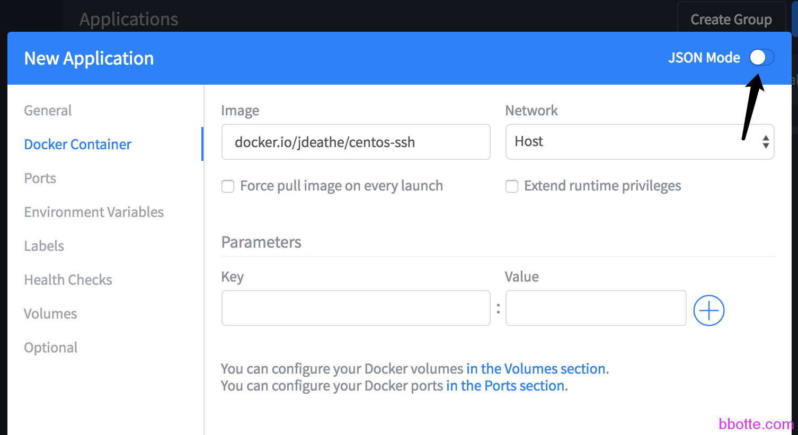
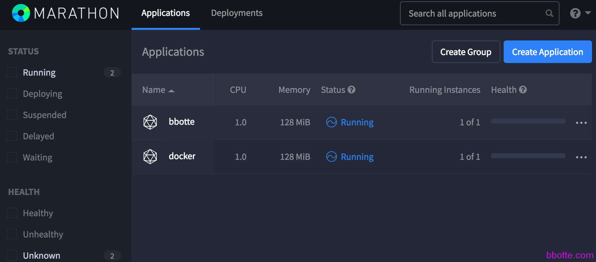
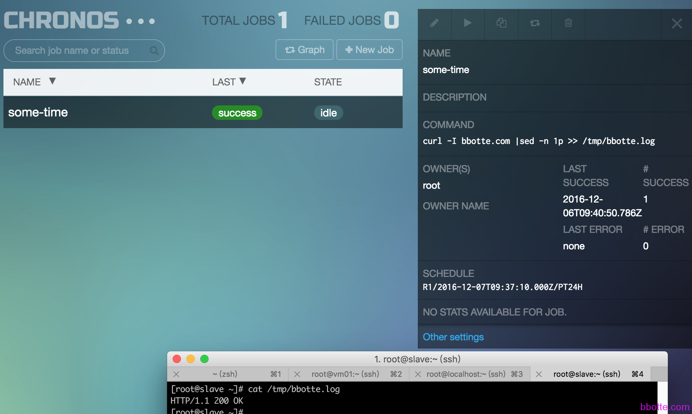
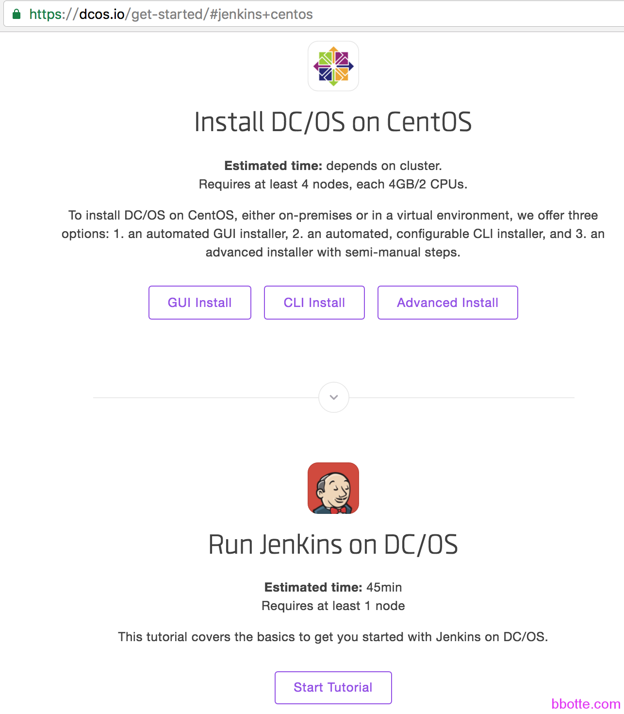

# mesos marathon和chronos构建分布式系统

一，系统说明
二，系统和zookeeper安装和配置

1. 升级gcc版本
2. 主机信息
3. zookeeper主机的设置

三，master主机设置

1. mesos-master安装配置
2. marathon的设置
3. chronos配置如下

四，slave主机设置
五，mesos的应用

1. 创建一个简单的application
2. 创建一个docker
3. chronos使用
4. 查看mesos application的信息

## **一，系统说明**

**DC/OS** 直译为数据中心操作系统，就是想要把常用的应用(比如jenkins，zookeeper，kafka等）放在AWS，阿里云，虚拟机，docker等中运行，自我认为是”Microservice””敏捷开发””PaaS”概念的实现者，并且通过资源调度来节省资源 <https://dcos.io/>
**mesos** 集群资源管理框架(以集群的形式出现，主决定资源的分配，从负责执行executor)，分配资源，提供offer给framework，不负责调度资源，千言万语都在这里了[mesos的设计结构](http://mesos.apache.org/documentation/latest/architecture/)
**marathon** mesos的framework,容器编排系统，保证长时间的运行任务，类似后台执行或者supervisor，和Kubernetes功能差不多，只是k8s只能运行docker
**chronos** mesos的framework,一个调度系统，类似cron具有容错性的分布式 scheduler，在一个时间段执行任务，和marathon一样都是听mesos的指令，给mesos搬砖的

<http://mesos.apache.org/documentation/latest/>
<https://mesosphere.github.io/marathon/docs/>
<https://mesos.github.io/chronos/docs/>

## **二，系统和zookeeper安装和配置**

### **升级gcc版本**

centos6的gcc版本较低，编译mesos需要升级到4.8以上，如果是yum安装的话就无需在意了

```
# tar -xzf mesos-1.1.0.tar.gz
# cd mesos-1.1.0
# ./configure --help
# ./configure --prefix=/usr/local/mesos
configure: error: GCC 4.8 or higher required (found 4.4.7)
# cat /etc/centos-release
CentOS release 6.7 (Final)
# gcc --version
gcc (GCC) 4.4.7 20120313 (Red Hat 4.4.7-17)
Copyright © 2010 Free Software Foundation, Inc.
#用centos6的源yum安装
# rpm -Uvh http://repos.mesosphere.io/el/6/noarch/RPMS/mesosphere-el-repo-6-2.noarch.rpm
```

下文mesos所在主机OS为centos 7.2，zookeeper为centos 6.7

```
# cat /etc/centos-release
CentOS Linux release 7.2.1511 (Core)
# yum install gcc gcc-c++ zlib-devel patch
# gcc --version
gcc (GCC) 4.8.5 20150623 (Red Hat 4.8.5-4)
Copyright © 2015 Free Software Foundation, Inc.
 
禁用防火墙，并禁止selinux
```

### 主机信息

主机结构如下，zookeeper没有用集群，mesos只是用了主从

```
master  10.211.55.10    mesos-master     marathon   chronos
slave   10.211.55.16    mesos-slave      docker
vm01    10.211.55.4    zookeeper-3.4.8
```

所有主机的hosts文件保持一致，并自行更改hostname

```
# cat /etc/hosts
127.0.0.1   localhost localhost.localdomain localhost4 localhost4.localdomain4
::1         localhost localhost.localdomain localhost6 localhost6.localdomain6
 
10.211.55.4 vm01
10.211.55.10 master
10.211.55.16 slave
```

### zookeeper主机的设置

```
# egrep -v "^#|^$" /usr/local/zookeeper/conf/zoo.cfg
tickTime=2000
initLimit=10
syncLimit=5
dataDir=/usr/local/zookeeper/data
clientPort=2181
server.1=vm01:2888:3888
# /usr/local/zookeeper/bin/zkServer.sh start
# zkServer.sh status
ZooKeeper JMX enabled by default
ZooKeeper remote JMX Port set to 9999
ZooKeeper remote JMX authenticate set to false
ZooKeeper remote JMX ssl set to false
ZooKeeper remote JMX log4j set to true
Using config: /usr/local/zookeeper/bin/../conf/zoo.cfg
Mode: standalone
```

## **三，master主机设置**

### mesos-master安装配置

```
master
#本文为centos 7.2
# rpm -ivh http://repos.mesosphere.io/el/7/noarch/RPMS/mesosphere-el-repo-7-2.noarch.rpm
# yum install mesos -y
mesos安装的版本为 1.1.0，在/etc/default/目录下，有几个mesos的配置
 
# cat /etc/mesos/zk    #如果是zookeeper集群，后面加上，继续写
zk://vm01:2181/mesos
# cat /etc/mesos-master/quorum
1
# cat /etc/mesos-master/hostname
master
# cat /etc/mesos-master/ip
10.211.55.10
 
# systemctl enable mesos-master
# systemctl status mesos-master
● mesos-master.service - Mesos Master
   Loaded: loaded (/usr/lib/systemd/system/mesos-master.service; enabled; vendor preset: disabled)
   Active: active (running) since 五 2016-12-02 05:26:01 EST; 2min 15s ago
 Main PID: 26233 (mesos-master)
   Memory: 10.1M
   CGroup: /system.slice/mesos-master.service
           ├─26233 /usr/sbin/mesos-master --zk=zk://vm01:2181/mesos --port=5050 --log_dir=/var/log/mesos --qu...
           ├─26243 logger -p user.info -t mesos-master[26233]
           └─26244 logger -p user.err -t mesos-master[26233]
# less /var/log/mesos/mesos-master.INFO
```

### marathon的设置

```
# yum install marathon
# mkdir /etc/marathon/conf/ -p
[root@master ~]# cat /etc/marathon/conf/hostname
master
[root@master ~]# cat /etc/marathon/conf/master
zk://vm01:2181/mesos
[root@master ~]# cat /etc/marathon/conf/zk
zk://vm01:2181/marathon
 
[root@master etc]# systemctl start marathon
# systemctl status marathon
● marathon.service - Marathon
   Loaded: loaded (/usr/lib/systemd/system/marathon.service; enabled; vendor preset: disabled)
   Active: active (running) since 五 2016-12-02 05:59:38 EST; 5s ago
 Main PID: 29311 (java)
   Memory: 260.5M
   CGroup: /system.slice/marathon.service
           ├─29311 java -Djava.library.path=/usr/local/lib:/usr/lib:/usr/lib64 -Djava.util.logging.SimpleForm...
           ├─29324 logger -p user.info -t marathon[29311]
           └─29325 logger -p user.notice -t marathon[29311]
```

### chronos配置如下

```
# yum install chronos
# cat /etc/chronos/conf/http_port
4400
# systemctl enable chronos
# systemctl start chronos
[root@master ~]# systemctl status chronos
● chronos.service - Chronos
   Loaded: loaded (/usr/lib/systemd/system/chronos.service; enabled; vendor preset: disabled)
   Active: active (running) since 五 2016-12-02 07:05:24 EST; 5s ago
 Main PID: 32362 (java)
   Memory: 202.8M
   CGroup: /system.slice/chronos.service
           ├─32362 java -Djava.library.path=/usr/local/lib:/usr/lib64:/usr/lib -Djava.util.logging.SimpleForm...
           ├─32372 logger -p user.info -t chronos[32362]
           └─32373 logger -p user.notice -t chronos[32362]
 
# ps aux|grep chronos
root     32362 10.3 12.6 3312016 238184 ?      Ssl  07:05   0:06 java -Djava.library.path=/usr/local/lib:/usr/lib64:/usr/lib -Djava.util.logging.SimpleFormatter.format=%2$s %5$s%6$s%n -Xmx512m -cp /usr/bin/chronos org.apache.mesos.chronos.scheduler.Main --zk_hosts vm01:2181 --master zk://vm01:2181/mesos --http_port 4400
root     32372  0.0  0.0 107896   692 ?        S    07:05   0:00 logger -p user.info -t chronos[32362]
root     32373  0.0  0.0 107896   696 ?        S    07:05   0:00 logger -p user.notice -t chronos[32362]
```

## **四，slave主机设置**

```
一样的yum安装mesos
# cat /etc/mesos/zk
zk://vm01:2181/mesos
# for i in `ls /etc/mesos-slave/`;do echo /etc/mesos-slave/${i};cat /etc/mesos-slave/${i};done
/etc/mesos-slave/containerizers
docker,mesos
/etc/mesos-slave/executor_registration_timeout
3mins
/etc/mesos-slave/hostname
slave
/etc/mesos-slave/ip
10.211.55.16
/etc/mesos-slave/work_dir
/var/lib/mesos
 
# systemctl enable mesos-slave
# systemctl start mesos-slave
# systemctl status mesos-slave
● mesos-slave.service - Mesos Slave
   Loaded: loaded (/usr/lib/systemd/system/mesos-slave.service; enabled; vendor preset: disabled)
   Active: active (running) since 二 2016-12-06 00:57:00 EST; 3h 6min ago
 Main PID: 10669 (mesos-slave)
   Memory: 10.9M
   CGroup: /system.slice/mesos-slave.service
           ├─10669 /usr/sbin/mesos-slave --master=zk://vm01:2181/mesos --log_dir=/var/log/mesos -...
           ├─10685 logger -p user.info -t mesos-slave[10669]
           └─10686 logger -p user.err -t mesos-slave[10669]
```

slave安装docker略

```
# vim /etc/sysconfig/docker
把docker运行的参数  enable-selinux 这个选项去掉
#OPTIONS='--selinux-enabled --log-driver=journald'
OPTIONS='--log-driver=journald'
```

浏览器访问
http://10.211.55.10:8080/       mesos
http://10.211.55.10:5050/       marathon
http://10.211.55.10:4400/       chronos

## **五，mesos的应用**

mesos marathon和chronos系统搭建完毕，以下是mesos的应用

### 创建一个简单的application

在mesos的界面，点击Create Application,输入ID(必须唯一，不能跟现有的重复)，Command输入 echo bbotte.com; sleep 30 确定创建即可



第二种方法，在mesos主机中新建一个json文件，再导入进去

```
[root@master ~]# cat bbotte.json
{
  "id": "bbotte",
  "cmd": "echo bbotte.com; sleep 30",
  "cpus": 1,
  "mem": 128,
  "disk": 0,
  "instances": 1
}
[root@master ~]# curl -i -H 'Content-Type: application/json' 10.211.55.10:8080/v2/apps -d @bbotte.json
```

在mesos和marathon后台能看到此application信息



### 创建一个docker

创建docker需要在创建application的Docker Container选项添加docker的image，mesos-slave主机已经有docker image

```
[root@slave ~]# docker images|grep docker.io/jdeathe/centos-ssh
docker.io/jdeathe/centos-ssh                          latest              9ec062aab4b6        9 weeks ago         230.3 MB
```



点击JSON Mode就是创建的json文件信息



在mesos-slave  docker ps 命令查看

### chronos使用

就比较简单，输入使用的命令和执行时间即可



参考 [How To Configure a Production-Ready Mesosphere Cluster on Ubuntu 14.04](https://www.digitalocean.com/community/tutorials/how-to-configure-a-production-ready-mesosphere-cluster-on-ubuntu-14-04)

mesos marathon和chronos构建分布式系统是一个平台，所以可以做的事情，要做的更多，资料可以查看dcos.io上面的介绍



### **5.4**    查看mesos application的信息

```
查看application的metric
# curl http://0.0.0.0:8080/metrics | python -m json.tool | less
 
查看运行的app
# curl http://0.0.0.0:8080/v2/apps | python -m json.tool
 
查看ID为bbotte的app
# curl http://0.0.0.0:8080/v2/apps/bbotte | python -m json.tool
 
删除ID为bbotte的app
# curl -X DELETE http://0.0.0.0:8080/v2/apps/bbotte | python -m json.tool
```

2016年12月06日 于 [linux工匠](https://bbotte.github.io/) 发表