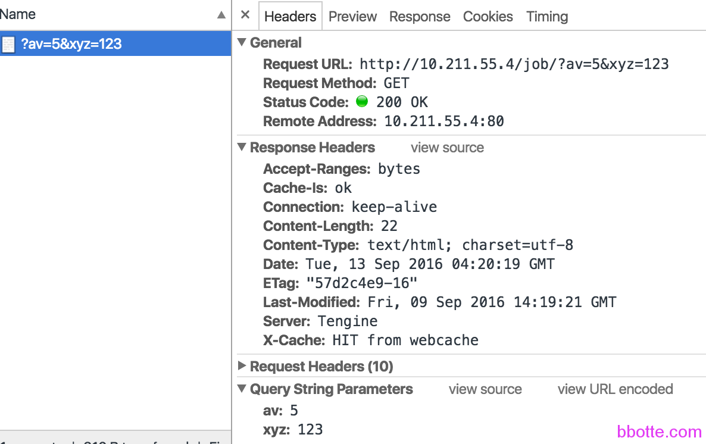
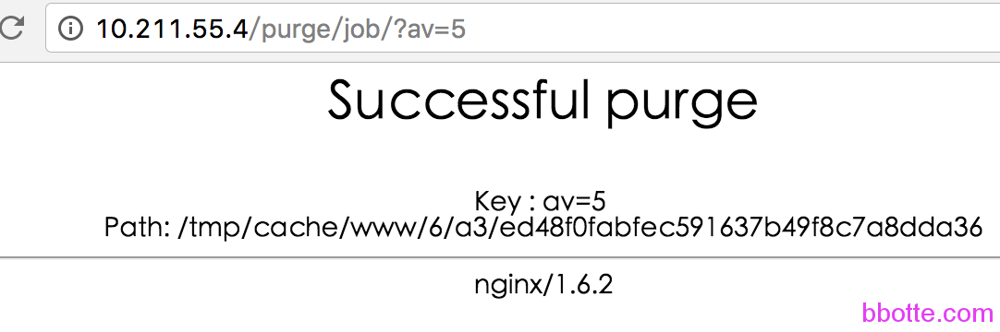

# nginx的proxy_cache缓存使用

### nginx设置缓存

nginx或tengine除了用于做http服务器外，一般还用于做反向代理，邮件代理服务器，今天说一下用proxy_cache模块缓存数据的配置。

### 一，安装nginx并添加ngx_cache_purge模块

下载ngx_cache_purge-2.3.tar.gz，解压，在tengine编译的时候添加解压ngx_cache_purge模块的路径

```
yum install openssl-devel pcre-dev lua-devel
wget https://ftp.pcre.org/pub/pcre/pcre-8.40.tar.gz
tar -xf pcre-8.40.tar.gz
./configure --prefix=/usr/local/nginx --with-http_gzip_static_module --with-http_stub_status_module --with-http_lua_module  --with-http_realip_module --with-http_gunzip_module --with-pcre=./pcre-8.40
 
编译tengine需要用下载的pcre，不能使用yum安装的pcre，把ngx_cache_purge模块也添加上
 
tengine-2.1.1]# ./configure --add-module=../ngx_cache_purge-2.3
```

安装好的tengine如下（nginx支持平滑升级）

```
# ./sbin/nginx -V
Tengine version: Tengine/2.1.1 (nginx/1.6.2)
built by gcc 4.4.7 20120313 (Red Hat 4.4.7-16) (GCC)
TLS SNI support enabled
configure arguments: --prefix=/usr/local/luanginx --with-http_gzip_static_module --with-http_stub_status_module --with-http_lua_module --add-module=../ngx_cache_purge-2.3
loaded modules:
    ngx_core_module (static)
    ngx_errlog_module (static)
    ngx_conf_module (static)
    ngx_dso_module (static)
    ngx_syslog_module (static)
    ngx_events_module (static)
    ngx_event_core_module (static)
    ngx_epoll_module (static)
    ngx_procs_module (static)
    ngx_proc_core_module (static)
    ngx_openssl_module (static)
    ngx_regex_module (static)
    ngx_http_module (static)
    ngx_http_core_module (static)
    ngx_http_log_module (static)
    ngx_http_upstream_module (static)
    ngx_http_static_module (static)
    ngx_http_gzip_static_module (static)
    ngx_http_autoindex_module (static)
    ngx_http_index_module (static)
    ngx_http_auth_basic_module (static)
    ngx_http_access_module (static)
    ngx_http_limit_conn_module (static)
    ngx_http_limit_req_module (static)
    ngx_http_geo_module (static)
    ngx_http_map_module (static)
    ngx_http_split_clients_module (static)
    ngx_http_referer_module (static)
    ngx_http_rewrite_module (static)
    ngx_http_ssl_module (static)
    ngx_http_proxy_module (static)
    ngx_http_fastcgi_module (static)
    ngx_http_uwsgi_module (static)
    ngx_http_scgi_module (static)
    ngx_http_memcached_module (static)
    ngx_http_empty_gif_module (static)
    ngx_http_browser_module (static)
    ngx_http_user_agent_module (static)
    ngx_http_upstream_ip_hash_module (static)
    ngx_http_upstream_consistent_hash_module (static)
    ngx_http_upstream_check_module (static)
    ngx_http_upstream_least_conn_module (static)
    ngx_http_reqstat_module (static)
    ngx_http_upstream_keepalive_module (static)
    ngx_http_upstream_dynamic_module (static)
    ngx_http_stub_status_module (static)
    ngx_http_cache_purge_module (static)
    ngx_http_write_filter_module (static)
    ngx_http_header_filter_module (static)
    ngx_http_chunked_filter_module (static)
    ngx_http_range_header_filter_module (static)
    ngx_http_gzip_filter_module (static)
    ngx_http_postpone_filter_module (static)
    ngx_http_ssi_filter_module (static)
    ngx_http_charset_filter_module (static)
    ngx_http_userid_filter_module (static)
    ngx_http_footer_filter_module (static)
    ngx_http_trim_filter_module (static)
    ngx_http_headers_filter_module (static)
    ngx_http_upstream_session_sticky_module (static)
    ngx_http_lua_module (static)
    ngx_http_copy_filter_module (static)
    ngx_http_range_body_filter_module (static)
    ngx_http_not_modified_filter_module (static)
```

### 二，配置nginx

nginx主配置文件nginx.conf添加如下，是设置响应被缓存的最小请求次数，缓存数据是保存在文件中的，缓存的键和文件名都是在代理URL上执行MD5的结果。levels参数定义了缓存的层次结构。建议将缓存和proxy_temp_path指令设置的临时文件目录放在同一文件系统。

共享内存通过keys_zone参数的name和size来定义。被缓存的数据如果在inactive参数指定的时间内未被访问，就会被从缓存中移除，不论它是否是刚产生的。inactive的默认值是10分钟。

特殊进程“cache manager”监控缓存的条目数量，如果超过max_size参数设置的最大值，使用LRU算法移除缓存数据。

proxy_cache_path中定义缓存路径，缓存区名称，缓存空间大小，保存时长，最大占用空间等

```
        proxy_temp_path   /tmp/cache/temp;
        proxy_cache_path  /tmp/cache/www levels=1:2 keys_zone=cache_www:30m inactive=60s max_size=512m;
        include  vhost/test.conf;
```

[tengine文档](http://tengine.taobao.org/nginx_docs/cn/docs/http/ngx_http_proxy_module.html#proxy_cache_path)

下面是test.conf的配置，10.211.55.4是本机的IP，10.211.55.5是运行http服务的主机。

先定义2个location，nowebcache只用于代理，不缓存；webcache用proxy_cache缓存

```
upstream webserver {
        server 10.211.55.5;
}
server {
        listen  80;
        server_name 10.211.55.4;
        access_log  /var/log/nginx/test.log access;
        error_page  404 = /404.html;
        index index.html;
 
        location @nowebcache {                #不缓存
            proxy_pass   http://webserver;
        }
        location @webcache {                  #缓存
        proxy_cache cache_www;                #名称，和nginx.conf里面keys_zone定义对应
        proxy_next_upstream http_502 http_504 error timeout invalid_header;
        proxy_cache_valid  200 304 1m;        #200和304状态码缓存时间
        proxy_cache_key $args;                #缓存是一个kv结构，这里是定义k，键的变量有多种，
                                              #比如$uri，$is_args，$request_uri或者多个变量的组合
        proxy_pass_header User-Agent;
        proxy_set_header Host  $args;
        proxy_set_header X-Forwarded-For  $remote_addr;
        add_header X-Cache "HIT from webcache";
        add_header Cache-Is "ok";             #添加一个header
        proxy_pass   http://webserver;
        }
 
        location /job {                      #对/job这个页面url的参数做判断，参数符合av=5的才做缓存
        #default_type "text/html";
        default_type "text/plain";
        content_by_lua '
        local uri_args = ngx.req.get_uri_args()
        for k,v in pairs(uri_args) do        --因为参数是kv结构，在lua中属于table函数库
            if k == "av" and v == "5" then
                ngx.req.set_uri_args({av=v}) --这里之所以要set是因为链接只判断av=5的参数，
                                             --并且和其他参数没关系，比如/job/?av=5&xyz=123
                ngx.exec("@webcache")
            else
                ngx.exec("@nowebcache")
            end
        end
        ';
        }
}
```

上面的配置是因为达到某一个需求：
1，不是针对所有的接口都做缓存
2，uri包含有av=5即做缓存，有一个前提：如果还有其他参数，此网页也可以正常访问（因为ngx.req.set_uri_args下面木有对请求页做判断，严谨一些是需要判断的）
我们在浏览器打开的链接为http://10.211.55.4/job/?av=5&xyz=123



我们查看缓存的内容

```
# strings /tmp/cache/www/6/a3/ed48f0fabfec591637b49f8c7a8dda36
KEY: av=5
HTTP/1.1 200 OK
Server: nginx
Date: Mon, 12 Sep 2016 05:35:27 GMT
Content-Type: text/html
Content-Length: 22
Last-Modified: Fri, 09 Sep 2016 14:19:21 GMT
Connection: close
ETag: "57d2c4e9-16"
Accept-Ranges: bytes
welcome to bbotte.com
```

如果对uri不用判断，proxy_cache_key参数可以为 $request_uri$args

### 三，清理缓存，如果需要清理已缓存的数据

需要在test.conf里面添加如下

```
        location ~ /purge(/.*)
        {
         allow            127.0.0.1;
         allow            192.168.0.0/16;
         deny             all;
         proxy_cache_purge    cache_www   $args;
         error_page 405 =200 /purge$1; 
        }
        if ( $request_method = "PURGE" ) {
         rewrite ^(.*)$ /purge$1 last;
        }
```

清理缓存访问http://10.211.55.4/purge/job/?av=5即可



我们一般是把缓存放在内存中/dev/shm/，这样请求会更快

参考：

[第二章 Nginx+Lua开发入门](http://jinnianshilongnian.iteye.com/blog/2186448)

[ngx_http_proxy_module proxy_cache_key 模块](http://tengine.taobao.org/nginx_docs/cn/docs/http/ngx_http_proxy_module.html#proxy_cache_key)

[安装淘宝开源web服务器tengine替换nginx并使用proxy_cache做前端代理](http://blog.c1gstudio.com/archives/1652)

[tengine ngx_http_lua_module ](https://github.com/alibaba/tengine/tree/master/modules/ngx_http_lua_module)

2016年09月20日 于 [linux工匠](http://www.bbotte.com/) 发表

