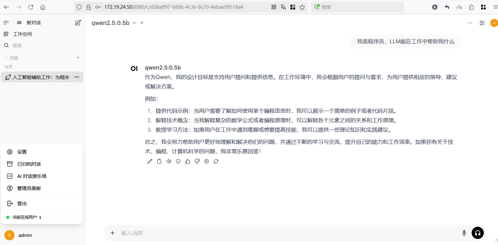

# 使用ollama运行大模型Qwen千问

使用ollama是运行大模型最简单的方法。下面使用ollama运行阿里的千问Qwen。[ollama下载](https://ollama.com/download)

##### 第一步，下载并启动服务

```
wget https://github.com/ollama/ollama/releases/download/v0.5.5/ollama-linux-amd64.tgz
tar -C /usr -xzf ollama-linux-amd64.tgz
sudo useradd -r -s /bin/false -U -m -d /usr/share/ollama ollama
sudo usermod -a -G ollama $(whoami)
cat > /etc/systemd/system/ollama.service << EOF
[Unit]
Description=Ollama Service
After=network-online.target

[Service]
ExecStart=/usr/bin/ollama serve
User=ollama
Group=ollama
Restart=always
RestartSec=3
Environment="PATH=$PATH"
Environment="OLLAMA_HOST=0.0.0.0"
Environment="OLLAMA_NUM_PARALLEL=3"
Environment="OLLAMA_MAX_LOADED_MODELS=3"

[Install]
WantedBy=default.target
EOF

systemctl daemon-reload
systemctl start ollama
```

ollama-linux-amd64.tgz 网盘链接: https://pan.baidu.com/s/1iYch51-RGRiggxwD8e449w?pwd=echy 提取码: echy 复制这段内容后打开百度网盘手机App，操作更方便哦

##### 第二步，拉取模型，启动模型即可问答

[阿里千问模型](https://modelscope.cn/models?name=Qwen2.5&page=1)

使用modelscope安装相当快，并且不用梯子。直接拉取模型就可以，不用离线下载

```
ollama pull qwen2.5:0.5b
ollama pull qwen2.5:3b
ollama pull qwen2.5:7b
ollama list
```

获取的模型在这个目录 /usr/share/ollama/.ollama/models/blobs/

模型获取可以看这个链接 [ollama模型](https://ollama.com/search)

国内DeepSeek-V3开源大模型，[modelscope中DeepSeek-V3模型](https://www.modelscope.cn/models/unsloth/DeepSeek-V3-GGUF)

```
ollama pull deepseek-v2:16b  8.9G磁盘
ollama pull deepseek-v3      模型404G磁盘,40G内存运行，这个太大了
```

启动服务，开始问答模式

```
$ ollama run qwen2.5:0.5b

>>> 解释一下LLM
Leverage learning machine（简称LLM）是一种人工智能技术，它模仿人类学习的策略。在自然语言处理领域，LLM的主要作用是通过大量数据训练出机器可以理解
和生成自然语言的能力。

LMM主要分为以下几类：

1. **Transformer模型**：Transformer是最著名的基于LMM的模型之一，由Hugging Face团队开发。Transformer结构能够提取和传递上下文信息，使得模型能够在
处理多轮对话等任务时表现出色。

2. **GPT-3/7系列**：这些模型是Google的最先进的语言模型，主要使用自注意力机制进行训练，通过复杂的门控机制实现高效的自然语言理解与生成能力。

3. **LLaMA家族**：由阿里云开发的LLM技术，代表了当前最先进的人工智能框架之一。LLaMA系列在理解和生成高质量文本方面表现出色，支持多种任务和场景，如
问答、翻译等。

4. **预训练模型**：这些模型是经过大量标注数据进行预训练后的模型，适用于更复杂或特定任务的文本生成。例如，在图像处理、自然语言生成等方面，都有预
训练的模型可以作为参考和学习。

5. **自编码器模型**：通过将输入映射到输出过程中引入自编码器机制，LLM能够模仿人类的认知过程，提供更加流畅的人机对话体验。

LMM在机器学习领域有着重要的应用价值。它不仅用于文本处理任务，还广泛应用于图像识别、语音识别等多个子领域中，并且随着深度学习技术的发展，其性能也
在不断优化和提升。

>>> /exit

$ ollama stop qwen2.5:0.5b
```

我电脑配置低，所以运行qwen2.5:0.5b回复速度很快，这个模型qwen2.5:7b就特别慢

##### 第三步，使用浏览器web端与模型互动

[open-webui仓库地址](https://github.com/open-webui/open-webui)  Open WebUI是一个可扩展、功能丰富、用户友好的自托管AI平台，旨在完全离线运行。使用这个web界面聊天
ghcr.io/open-webui/open-webui:v0.5.4 
使用国内镜像链接 swr.cn-north-4.myhuaweicloud.com/ddn-k8s/ghcr.io/open-webui/open-webui:v0.5.4，因为没有梯子，所以 OPENAI_API_BASE_URL=None

```
docker pull swr.cn-north-4.myhuaweicloud.com/ddn-k8s/ghcr.io/open-webui/open-webui:v0.5.4
docker tag swr.cn-north-4.myhuaweicloud.com/ddn-k8s/ghcr.io/open-webui/open-webui:v0.5.4 ghcr.io/open-webui/open-webui:v0.5.4

docker run -d --network=host -e OPENAI_API_BASE_URL=None -e OLLAMA_BASE_URL=http://127.0.0.1:11434 -e HF_HUB_OFFLINE=1 -v ./
open_webui:/app/backend/data --name open-webui --restart always ghcr.io/open-webui/open-webui:v0.5.4

docker logs --tail 10 -f open-webui
```


浏览器打开 http://IP_address:8080  输入用户名  admin,邮箱 admin@123.com, 密码123456，就能登录到后台。这样直接在web端聊天




##### 第四步 清理环境

```
docker stop open-webui
docker rm open-webui
$ ollama list
NAME            ID              SIZE      MODIFIED
qwen2.5:0.5b    a8b0c5157701    397 MB    3 minutes ago
qwen2.5:3b      357c53fb659c    1.9 GB    8 minutes ago
qwen2.5:7b      845dbda0ea48    4.7 GB    17 minutes ago
ollama rm qwen2.5:0.5b
ollama rm qwen2.5:3b
ollama rm qwen2.5:7b
```

使用总结：
1，ollama是管理大模型的consul控制台，支持主流的LLM，安装简单，入门平滑，并且有web端，还不出错

2，linux、windows都支持，用户体验很好

3，除了这个已用的客户端，还有 [LM Studio](https://lmstudio.ai/)，功能较为全面且偏向于应用层面。它提供了发现、下载和运行本地大型语言模型（LLM）的功能，用户可以通过其直观的图形用户界面轻松管理模型，无需编写代码即可在本地测试模型性能。还支持文本生成、模型微调和文档交互等操作。这个是闭源的，ollama是开源的，这个工具也是挺好用，可以试试

参考：

[Ollama 安装与使用笔记](https://zhuanlan.zhihu.com/p/14231377407)

[ollama部署常见问题解答](https://linxkon.github.io/ollama%E9%83%A8%E7%BD%B2%E6%8C%87%E5%8D%97.html)

2025年1月13日 于 [linux工匠](https://bbotte.github.io/) 发表