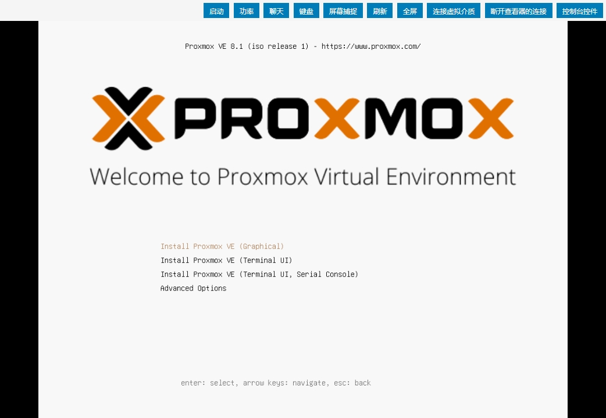

#### 主机的虚拟化系统之proxmox

公司有3台配置服务器，准备做成虚拟机，有考虑VMware，毕竟有图形化界面方便操作，可是没有license，找个开源的proxmox，发现安装过程简单，安装后配置也没那么麻烦，底层是qemu，安装Windows、MAC都没问题，并且操控虚拟机和VMware、Openstack同样方便,顺便记录一下过程

Proxmox VE是一个运行虚拟机和容器的平台。它基于Debian Linux，完全开源。为了获得最大的灵活性，我们实现了两种虚拟化技术——基于内核的虚拟机(KVM)和基于容器的虚拟化(LXC)

下面是在三台主机安装基于debian的社区版Proxmox虚拟平台，存储使用ceph，安装系统的。首先下载系统镜像 https://proxmox.com/en/downloads  Proxmox VE 8.1 ISO Installer，用rufus软件把镜像写入到U盘，当然其他软件都可以，像平时安装系统一样，完成后登录服务器



1，更改镜像源，更改为没有订阅的社区版版本

```
# vi /etc/apt/sources.list.d/pve-enterprise.list 
#deb https://enterprise.proxmox.com/debian/pve bookworm pve-enterprise

# vi /etc/apt/sources.list
#deb http://ftp.debian.org/debian bookworm main contrib

#deb http://ftp.debian.org/debian bookworm-updates main contrib

# security updates
#deb http://security.debian.org bookworm-security main contrib
deb http://download.proxmox.com/debian/pve bookworm pve-no-subscription
deb http://security.debian.org/debian-security bookworm-security main contrib


deb https://mirrors.huaweicloud.com/debian/ bookworm main non-free non-free-firmware contrib
deb-src https://mirrors.huaweicloud.com/debian/ bookworm main non-free non-free-firmware contrib
deb https://mirrors.huaweicloud.com/debian-security/ bookworm-security main
deb-src https://mirrors.huaweicloud.com/debian-security/ bookworm-security main
deb https://mirrors.huaweicloud.com/debian/ bookworm-updates main non-free non-free-firmware contrib
deb-src https://mirrors.huaweicloud.com/debian/ bookworm-updates main non-free non-free-firmware contrib
deb https://mirrors.huaweicloud.com/debian/ bookworm-backports main non-free non-free-firmware contrib
deb-src https://mirrors.huaweicloud.com/debian/ bookworm-backports main non-free non-free-firmware contrib

# vi /etc/apt/sources.list.d/ceph.list
#deb https://enterprise.proxmox.com/debian/ceph-quincy bookworm enterprise
deb http://download.proxmox.com/debian/ceph-reef bookworm no-subscription

```

2，升级系统

```
apt-get update
apt-get dist-upgrade -y

apt-get install lsof vim ntpdate -y
ntpdate -d ntp.ntsc.ac.cn
```

3，到图形化界面，登录用户名是root，密码是安装系统时设置的

https://IP:8006

能打开这个界面说明proxmox已经安装完毕，安装过程很简单。
把另外2台也安装好，这3台主机做一个集群，把另外2台加入到集群


安装ceph，作为存储


磁盘不能直接加入，是因为以前装过proxmox，磁盘是使用过的，所以需要先destroy销毁，这一步不是必须

```
for i in {a..v};do echo $i; ceph-volume lvm zap /dev/sd$i --destroy;done
```


配置ceph存储，创建OSD


存储创建后，就可以上传centos ISO镜像，创建虚拟机了


安装centos系统


安装后查看proxmox集群


安装后查看创建的虚拟机，图形化界面可以直接输入命令，并且有监控


ceph存储还需要做的事情：
1，监视器，ceph 3个节点都加入monitor
2，CephFS，元数据服务器添加3个节点
3，资源池，创建资源池

使用总结：
1，proxmox集群安装简单，并且不收费，没有什么特别的配置，图形化界面简单、方便。ceph存储集群在图形化界面就能完成配置，和手动安装配置ceph来说简直天壤之别。
2，主机创建完成后可以做成模板，下次创建主机直接使用，CPU、内存、磁盘也可以调整，创建主机选择资源池，方便迁移
3，官方文档很详细，集群的各种网络模式也考虑到了，其他设置自己摸索。参考[Proxmox VE文档](https://pve.proxmox.com/pve-docs/index.html)

2023年12月31日 于 [linux工匠](https://bbotte.github.io/) 发表