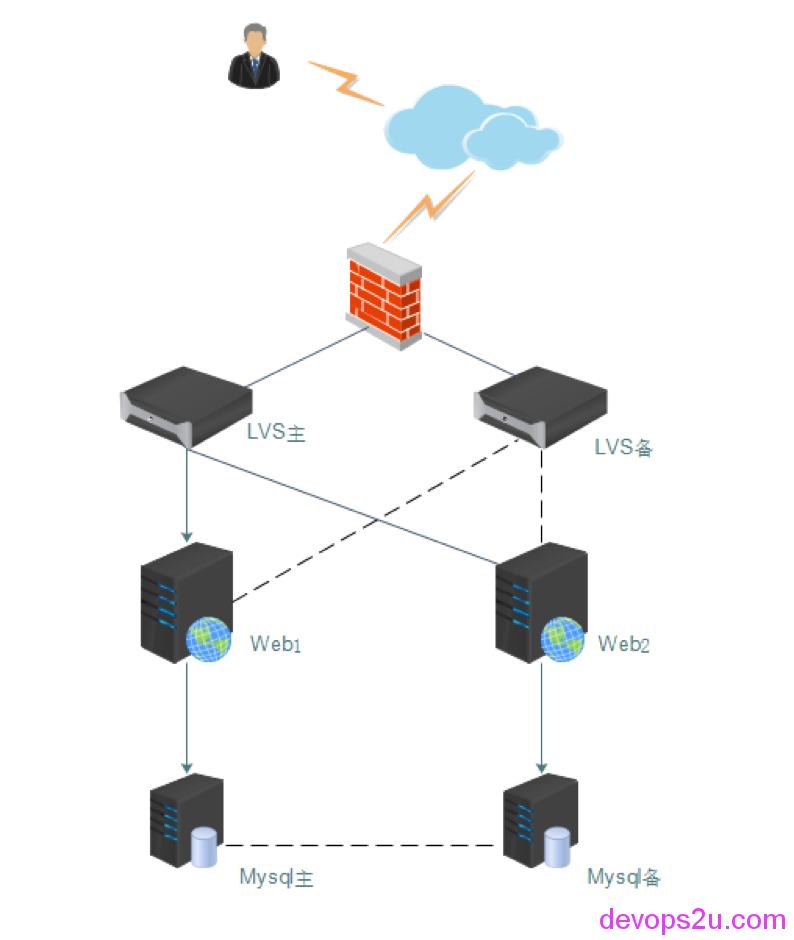
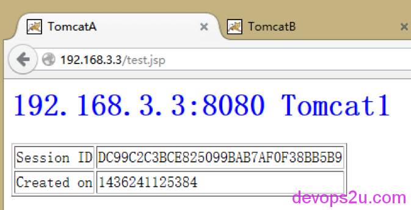
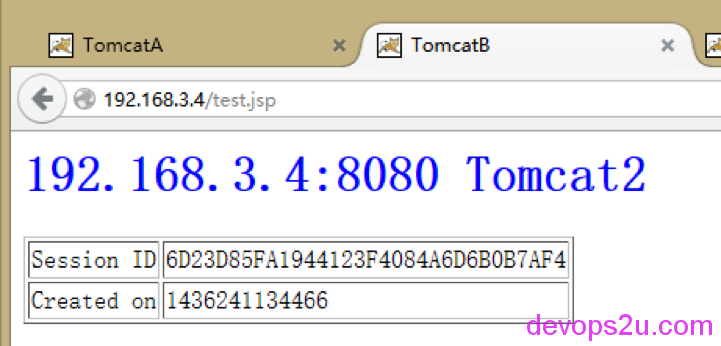
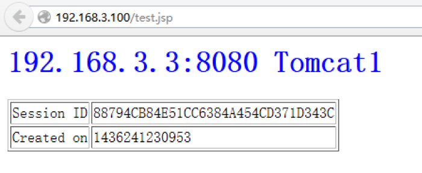

# web和mysql高可用集群部署文档

项目需求
实现方式
拓扑图
系统及软件版本
安装步骤
IP分配
LVS和keepalived的安装和配置

1. LVS主的安装和配置
2. LVS2备 配置
3. web服务器配置

Mysql-MHA高可用

1. Mysql主配置
2. manager管理端操作
3. VIP切换

测试

## 项目需求：

- 两台WEB/J2EE应用服务器同时提供服务，且负载均衡，当一台服务器当机时，另一台继续提供服务。
- .两台MYSQL数据库实时同步，保证数据一致性及完整性。

## 实现方式：

**lvs + keepalived + nginx + tomcat + redis + mysql**

- 使用lvs+Keepalived集群

LVS的通过控制IP来实现负载均衡。IPVS是其具体的实现模块。IPVS的主要作用：安装在Director Server上面，在Director Server虚拟一个对外访问的IP（VIP）。用户访问VIP，到达Director Server，Director Server根据一定的规则选择一个Real Server，处理完成后然后返回给客户端数据。使用lvs+Keepalived集群技术( DR模式 )让两台WEB/J2EE服务器实现负载均衡和高可用。

- redis一主一从，实现会话保持

redis主从复制，保证session不丢失，实现会话保持。当用户往Master端写入数据时，通过Redis Sync机制将数据文件发送至Slave，Slave也会执行相同的操作确保数据一致。

- 使用MysqlMHA高可用

MysqlMHA是一套优秀的作为MySQL高可用性环境下故障切换和主从提升的高可用软件。在MySQL故障切换过程中，MHA能做到0~30秒之内自动完成数据库的故障切换操作，并且在进行故障切换的过程中，MHA能最大程度上保证数据库的一致性，以达到真正意义上的高可用。使用MysqlMHA高可用建立稳定的mysql数据库集群，可以随时切换mysql数据库

- nginx + tomcat实现页面访问

现公司使用的即是前端nginx +后端 tomcat 访问网站

## 拓扑图：



## 系统及软件版本：

| 系统    | CentOS 5.6 X86-64    | kernel     | 2.6.18-238.el5 |
| ----- | -------------------- | ---------- | -------------- |
| LVS   | 1.2.1                | keepalived | 1.2.13         |
| mysql | 5.1.73               | mysqlMHA   | manager-0.55   |
| nginx | 1.6.2                | tomcat     | 6.0.44         |
| jdk   | jdk-6u41-linux-amd64 | redis      | 2.8.19         |

## 安装步骤：

系统分区及安装：

最小化安装，并修复bash漏洞，openssl心脏流血漏洞，glibc幽灵漏洞。

修复系统漏洞略，系统安装略。

## IP分配：

| LVS主    | 192.168.3.1   | LVS备    | 192.168.3.2  |
| ------- | ------------- | ------- | ------------ |
| LVS VIP | 192.168.3.100 | MHA VIP | 192.168.3.80 |
| web1    | 192.168.3.3   | web2    | 192.168.3.4  |
| Mysql主  | 192.168.3.5   | Mysql备  | 192.168.3.6  |

## LVS和keepalived的安装和配置：

### LVS主的安装和配置：

```
setenforce 0
vim /etc/sysconfig/selinux
 
yum install -y ipvsadm
wget http://mirrors.opencas.cn/epel/5/x86_64/epel-release-5-4.noarch.rpm
rpm -ivh epel-release-5-4.noarch.rpm
yum install gcc gcc-c++ vim wget lrzsz ntpdate sysstat dstat wget man tree popt popt-devel popt-static libnl libnl-devel openssl* -y
yum install kernel-devel
tar -xzf keepalived-1.2.13.tar.gz
cd keepalived-1.2.13
./configure --prefix=/usr/local/keepalived --disable-fwmark
cp /usr/local/keepalived/etc/rc.d/init.d/keepalived /etc/rc.d/init.d/
chmod +x /etc/rc.d/init.d/keepalived
mkdir /etc/keepalived
cp /usr/local/keepalived/etc/keepalived/keepalived.conf /etc/keepalived/
cp /etc/keepalived/keepalived.conf{,.bak}
sed -i 's/net\.ipv4\.ip\_forward\ \=\ 0/net\.ipv4\.ip\_forward\ \=\ 1/' /etc/sysctl.conf
service keepalived restart
ipvsadm -ln
```

keepalived的配置

```
# vim /etc/keepalived/keepalived.conf
! Configuration File for keepalived
 
global_defs {
   notification_email {
     sysadmin@firewall.loc
   }
   notification_email_from Alexandre.Cassen@firewall.loc
   smtp_server 192.168.200.1
   smtp_connect_timeout 30
   router_id LVS_DEVEL
}
 
vrrp_sync_group LVS_DEVEL {
 group {
         VI_1
 }
 }
 
vrrp_instance VI_1 {
    state MASTER
    interface eth0
    lvs_sync_daemon_interface eth0
    garp_master_delay 5
    virtual_router_id 99
    priority 151
    advert_int 1
    authentication {
        auth_type PASS
        auth_pass 1234567
    }
    virtual_ipaddress {
        192.168.3.100
    }
   track_interface {
   eth0
   }
}
 
virtual_server 192.168.3.100 80 {
    delay_loop 2
    lb_algo wrr
    lb_kind DR
    nat_mask 255.255.255.0
#    persistence_timeout 3
    protocol TCP
 
    real_server 192.168.3.3 80 {
        weight 1
        TCP_CHECK {
            connect_timeout 2
            nb_get_retry 3
            delay_before_retry 2
            connect_port 80
        }
     }
    real_server 192.168.3.4 80 {
        weight 1
        TCP_CHECK {
            connect_timeout 2
            nb_get_retry 3
            delay_before_retry 2
            connect_port 80
    }
}
}
```

service keepalived start

tail -f /var/log/messages

```
LVS1 日志：
Jul  7 10:58:03 dr1 Keepalived_vrrp[3645]: Opening file '/etc/keepalived/keepalived.conf'.
Jul  7 10:58:03 dr1 Keepalived_vrrp[3645]: Configuration is using : 66961 Bytes
Jul  7 10:58:03 dr1 Keepalived_vrrp[3645]: Using LinkWatch kernel netlink reflector...
Jul  7 10:58:03 dr1 kernel: IPVS: sync thread started: state = MASTER, mcast_ifn = eth0, syncid = 99
Jul  7 10:58:03 dr1 Keepalived_vrrp[3645]: VRRP sockpool: [ifindex(2), proto(112), unicast(0), fd(11,12)]
Jul  7 10:58:04 dr1 Keepalived_vrrp[3645]: VRRP_Instance(VI_1) Transition to MASTER STATE
Jul  7 10:58:05 dr1 Keepalived_vrrp[3645]: VRRP_Instance(VI_1) Entering MASTER STATE
Jul  7 10:58:05 dr1 Keepalived_vrrp[3645]: VRRP_Instance(VI_1) setting protocol VIPs.
Jul  7 10:58:05 dr1 Keepalived_vrrp[3645]: VRRP_Instance(VI_1) Sending gratuitous ARPs on eth0 for 192.168.3.100
Jul  7 10:58:05 dr1 Keepalived_vrrp[3645]: IPVS: No daemon is running
Jul  7 10:58:05 dr1 Keepalived_vrrp[3645]: IPVS: Daemon has already run
Jul  7 10:58:05 dr1 Keepalived_vrrp[3645]: VRRP_Group(LVS_DEVEL) Syncing instances to MASTER state
Jul  7 10:58:05 dr1 Keepalived_vrrp[3645]: Netlink reflector reports IP 192.168.3.100 added
Jul  7 10:58:05 dr1 Keepalived_healthcheckers[3644]: Netlink reflector reports IP 192.168.3.100 added
Jul  7 10:58:05 dr1 avahi-daemon[3312]: Registering new address record for 192.168.3.100 on eth0.
Jul  7 10:58:10 dr1 Keepalived_vrrp[3645]: VRRP_Instance(VI_1) Sending gratuitous ARPs on eth0 for 192.168.3.100
```

iptables设置

```
iptables -A INPUT -p udp -m udp --dport 3478 -j ACCEPT
iptables -A OUTPUT -p udp -m udp --sport 3478 -j ACCEPT
iptables -A INPUT -p tcp -m tcp --dport 3478 -j ACCEPT
iptables -A OUTPUT -p tcp -m tcp --sport 3478 -j ACCEPT
iptables -A INPUT -p tcp -m tcp --dport 80 -j ACCEPT
iptables -A OUTPUT -p tcp -m tcp --sport 80 -j ACCEPT
iptables -I INPUT -i eth0 -d 224.0.0.0/8 -j ACCEPT 
iptables -A INPUT -i eth0 -p vrrp -j ACCEPT
iptables -A OUTPUT -o eth0 -p vrrp -j ACCEPT
```

### LVS2备 配置

```
setenforce 0
vim /etc/sysconfig/selinux
yum install -y ipvsadm
wget http://mirrors.opencas.cn/epel/5/x86_64/epel-release-5-4.noarch.rpm
rpm -ivh epel-release-5-4.noarch.rpm
yum install gcc gcc-c++ vim wget lrzsz ntpdate sysstat dstat wget man tree popt popt-devel popt-static libnl libnl-devel openssl* -y
tar -xzf keepalived-1.2.13.tar.gz
cd keepalived-1.2.13
./configure --prefix=/usr/local/keepalived --disable-fwmark
cp /usr/local/keepalived/etc/rc.d/init.d/keepalived /etc/rc.d/init.d/
chmod +x /etc/rc.d/init.d/keepalived
mkdir /etc/keepalived
cp /usr/local/keepalived/etc/keepalived/keepalived.conf /etc/keepalived/
cp /etc/keepalived/keepalived.conf{,.bak}
sed -i 's/net\.ipv4\.ip\_forward\ \=\ 0/net\.ipv4\.ip\_forward\ \=\ 1/' /etc/sysctl.conf
service keepalived restart
```

```
vim /etc/keepalived/keepalived.conf
 
! Configuration File for keepalived
 
global_defs {
   notification_email {
     sysadmin@firewall.loc
   }
   notification_email_from Alexandre.Cassen@firewall.loc
   smtp_server 192.168.200.1
   smtp_connect_timeout 30
   router_id LVS_DEVEL
}
 
vrrp_sync_group LVS_DEVEL {
 
 group {
         VI_1
 }
 }
 
vrrp_instance VI_1 {
    state SLAVE
    interface eth0
    lvs_sync_daemon_interface eth0
    garp_master_delay 5
    virtual_router_id 99
    priority 150
    advert_int 1
    authentication {
        auth_type PASS
        auth_pass 1234567
    }
 
    virtual_ipaddress {
        192.168.3.100
    }
   track_interface {
   eth0
   }
}
 
virtual_server 192.168.3.100 80 {
    delay_loop 2
    lb_algo wrr
    lb_kind DR
    nat_mask 255.255.255.0
#    persistence_timeout 3
    protocol TCP
 
    real_server 192.168.3.3 80 {
        weight 1
        TCP_CHECK {
            connect_timeout 2
            nb_get_retry 3
            delay_before_retry 2
            connect_port 80
        }
     }
 
    real_server 192.168.3.4 80 {
        weight 1
        TCP_CHECK {
            connect_timeout 2
            nb_get_retry 3
            delay_before_retry 2
            connect_port 80
    }
}
}
```

service keepalived start

tail -f /var/log/messages

```
LVS2 日志：
Jul  7 10:58:23 dr2 Keepalived_healthcheckers[3634]: Opening file '/etc/keepalived/keepalived.conf'.
Jul  7 10:58:23 dr2 Keepalived_healthcheckers[3634]: Configuration is using : 14654 Bytes
Jul  7 10:58:23 dr2 Keepalived_healthcheckers[3634]: Using LinkWatch kernel netlink reflector...
Jul  7 10:58:23 dr2 Keepalived_healthcheckers[3634]: Activating healthchecker for service [192.168.3.3]:80
Jul  7 10:58:23 dr2 Keepalived_healthcheckers[3634]: Activating healthchecker for service [192.168.3.4]:80
Jul  7 10:58:23 dr2 Keepalived_vrrp[3635]: Opening file '/etc/keepalived/keepalived.conf'.
Jul  7 10:58:23 dr2 Keepalived_vrrp[3635]: Configuration is using : 66959 Bytes
Jul  7 10:58:23 dr2 Keepalived_vrrp[3635]: Using LinkWatch kernel netlink reflector...
Jul  7 10:58:23 dr2 kernel: IPVS: sync thread started: state = BACKUP, mcast_ifn = eth0, syncid = 99
Jul  7 10:58:23 dr2 Keepalived_vrrp[3635]: VRRP_Instance(VI_1) Entering BACKUP STATE
Jul  7 10:58:23 dr2 Keepalived_vrrp[3635]: VRRP sockpool: [ifindex(2), proto(112), unicast(0), fd(11,12)]
```

### web服务器配置

```
yum install gcc gcc-c++ vim wget lrzsz ntpdate sysstat dstat wget man tree -y
chmod 755 jdk-6u41-linux-x64-rpm.bin
./jdk-6u41-linux-x64-rpm.bin
yum install openssl openssl-devel
java -version
tar -xzf apache-tomcat-6.0.44.tar.gz -C /usr/local/
cd /usr/local/
mv apache-tomcat-6.0.44/ tomcat
tar  -zxf pcre-8.35.tar.gz
cd pcre-8.35
./configure --prefix=/usr/local/pcre
make &&make install &&cd ..
groupadd www
useradd -g www www -s /sbin/nologin
tar -xzf nginx-1.6.2.tar.gz
cd nginx-1.6.2
./configure --user=www --group=www --prefix=/usr/local/nginx --with-http_stub_status_module  --with-http_gzip_static_module --with-pcre=/root/pcre-8.35 --with-http_realip_module
make -j4
make install
cd /usr/local/tomcat/conf
cp context.xml context.xml.def
```


```
vim /usr/local/tomcat/conf/context.xml
<?xml version='1.0' encoding='utf-8'?>
 
<Context>
 
    <!-- Default set of monitored resources -->
    <WatchedResource>WEB-INF/web.xml</WatchedResource>
    <Valve className="com.radiadesign.catalina.session.RedisSessionHandlerValve" />
    <Manager className="com.radiadesign.catalina.session.RedisSessionManager"
         host="192.168.3.3"
         port="6379"
         database="0"
         maxInactiveInterval="60" />
</Context>
```

```
tar -xzf redis-2.8.19.tar.gz
make -j4
make install
cp redis.conf /etc/
vim /etc/redis.conf
/usr/local/bin/redis-server /etc/redis.conf &
```

```
vim /usr/local/tomcat/webapps/ROOT/test.jsp
<%@ page language="java" %>
 
<html>
 
 <head><title>TomcatA</title></head>
 
 <body>
  <h1><font color="blue">192.168.3.3:8080 Tomcat1 </h1>
  <table align="centre" border="1">
   <tr>
    <td>Session ID</td>
  <% session.setAttribute("abc","abc"); %>
    <td><%= session.getId() %></td>
   </tr>
   <tr>
    <td>Created on</td>
    <td><%= session.getCreationTime() %></td>
   </tr>
  </table>
 </body>
</html>
```

/usr/local/tomcat/bin/catalina.sh start

```
grep -v "^.*#" /usr/local/nginx/conf/nginx.conf|sed '/^$/d'
 
worker_processes  1;
events {
    worker_connections  1024;
}
 
http {
    include       mime.types;
    default_type  application/octet-stream;
    sendfile        on;
    keepalive_timeout  65;
 
    upstream mycluser {
    server 192.168.3.3:8080;
    }
 
    server {
        listen       80;
        server_name  localhost;
        location / {
            root   html;
            index  index.html index.htm index.jsp;
        proxy_pass http://mycluser;
        proxy_set_header X-Real-IP $remote_addr;
        proxy_set_header Host $host;
        proxy_set_header X-Forwarded-For $proxy_add_x_forwarded_for;
        proxy_redirect off;
        }
 
        error_page   500 502 503 504  /50x.html;
        location = /50x.html {
            root   html;
        }
    }
}
```

/usr/local/nginx/sbin/nginx

/usr/local/bin/redis-server /etc/redis.conf &

web2服务器需 vim /etc/redis.conf

slaveof 192.168.3.3 6379

编辑脚本并启动：

```
vim realserver.sh
 
#!/bin/bash
#
# Script to start LVS DR real server.
# description: LVS DR real server
#
 
. /etc/rc.d/init.d/functions
VIP=192.168.3.100
host=`/bin/hostname`
case "$1" in
 
start)
       # Start LVS-DR real server on this machine.
        /sbin/ifconfig lo down
        /sbin/ifconfig lo up
        echo 1 > /proc/sys/net/ipv4/conf/lo/arp_ignore
        echo 2 > /proc/sys/net/ipv4/conf/lo/arp_announce
        echo 1 > /proc/sys/net/ipv4/conf/all/arp_ignore
        echo 2 > /proc/sys/net/ipv4/conf/all/arp_announce
        /sbin/ifconfig lo:0 $VIP broadcast $VIP netmask 255.255.255.255 up
        /sbin/route add -host $VIP dev lo:0
;;
 
stop)
        # Stop LVS-DR real server loopback device(s).
        /sbin/ifconfig lo:0 down
        echo 0 > /proc/sys/net/ipv4/conf/lo/arp_ignore
        echo 0 > /proc/sys/net/ipv4/conf/lo/arp_announce
        echo 0 > /proc/sys/net/ipv4/conf/all/arp_ignore
        echo 0 > /proc/sys/net/ipv4/conf/all/arp_announce
;;
 
status)
        # Status of LVS-DR real server.
        islothere=`/sbin/ifconfig lo:0 | grep $VIP`
        isrothere=`netstat -rn | grep "lo:0" | grep $VIP`
        if [ ! "$islothere" -o ! "isrothere" ];then
            # Either the route or the lo:0 device
            # not found.
            echo "LVS-DR real server Stopped."
        else
            echo "LVS-DR real server Running."
        fi
;;
*)
            # Invalid entry.
            echo "$0: Usage: $0 {start|status|stop}"
            exit 1
;;
esac
```

iptables设置

```
iptables -A INPUT -p udp -m udp --dport 3478 -j ACCEPT
iptables -A OUTPUT -p udp -m udp --sport 3478 -j ACCEPT
iptables -A INPUT -p tcp -m tcp --dport 3478 -j ACCEPT
iptables -A OUTPUT -p tcp -m tcp --sport 3478 -j ACCEPT
iptables -A INPUT -p tcp -m tcp --dport 80 -j ACCEPT
iptables -A OUTPUT -p tcp -m tcp --sport 80 -j ACCEPT
```

## Mysql-MHA高可用：

| Hostname | Ip                | 主机说明 |
| -------- | ----------------- | ---- |
| manager  | 192.168.3.7       | 管理端  |
| db1      | 192.168.3.5       | 现有主库 |
| db2      | 192.168.3.6       | 备用主库 |
|          | VIP  192.168.3.80 |      |

### Mysql主配置：

安装mysql：

```
yum -y install ncurses*
/usr/sbin/groupadd mysql
/usr/sbin/useradd -g mysql mysql
chown -R mysql.mysql /var/mysql/data
chown -R mysql.mysql /var/log/mysql
cd mysql-5.1.73
yum -y install libtool
./configure --prefix=/usr/local/mysql/ --with-server-suffix=-junsansi-edition --enable-assembler --enable-local-infile --enable-thread-safe-client --with-big-tables --with-charset=utf8&nbsp; --with-extra-charsets=gbk,gb2312,utf8,ascii&nbsp; --with-readline --with-ssl --with-embedded-server --with-pthread --with-mysqld-user=mysql --with-mysqld-ldflags=-all-static --with-client-ldflags=-all-static --with-plugins=partition,innobase,innodb_plugin
make
make install
cp support-files/mysql.server /etc/init.d/mysqld
chmod 755 /etc/init.d/mysqld
 
vim /etc/my.cnf
[mysqld]
datadir=/var/mysql/data
socket=/var/log/mysql/mysql.sock
 
user=mysql
# Default to using old password format for compatibility with mysql 3.x
# clients (those using the mysqlclient10 compatibility package).
old_passwords=1
 
# Disabling symbolic-links is recommended to prevent assorted security risks;
# to do so, uncomment this line:
# symbolic-links=0
 
[mysqld_safe]
log-error=/var/log/mysql/mysqld.log
pid-file=/var/log/mysql/mysqld.pid
 
 
/usr/local/mysql/bin/mysql_install_db --user=mysql&nbsp; --datadir=/var/mysql/data/ --basedir=/usr/local/mysql --log-output=file
 
service mysqld start
```

**db1**现有主库操作：

```
ssh-keygen -t rsa
ssh-copy-id -i ~/.ssh/id_rsa.pub root@192.168.23.7
ssh-copy-id -i ~/.ssh/id_rsa.pub root@192.168.23.6
 
mysql -uroot -p
grant replication slave on *.* to mharep@'192.168.3.%' identified by 'passwd';
grant all privileges on *.* to 'mha_manager'@'192.168.3.%' identified by '123456';
flush privileges;
\q
 
rpm -ivh perl-DBD-MySQL-3.0007-2.el5.x86_64.rpm
rpm -ivh mha4mysql-node-0.54-1.el5.noarch.rpm
```

**db2**备用主库操作

```
ssh-keygen -t rsa
ssh-copy-id -i ~/.ssh/id_rsa.pub root@192.168.23.5
ssh-copy-id -i ~/.ssh/id_rsa.pub root@192.168.23.7
#ntpdate 132.163.4.101
rpm -ivh perl-DBD-MySQL-3.0007-2.el5.x86_64.rpm
rpm -ivh mha4mysql-node-0.54-1.el5.noarch.rpm
 
vim /etc/my.cnf
 
#character-set-server=utf8 
server-id=2
log-bin=mysql-bin
binlog_format=mixed
relay_log_purge=0        #最好添加此选项
 
mysql -uroot -p
reset master;
reset slave;
grant replication slave on *.* to mharep@'192.168.3.%' identified by 'passwd';
grant all privileges on *.* to 'mha_manager'@'192.168.3.%' identified by '123456';
flush privileges;
slave stop;
change master to MASTER_HOST='192.168.3.5', MASTER_PORT=3306,MASTER_USER='mharep', MASTER_PASSWORD='passwd',master_log_file='mysql-bin.000001', master_log_pos=107;
slave start;
show slave status\G;
\q
```

### manager管理端操作

```
ssh-keygen -t rsa
ssh-copy-id -i ~/.ssh/id_rsa.pub root@192.168.23.5
ssh-copy-id -i ~/.ssh/id_rsa.pub root@192.168.23.6
ntpdate 132.163.4.101
yum install perl cpan -y
yum install perl-DBD-MySQL perl-Config-Tiny perl-Log-Dispatch perl-Parallel-ForkManager -y
rpm -ivh perl-Mail-Sender-0.8.16-1.el6.rf.noarch.rpm
rpm -ivh perl-Mail-Sendmail-0.79-1.2.el6.rf.noarch.rpm
yum localinstall perl-Log-Dispatch-2.26-1.el6.rf.noarch.rpm -y
yum localinstall perl-Parallel-ForkManager-0.7.5-2.2.el6.rf.noarch.rpm -y
yum localinstall mha4mysql-node-0.54-1.el5.noarch.rpm -y
yum localinstall mha4mysql-manager-0.55-1.el5.noarch.rpm -y
yum localinstall perl-Net-Telnet-3.03-2.el6.rfx.noarch.rpm -y
tar -xzf mha4mysql-manager-0.55.tar.gz
mkdir -p /usr/local/mha/scripts
cp mha4mysql-manager-0.55/samples/scripts/* /usr/local/mha/scripts
 
cat >> /usr/local/mha/mha.conf << EOF
 
[server default]
user=mha_manager
password=123456
manager_workdir=/usr/local/mha
manager_log=/usr/local/mha/manager.log
remote_workdir=/usr/local/mha
ssh_user=root
repl_user=mharep
repl_password=passwd
ping_interval=1
 
#下面是mysql检测设置
secondary_check_script= masterha_secondary_check -s 192.168.3.5 -s 192.168.3.6
#master_ip_failover_script=/usr/local/mha/scripts/master_ip_failover
#shutdown_script= /usr/local/mha/scripts/power_manager
report_script= /usr/local/mha/scripts/send_report
master_ip_online_change_script= /usr/local/mha/scripts/master_ip_online_change
[server1]
hostname=192.168.3.5
ssh_port=22
master_binlog_dir=/var/mysql/log   #binlog_dir目录必须正确
candidate_master=1
 
[server2]
hostname=192.168.3.6
ssh_port=22
master_binlog_dir=/var/mysql/log
candidate_master=1
EOF

```

```
masterha_check_ssh  --conf=/usr/local/mha/mha.conf
 
masterha_check_repl --conf=/usr/local/mha/mha.conf
 
mv /usr/local/mha/scripts/master_ip_failover /usr/local/mha/scripts/master_ip_failover.def
 
cp master_ip_failover /usr/local/mha/scripts/master_ip_failover
 
chmod 755 /usr/local/mha/scripts/master_ip_failover
 
sed -i 's/#master_ip_failover_script/master_ip_failover_script/' /usr/local/mha/mha.conf
```

### VIP切换

```
masterha_check_repl --conf=/usr/local/mha/mha.conf
 
nohup masterha_manager --conf=/usr/local/mha/mha.conf > /tmp/mha_manager.log  < /dev/null 2>&1 &
 
masterha_check_status --conf=/usr/local/mha/mha.conf
 
masterha_stop --conf=/usr/local/mha/mha.conf
 
masterha_master_switch --conf=/usr/local/mha/mha.conf --master_state=alive --new_master_host=192.168.23.6 --new_master_port=3306 --orig_master_is_new_slave --running_updates_limit=10000
```

```
vim master_ip_online_change
#!/usr/bin/env perl
 
#  Copyright (C) 2011 DeNA Co.,Ltd.
#
#  This program is free software; you can redistribute it and/or modify
#  it under the terms of the GNU General Public License as published by
#  the Free Software Foundation; either version 2 of the License, or
#  (at your option) any later version.
#
#  This program is distributed in the hope that it will be useful,
#  but WITHOUT ANY WARRANTY; without even the implied warranty of
#  MERCHANTABILITY or FITNESS FOR A PARTICULAR PURPOSE.  See the
#  GNU General Public License for more details.
#
#  You should have received a copy of the GNU General Public License
#   along with this program; if not, write to the Free Software
#  Foundation, Inc.,
#  51 Franklin Street, Fifth Floor, Boston, MA  02110-1301  USA
 
## Note: This is a sample script and is not complete. Modify the script based on your environment.
 
use strict;
use warnings FATAL => 'all';
 
use Getopt::Long;
use MHA::DBHelper;
use MHA::NodeUtil;
use Time::HiRes qw( sleep gettimeofday tv_interval );
use Data::Dumper;
 
my $_tstart;
my $_running_interval = 0.1;
my (
  $command,          $orig_master_host, $orig_master_ip,
  $orig_master_port, $orig_master_user, 
  $new_master_host,  $new_master_ip,    $new_master_port,
  $new_master_user,  
);
 
 
my $vip = '192.168.3.80/24';  # Virtual IP 
my $key = "1"; 
my $ssh_start_vip = "/sbin/ifconfig eth1:$key $vip";
my $ssh_stop_vip = "/sbin/ifconfig eth1:$key down";
my $ssh_user = "root";
my $new_master_password='123456';
my $orig_master_password='123456';
GetOptions(
  'command=s'              => \$command,
  #'ssh_user=s'             => \$ssh_user,  
  'orig_master_host=s'     => \$orig_master_host,
  'orig_master_ip=s'       => \$orig_master_ip,
  'orig_master_port=i'     => \$orig_master_port,
  'orig_master_user=s'     => \$orig_master_user,
  #'orig_master_password=s' => \$orig_master_password,
  'new_master_host=s'      => \$new_master_host,
  'new_master_ip=s'        => \$new_master_ip,
  'new_master_port=i'      => \$new_master_port,
  'new_master_user=s'      => \$new_master_user,
  #'new_master_password=s'  => \$new_master_password,
);
 
exit &main();
 
sub current_time_us {
  my ( $sec, $microsec ) = gettimeofday();
  my $curdate = localtime($sec);
  return $curdate . " " . sprintf( "%06d", $microsec );
}
 
sub sleep_until {
  my $elapsed = tv_interval($_tstart);
  if ( $_running_interval > $elapsed ) {
    sleep( $_running_interval - $elapsed );
  }
}
 
sub get_threads_util {
  my $dbh                    = shift;
  my $my_connection_id       = shift;
  my $running_time_threshold = shift;
  my $type                   = shift;
  $running_time_threshold = 0 unless ($running_time_threshold);
  $type                   = 0 unless ($type);
  my @threads;
 
  my $sth = $dbh->prepare("SHOW PROCESSLIST");
  $sth->execute();
 
  while ( my $ref = $sth->fetchrow_hashref() ) {
    my $id         = $ref->{Id};
    my $user       = $ref->{User};
    my $host       = $ref->{Host};
    my $command    = $ref->{Command};
    my $state      = $ref->{State};
    my $query_time = $ref->{Time};
    my $info       = $ref->{Info};
    $info =~ s/^\s*(.*?)\s*$/$1/ if defined($info);
    next if ( $my_connection_id == $id );
    next if ( defined($query_time) && $query_time < $running_time_threshold );
    next if ( defined($command)    && $command eq "Binlog Dump" );
    next if ( defined($user)       && $user eq "system user" );
    next
      if ( defined($command)
      && $command eq "Sleep"
      && defined($query_time)
      && $query_time >= 1 );
 
    if ( $type >= 1 ) {
      next if ( defined($command) && $command eq "Sleep" );
      next if ( defined($command) && $command eq "Connect" );
    }
 
    if ( $type >= 2 ) {
      next if ( defined($info) && $info =~ m/^select/i );
      next if ( defined($info) && $info =~ m/^show/i );
    }
 
    push @threads, $ref;
  }
  return @threads;
}
 
sub main {
  if ( $command eq "stop" ) {
    ## Gracefully killing connections on the current master
    # 1. Set read_only= 1 on the new master
    # 2. DROP USER so that no app user can establish new connections
    # 3. Set read_only= 1 on the current master
    # 4. Kill current queries
    # * Any database access failure will result in script die.
    my $exit_code = 1;
    eval {
      ## Setting read_only=1 on the new master (to avoid accident)
      my $new_master_handler = new MHA::DBHelper();
 
      # args: hostname, port, user, password, raise_error(die_on_error)_or_not
      $new_master_handler->connect( $new_master_ip, $new_master_port,
        $new_master_user, $new_master_password, 1 );
      print current_time_us() . " Set read_only on the new master.. ";
      $new_master_handler->enable_read_only();
      if ( $new_master_handler->is_read_only() ) {
        print "ok.\n";
      }
      else {
        die "Failed!\n";
      }
      $new_master_handler->disconnect();
 
      # Connecting to the orig master, die if any database error happens
      my $orig_master_handler = new MHA::DBHelper();
      $orig_master_handler->connect( $orig_master_ip, $orig_master_port,
        $orig_master_user, $orig_master_password, 1 );
 
      ## Drop application user so that nobody can connect. Disabling per-session binlog beforehand
      #$orig_master_handler->disable_log_bin_local();
      #print current_time_us() . " Drpping app user on the orig master..\n";
      #FIXME_xxx_drop_app_user($orig_master_handler);
 
      ## Waiting for N * 100 milliseconds so that current connections can exit
      my $time_until_read_only = 15;
      $_tstart = [gettimeofday];
      my @threads = get_threads_util( $orig_master_handler->{dbh},
        $orig_master_handler->{connection_id} );
      while ( $time_until_read_only > 0 && $#threads >= 0 ) {
        if ( $time_until_read_only % 5 == 0 ) {
          printf
"%s Waiting all running %d threads are disconnected.. (max %d milliseconds)\n",
            current_time_us(), $#threads + 1, $time_until_read_only * 100;
          if ( $#threads < 5 ) {
            print Data::Dumper->new( [$_] )->Indent(0)->Terse(1)->Dump . "\n"
              foreach (@threads);
          }
        }
        sleep_until();
        $_tstart = [gettimeofday];
        $time_until_read_only--;
        @threads = get_threads_util( $orig_master_handler->{dbh},
          $orig_master_handler->{connection_id} );
      }
 
      ## Setting read_only=1 on the current master so that nobody(except SUPER) can write
      print current_time_us() . " Set read_only=1 on the orig master.. ";
      $orig_master_handler->enable_read_only();
      if ( $orig_master_handler->is_read_only() ) {
        print "ok.\n";
      }
      else {
        die "Failed!\n";
      }
 
      ## Waiting for M * 100 milliseconds so that current update queries can complete
      my $time_until_kill_threads = 5;
      @threads = get_threads_util( $orig_master_handler->{dbh},
        $orig_master_handler->{connection_id} );
      while ( $time_until_kill_threads > 0 && $#threads >= 0 ) {
        if ( $time_until_kill_threads % 5 == 0 ) {
          printf
"%s Waiting all running %d queries are disconnected.. (max %d milliseconds)\n",
            current_time_us(), $#threads + 1, $time_until_kill_threads * 100;
          if ( $#threads < 5 ) {
            print Data::Dumper->new( [$_] )->Indent(0)->Terse(1)->Dump . "\n"
              foreach (@threads);
          }
        }
        sleep_until();
        $_tstart = [gettimeofday];
        $time_until_kill_threads--;
        @threads = get_threads_util( $orig_master_handler->{dbh},
          $orig_master_handler->{connection_id} );
      }
 
 
 
                print "Disabling the VIP on old master: $orig_master_host \n";
                &stop_vip();     
 
 
      ## Terminating all threads
      print current_time_us() . " Killing all application threads..\n";
      $orig_master_handler->kill_threads(@threads) if ( $#threads >= 0 );
      print current_time_us() . " done.\n";
      #$orig_master_handler->enable_log_bin_local();
      $orig_master_handler->disconnect();
 
      ## After finishing the script, MHA executes FLUSH TABLES WITH READ LOCK
      $exit_code = 0;
    };
    if ($@) {
      warn "Got Error: $@\n";
      exit $exit_code;
    }
    exit $exit_code;
  }
  elsif ( $command eq "start" ) {
    ## Activating master ip on the new master
    # 1. Create app user with write privileges
    # 2. Moving backup script if needed
    # 3. Register new master's ip to the catalog database
 
# We don't return error even though activating updatable accounts/ip failed so that we don't interrupt slaves' recovery.
# If exit code is 0 or 10, MHA does not abort
    my $exit_code = 10;
    eval {
      my $new_master_handler = new MHA::DBHelper();
 
      # args: hostname, port, user, password, raise_error_or_not
      $new_master_handler->connect( $new_master_ip, $new_master_port,
        $new_master_user, $new_master_password, 1 );
 
      ## Set read_only=0 on the new master
      #$new_master_handler->disable_log_bin_local();
      print current_time_us() . " Set read_only=0 on the new master.\n";
      $new_master_handler->disable_read_only();
 
      ## Creating an app user on the new master
      #print current_time_us() . " Creating app user on the new master..\n";
      #FIXME_xxx_create_app_user($new_master_handler);
      #$new_master_handler->enable_log_bin_local();
      $new_master_handler->disconnect();
 
      ## Update master ip on the catalog database, etc
                print "Enabling the VIP - $vip on the new master - $new_master_host \n";
                &start_vip();
                $exit_code = 0;
    };
    if ($@) {
      warn "Got Error: $@\n";
      exit $exit_code;
    }
    exit $exit_code;
  }
  elsif ( $command eq "status" ) {
 
    # do nothing
    exit 0;
  }
  else {
    &usage();
    exit 1;
  }
}
 
# A simple system call that enable the VIP on the new master 
sub start_vip() {
    `ssh $ssh_user\@$new_master_host \" $ssh_start_vip \"`;
}
# A simple system call that disable the VIP on the old_master
sub stop_vip() {
    `ssh $ssh_user\@$orig_master_host \" $ssh_stop_vip \"`;
}
 
sub usage {
  print
"Usage: master_ip_online_change --command=start|stop|status --orig_master_host=host --orig_master_ip=ip --orig_master_port=port --new_master_host=host --new_master_ip=ip --new_master_port=port\n";
  die;
}
 
 
 
vim master_ip_failover
#!/usr/bin/env perl
use strict;
use warnings FATAL => 'all';
use Getopt::Long;
my (
$command, $ssh_user, $orig_master_host, $orig_master_ip,
$orig_master_port, $new_master_host, $new_master_ip, $new_master_port
);
  
my $vip = '192.168.23.80'; # Virtual IP
my $gateway = ''; #Gateway IP
my $interface = 'eth1';
my $key = "1";
my $ssh_start_vip = "/sbin/ifconfig $interface:$key $vip;/sbin/arping -I $interface -c 3 -s $vip $gateway >/dev/null 2>&1";
my $ssh_stop_vip = "/sbin/ifconfig $interface:$key down";
  
GetOptions(
'command=s' => \$command,
'ssh_user=s' => \$ssh_user,
'orig_master_host=s' => \$orig_master_host,
'orig_master_ip=s' => \$orig_master_ip,
'orig_master_port=i' => \$orig_master_port,
'new_master_host=s' => \$new_master_host,
'new_master_ip=s' => \$new_master_ip,
'new_master_port=i' => \$new_master_port,
);
 
exit &main();
sub main {
print "\n\nIN SCRIPT TEST====$ssh_stop_vip==$ssh_start_vip===\n\n";
if ( $command eq "stop" || $command eq "stopssh" ) {
# $orig_master_host, $orig_master_ip, $orig_master_port are passed.
# If you manage master ip address at global catalog database,
# invalidate orig_master_ip here.
my $exit_code = 1;
eval {
print "Disabling the VIP on old master: $orig_master_host \n";
&stop_vip();
$exit_code = 0;
};
if ($@) {
warn "Got Error: $@\n";
exit $exit_code;
}
exit $exit_code;
}
elsif ( $command eq "start" ) {
# all arguments are passed.
# If you manage master ip address at global catalog database,
# activate new_master_ip here.
# You can also grant write access (create user, set read_only=0, etc) here.
my $exit_code = 10;
eval {
print "Enabling the VIP - $vip on the new master - $new_master_host \n";
&start_vip();
$exit_code = 0;
};
if ($@) {
warn $@;
exit $exit_code;
}
exit $exit_code;
}
elsif ( $command eq "status" ) {
print "Checking the Status of the script.. OK \n";
`ssh $ssh_user\@$orig_master_host \" $ssh_start_vip \"`;
exit 0;
}
else {
&usage();
exit 1;
}
}
# A simple system call that enable the VIP on the new master
sub start_vip() {
`ssh $ssh_user\@$new_master_host \" $ssh_start_vip \"`;
}
# A simple system call that disable the VIP on the old_master
sub stop_vip() {
`ssh $ssh_user\@$orig_master_host \" $ssh_stop_vip \"`;
}
sub usage {
print
"Usage:
 master_ip_failover --command=start|stop|stopssh|status 
--orig_master_host=host --orig_master_ip=ip --orig_master_port=port 
--new_master_host=host --new_master_ip=ip --new_master_port=port\n";
}
```

## 测试：

- 正常访问网站

web1服务器页面：



web2服务器页面：



lvs + keepalived VIP页面：



- 把主数据库关机或关闭网卡

1，访问页面不受影响，正常访问

2，数据库数据完整性、一致性、可用性正常

- 把web1服务器关机或关闭网卡

由于web1和web2实现了负载均衡，所以客户打开的页面内容完全一致，访问正常

- 把LVS1服务器关机或关闭网卡

1，由于2台服务器实现前端分发请求的高可用，所以LVS1主机当机，网站仍然正常访问，访问不受影响

- 打开网站，登录

在测试期间，一直刷新页面查看，在LVS1当机的时刻会有少于2秒时间无法访问网站，高可用可以达到 99.99999% ，保证网站访问不因为服务器当机而造成损失。

2016年05月13日 于 [linux工匠](http://www.bbotte.com/) 发表

