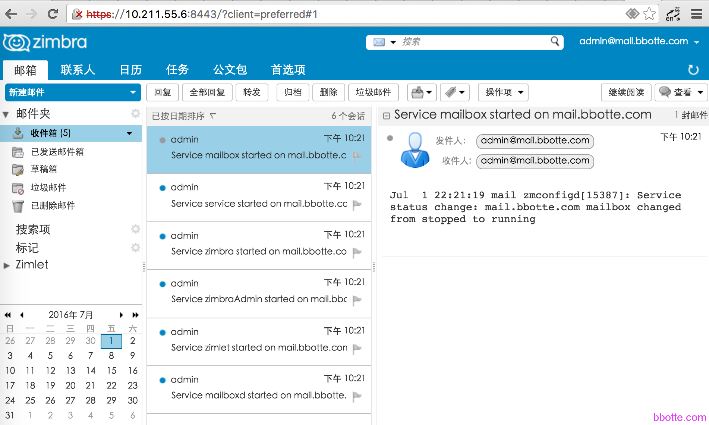
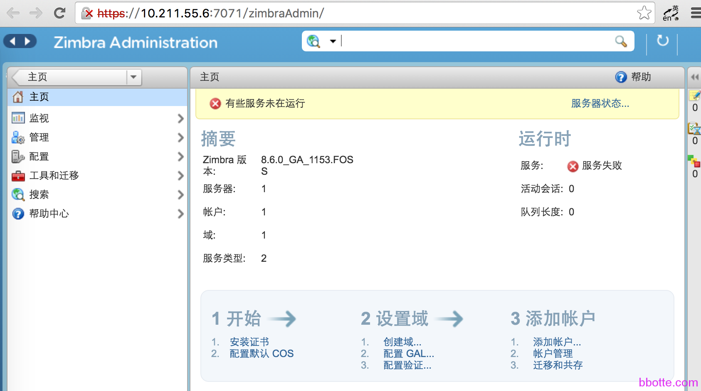
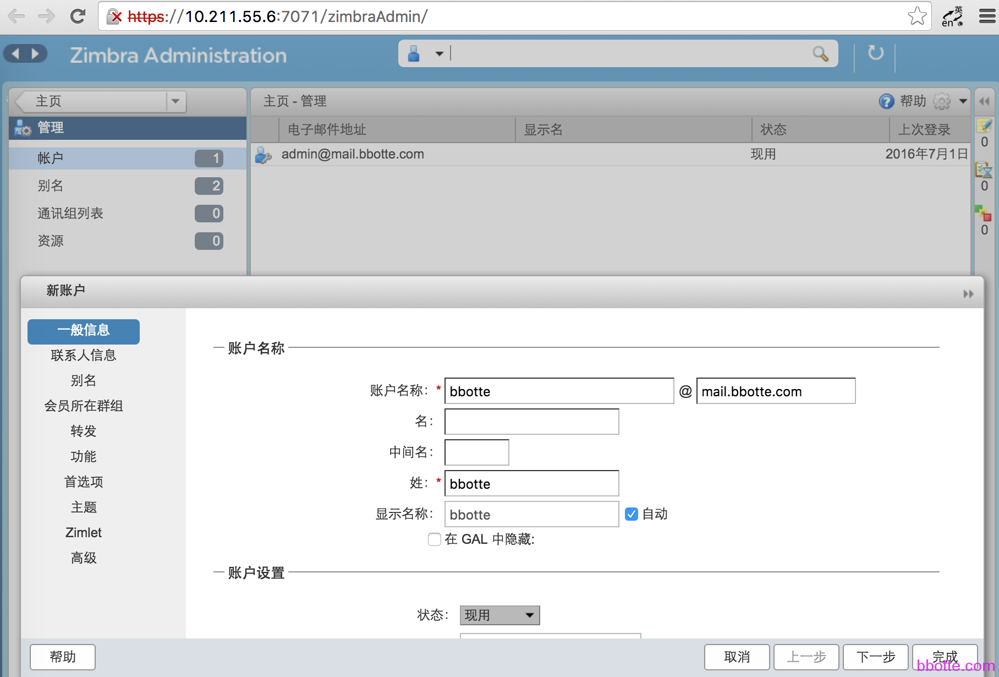
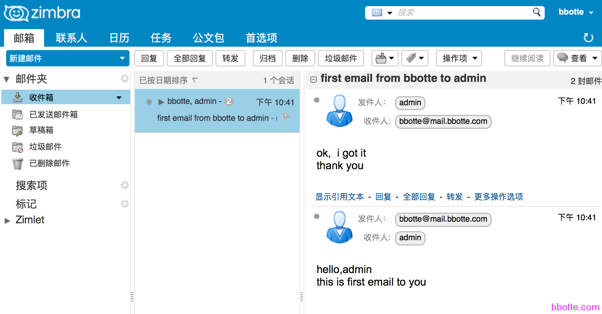

# Zimbra配置邮件服务全程记录

1. 说明
2. 基本设置
3. 配置dns服务
4. 下载zimbra客户端并安装
5. web界面

### 说明

**Zimbra Collaboration Suite** (**ZCS**) 是一套多人协作平台, 包含了邮件服务器和客户端.它的核心功能是电子邮件和日程安排服务器，就象是下一代的微软Exchange。在电子邮件和日程安排之外，它还提供文档存储和编辑、即时消息以及一个利用获奖技术开发的全功能的管理控制台。ZCS同时也提供移动设备的支持，以及与部署于Windows、Linux或apple操作系统中的桌面程序的同步功能。   <https://www.zimbra.com/>

### 基本设置

```
# cat /etc/centos-release
CentOS release 6.7 (Final)
# ntpdate ntp1.aliyun.com;hwclock -w
# service iptables stop
# setenforce 0   #禁用selinux
# yum install rpm-build ant sysstat libidn gmp perl sqlite bind nc -y
# /etc/init.d/postfix stop
# chkconfig postfix off
# 如果有sendmail服务也需要停止并且关闭开机启动
```

### 配置dns服务

如果依赖其他的dns，这一步可以省略

```
# cat /etc/hosts
127.0.0.1   localhost localhost.localdomain localhost4 localhost4.localdomain4
::1         localhost localhost.localdomain localhost6 localhost6.localdomain6
10.211.55.6 mail.bbotte.com mail
127.0.0.1 mail.bbotte.com mail
```

```
# cat /etc/sysconfig/network
NETWORKING=yes
#HOSTNAME=localhost.localdomain
HOSTNAME=mail.bbotte.com
```

```
# exec $SHELL
# hostname mail
# yum install bind -y
# egrep -v '^#|^\/' /etc/named.conf
 
options {
	listen-on port 53 { 127.0.0.1; };
	listen-on-v6 port 53 { ::1; };
	directory 	"/var/named";
	dump-file 	"/var/named/data/cache_dump.db";
        statistics-file "/var/named/data/named_stats.txt";
        memstatistics-file "/var/named/data/named_mem_stats.txt";
	allow-query     { localhost; };
	recursion yes;
 
	dnssec-enable yes;
	dnssec-validation yes;
 
	/* Path to ISC DLV key */
	bindkeys-file "/etc/named.iscdlv.key";
 
	managed-keys-directory "/var/named/dynamic";
};
 
logging {
        channel default_debug {
                file "data/named.run";
                severity dynamic;
        };
};
 
zone "." IN {
	type hint;
	file "named.ca";
};
zone "bbotte.com" IN {
type master;
file "bbotte.com.zone";
 };
include "/etc/named.rfc1912.zones";
include "/etc/named.root.key";
 
# cat /var/named/bbotte.com.zone
@       IN  SOA bbotte.com. root.localhost. (
            2013031901      ;serial
            12h     ;refresh
            7200        ;retry
            604800      ;expire
            86400       ;mininum
            )
@       IN  NS   bbotte.com.
        IN  A    10.211.55.6
        IN  MX  10  mail.bbotte.com.
mail    IN  A   10.211.55.6
*       IN  A   10.211.55.6
 
#这里没有配置dns的反向解析
```

### 下载zimbra客户端并安装

```
#下载链接  https://www.zimbra.com/downloads/zimbra-collaboration-open-source/
# tar -xzf zcs-8.6.0_GA_1153.RHEL6_64.20141215151155.tgz -C /opt/
# cd /opt/zcs-8.6.0_GA_1153.RHEL6_64.20141215151155/
# ./install.sh -h
./install.sh [-r <dir> -l <file> -a <file> -u -s -c type -x -h] [defaultsfile]
 
-h|--help               Usage
-l|--license <file>     License file to install.
-a|--activation <file>  License activation file to install. [Upgrades only]
-r|--restore <dir>      Restore contents of <dir> to localconfig
-s|--softwareonly       Software only installation.
-u|--uninstall          Uninstall ZCS
-x|--skipspacecheck     Skip filesystem capacity checks.
--beta-support          Allows installer to upgrade Network Edition Betas.
--platform-override     Allows installer to continue on an unknown OS.
--skip-activation-check Allows installer to continue if license activation checks fail.
--skip-upgrade-check    Allows installer to skip upgrade validation checks.
[defaultsfile]          File containing default install values.
 
[root@mail zcs-8.6.0_GA_1153.RHEL6_64.20141215151155]# ./install.sh
 
Operations logged to /tmp/install.log.19443
Checking for existing installation...
    zimbra-ldap...NOT FOUND
    zimbra-logger...NOT FOUND
    zimbra-mta...NOT FOUND
    zimbra-dnscache...NOT FOUND
    zimbra-snmp...NOT FOUND
    zimbra-store...NOT FOUND
    zimbra-apache...NOT FOUND
    zimbra-spell...NOT FOUND
    zimbra-convertd...NOT FOUND
    zimbra-memcached...NOT FOUND
    zimbra-proxy...NOT FOUND
    zimbra-archiving...NOT FOUND
    zimbra-core...NOT FOUND
 
 
PLEASE READ THIS AGREEMENT CAREFULLY BEFORE USING THE SOFTWARE.
ZIMBRA, INC. ("ZIMBRA") WILL ONLY LICENSE THIS SOFTWARE TO YOU IF YOU
FIRST ACCEPT THE TERMS OF THIS AGREEMENT. BY DOWNLOADING OR INSTALLING
THE SOFTWARE, OR USING THE PRODUCT, YOU ARE CONSENTING TO BE BOUND BY
THIS AGREEMENT. IF YOU DO NOT AGREE TO ALL OF THE TERMS OF THIS
AGREEMENT, THEN DO NOT DOWNLOAD, INSTALL OR USE THE PRODUCT.
 
License Terms for the Zimbra Collaboration Suite:
  http://www.zimbra.com/license/zimbra-public-eula-2-5.html
 
 
 
Do you agree with the terms of the software license agreement? [N] y
 
 
 
Checking for prerequisites...
     FOUND: NPTL
     FOUND: nc-1.84-24
     FOUND: sudo-1.8.6p3-19
     FOUND: libidn-1.18-2
     FOUND: gmp-4.3.1-10
     FOUND: libaio-0.3.107-10
     FOUND: libstdc++-4.4.7-16
     FOUND: unzip-6.0-2
 
Checking for suggested prerequisites...
     FOUND: perl-5.10.1
     FOUND: sysstat
     FOUND: sqlite
Prerequisite check complete.
 
Checking for installable packages
 
Found zimbra-core
Found zimbra-ldap
Found zimbra-logger
Found zimbra-mta
Found zimbra-dnscache
Found zimbra-snmp
Found zimbra-store
Found zimbra-apache
Found zimbra-spell
Found zimbra-memcached
Found zimbra-proxy
 
 
Select the packages to install
 
Install zimbra-ldap [Y]
 
Install zimbra-logger [Y]
 
Install zimbra-mta [Y]
 
Install zimbra-dnscache [Y]
 
Install zimbra-snmp [Y]
 
Install zimbra-store [Y]
 
Install zimbra-apache [Y]
 
Install zimbra-spell [Y]
 
Install zimbra-memcached [Y]
 
Install zimbra-proxy [Y]
Checking required space for zimbra-core
Checking space for zimbra-store
Checking required packages for zimbra-store
zimbra-store package check complete.
 
Installing:
    zimbra-core
    zimbra-ldap
    zimbra-logger
    zimbra-mta
    zimbra-dnscache
    zimbra-snmp
    zimbra-store
    zimbra-apache
    zimbra-spell
    zimbra-memcached
    zimbra-proxy
 
The system will be modified.  Continue? [N] y
 
Removing /opt/zimbra
Removing zimbra crontab entry...done.
Cleaning up zimbra init scripts...done.
Cleaning up /etc/ld.so.conf...done.
Cleaning up /etc/security/limits.conf...done.
 
Finished removing Zimbra Collaboration Server.
 
Installing packages
 
    zimbra-core......zimbra-core-8.6.0_GA_1153.RHEL6_64-20141215151155.x86_64.rpm...done
    zimbra-ldap......zimbra-ldap-8.6.0_GA_1153.RHEL6_64-20141215151155.x86_64.rpm...done
    zimbra-logger......zimbra-logger-8.6.0_GA_1153.RHEL6_64-20141215151155.x86_64.rpm...done
    zimbra-mta......zimbra-mta-8.6.0_GA_1153.RHEL6_64-20141215151155.x86_64.rpm...done
    zimbra-dnscache......zimbra-dnscache-8.6.0_GA_1153.RHEL6_64-20141215151155.x86_64.rpm...done
    zimbra-snmp......zimbra-snmp-8.6.0_GA_1153.RHEL6_64-20141215151155.x86_64.rpm...done
    zimbra-store......zimbra-store-8.6.0_GA_1153.RHEL6_64-20141215151155.x86_64.rpm...done
    zimbra-apache......zimbra-apache-8.6.0_GA_1153.RHEL6_64-20141215151155.x86_64.rpm...done
    zimbra-spell......zimbra-spell-8.6.0_GA_1153.RHEL6_64-20141215151155.x86_64.rpm...done
    zimbra-memcached......zimbra-memcached-8.6.0_GA_1153.RHEL6_64-20141215151155.x86_64.rpm...done
    zimbra-proxy......zimbra-proxy-8.6.0_GA_1153.RHEL6_64-20141215151155.x86_64.rpm...done
Operations logged to /tmp/zmsetup07012016-221433.log
Installing LDAP configuration database...done.
Setting defaults...
 
DNS ERROR resolving MX for mail.bbotte.com
It is suggested that the domain name have an MX record configured in DNS
Change domain name? [Yes] no
done.
Checking for port conflicts
Port conflict detected: 53 (zimbra-dnscache)
Port conflict detected: 53 (zimbra-dnscache)
Port conflicts detected! - Press Enter/Return key to continue
 
Main menu
 
   1) Common Configuration:
   2) zimbra-ldap:                             Enabled
   3) zimbra-logger:                           Enabled
   4) zimbra-mta:                              Enabled
   5) zimbra-dnscache:                         Enabled
   6) zimbra-snmp:                             Enabled
   7) zimbra-store:                            Enabled
        +Create Admin User:                    yes
        +Admin user to create:                 admin@mail.bbotte.com
******* +Admin Password                        UNSET
        +Anti-virus quarantine user:           virus-quarantine.bhgyifoe@mail.bbotte.com
        +Enable automated spam training:       yes
        +Spam training user:                   spam.ma4780eebm@mail.bbotte.com
        +Non-spam(Ham) training user:          ham.mjm3ar17@mail.bbotte.com
        +SMTP host:                            mail.bbotte.com
        +Web server HTTP port:                 8080
        +Web server HTTPS port:                8443
        +Web server mode:                      https
        +IMAP server port:                     7143
        +IMAP server SSL port:                 7993
        +POP server port:                      7110
        +POP server SSL port:                  7995
        +Use spell check server:               yes
        +Spell server URL:                     http://mail.bbotte.com:7780/aspell.php
        +Enable version update checks:         TRUE
        +Enable version update notifications:  TRUE
        +Version update notification email:    admin@mail.bbotte.com
        +Version update source email:          admin@mail.bbotte.com
        +Install mailstore (service webapp):   yes
        +Install UI (zimbra,zimbraAdmin webapps): yes
 
   8) zimbra-spell:                            Enabled
   9) zimbra-proxy:                            Enabled
  10) Default Class of Service Configuration:
   s) Save config to file
   x) Expand menu
   q) Quit
 
Address unconfigured (**) items  (? - help) 7
 
 
Store configuration
 
   1) Status:                                  Enabled
   2) Create Admin User:                       yes
   3) Admin user to create:                    admin@mail.bbotte.com
** 4) Admin Password                           UNSET
   5) Anti-virus quarantine user:              virus-quarantine.bhgyifoe@mail.bbotte.com
   6) Enable automated spam training:          yes
   7) Spam training user:                      spam.ma4780eebm@mail.bbotte.com
   8) Non-spam(Ham) training user:             ham.mjm3ar17@mail.bbotte.com
   9) SMTP host:                               mail.bbotte.com
  10) Web server HTTP port:                    8080
  11) Web server HTTPS port:                   8443
  12) Web server mode:                         https
  13) IMAP server port:                        7143
  14) IMAP server SSL port:                    7993
  15) POP server port:                         7110
  16) POP server SSL port:                     7995
  17) Use spell check server:                  yes
  18) Spell server URL:                        http://mail.bbotte.com:7780/aspell.php
  19) Enable version update checks:            TRUE
  20) Enable version update notifications:     TRUE
  21) Version update notification email:       admin@mail.bbotte.com
  22) Version update source email:             admin@mail.bbotte.com
  23) Install mailstore (service webapp):      yes
  24) Install UI (zimbra,zimbraAdmin webapps): yes
 
Select, or 'r' for previous menu [r] 4
 
Password for admin@mail.bbotte.com (min 6 characters): [t4Bav12P] 123456
 
Store configuration
 
   1) Status:                                  Enabled
   2) Create Admin User:                       yes
   3) Admin user to create:                    admin@mail.bbotte.com
   4) Admin Password                           set
   5) Anti-virus quarantine user:              virus-quarantine.bhgyifoe@mail.bbotte.com
   6) Enable automated spam training:          yes
   7) Spam training user:                      spam.ma4780eebm@mail.bbotte.com
   8) Non-spam(Ham) training user:             ham.mjm3ar17@mail.bbotte.com
   9) SMTP host:                               mail.bbotte.com
  10) Web server HTTP port:                    8080
  11) Web server HTTPS port:                   8443
  12) Web server mode:                         https
  13) IMAP server port:                        7143
  14) IMAP server SSL port:                    7993
  15) POP server port:                         7110
  16) POP server SSL port:                     7995
  17) Use spell check server:                  yes
  18) Spell server URL:                        http://mail.bbotte.com:7780/aspell.php
  19) Enable version update checks:            TRUE
  20) Enable version update notifications:     TRUE
  21) Version update notification email:       admin@mail.bbotte.com
  22) Version update source email:             admin@mail.bbotte.com
  23) Install mailstore (service webapp):      yes
  24) Install UI (zimbra,zimbraAdmin webapps): yes
 
Select, or 'r' for previous menu [r] r
 
Main menu
 
   1) Common Configuration:
   2) zimbra-ldap:                             Enabled
   3) zimbra-logger:                           Enabled
   4) zimbra-mta:                              Enabled
   5) zimbra-dnscache:                         Enabled
   6) zimbra-snmp:                             Enabled
   7) zimbra-store:                            Enabled
   8) zimbra-spell:                            Enabled
   9) zimbra-proxy:                            Enabled
  10) Default Class of Service Configuration:
   s) Save config to file
   x) Expand menu
   q) Quit
 
*** CONFIGURATION COMPLETE - press 'a' to apply
Select from menu, or press 'a' to apply config (? - help) 5
 
 
DNS Cache configuration
 
   1) Status:                                  Enabled
   2) Master DNS IP address(es):               10.211.55.1
   3) Enable DNS lookups over TCP:             yes
   4) Enable DNS lookups over UDP:             yes
   5) Only allow TCP to communicate with Master DNS: no
 
Select, or 'r' for previous menu [r] 2
 
IP Address(es) of Master DNS Server(s), space separated: [10.211.55.1] 10.211.55.4
 
DNS Cache configuration
 
   1) Status:                                  Enabled
   2) Master DNS IP address(es):               10.211.55.4
   3) Enable DNS lookups over TCP:             yes
   4) Enable DNS lookups over UDP:             yes
   5) Only allow TCP to communicate with Master DNS: no
 
Select, or 'r' for previous menu [r] r
 
Main menu
 
   1) Common Configuration:
   2) zimbra-ldap:                             Enabled
   3) zimbra-logger:                           Enabled
   4) zimbra-mta:                              Enabled
   5) zimbra-dnscache:                         Enabled
   6) zimbra-snmp:                             Enabled
   7) zimbra-store:                            Enabled
   8) zimbra-spell:                            Enabled
   9) zimbra-proxy:                            Enabled
  10) Default Class of Service Configuration:
   s) Save config to file
   x) Expand menu
   q) Quit
 
*** CONFIGURATION COMPLETE - press 'a' to apply
Select from menu, or press 'a' to apply config (? - help) a
Save configuration data to a file? [Yes]
Save config in file: [/opt/zimbra/config.29267]
Saving config in /opt/zimbra/config.29267...done.
The system will be modified - continue? [No] y
Operations logged to /tmp/zmsetup07012016-221433.log
Setting local config values...done.
Initializing core config...Setting up CA...done.
Deploying CA to /opt/zimbra/conf/ca ...done.
Creating SSL zimbra-store certificate...done.
Creating new zimbra-ldap SSL certificate...done.
Creating new zimbra-mta SSL certificate...done.
Creating new zimbra-proxy SSL certificate...done.
Installing mailboxd SSL certificates...done.
Installing MTA SSL certificates...done.
Installing LDAP SSL certificate...done.
Installing Proxy SSL certificate...done.
Initializing ldap...done.
Setting replication password...done.
Setting Postfix password...done.
Setting amavis password...done.
Setting nginx password...done.
Setting BES searcher  password...done.
Creating server entry for mail.bbotte.com...done.
Setting Zimbra IP Mode...done.
Saving CA in ldap ...done.
Saving SSL Certificate in ldap ...done.
Setting spell check URL...done.
Setting service ports on mail.bbotte.com...done.
Setting zimbraFeatureTasksEnabled=TRUE...done.
Setting zimbraFeatureBriefcasesEnabled=TRUE...done.
Setting Master DNS IP address(es)...done.
Setting DNS cache tcp lookup preference...done.
Setting DNS cache udp lookup preference...done.
Setting DNS tcp upstream preference...done.
Setting TimeZone Preference...done.
Initializing mta config...done.
Setting services on mail.bbotte.com...done.
Adding mail.bbotte.com to zimbraMailHostPool in default COS...done.
Creating domain mail.bbotte.com...done.
Setting default domain name...done.
Creating domain mail.bbotte.com...already exists.
Creating admin account admin@mail.bbotte.com...done.
Creating root alias...done.
Creating postmaster alias...done.
Creating user spam.ma4780eebm@mail.bbotte.com...done.
Creating user ham.mjm3ar17@mail.bbotte.com...done.
Creating user virus-quarantine.bhgyifoe@mail.bbotte.com...done.
Setting spam training and Anti-virus quarantine accounts...done.
Initializing store sql database...done.
Setting zimbraSmtpHostname for mail.bbotte.com...done.
Configuring SNMP...done.
Setting up syslog.conf...done.
Starting servers...done.
Installing common zimlets...
	com_zimbra_clientuploader...done.
	com_zimbra_webex...done.
	com_zimbra_url...done.
	com_zimbra_ymemoticons...done.
	com_zimbra_bulkprovision...done.
	com_zimbra_viewmail...done.
	com_zimbra_date...done.
	com_zimbra_srchhighlighter...done.
	com_zimbra_proxy_config...done.
	com_zimbra_attachmail...done.
	com_zimbra_cert_manager...done.
	com_zimbra_attachcontacts...done.
	com_zimbra_adminversioncheck...done.
	com_zimbra_phone...done.
	com_zimbra_tooltip...done.
	com_zimbra_email...done.
	com_zimbra_mailarchive...done.
Finished installing common zimlets.
Restarting mailboxd...done.
Creating galsync account for default domain...done.
 
You have the option of notifying Zimbra of your installation.
This helps us to track the uptake of the Zimbra Collaboration Server.
The only information that will be transmitted is:
	The VERSION of zcs installed (8.6.0_GA_1153_RHEL6_64)
	The ADMIN EMAIL ADDRESS created (admin@mail.bbotte.com)
 
Notify Zimbra of your installation? [Yes] no
Notification skipped
Setting up zimbra crontab...done.
 
 
Moving /tmp/zmsetup07012016-221433.log to /opt/zimbra/log
 
 
Configuration complete - press return to exit
 
 
[root@mail zcs-8.6.0_GA_1153.RHEL6_64.20141215151155]#
```

\# ps aux|grep zimbra 查看zimbra的进程

### web界面

http://10.211.55.6:7072/ 或者

https://10.211.55.6:8443 进入zimbra邮箱的登录页面，此时可以登录admin@mail.bbotte.com用户，密码即是上面创建的123456，其他用户登录邮箱一样的也是这个链接，管理后台为下面所写链接



https://10.211.55.6:7071/zimbraAdmin/ 此链接为管理后台，用管理员登录admin@mail.bbotte.com   密码123456



所有服务的配置管理，用户和组管理都在此页面。因为本级dns所占用53端口，所以这里dnscache服务失败，可以忽略，也可以安装的时候选择不安装dnscache服务

我们新建一个用户，用于和admin发送邮件



添加完用户之后，就可以发送接收邮件了



当然，zimbra可以做的不止这些。

1，不使用自带的ldap，用外部的ldap参考

<http://sam198214.blogspot.hk/2015/02/zimbra-80x-mailbox.html>

<https://wiki.zimbra.com/wiki/How_to_configure_autoprovisioning_with_external_LDAP>

2，zimbra的多机配置，官方文档提供的说明是根据不同的服务做拆分，如下面几种：

LDAP Master Server
Mailbox Server
MTA Server
SNMP Server

每一个服务用一台服务器，因为所有的服务都依赖于ldap服务，所以ldap需要一主一从。配置文档在解压后的 docs/en_US/目录下

3，查看mysql数据库的信息

su – zimbra
zmlocalconfig -s | grep mysql | grep password
mysql_root_password =
zimbra_mysql_password =

想要更改mysql的配置可以参考 <https://wiki.zimbra.com/wiki/Harley77-Mysqld>

4，zimbra自带日历功能，就是自带提醒

跟MAC系统的日历相关可以参考<https://wiki.zimbra.com/wiki/Accessing_Zimbra_Collaboration_Server_with_iCal_and_Calendar>

5，zimbra调优配置参考<https://wiki.zimbra.com/wiki/Performance_Tuning_Guidelines_for_Large_Deployments>

6，zimbra后台自带的邮件迁移，默认支持微软的exchange迁移到zimbra

2016年07月01日 于 [linux工匠](http://www.bbotte.com/) 发表