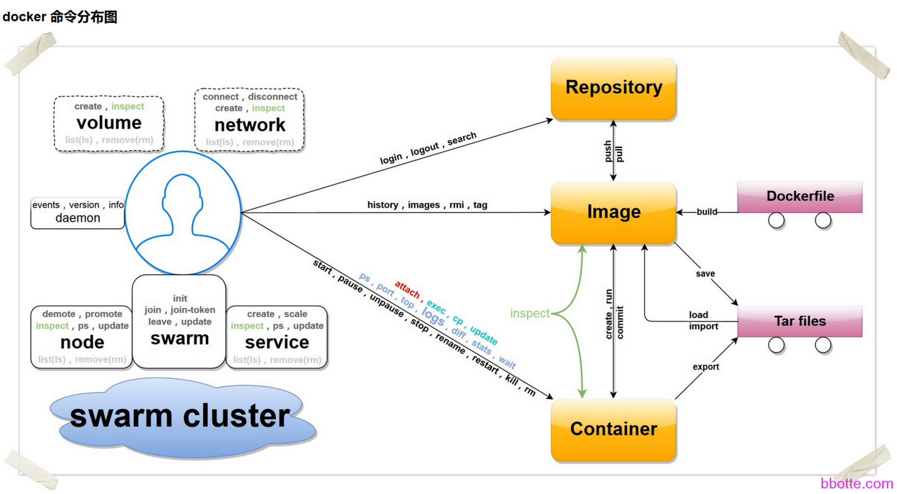

# docker初学跟我来

1. docker安装
2. 安装一个docker容器
3. docker的常用命令
4. docker容器的运行
5. docker容器安装nginx
6. 打包容器
7. Dockerfile


### 说明

本文讲centos下docker安装、docker常用命令、容器的运行、images的导出导入等

环境：CentOS 7.2 64位,因为官方说了，EL7系可以安装成功，其他版本或许会安装成功，不过docker公司没有在其他版本做测试，也不提供支持。下面安装版本为docker1.8

比如我用centos6.5的安装docker 1.7，出现下面的提示

```
# docker info
Get http:///var/run/docker.sock/v1.19/info: dial unix /var/run/docker.sock: no such file or directory. Are you trying to connect to a TLS-enabled daemon without TLS?
 
centos7的docker
# docker run -it docker.io/centos /bin/bash
/]# yum install openssh ssl
/]# systemctl restart sshd.service
Failed to get D-Bus connection: Operation not permitted
 
docker run --privileged -d -ti -p 2222:22 -e "container=docker"  -v /sys/fs/cgroup:/sys/fs/cgroup docker.io/centos
```

/etc/init.d/docker restart 也启动不起来，以前centos6.5安装docker1.5的版本是没问题的，要解决这个问题有2个方法：

1，使用centos7的系统运行docker

2，把centos6.5的内核升级，更新为3以后的版本

本质都是内核升级。下面用centos7.2来讲

### **docker安装**

```
安装centos 7.2系统
http://mirrors.163.com/centos/7.2.1511/isos/x86_64/CentOS-7-x86_64-Minimal-1511.iso
# sed -i 's#ONBOOT=no#ONBOOT=yes#' /etc/sysconfig/network-scripts/ifcfg-ens32
# systemctl restart network
# yum install docker-io -y
现在安装的是1.8的版本
如果没有安源，先安装 rpm -ivh http://dl.fedoraproject.org/pub/epel/7/x86_64/e/epel-release-7-5.noarch.rpm
```

```
# systemctl restart docker
# ps aux|grep docker
root 10527 0.5 1.6 373540 16860 ? Ssl 08:35 0:00 /usr/bin/docker daemon --selinux-enabled
# docker info
Containers: 0
Images: 0
Storage Driver: devicemapper
 Pool Name: docker-253:0-34142908-pool
 Pool Blocksize: 65.54 kB
 Backing Filesystem: xfs
 Data file: /dev/loop0
 Metadata file: /dev/loop1
 Data Space Used: 1.821 GB
 Data Space Total: 107.4 GB
 Data Space Available: 26.66 GB
 Metadata Space Used: 1.479 MB
 Metadata Space Total: 2.147 GB
 Metadata Space Available: 2.146 GB
 Udev Sync Supported: true
 Deferred Removal Enabled: false
 Data loop file: /var/lib/docker/devicemapper/devicemapper/data
 Metadata loop file: /var/lib/docker/devicemapper/devicemapper/metadata
 Library Version: 1.02.107-RHEL7 (2015-10-14)
Execution Driver: native-0.2
Logging Driver: json-file
Kernel Version: 3.10.0-327.el7.x86_64
Operating System: CentOS Linux 7 (Core)
CPUs: 4
Total Memory: 985.6 MiB
Name: localhost.localdomain
ID: N5MD:5WUQ:VZX3:O2XF:BITP:6ASK:ZH2I:MMQM:Y2PD:7YCC:WWP4:MW2V
WARNING: bridge-nf-call-iptables is disabled
WARNING: bridge-nf-call-ip6tables is disabled
```

docker version  查看版本

docker –help   查看docker的命令



### **安装一个docker容器**

```
[root@localhost ~]# docker search centos  #搜索centos镜像
INDEX       NAME                                      DESCRIPTION                                     STARS     OFFICIAL   AUTOMATED
docker.io   docker.io/centos                          The official build of CentOS.                   2040      [OK]       
docker.io   docker.io/ansible/centos7-ansible         Ansible on Centos7                              67                   [OK]
docker.io   docker.io/jdeathe/centos-ssh              CentOS-6 6.7 x86_64 / CentOS-7 7.2.1511 x8...   18                   [OK]
docker.io   docker.io/jdeathe/centos-ssh-apache-php   CentOS-6 6.7 x86_64 / Apache / PHP / PHP M...   14                   [OK]
docker.io   docker.io/million12/centos-supervisor     Base CentOS-7 with supervisord launcher, h...   9                    [OK]
docker.io   docker.io/blalor/centos                   Bare-bones base CentOS 6.5 image                8                    [OK]
docker.io   docker.io/nimmis/java-centos              This is docker images of CentOS 7 with dif...   8                    [OK]
docker.io   docker.io/torusware/speedus-centos        Always updated official CentOS docker imag...   7                    [OK]
 
 
# docker search ubuntu                   #搜索ubuntu镜像
```

根据搜索的名字，拉取一个镜像到本地，拉一个centos6的版本吧，如果是需要centos6，那么 docker pull jdeathe/centos-ssh:1.7.6

```
[root@localhost ~]# docker pull jdeathe/centos-ssh       #centos 7.2版本
[root@localhost ~]# docker pull jdeathe/centos-ssh:1.7.6 #centos 6.8版本
Using default tag: latest
898d6a169a87: Download complete 1.docker.io/v1/ lling image (latest) from docker.io/jdeathe/centos-ssh 
3690474eb5b4: Download complete 
c71e50f0243f: Download complete
.
Status: Image is up to date for docker.io/jdeathe/centos-ssh:latest
```

查看拉取的这个image

```
[root@localhost ~]# docker images
REPOSITORY                     TAG                 IMAGE ID            CREATED             VIRTUAL SIZE
docker.io/jdeathe/centos-ssh   latest              898d6a169a87        40 hours ago        230.1 MB
```

这个image是可以解压的压缩包，brtfs格式。btrfs (B-tree file system) is a Linux [filesystem](https://docs.docker.com/engine/reference/glossary/#filesystem) that Docker supports as a storage backend. It is a [copy-on-write](http://en.wikipedia.org/wiki/Copy-on-write) filesystem.

### **docker的常用命令**

```
# docker pull <镜像名:tag>                   #拉取一个镜像
# docker images                             #查看images
# docker run -i -t image_name /bin/bash     #交互式进入容器
# docker ps                                 #查看运行的docker 
# docker logs <镜像名:tag>                   #查看容器的logs
# docker start/stop/kill <镜像名:tag>    
# docker rm $(docker ps -a -q)              #删除所有容器
# docker rmi $(docker images | grep none | awk '{print $3}' | sort -r) #删除所有镜像
# docker build -t <镜像名> <Dockerfile路径>  #构建自己的镜像
# docker cp 683198a36fcb:/run.sh .          #从docker复制一个文件到当前目录
# docker save new_centos:latest > net_centos.tar  #保存镜像
# docker load < net_centos.tar              #载入镜像
# docker run --help
# docker exec -it <镜像名:tag> "command"    #执行docker容器里面的命令，比如 ls
# docker kill <镜像名:tag>                  #结束正在运行的容器
# docker stop <镜像名:tag>                  #关闭正在运行的容器
# docker cp container_id:/run.sh /home/run.sh #从容器中复制文件
# docker cp /home/run.sh container_id:/run.sh #将文件复制到容器中
# docker run -d --name nginx -v /data:/data image_name #挂载目录
```

### **docker容器的运行**

```
[root@localhost ~]# docker run -it docker.io/centos /bin/bash
[root@1a9aff12e4b1 /]# ls
anaconda-post.log  dev  home  lib64       media  opt   root  sbin  sys  usr
bin                etc  lib   lost+found  mnt    proc  run   srv   tmp  var
[root@1a9aff12e4b1 /]# exit
exit
```

docker运行就是这么简单，如果要ssh登录进去

```
[root@localhost ~]# docker run -d --name test_1 -p 2222:22 docker.io/jdeathe/centos-ssh
c5281c0124c0fbcb0fbe720d4a31aed90059ef762abe3035f0f508cec5e32e3a
 
[root@localhost ~]# docker ps
CONTAINER ID        IMAGE                          COMMAND                  CREATED             STATUS              PORTS                  NAMES
c5281c0124c0        docker.io/jdeathe/centos-ssh   "/usr/bin/supervisord"   4 seconds ago       Up 3 seconds        0.0.0.0:2222->22/tcp   test_1
 
[root@localhost ~]# docker logs c5281c0124c0
2016-03-21 18:17:26,572 CRIT Supervisor running as root (no user in config file)
2016-03-21 18:17:26,572 WARN Included extra file "/etc/supervisord.d/sshd-bootstrap.conf" during parsing
2016-03-21 18:17:26,572 WARN Included extra file "/etc/supervisord.d/sshd.conf" during parsing
2016-03-21 18:17:26,572 WARN No file matches via include "/etc/supervisord.d/*.ini"
2016-03-21 18:17:26,574 INFO supervisord started with pid 1
2016-03-21 18:17:27,579 INFO spawned: 'supervisor_stdout' with pid 7
2016-03-21 18:17:27,586 INFO spawned: 'sshd-bootstrap' with pid 8
2016-03-21 18:17:27,595 INFO spawned: 'sshd' with pid 9
2016-03-21 18:17:27,643 INFO success: supervisor_stdout entered RUNNING state, process has stayed up for > than 0 seconds (startsecs)
2016-03-21 18:17:27,643 INFO success: sshd-bootstrap entered RUNNING state, process has stayed up for > than 0 seconds (startsecs)
sshd-bootstrap stdout | Initialising SSH.
sshd-bootstrap stdout | 
================================================================================
SSH Details
--------------------------------------------------------------------------------
user : app-admin
password : 8JsYQNx8983ubFKY
id : 500:500
home : /home/app-admin
chroot path : N/A
shell : /bin/bash
sudo : ALL=(ALL) ALL
key fingerprints :
dd:3b:b8:2e:85:04:06:e9:ab:ff:a8:0a:c0:04:6e:d6 (insecure key)
rsa host key fingerprint :
a1:2f:52:a3:4c:07:e4:62:23:c5:ab:3d:48:71:ec:0a
--------------------------------------------------------------------------------
0.439589
 
2016-03-21 18:17:28,053 INFO exited: sshd-bootstrap (exit status 0; expected)
sshd stdout | Server listening on 0.0.0.0 port 22.
Server listening on :: port 22.
2016-03-21 18:17:29,121 INFO success: sshd entered RUNNING state, process has stayed up for > than 1 seconds (startsecs)
sshd stdout | Connection closed by 172.17.42.1 [preauth]
2016-03-21 18:17:42,971 INFO reaped unknown pid 130
```

ok，看容器的日志，是用supervisord控制ssh，用公钥登录

```
[root@localhost ~]# curl -LSs https://raw.githubusercontent.com/mitchellh/vagrant/master/keys/vagrant > id_rsa_insecure
[root@localhost ~]# chmod 600 id_rsa_insecure
[root@localhost ~]# ssh -p 2222 -i id_rsa_insecure app-admin@172.17.42.1
[app-admin@c5281c0124c0 ~]$ id
uid=500(app-admin) gid=500(app-admin) groups=500(app-admin),10(wheel),100(users)
[app-admin@c5281c0124c0 ~]$ ps aux
USER       PID %CPU %MEM    VSZ   RSS TTY      STAT START   TIME COMMAND
root         1  0.0  1.2 112864 12268 ?        Ss   18:17   0:00 /usr/bin/python /usr/bin/superviso
root         7  0.0  0.6  50356  6248 ?        S    18:17   0:00 /usr/bin/python /usr/bin/superviso
root         9  0.0  0.1  11628  1364 ?        S    18:17   0:00 bash -c touch /tmp/sshd.lock; whil
root       128  0.0  0.3  82544  3564 ?        S    18:17   0:00 /usr/sbin/sshd -D -e
root       139  0.0  0.4 134584  4704 ?        Ss   18:23   0:00 sshd: app-admin [priv]
app-adm+   141  0.0  0.2 134584  2072 ?        S    18:23   0:00 sshd: app-admin@pts/0
app-adm+   142  0.0  0.1  11768  1864 pts/0    Ss   18:23   0:00 -bash
app-adm+   165  0.0  0.1  35884  1476 pts/0    R+   18:48   0:00 ps aux
[app-admin@c5281c0124c0 ~]$   #修改密码，并启用root登录，下面在docker中操作
sudo passwd app-admin   #修改app-admin用户的密码
sudo passwd             #修改root用户密码
su                      #切换到root用户操作   
sed -i 's/PermitRootLogin\ no/PermitRootLogin yes/' /etc/ssh/sshd_config
PasswordAuthentication no
/etc/init.d/sshd restart
[app-admin@c5281c0124c0 ~]$ 
#如果在修改密码中有提示
/usr/share/cracklib/pw_dict.pwd: No such file or directory
PWOpen: No such file or directory
 
sudo yum reinstall -y cracklib-dicts
```

<https://github.com/jdeathe/centos-ssh> 制作这个image的linuxer文档写的也相当详细

### **docker容器安装nginx**

```
[app-admin@c5281c0124c0 /]$ sudo yum install nginx
 
We trust you have received the usual lecture from the local System
Administrator. It usually boils down to these three things:
 
    #1) Respect the privacy of others.
    #2) Think before you type.
    #3) With great power comes great responsibility.
 
[sudo] password for app-admin: 
```

这个容器现在登录的用户有sudo所有的权限，修改密码，公钥什么的自己搞吧。这样nginx就安装完成

```
[app-admin@c5281c0124c0 /]$ sudo /usr/sbin/nginx
[app-admin@c5281c0124c0 /]$ ps aux|grep nginx
root       300  0.0  0.2 109496  2148 ?        Ss   19:00   0:00 nginx: master process /usr/sbin/nginx
nginx      301  0.0  0.2 109920  2852 ?        S    19:00   0:00 nginx: worker process
nginx      302  0.0  0.3 109920  3052 ?        S    19:00   0:00 nginx: worker process
nginx      303  0.0  0.3 109920  3052 ?        S    19:00   0:00 nginx: worker process
nginx      304  0.0  0.3 109920  3052 ?        S    19:00   0:00 nginx: worker process
app-adm+   306  0.0  0.0   9036   672 pts/0    S+   19:00   0:00 grep --color=auto nginx
```

### **打包容器**

docker容器制作好之后，我们需要保存下来

```
[root@localhost ~]# docker ps
CONTAINER ID        IMAGE                          COMMAND                  CREATED             STATUS              PORTS                  NAMES
c5281c0124c0        docker.io/jdeathe/centos-ssh   "/usr/bin/supervisord"   44 minutes ago      Up 44 minutes       0.0.0.0:2222->22/tcp   test_1
[root@localhost ~]# docker commit c5281c0124c0 devops2u
edb963ba7abcf515f61e49b4c5b8abae0e7d67debba57085b226778bfc9b34ff
[root@localhost ~]# docker images
REPOSITORY                     TAG                 IMAGE ID            CREATED             VIRTUAL SIZE
devops2u                       latest              edb963ba7abc        16 seconds ago      381.8 MB
```

devops2u就是安装了nginx的docker

docker工作的文件夹 /var/lib/docker

我们需要把这个docker image打包保存起来，或者放其他服务器，再导入用

```
[root@localhost docker]# docker save -o devops2u_test1.tar devops2u
 
[root@localhost docker]# ll -h devops2u_test1
-rw-r--r--. 1 root root 375M Mar 21 17:11 devops2u_test1.tar
 
[root@localhost docker]# docker load < devops2u_test1.tar
fa9c44554e1e2f60a51684b632198418ebcc4657c56cc33b37f6ee8cd69b3d81
[root@localhost docker]# docker images
REPOSITORY                     TAG                 IMAGE ID            CREATED             VIRTUAL SIZE
devops2u                 latest              fa9c44554e1e        15 seconds ago      392.5 MB
 
 
#给docker的内存设置为最大100M，cpu使用率不超过50%，本地40000端口映射到docker的22端口
# docker run -m 100m -c 512 -d -p 40000:22 devops2u
```

ok，先说到这里吧，现在写docker应该比较晚了

参考文档
<https://www.docker.com/> docker的官网
[https://www.gitbook.com/book/yeasy/docker_practice/](https://www.gitbook.com/book/yeasy/docker_practice/details%20Docker) —— 从入门到实践
<http://yuedu.baidu.com/ebook/d817967416fc700abb68fca1?fr=aladdin&key=docker&f=read&qq-pf-to=pcqq.group> Docker终极指南
<http://dockerpool.com/books>
<http://yeasy.gitbooks.io/docker_practice/content/appendix_command/index.html>

docker的网络管理 参考下面两个链接

<http://dockone.io/article/1489>  <http://dockone.io/article/355>

docker有讲述基于Ubuntu制作一个最基础的image镜像

<https://docs.docker.com/engine/userguide/eng-image/baseimages/>

### **Dockerfile**

补充一下Dockerfile，docker通过读取dockerfile的内容可以自动构建images，dockerfile是包含了用户可执行命令的集合文档，通过dockerfile文档的几行命令，“docker build”就可以自动构建出来。

<https://docs.docker.com/engine/reference/builder/>

举个例子：

```
先下载centos的docker镜像包
# wget https://github.com/tutumcloud/tutum-centos/archive/master.zip
# unzip tutum-centos-master.zip
# cd tutum-centos-master
 
# docker build -t tutum/centos:centos6 centos6 
#这一步是构建docker镜像，是根据Dockerfile文件执行操作指令，可以根据自己的需求修改Dockerfile，看一下dockerfile文件内容：
# cat centos6/Dockerfile 
FROM centos:centos6
MAINTAINER Feng Honglin <hfeng@tutum.co>
RUN yum -y install openssh-server epel-release && \
    yum -y install pwgen && \
    rm -f /etc/ssh/ssh_host_dsa_key /etc/ssh/ssh_host_rsa_key && \
    ssh-keygen -q -N "" -t dsa -f /etc/ssh/ssh_host_dsa_key && \
    ssh-keygen -q -N "" -t rsa -f /etc/ssh/ssh_host_rsa_key && \
    sed -i "s/#UsePrivilegeSeparation.*/UsePrivilegeSeparation no/g" /etc/ssh/sshd_config && \
    sed -i "s/UsePAM.*/UsePAM no/g" /etc/ssh/sshd_config
ADD set_root_pw.sh /set_root_pw.sh
ADD run.sh /run.sh
RUN chmod +x /*.sh                              #执行命令
ENV AUTHORIZED_KEYS **None**                    #设置环境变量
EXPOSE 22                                       #对外22端口
CMD ["/run.sh"]
# docker images    #查看构建的docker镜像
 
# docker run -d -p 2222:22 centos6  的时候遇到下面的一个提示
Usage of loopback devices is strongly discouraged for production use. Either use `--storage-opt dm.thinpooldev` or use `--storage-opt dm.no_warn_on_loop_devices=true` to suppress this warning.
原因是磁盘格式为lvm的，
vim /etc/sysconfig/docker-storage
DOCKER_STORAGE_OPTIONS=--storage-opt dm.no_warn_on_loop_devices=true
systemctl restart docker
再运行就可以了
```

2016年03月21日 于 [linux工匠](http://www.bbotte.com/) 发表