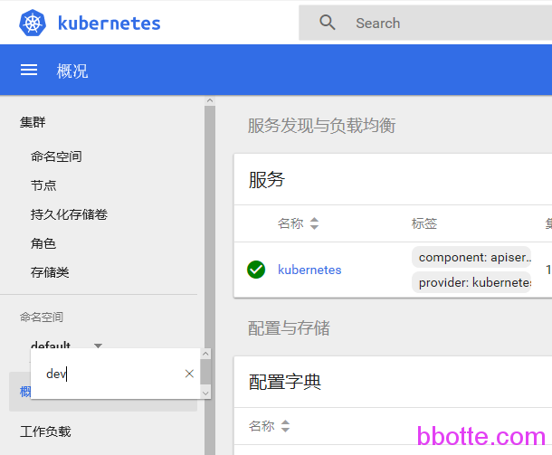

# kubernetes dashboard面板只读用户创建

kubernetes dashboard默认的用户kubernetes-dashboard拥有最大的权限，使用过程中需要对公司人员开通其中一个namespace的只读权限，下面是role和binding的关系，即把用户(sa)绑定(binding)规则(role)到资源(resources)上

```
 用户            规则           绑定               范围             说明
                 role         rolebinding         当前namespace    仅对当前namespace做指定权限管理
					    
serveraccount   clusterrole   clusterrolebinding  集群cluster	   对当前集群所有namespace做权限管理
 
                clusterrole   rolebinding        当前namespace    当前namespace做所有权限管理
```

```
kubectl create role --help
kubectl create role NAME --verb=verb --resource=resource.group/subresource [--resource-name=resourcename] [--dry-run] [options]
创建一个role
 
kubectl create rolebinding NAME --clusterrole=NAME|--role=NAME [--user=username] [--group=groupname] [--serviceaccount=namespace:serviceaccountname] [--dry-run] [options]
rolebinding可以绑定clusterrole或者role
 
kubectl create clusterrole NAME --verb=verb --resource=resource.group [--resource-name=resourcename] [--dry-run] [options]
创建一个clusterrole
 
kubectl create clusterrolebinding NAME --clusterrole=NAME [--user=username] [--group=groupname] [--serviceaccount=namespace:serviceaccountname] [--dry-run] [options]
创建一个clusterrolebinding
```

比如对dev namespace创建只读用户，下面开始，先创建一个serviceaccount

```
# cat sa.yaml 
apiVersion: v1
kind: ServiceAccount
metadata:
  name: dev-sa
  namespace: dev
```

创建规则role,  yaml格式中， – “abc” 格式或者 [“abc”] 代表意义都一样，表示一个列表，指定了resources的权限

```
# cat sit-role.yaml 
kind: Role
apiVersion: rbac.authorization.k8s.io/v1
metadata:
  name: dev-reader
  namespace: dev
rules:
- apiGroups:
  - ""
  resources:
  - "pods"
  - "configmaps"
  - "persistentvolumeclaims"
  - "secrets"
  - "services"
  - "events"
  - "replicationcontrollers"
  verbs:
  - get
  - list
  - watch
- apiGroups: ["extensions", "apps","batch"]
  resources: ["deployments","ingresses","daemonsets","replicasets","jobs","cronjobs","statefulsets"]
  verbs: ["get", "list", "watch"]
```

绑定用户serviceaccount和role

```
# cat sit-rolebinding.yaml 
kind: RoleBinding
apiVersion: rbac.authorization.k8s.io/v1
metadata:
  name: role-bind-dev-reader
  namespace: dev
subjects:
- kind: ServiceAccount
  name: dev-sa
  namespace: dev
roleRef:
  kind: Role
  name: dev-reader
  apiGroup: rbac.authorization.k8s.io
```

ok,这样就可以了，获取登录令牌

```
# kubectl get secret -n dev|grep dev-sa
 
# kubectl describe secret dev-sa-token-lx48a -n dev
token: 这一段为dashboard登录的令牌
```

默认登录后的namespace是default，因为没有对default授权，所以有一堆错误提示，只需要鼠标点一下命名空间，在选择命名空间输入dev即可，也可以把链接最后面改一下 namespace=dev

我觉得default命名空间出错不好看，接着授权default namespace

```
# cat default-role.yaml
kind: Role
apiVersion: rbac.authorization.k8s.io/v1
metadata:
  name: default-reader
rules:
- apiGroups: [""]  resources: ["pods","configmaps","persistentvolumeclaims","secrets","services","events","replicationcontrollers"]
  verbs: ["get", "list", "watch"]
- apiGroups: ["extensions", "apps","batch"]
  resources: ["deployments","ingresses","daemonsets","replicasets","jobs","cronjobs","statefulsets"]
  verbs: ["get", "list", "watch"]
```

```
# cat default-rolebinding.yal 
kind: RoleBinding
apiVersion: rbac.authorization.k8s.io/v1
metadata:
  name: role-bind-default-reader
  namespace: default
subjects:
- kind: ServiceAccount
  name: dev-sa
  namespace: dev
roleRef:
  kind: Role
  name: default-reader
  apiGroup: rbac.authorization.k8s.io
```

这样default和dev namespace都有权限查看k8s服务状态



那么，如果对所有namespace都要有查看权限呢

```
# kubectl create sa test -n default
serviceaccount "test" created
# kubectl create clusterrolebinding read-rolebinding --clusterrole=view --serviceaccount=default:test
clusterrolebinding "read-rolebinding" created
# kubectl get secret
NAME                    TYPE                                  DATA      AGE
test-token-dvm8f        kubernetes.io/service-account-token   3         37s
# kubectl describe secret test-token-dvm8f
token:  这里是登录的令牌
 
不用的话，便删除
# kubectl delete clusterrolebinding read-rolebinding
clusterrolebinding "read-rolebinding" deleted
# kubectl delete sa test -n default
serviceaccount "test" deleted
```

感谢马哥和旺旺的帮助

<https://github.com/kubernetes/kubernetes/tree/master/plugin/pkg/auth/authorizer/rbac/bootstrappolicy/testdata>

<https://jimmysong.io/kubernetes-handbook/guide/kubectl-user-authentication-authorization.html>

<https://docs.bitnami.com/kubernetes/how-to/configure-rbac-in-your-kubernetes-cluster/>


2018年11月19日 于 [linux工匠](http://www.bbotte.com/) 发表