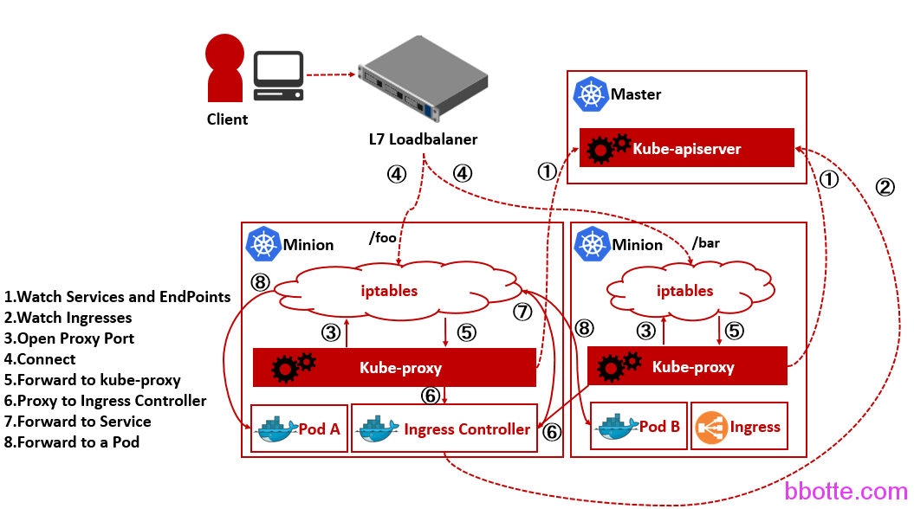
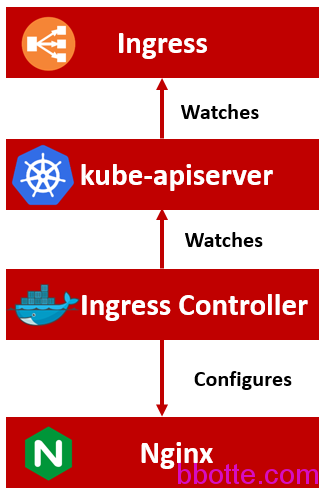
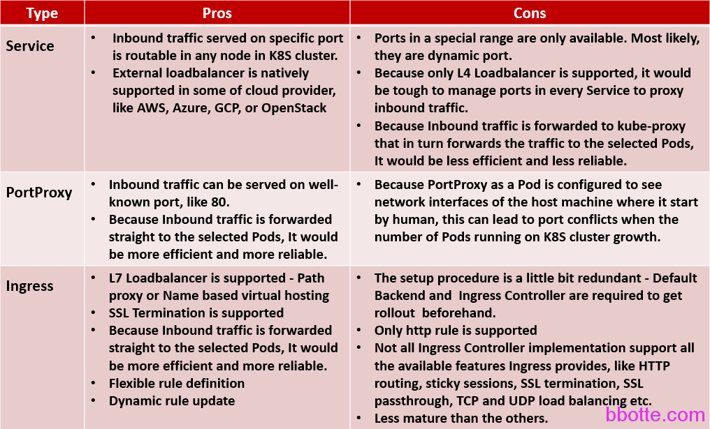

# inux工匠之kubernetes的ingress-nginx配置介绍

kubernetes创建服务后，需要把服务暴露出来，这样客户才能够访问到，ingress就可以完美的完成此任务。github链接:[ingress-nginx](https://github.com/kubernetes/ingress-nginx)  [ingress-gce](https://github.com/kubernetes/ingress-gce)，觉得看ingress-gce文档更详细一些

之前有用过consul作为服务发现，服务注册，并通过修改nginx的模板，nginx服务自动reload，来动态更新后端服务的文章 [consul集群的服务注册发现和模板使用](http://bbotte.com/server-config/consul-cluster-service-with-registry-and-discovery-and-template-usage/)，现在kubernetes的ingress做的同样是这个事情，建议看一下此文章，consul和etcd是多数公司用于服务注册、服务发现的软件

ingress结构分为3块，ingress客户端、ingress控制端(服务端)、nginx反向代理

ingress controller就是kubernetes一个外部负载均衡器，包含了nginx代理服务和控制器。控制器从 kube-apiserver获取ingress客户端信息，并通过模板生成nginx代理的配置，然后reload nginx服务。和consul+nginx作用有相似的地方，负责接受客户端提交的信息(服务发现)，从而做服务注册，利用设计好的模板，更新nginx代理的配置



图片来源：[https://techblog.rakuten.co.jp](https://techblog.rakuten.co.jp/)

下面来创建ingress-nginx服务，实践出真知

```
# vim ingress.yaml
 
apiVersion: extensions/v1beta1
kind: Deployment
metadata:
  name: default-http-backend
  labels:
    k8s-app: default-http-backend
  namespace: kube-system
spec:
  replicas: 1
  template:
    metadata:
      labels:
        k8s-app: default-http-backend
    spec:
      terminationGracePeriodSeconds: 60
      containers:
      - name: default-http-backend
        # Any image is permissable as long as:
        # 1. It serves a 404 page at /
        # 2. It serves 200 on a /healthz endpoint
        #image: gcr.io/google_containers/defaultbackend:1.0
        image: chenliujin/defaultbackend:latest
        livenessProbe:
          httpGet:
            path: /healthz
            port: 8080
            scheme: HTTP
          initialDelaySeconds: 30
          timeoutSeconds: 5
        ports:
        - containerPort: 8080
        resources:
          limits:
            cpu: 10m
            memory: 20Mi
          requests:
            cpu: 10m
            memory: 20Mi
---
apiVersion: v1
kind: Service
metadata:
  name: default-http-backend
  namespace: kube-system
  labels:
    k8s-app: default-http-backend
spec:
  ports:
  - port: 80
    targetPort: 8080
  selector:
    k8s-app: default-http-backend
---
apiVersion: v1
kind: ServiceAccount
metadata:
  name: ingress
  namespace: kube-system
---
apiVersion: extensions/v1beta1
kind: Deployment
metadata:
  name: nginx-ingress-controller
  labels:
    k8s-app: nginx-ingress-controller
  namespace: kube-system
spec:
  replicas: 1
  template:
    metadata:
      labels:
        k8s-app: nginx-ingress-controller
    spec:
      # hostNetwork makes it possible to use ipv6 and to preserve the source IP correctly regardless of docker configuration
      # however, it is not a hard dependency of the nginx-ingress-controller itself and it may cause issues if port 10254 already is taken on the host
      # that said, since hostPort is broken on CNI (https://github.com/kubernetes/kubernetes/issues/31307) we have to use hostNetwork where CNI is used
      # like with kubeadm
      hostNetwork: true
      terminationGracePeriodSeconds: 60
      serviceAccountName: ingress
      containers:
      #- image: gcr.io/google_containers/nginx-ingress-controller:0.9.0-beta.3
      - image: quay.io/kubernetes-ingress-controller/nginx-ingress-controller:0.9.0
        name: nginx-ingress-controller
        readinessProbe:
          httpGet:
            path: /healthz
            port: 10254
            scheme: HTTP
        livenessProbe:
          httpGet:
            path: /healthz
            port: 10254
            scheme: HTTP
          initialDelaySeconds: 10
          timeoutSeconds: 1
        ports:
        - containerPort: 80
          hostPort: 80
        - containerPort: 443
          hostPort: 443
        env:
          - name: POD_NAME
            valueFrom:
              fieldRef:
                fieldPath: metadata.name
          - name: POD_NAMESPACE
            valueFrom:
              fieldRef:
                fieldPath: metadata.namespace
        args:
        - /nginx-ingress-controller
        - --default-backend-service=$(POD_NAMESPACE)/default-http-backend
```

上面配置部署了一个default-http-backend，这个默认的后端服务是为了提供一个404页面
如果请求header中的host不能跟ingress中的host匹配，并且/或请求的URL不能与任何一个path匹配，则流量将路由到默认backend，默认的backend可以用一个网站维护页面。健康检查页面是/healthz，访问即出现404页面

部署nginx-ingress-controller服务，健康检查页面是/healthz，当然还需要一个rbac认证：

```
# vim ingress-rbac.yaml 
 
apiVersion: rbac.authorization.k8s.io/v1beta1
kind: ClusterRole
metadata:
  name: ingress
rules:
- apiGroups:
  - ""
  - "extensions"
  resources:
  - configmaps
  - secrets
  - services
  - endpoints
  - ingresses
  - nodes
  - pods
  verbs:
  - list
  - watch
- apiGroups:
  - "extensions"
  resources:
  - ingresses
  verbs:
  - get
- apiGroups:
  - ""
  resources:
  - events
  - services
  verbs:
  - create
  - list
  - update
  - get
- apiGroups:
  - "extensions"
  resources:
  - ingresses/status
  - ingresses
  verbs:
  - update
---
apiVersion: rbac.authorization.k8s.io/v1beta1
kind: Role
metadata:
  name: ingress-ns
  namespace: kube-system
rules:
- apiGroups:
  - ""
  resources:
  - pods
  verbs:
  - list
- apiGroups:
  - ""
  resources:
  - services
  verbs:
  - get
- apiGroups:
  - ""
  resources:
  - endpoints
  verbs:
  - get
  - create
  - update
---
apiVersion: rbac.authorization.k8s.io/v1beta1
kind: RoleBinding
metadata:
  name: ingress-ns-binding
  namespace: kube-system
roleRef:
  apiGroup: rbac.authorization.k8s.io
  kind: Role
  name: ingress-ns
subjects:
  - kind: ServiceAccount
    name: ingress
    namespace: kube-system
---
apiVersion: rbac.authorization.k8s.io/v1beta1
kind: ClusterRoleBinding
metadata:
  name: ingress-binding
roleRef:
  apiGroup: rbac.authorization.k8s.io
  kind: ClusterRole
  name: ingress
subjects:
  - kind: ServiceAccount
    name: ingress
    namespace: kube-system
```

上面即ingress服务部署，我们以代理自建的nginx服务为例，创建一个nginx服务，这个nginx服务bbotte/nginx:v0.1的构建在[MAC系统Docker镜像构建和私有仓库](http://bbotte.com/kvm-xen/docker-images-build-and-private-registry/)，只是更改了nginx服务的端口为8080，当然你可以用其他的服务，修改服务name、image和containerPort即可

```
# vim nginx-service.yaml 
 
apiVersion: v1
kind: ReplicationController
metadata:
  name: nginx
spec:
  replicas: 1
  template:
    metadata:
      labels:
        app: nginx
    spec:
      containers:
      - name: nginx
        image: bbotte/nginx:v0.1
        ports:
        - containerPort: 8080
---
apiVersion: v1
kind: Service
metadata:
  name: nginx
  labels:
    app: nginx
spec:
  #type: NodePort
  ports:
  - port: 80
    targetPort: 8080
    protocol: TCP
    name: http
  selector:
    app: nginx
```

这时候就把ingress和自建的nginx服务结合起来，让ingress代理后端的服务：

```
# vim ingress-nginx.yaml 
 
apiVersion: extensions/v1beta1
kind: Ingress
metadata:
  name: ingress-nginx
spec:
  rules:
  - host: www.bbotte.com
    http:
      paths:
      - backend:
          # This assumes http-svc exists and routes to healthy endpoints.
          serviceName: nginx
          servicePort: 80
```

指定的域名是www.bbotte.com，后端的服务是nginx，即上面创建的nginx服务，端口是80

```
[root@master ingress]# ls
ingress-nginx.yaml  ingress-rbac.yaml  ingress.yaml  nginx-service.yaml
[root@master ingress]# kubectl create -f ingress.yaml 
deployment "default-http-backend" created
service "default-http-backend" created
serviceaccount "ingress" created
deployment "nginx-ingress-controller" created
[root@master ingress]# kubectl create -f ingress-rbac.yaml 
clusterrole "ingress" created
role "ingress-ns" created
rolebinding "ingress-ns-binding" created
clusterrolebinding "ingress-binding" created
[root@master ingress]# kubectl create -f nginx-service.yaml 
replicationcontroller "nginx" created
service "nginx" created
[root@master ingress]# kubectl create -f ingress-nginx.yaml 
ingress "ingress-nginx" created
```

这样域名解析后就可以访问nginx服务了，

```
[root@master ~]# kubectl get svc -o wide
NAME         TYPE        CLUSTER-IP     EXTERNAL-IP   PORT(S)   AGE       SELECTOR
kubernetes   ClusterIP   10.96.0.1      <none>        443/TCP   29d       <none>
nginx        ClusterIP   10.96.112.23   <none>        80/TCP    19d       app=nginx
[root@master ~]# kubectl get ingress
NAME            HOSTS              ADDRESS   PORTS     AGE
ingress-nginx   www.bbotte.com             80        19d
 
curl --resolve www.bbotte.com:80:192.168.1.1 http://www.bbotte.com/
```





图片来源：<https://techblog.rakuten.co.jp/>

上述配置文件和docker包链接：https://pan.baidu.com/s/1bq7oJPd 密码：buye

2018年01月10日 于 [linux工匠](http://www.bbotte.com/) 发表


