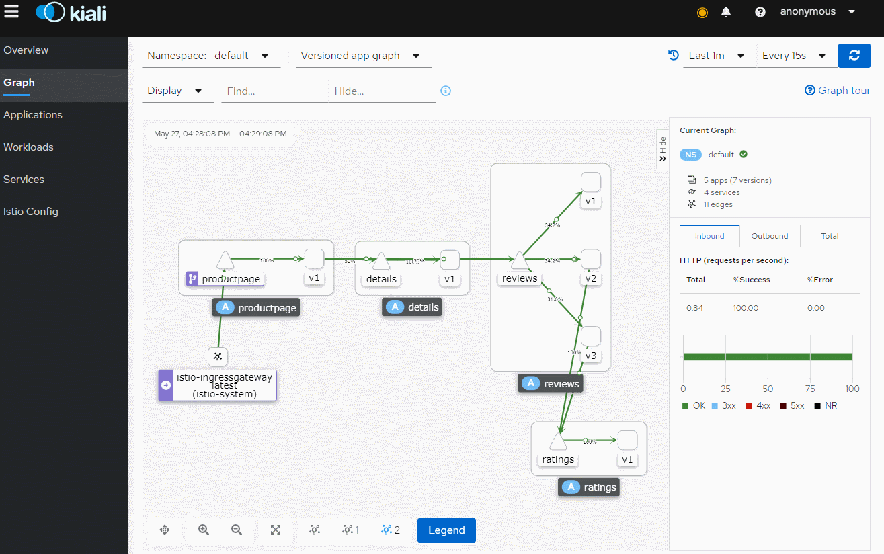

## kubernetes和istio开箱测试

##### 鉴于网络上多数istio版本较老，本文用新版k8s和istio做测试小结，目的是节省看官方文档时间，尽快明白istio的运行

2台虚拟机，内存均为4296m，小于4G内存pod经常出问题

| 版本号     |                 |
| ---------- | --------------- |
| os         | CentOS 7.9.2009 |
| docker     | 19.03.12        |
| kubernetes | v1.20.7         |
| istio      | 1.10.0          |

设置主机名称，配置hosts

```
# cat /etc/hosts
127.0.0.1   localhost localhost.localdomain localhost4 localhost4.localdomain4
::1         localhost localhost.localdomain localhost6 localhost6.localdomain6
172.16.8.241 vm1
172.16.8.242 vm2
```

以下通用，关闭swap，设置系统参数，比如nf_conntrack

```
swapoff -a
sed -i 's/.*swap.*/#&/' /etc/fstab
systemctl stop firewalld
systemctl disable firewalld
sed -i 's/SELINUX=enforcing/SELINUX=disabled/' /etc/selinux/config 
setenforce 0
iptables -P FORWARD ACCEPT
yum install -y epel-release vim vim-enhanced wget lrzsz unzip ntpdate sysstat dstat wget mlocate mtr lsof iotop bind-utils git net-tools ipvsadm ipset
echo 'export HISTTIMEFORMAT="%m/%d %T "' >> ~/.bashrc
source ~/.bashrc
echo "ulimit -SHn 65535" >> /etc/profile
echo "ulimit -SHn 65535" >> /etc/rc.local
ulimit -SHn 65535
sed -i 's/4096/10240/' /etc/security/limits.d/20-nproc.conf
cat <<EOF >> /etc/sysctl.conf
net.ipv4.ip_forward=1
fs.file-max = 655350
net.ipv4.tcp_max_syn_backlog = 65536
net.core.netdev_max_backlog =  32768
net.core.somaxconn = 32768
net.core.wmem_default = 8388608
net.core.rmem_default = 8388608
net.core.rmem_max = 16777216
net.core.wmem_max = 16777216
net.ipv4.tcp_timestamps = 0
net.ipv4.tcp_synack_retries = 2
net.ipv4.tcp_syn_retries = 2
net.ipv4.tcp_tw_reuse = 1
net.ipv4.tcp_mem = 94500000 915000000 927000000
net.ipv4.tcp_max_orphans = 3276800
net.ipv4.tcp_fin_timeout = 30
net.ipv4.tcp_keepalive_time = 600
net.ipv4.ip_local_port_range = 1024  65535
net.netfilter.nf_conntrack_tcp_timeout_close_wait = 60
net.netfilter.nf_conntrack_tcp_timeout_fin_wait = 120
net.nf_conntrack_max=655360
net.netfilter.nf_conntrack_max=655360
net.netfilter.nf_conntrack_tcp_timeout_established=180
net.netfilter.nf_conntrack_tcp_timeout_time_wait=30
net.bridge.bridge-nf-call-ip6tables = 1
net.bridge.bridge-nf-call-iptables = 1
net.ipv6.conf.all.disable_ipv6 = 1
net.ipv6.conf.default.disable_ipv6 = 1
net.ipv6.conf.lo.disable_ipv6 = 1
vm.swappiness = 0
vm.overcommit_memory=1
vm.panic_on_oom=0
kernel/panic=10
kernel/panic_on_oops=1
kernel.pid_max = 4194303
vm.max_map_count = 655350
fs.aio-max-nr = 524288
fs.file-max = 6590202
EOF
/sbin/sysctl -p
```

master主机执行：

```
cat > /etc/sysconfig/modules/ipvs.modules <<EOF
#!/bin/bash
modprobe -- ip_vs
modprobe -- ip_vs_rr
modprobe -- ip_vs_wrr
modprobe -- ip_vs_sh
modprobe -- nf_conntrack_ipv4
EOF
chmod 755 /etc/sysconfig/modules/ipvs.modules && bash /etc/sysconfig/modules/ipvs.modules && lsmod | grep -e ip_vs -e nf_conntrack_ipv4
sysctl -p /etc/sysctl.conf
/sbin/sysctl -p
```

#### master主机生成证书(在vm1操作)

cfssl cfssl-certinfo cfssljson 这3个bin文件见 https://github.com/cloudflare/cfssl

```
cp cfssl cfssl-certinfo cfssljson /usr/bin/
mkdir -p ssl/conf
cat > ssl/conf/etcd-csr.json <<EOF
{
  "key": {
    "algo": "rsa",
    "size": 2048
  },
  "names": [
    {
      "O": "etcd",
      "OU": "etcd Security",
      "L": "Shanghai",
      "ST": "Shanghai",
      "C": "CN"
    }
  ],
  "CN": "etcd",
  "hosts": [
    "127.0.0.1",
    "172.16.8.241"  # etcd的主机ip
  ]
}
EOF
cat > ssl/conf/etcd-gencert.json <<EOF
{
  "signing": {
    "default": {
        "usages": [
          "signing",
          "key encipherment",
          "server auth",
          "client auth"
        ],
        "expiry": "87600h"
    }
  }
}
EOF
cat > ssl/conf/etcd-root-ca-csr.json <<EOF
{
  "key": {
    "algo": "rsa",
    "size": 4096
  },
  "names": [
    {
      "O": "etcd",
      "OU": "etcd Security",
      "L": "Shanghai",
      "ST": "Shanghai",
      "C": "CN"
    }
  ],
  "ca": {
    "expiry": "87600h"
  }
}
EOF
cd ssl/conf/
cfssl gencert --initca=true etcd-root-ca-csr.json | cfssljson --bare ca
cfssl gencert --ca ca.pem --ca-key ca-key.pem --config etcd-gencert.json etcd-csr.json | cfssljson --bare etcd
```

```
mkdir -p /etc/etcd/ssl; cp etcd-key.pem etcd.pem ca.pem /etc/etcd/ssl
```

#### etcd安装

务必安装etcd 3.3.13以上版本，避免 etcd read-only range request took too long， 见 https://github.com/etcd-io/etcd

```
tar -xf etcd-v3.3.13-linux-amd64.tar.gz
# change etcd.conf configure
cp etcd.service /usr/lib/systemd/system/etcd.service
cp etcd-v3.3.13-linux-amd64/etcd /usr/bin/
cp etcd-v3.3.13-linux-amd64/etcdctl /usr/bin/
mkdir -p /var/lib/etcd/default.etcd
chmod 700 /var/lib/etcd
getent group etcd >/dev/null || groupadd -r etcd
getent passwd etcd >/dev/null || useradd -r -g etcd -d /var/lib/etcd -s /sbin/nologin -c "etcd user" etcd
chown etcd.etcd -R /var/lib/etcd/
systemctl daemon-reload
systemctl enable etcd
systemctl start etcd
export ETCDCTL_API=3
cat >> /etc/profile.d/etcd.sh <<EOF
export ETCDCTL_API=3
EOF
```

```
# cat /etc/etcd/etcd.conf 
#[Member]
# !! change me !!
ETCD_NAME="etcd1"
#ETCD_CORS=""
ETCD_DATA_DIR="/var/lib/etcd/default.etcd"
#ETCD_WAL_DIR=""
ETCD_LISTEN_PEER_URLS="https://172.16.8.241:2380"
ETCD_LISTEN_CLIENT_URLS="https://172.16.8.241:2379,http://127.0.0.1:2379"
#ETCD_MAX_SNAPSHOTS="5"
#ETCD_MAX_WALS="5"
#ETCD_SNAPSHOT_COUNT="100000"
#ETCD_HEARTBEAT_INTERVAL="100"
#ETCD_ELECTION_TIMEOUT="1000"
#ETCD_QUOTA_BACKEND_BYTES="0"
#ETCD_MAX_REQUEST_BYTES="1572864"
#ETCD_GRPC_KEEPALIVE_MIN_TIME="5s"
#ETCD_GRPC_KEEPALIVE_INTERVAL="2h0m0s"
#ETCD_GRPC_KEEPALIVE_TIMEOUT="20s"
#
#[Clustering]
ETCD_INITIAL_ADVERTISE_PEER_URLS="https://172.16.8.241:2380"
ETCD_ADVERTISE_CLIENT_URLS="https://172.16.8.241:2379"
#ETCD_DISCOVERY=""
#ETCD_DISCOVERY_FALLBACK="proxy"
#ETCD_DISCOVERY_PROXY=""
#ETCD_DISCOVERY_SRV=""
ETCD_INITIAL_CLUSTER="etcd1=https://172.16.8.241:2380,"
ETCD_INITIAL_CLUSTER_TOKEN="etcd-cluster"
ETCD_INITIAL_CLUSTER_STATE="new"
#ETCD_STRICT_RECONFIG_CHECK="true"
ETCD_ENABLE_V2="false"
#
#[Proxy]
#ETCD_PROXY="off"
#ETCD_PROXY_FAILURE_WAIT="5000"
#ETCD_PROXY_REFRESH_INTERVAL="30000"
#ETCD_PROXY_DIAL_TIMEOUT="1000"
#ETCD_PROXY_WRITE_TIMEOUT="5000"
#ETCD_PROXY_READ_TIMEOUT="0"
#
#[Security]
ETCD_CERT_FILE="/etc/etcd/ssl/etcd.pem"
ETCD_KEY_FILE="/etc/etcd/ssl/etcd-key.pem"
ETCD_CLIENT_CERT_AUTH="true"
ETCD_TRUSTED_CA_FILE="/etc/etcd/ssl/ca.pem"
ETCD_AUTO_TLS="true"
ETCD_PEER_CERT_FILE="/etc/etcd/ssl/etcd.pem"
ETCD_PEER_KEY_FILE="/etc/etcd/ssl/etcd-key.pem"
ETCD_PEER_CLIENT_CERT_AUTH="true"
ETCD_PEER_TRUSTED_CA_FILE="/etc/etcd/ssl/ca.pem"
ETCD_PEER_AUTO_TLS="true"
#
#[Logging]
#ETCD_DEBUG="false"
#ETCD_LOG_PACKAGE_LEVELS=""
#ETCD_LOG_OUTPUT="default"
#
#[Unsafe]
#ETCD_FORCE_NEW_CLUSTER="false"
#
#[Version]
#ETCD_VERSION="false"
#ETCD_AUTO_COMPACTION_RETENTION="0"
#
#[Profiling]
#ETCD_ENABLE_PPROF="false"
#ETCD_METRICS="basic"
#
#[Auth]
#ETCD_AUTH_TOKEN="simple"
```

#### 安装基础服务

2个节点安装docker和kube服务，docker安装省略

```
# cat /etc/yum.repos.d/kubernetes.repo 
[kubernetes]
name=Kubernetes
baseurl=https://mirrors.tuna.tsinghua.edu.cn/kubernetes/yum/repos/kubernetes-el7-$basearch
enabled=1

# yum install kubeadm-1.20.7-0 kubectl-1.20.7-0 kubelet-1.20.7-0 -y
# systemctl enable kubelet
```

配置kubernetes master节点

```
cat >> config.yaml <<EOF
apiVersion: kubeadm.k8s.io/v1beta2
bootstrapTokens:
- groups:
  - system:bootstrappers:kubeadm:default-node-token
  token: 5kj904.l6nue0rh57m5z8as   # kubeadm token generate
  ttl: 108h0m0s
  usages:
  - signing
  - authentication
kind: InitConfiguration
localAPIEndpoint:
  advertiseAddress: 172.16.8.241   #kube-apiserver IP
  bindPort: 6443
nodeRegistration:
  criSocket: /var/run/dockershim.sock
  name: vm1                       #master node name
  taints:
  - effect: NoSchedule
    key: node-role.kubernetes.io/master
---
apiServer:
  timeoutForControlPlane: 4m0s
apiVersion: kubeadm.k8s.io/v1beta2
certificatesDir: /etc/kubernetes/pki
clusterName: kubernetes
controlPlaneEndpoint: 172.16.8.241:6443 #kube-apiserver IP
controllerManager: {}
dns:
  type: CoreDNS
etcd:
  external:
    caFile: /etc/etcd/ssl/ca.pem          #使用etcd的证书
    certFile: /etc/etcd/ssl/etcd.pem
    endpoints:
    - https://172.16.8.241:2379          # etcd IP
    keyFile: /etc/etcd/ssl/etcd-key.pem
imageRepository: registry.cn-hangzhou.aliyuncs.com/google_containers  #使用阿里云镜像
kind: ClusterConfiguration
kubernetesVersion: v1.20.7             #k8s版本
networking:
  dnsDomain: cluster.local
  podSubnet: 10.100.0.0/17  #pod ip address segment,every server has a ip segment, this network segment supports up to 127 hosts
  serviceSubnet: 10.200.0.0/19 #service ip address segment,this network segment supports up to 8190 services
scheduler: {}
EOF
```

#### k8s初始化，安装kuberoute、flannel网络插件

```
kubeadm init --config config.yaml
cp config.yaml /etc/kubernetes/  # 留个备份而已
#保存最后生成的 kubeadm join，其实忘了也没关系
kubeadm join --token z2dbca.pe313xd0XXXX 172.16.8.241:6443 --discovery-token-ca-cert-hash sha256:c392bXXXX

mkdir -p $HOME/.kube
/bin/cp /etc/kubernetes/admin.conf $HOME/.kube/config
chown $(id -u):$(id -g) $HOME/.kube/config
kubectl get cs
kubectl apply -f kubeadm-kuberouter-all-features.yaml  #见 https://github.com/cloudnativelabs/kube-router/blob/master/daemonset/kubeadm-kuberouter-all-features.yaml
sleep 30
kubectl apply -f kube-flannel.yml # 见 https://github.com/flannel-io/flannel/blob/master/Documentation/kube-flannel.yml
kubectl get po -n kube-system
```

k8s master 不使用kube-proxy

```
docker run --privileged -v /lib/modules:/lib/modules --net=host registry.cn-hangzhou.aliyuncs.com/google_containers/kube-proxy:v1.20.7 kube-proxy --cleanup
kubectl -n kube-system delete ds kube-proxy
sleep 20
kubectl get po -n kube-system
kubectl scale --replicas=3 deployment/coredns -n kube-system
kubectl get po -n kube-system
```

node节点安装docker和kubelet后，执行master节点 kubeadm init 后的结果加入k8s集群

```
kubeadm join --token b2dbca.pe35XXXXX 172.16.8.241:6443 --discovery-token-ca-cert-hash sha256:c392b12260XXXX
```

现在k8s应该是这个状态

```
[root@vm1 ~]# kubectl get no
NAME   STATUS   ROLES                  AGE     VERSION
vm1    Ready    master                 2d21h   v1.20.7
vm2    Ready    <none>                 2d21h   v1.20.7
[root@vm1 ~]# kubectl get po -n kube-system
NAME                          READY   STATUS    RESTARTS   AGE
coredns-54d67798b7-5tz57      1/1     Running   0          39m
coredns-54d67798b7-mh2df      1/1     Running   0          39m
kube-apiserver-vm1            1/1     Running   11         2d21h
kube-controller-manager-vm1   1/1     Running   13         2d21h
kube-flannel-ds-9b66c         1/1     Running   0          40m
kube-flannel-ds-fhmdm         1/1     Running   0          40m
kube-router-n74j5             1/1     Running   0          40m
kube-router-z96rc             1/1     Running   0          40m
kube-scheduler-vm1            1/1     Running   12         2d21h
```

#### 配置istio

https://github.com/istio/istio/releases 下载后解压进入目录

```
cp bin/istioctl /usr/local/bin/
istioctl install -f manifests/profiles/default.yaml
```

相当于官方文档的 istioctl install --set profile=default ，即安装 "Istio core" "Istiod" "Ingress gateways"

```
# kubectl get po -n istio-system
NAME                                    READY   STATUS    RESTARTS   AGE
istio-ingressgateway-58567cb58d-xdfmd   1/1     Running   0          48m
istiod-85c6f66ccd-2hmkc                 1/1     Running   0          48m
```

如果ingressgateway没有启动，describe 提示证书的问题，先重启一下istiod，不行就重启master和node节点

```
kubectl rollout restart deploy istiod -n istio-system
kubectl rollout restart deploy istio-ingressgateway -n istio-system
```

为了增加可观察性，要把监控也安装好

```
kubectl apply -f samples/addons/prometheus.yaml
kubectl apply -f samples/addons/grafana.yaml
kubectl apply -f samples/addons/jaeger.yaml
kubectl apply -f samples/addons/kiali.yaml
```

当然了，我是虚拟机，所以要想访问grafana或者kiali的话，需要更改service的模式为NodePort，如果是公有云比如阿里、腾讯就会自动使用公网ip

更改grafana的service：

```
 vim samples/addons/grafana.yaml
  70 ---
  71 # Source: grafana/templates/service.yaml
  72 apiVersion: v1
  73 kind: Service
  74 metadata:
  75   name: grafana
  76   namespace: istio-system
  77   labels:
  78     helm.sh/chart: grafana-6.6.3
  79     app.kubernetes.io/name: grafana
  80     app.kubernetes.io/instance: grafana
  81     app.kubernetes.io/version: "7.4.3"
  82     app.kubernetes.io/managed-by: Helm
  83 spec:
  84   type: NodePort   #修改了这里
  85   ports:
  86     - name: service
  87       port: 3000
  88       protocol: TCP
  89       targetPort: 3000  
  90       nodePort: 30300  #修改了这里
```

更改kiali的service：

```
vim samples/addons/kiali.yaml
 414 # Source: kiali-server/templates/service.yaml
 415 apiVersion: v1
 416 kind: Service
 417 metadata:
 418   name: kiali
 419   namespace: istio-system
 420   labels:
 421     helm.sh/chart: kiali-server-1.34.0
 422     app: kiali
 423     app.kubernetes.io/name: kiali
 424     app.kubernetes.io/instance: kiali-server
 425     version: "v1.34.0"
 426     app.kubernetes.io/version: "v1.34.0"
 427     app.kubernetes.io/managed-by: Helm
 428     app.kubernetes.io/part-of: "kiali"
 429   annotations:
 430 spec:
 431   type: NodePort    #修改了这里
 432   ports:
 433   - name: http
 434     protocol: TCP
 435     port: 20001 
 436     nodePort: 30201   #修改了这里
 437   - name: http-metrics
 438     protocol: TCP
 439     port: 9090
 440   selector:
 441     app.kubernetes.io/name: kiali
 442     app.kubernetes.io/instance: kiali-server
```

其他的无所谓了，自己改就是

```
# kubectl get svc -n istio-system
NAME                   TYPE           CLUSTER-IP      EXTERNAL-IP   PORT(S)                                      AGE
grafana                NodePort       10.200.29.102   <none>        3000:30300/TCP                               2d4h
istio-ingressgateway   LoadBalancer   10.200.9.51     <pending>     15021:30197/TCP,80:32430/TCP,443:30032/TCP   2d
istiod                 ClusterIP      10.200.16.127   <none>        15010/TCP,15012/TCP,443/TCP,15014/TCP        2d1h
jaeger-collector       ClusterIP      10.200.6.66     <none>        14268/TCP,14250/TCP                          2d4h
kiali                  NodePort       10.200.20.168   <none>        20001:30201/TCP,9090:31946/TCP               2d4h
prometheus             ClusterIP      10.200.31.174   <none>        9090/TCP                                     2d4h
tracing                NodePort       10.200.3.216    <none>        80:30686/TCP                                 45h
zipkin                 ClusterIP      10.200.13.113   <none>        9411/TCP                                     45h
```

浏览器访问 http://k8s_node_ip:30300/  是grafana，http://k8s_node_ip:30201/ 是kiali

```
# istioctl version
client version: 1.10.0
control plane version: 1.10.0
data plane version: 1.10.0
```

附：加个istio-ingressgateway使用阿里云私有SLB配置，

```
# cat istio-ingressgateway.yaml 
apiVersion: v1
kind: Service
metadata:
  annotations:
    service.beta.kubernetes.io/alicloud-loadbalancer-address-type: intranet
    service.beta.kubernetes.io/alicloud-loadbalancer-force-override-listeners: 'true'
    service.beta.kubernetes.io/alicloud-loadbalancer-id: lb-uf**********  #私网SLB名称
  labels:
    app: istio-ingressgateway
    install.operator.istio.io/owning-resource: unknown
    install.operator.istio.io/owning-resource-namespace: istio-system
    istio: ingressgateway
    istio.io/rev: default
    operator.istio.io/component: IngressGateways
    operator.istio.io/managed: Reconcile
    operator.istio.io/version: 1.10.0
    release: istio
  name: istio-ingressgateway
  namespace: istio-system
spec:
  ports:
  - name: status-port
    nodePort: 32045
    port: 15021
    protocol: TCP
    targetPort: 15021
  - name: http2
    nodePort: 30080
    port: 80
    protocol: TCP
    targetPort: 8080
  - name: https
    nodePort: 30443
    port: 443
    protocol: TCP
    targetPort: 8443
  selector:
    app: istio-ingressgateway
    istio: ingressgateway
  sessionAffinity: None
  type: LoadBalancer
  externalTrafficPolicy: "Local"
status:
  loadBalancer:
    ingress:
    - ip: 172.16.*.*  #私网SLB
```

先把现在使用公网SLB的服务删除，在apply上面私网SLB配置即可

```
kubectl delete svc -n istio-system istio-ingressgateway
```

dns指向内部的私网SLB IP，访问域名即可打开部署的服务。因为kiali、grafana、jaeger使用的是NodePort，所以以http://k8s_node_ip:NodePort/ 打开连接访问，访问不到的话需要加一层nginx代理

#### 测试istio功能

这样istio就安装完成，对default 命名空间默认启用istio服务网格，这样就不用  kubectl apply -f <(istioctl kube-inject -f  someone.yaml)

```
kubectl label namespace default istio-injection=enabled
kubectl get namespace -L istio-injection
```

如果没有injection，那么 kubectl label namespace default istio-injection=enabled --overwrite ，以bookinfo为例

```
kubectl apply -f samples/bookinfo/platform/kube/bookinfo.yaml
kubectl apply -f samples/bookinfo/networking/bookinfo-gateway.yaml
```

安装好了看一下状态，都是2/2 ，说明服务运行分了2个阶段，第一个阶段是istio注入，第二阶段是服务启动。如果是1/1肯定是istio还没用注入

```
# kubectl get po
NAME                              READY   STATUS    RESTARTS   AGE
details-v1-79f774bdb9-2dgvf       2/2     Running   2          24h
productpage-v1-5d6475f6c4-q2kn9   2/2     Running   2          24h
productpage-v1-5d6475f6c4-s55jh   2/2     Running   2          24h
ratings-v1-b6994bb9-xqjmp         2/2     Running   2          28h
reviews-v1-545db77b95-8nm8c       2/2     Running   4          45h
reviews-v2-7bf8c9648f-bfrph       2/2     Running   4          45h
reviews-v3-84779c7bbc-z888t       2/2     Running   2          29h
```

```
# istioctl proxy-status
# istioctl proxy-config listeners details-v1-79f774bdb9-2dgvf
# kubectl exec -it details-v1-79f774bdb9-2dgvf -c istio-proxy -n default -- pilot-agent request GET server_info
```

浏览器访问 http://k8s_node_ip:32430/productpage   查看部署的web页面，32430是怎么来的呢？

```
kubectl get svc -n istio-system istio-ingressgateway
```

多访问几次，打开kiali，我们这里是  http://k8s_node_ip:30201/



至于istio的配置请求路由，熔断，金丝雀发布等，看官方文档即可，文章只此引入，节省理解istio的时间

重点看看这个配置 samples/bookinfo/networking/bookinfo-gateway.yaml 

istio需要新建VirtualService作为入口，或者说作为映射，里面有配置域名、gateway、route，而没有istio之前的deploy不用修改任何配置，只需要像下面一样对service裹上一层VirtualService就行了，当nginx.bbotte.com的dns指向node节点，即可访问到服务，虚拟机是nginx.bbotte.com:32430，如此一来就可以添加多个前端服务

```
---
apiVersion: networking.istio.io/v1alpha3
kind: VirtualService
metadata:
  name: nginx
spec:
  hosts:
  - "nginx.bbotte.com"
  gateways:
  - nginx-gateway
  http:
  - match:
    - uri:
        prefix: /
    route:
    - destination:
        host: proxy-com      #这是一个nginx服务
        port:
          number: 80
---
apiVersion: networking.istio.io/v1alpha3
kind: Gateway
metadata:
  name: nginx-gateway
spec:
  selector:
    istio: ingressgateway # use istio default controller
  servers:
  - port:
      number: 80
      name: http
      protocol: HTTP
    hosts:
    - "nginx.bbotte.com"
```


总结：kubernetes管理容器的运行，扩展或缩容，是管理平台，istio为每个pod的网络进行劫持，进而更改流量走向，对其转发或者复制，又利用插件显示整个过程，有很好的可观察性

